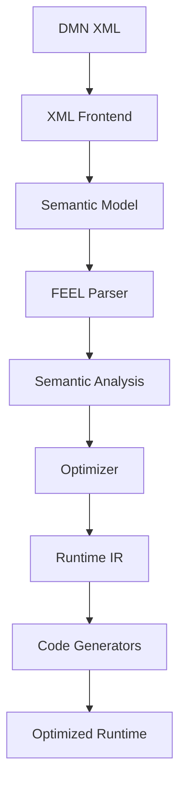
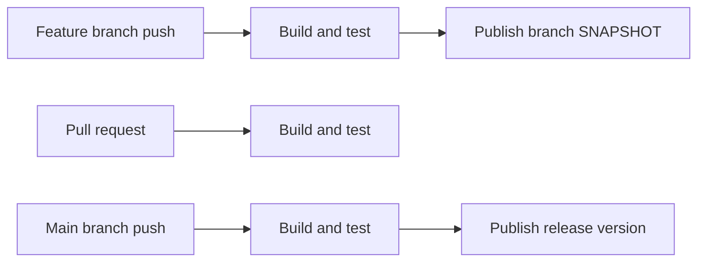

# DMN Compiler Toolkit

High-performance compiler infrastructure for Decision Model and Notation (DMN).

The project compiles DMN models into an internal semantic representation that can later be validated, optimized, and translated into efficient runtime code.

<a id="contents-section-1"></a>
## Status

<!-- generated-toc:start -->
## Table of contents

- [Architecture](#contents-section-2)
- [Modules](#contents-section-3)
- [Requirements](#contents-section-4)
- [Build](#contents-section-5)
- [Generate FEEL parser sources](#contents-section-6)
- [Use a single module](#contents-section-7)
- [GitHub Packages](#contents-section-8)
- [Continuous Integration](#contents-section-9)
- [Design principles](#contents-section-10)
- [Documentation](#contents-section-11)
- [Roadmap](#contents-section-12)
- [License](#contents-section-13)
- [Project](#contents-section-14)
<!-- generated-toc:end -->

The project is a feature-rich DMN 1.5/1.6 compiler platform.

Current status & focus:

- Lean Tier-1 reactor for the optimized interpreter and generated-Java runtime path
- 3,391/3,391 official OMG DMN TCK cases passing on both optimized backends (6,782 outcomes)
- Static optimization passes (`dmn-optimizer`) enabled by default through `DmnCompiler`
- Spark SQL and gRPC flavors isolated behind the opt-in `incubator` profile
- TCK and benchmarks isolated behind opt-in verification profiles to preserve fast builds
- Near-term focus: production hardening and an early Tier-1 release

<a id="contents-section-2"></a>
## Architecture



The architecture separates parsing, semantic analysis, optimization, and runtime generation. Runtime execution is intentionally independent from the original DMN XML representation.

<a id="contents-section-3"></a>
## Modules

| Module | Description |
|---|---|
| `dmn-protobuf` | Protobuf definitions and generated Java classes for the semantic model |
| `dmn-frontend-xml` | Namespace-aware DMN XML reader and semantic round-trip writer based on VTD-XML |
| `dmn-feel-parser` | ANTLR4 parser for DMN FEEL expressions |
| `dmn-semantic-analysis` | Reference resolution, type analysis, DMN validation, and dependency ordering |
| `dmn-runtime-ir` | Immutable Runtime IR with structural, constant, and value-reference lowering |
| `dmn-runtime` | Deterministic interpreter for executable Runtime IR |
| `dmn-compiler` | Compiler orchestration and resolver-independent model-source contracts |
| `dmn-generator-java` | High-performance Java source code generator directly from Runtime IR |
| `dmn-tck-runner` | Opt-in OMG DMN TCK runner for strict optimized-interpreter/generated-Java conformance |
| `dmn-benchmarks` | Opt-in JMH microbenchmarks & DataFaker reference model workloads |
| `dmn-optimizer` | Constant folding, algebraic simplification, and rule pruning passes |
| `dmn-grpc` | Incubating generic and strongly-typed Protobuf schema & gRPC service adapter generator |
| `dmn-generator-sparksql` | Incubating Spark / Databricks SQL CTE query generator |
| `dmn-models` | Opt-in benchmark models and streaming ingestion fixtures |

Planned modules include further optimization and native code generation backends.

<a id="contents-section-4"></a>
## Requirements

- JDK 25
- Maven 3.9 or later

<a id="contents-section-5"></a>
## Build

```bash
mvn clean verify
```

The command builds the lean Tier-1 reactor and runs its unit/integration tests. Additional gates are
explicit:

```bash
mvn -Ptck verify          # complete optimized interpreter + generated-Java TCK
mvn -Pbenchmarks verify   # benchmark support modules
mvn -Pincubator verify    # experimental gRPC and Spark SQL flavors
```

<a id="contents-section-6"></a>
## Generate FEEL parser sources

The FEEL parser module generates Java sources from ANTLR grammars.

```bash
mvn -Pgenerate-code clean verify
```

<a id="contents-section-7"></a>
## Use a single module

Example:

```bash
mvn -pl dmn-feel-parser -am test
```

`-am` also builds required upstream modules.

<a id="contents-section-8"></a>
## GitHub Packages

Snapshot and release artifacts are published to GitHub Packages.

Repository:

```text
https://maven.pkg.github.com/finmsg-io/dmn-compiler-toolkit
```

Example Maven repository configuration:

```xml
<repositories>
    <repository>
        <id>github</id>
        <url>https://maven.pkg.github.com/finmsg-io/dmn-compiler-toolkit</url>
    </repository>
</repositories>
```

Example dependency:

```xml
<dependency>
    <groupId>io.finmsg.dmn</groupId>
    <artifactId>dmn-feel-parser</artifactId>
    <version>1.0.0-SNAPSHOT</version>
</dependency>
```

GitHub Packages requires authentication, including for package downloads.

Add credentials to `~/.m2/settings.xml`:

```xml
<settings>
    <servers>
        <server>
            <id>github</id>
            <username>YOUR_GITHUB_USERNAME</username>
            <password>YOUR_GITHUB_TOKEN</password>
        </server>
    </servers>
</settings>
```

The token requires package read permission.

<a id="contents-section-9"></a>
## Continuous Integration

GitHub Actions performs the following operations:



Feature branch versions use a branch-specific suffix, for example:

```text
1.0.0-feature-initiate-SNAPSHOT
```

<a id="contents-section-10"></a>
## Design principles

- Semantic model instead of an XML-shaped runtime model
- Compilation before execution
- Runtime independence from XML parsing
- Explicit compiler stages
- Extensible code-generation backends
- Protobuf-based stable model contracts
- Performance as a primary design goal
- Small, independently testable modules

<a id="contents-section-11"></a>
## Documentation

The documentation site is located in the `docs` directory and is built with MkDocs.

Key references are the [architecture overview](docs/architecture.md), the normative
[architecture specification](docs/architecture/architecture-spec.md), the
[ADR index](docs/architecture/adr/generall-adr.md), and the project
[glossary](docs/glossary.md).

Install MkDocs:

```bash
pip install mkdocs mkdocs-material
```

Run locally:

```bash
mkdocs serve
```

Build the static site:

```bash
mkdocs build
```

<a id="contents-section-12"></a>
- [x] Add compiler facade and import model resolver (`dmn-compiler`)
- [x] Lower FEEL expressions and decision tables into Runtime IR instructions (`dmn-runtime-ir`)
- [x] Implement static optimizer passes (`dmn-optimizer`)
- [x] Generate optimized Java code (`dmn-generator-java`)
- [x] Add performance benchmarks & DataFaker realistic workloads (`dmn-benchmarks`)
- [x] Generate pure Spark / Databricks SQL CTE queries (`dmn-generator-sparksql`)
- [x] Generate dynamic and strongly-typed gRPC services (`dmn-grpc`)
- [x] Add multi-file DMN sample suites and Java streaming ingestion API (`dmn-models`)
- [ ] Add native language code-generation backends (Rust, Go, C++)

<a id="contents-section-13"></a>
## License

This project is licensed under the [Apache License 2.0](LICENSE).

<a id="contents-section-14"></a>
## Project

Developed under the `finmsg.io` GitHub organization.
