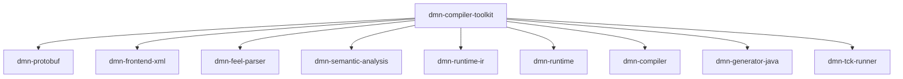
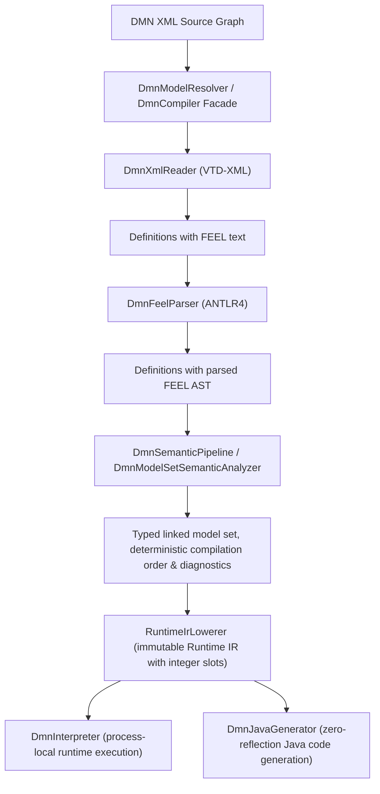

# DMN Compiler Toolkit

## Architecture Specification

**Version 2.0 — implementation architecture; TCK conformance recovery in progress**

Related normative material:

- [Glossary](../glossary.md) — shared terminology and acronyms.
- [ADR guide and index](adr/generall-adr.md) — accepted decisions and their rationale.

## Document status

This version reflects the implementation available in August 2026.

Status labels:

- **IMPLEMENTED** — present in the codebase and covered by automated tests
- **PARTIAL** — implemented for a defined subset
- **FUTURE** — architectural target without an active implementation

## Most important requirements

> **Review status: UNREVIEWED PROPOSAL.** These are candidate architectural requirements. They
> become normative only after review; current implementation status is determined by code, tests,
> and the linked implementation-aligned chapters.

| ID | Requirement | Primary detail |
| --- | --- | --- |
| AR-001 | Models accepted by semantic analysis must have explicitly defined observable behavior or be rejected before execution. | [Compiler passes](./chapters/16-Compiler%20Passes.md), [testing](./chapters/20-Testing%20Strategy.md) |
| AR-002 | Identical sources, options, and supported toolchain versions must produce deterministic ordering, diagnostics, Runtime IR, and generated artifacts. | [ADR-0011](adr/adr-0011-deterministic-compilation.md) |
| AR-003 | Runtime execution and generated backends must not depend on DMN XML, ANTLR, or semantic protobuf traversal. | [ADR-0008](adr/adr-0008-runtime-without-xml-knowledge.md), [Runtime IR](./chapters/12-Runtime%20IR.md) |
| AR-004 | Compiler stages must treat their inputs as immutable and return explicit result contracts. | [ADR-0005](adr/adr-0005-immutable-intermediate-representations.md) |
| AR-005 | Diagnostics must carry stable phase, severity, code, source/model identity, path, and location where available. | [ADR-0012](adr/adr-0012-diagnostics-as-first-class-objects.md), [failure model](./chapters/24-Failure%20Model%20and%20Resilience.md) |
| AR-006 | Root models and transitive imports must compile through resolver-independent, deterministic, confined source-loading policies. | [System context](./chapters/04-System%20Context%20and%20External%20Interfaces.md), [security](./chapters/23-Security%20and%20Trust%20Boundaries.md) |
| AR-007 | The interpreter and generated backends must share Runtime IR semantics and pass the same observable-behavior corpus. | [Runtime IR](./chapters/12-Runtime%20IR.md), [testing](./chapters/20-Testing%20Strategy.md) |
| AR-008 | XML, FEEL, model graphs, host values, and evaluation must have configurable deterministic resource limits. | [Security](./chapters/23-Security%20and%20Trust%20Boundaries.md), [failure model](./chapters/24-Failure%20Model%20and%20Resilience.md) |
| AR-009 | Public callers must address models, inputs, and decisions by stable external identities rather than compiler-assigned slots. | [Public API](./chapters/09-Public%20API.md) |
| AR-010 | Public APIs, semantic protobuf, Runtime IR persistence, generated Java, diagnostics, and generated Protobuf contracts must have separate explicit compatibility policies. | [Data lifecycle and compatibility](./chapters/25-Data%20Lifecycle%20Caching%20and%20Compatibility.md), [ADR-0025](adr/adr-0025-runtime-ir-persistence-and-compatibility-boundary.md) |
| AR-011 | Performance claims and optimizations must be supported by reproducible benchmarks without weakening semantic parity. | [Performance](./chapters/21-Performance.md) |
| AR-012 | Production module dependencies must remain acyclic and point toward lower-level contracts; compiler orchestration stays above the stages it coordinates. | [Maven modules](./chapters/07-Maven%20Modules.md), [ADR-0014](adr/adr-0014-maven-multi-module-architecture.md) |

Current modules:

Current executable compiler path:

The semantic-analysis stage implements reference and structured-property resolution, exposes successful symbol and named-type bindings, performs type and expression analysis, validates operators, functions, imports, and DMN structures, and analyzes dependency graphs across namespace-linked models. Bindings are exposed as an immutable side table rather than persisted in protobuf AST nodes. Structural Runtime IR, typed constants, bound value-slot references, unary/binary operators, boxed logic, and decision tables are implemented. Process-local interpretation (`dmn-runtime`), one-call compiler facade (`dmn-compiler`), high-performance Java code generation (`dmn-generator-java`), and TCK conformance testing (`dmn-tck-runner`) are implemented. Optimization passes and multi-language backends (Rust, Go) remain future stages.

## Table of contents

Core section: [Most important requirements](#most-important-requirements)

### Part I: Vision, Context & Architectural Principles
1. [Vision](./chapters/01-Vision.md)
2. [Architecture Principles](./chapters/02-Architecture%20Principles.md)
3. [Stakeholders and Quality Attributes](./chapters/03-Stakeholders%20and%20Quality%20Attributes.md)
4. [System Context and External Interfaces](./chapters/04-System%20Context%20and%20External%20Interfaces.md)

### Part II: Overall Architecture & Public Contracts
5. [Overall Architecture](./chapters/05-Overall%20Architecture.md)
6. [Logical Component Architecture](./chapters/06-Logical%20Component%20Architecture.md)
7. [Maven Modules](./chapters/07-Maven%20Modules.md)
8. [Package Layout](./chapters/08-Package%20Layout.md)
9. [Public API](./chapters/09-Public%20API.md)

### Part III: Core Data Structures & Intermediate Representations
10. [Semantic Model](./chapters/10-Semantic%20Model.md)
11. [FEEL AST](./chapters/11-FEEL%20AST.md)
12. [Runtime IR](./chapters/12-Runtime%20IR.md)

### Part IV: Compiler Pipeline & Execution Engines
13. [XML Frontend](./chapters/13-XML%20Frontend.md)
14. [FEEL Parser](./chapters/14-FEEL%20Parser.md)
15. [Semantic Analysis](./chapters/15-Semantic%20Analysis.md)
16. [Compiler Passes](./chapters/16-Compiler%20Passes.md)
17. [Internal Compiler Architecture](./chapters/17-Internal%20Compiler%20Architecture.md)
18. [Java Generator](./chapters/18-Java%20Generator.md)
19. [Future Generators](./chapters/19-Future%20Generators.md)

### Part V: Operational, Quality & Cross-Cutting Architecture
20. [Testing Strategy](./chapters/20-Testing%20Strategy.md)
21. [Performance](./chapters/21-Performance.md)
22. [Deployment and Operational Architecture](./chapters/22-Deployment%20and%20Operational%20Architecture.md)
23. [Security and Trust Boundaries](./chapters/23-Security%20and%20Trust%20Boundaries.md)
24. [Failure Model and Resilience](./chapters/24-Failure%20Model%20and%20Resilience.md)
25. [Data Lifecycle, Caching, and Compatibility](./chapters/25-Data%20Lifecycle%20Caching%20and%20Compatibility.md)
26. [Observability and Supportability](./chapters/26-Observability%20and%20Supportability.md)
27. [Build, Release, and Supply Chain](./chapters/27-Build%20Release%20and%20Supply%20Chain.md)

### Part VI: Governance, Risks & Evolution
28. [Architecture Traceability and Conformance](./chapters/28-Architecture%20Traceability%20and%20Conformance.md)
29. [Architecture Risks and Technical Debt](./chapters/29-Architecture%20Risks%20and%20Technical%20Debt.md)
30. [Roadmap](./chapters/30-Roadmap.md)

### Part VII: Appendices
31. [Reference Material & Appendices](./chapters/31-Appendices.md)

Reference: [Glossary](../glossary.md)
