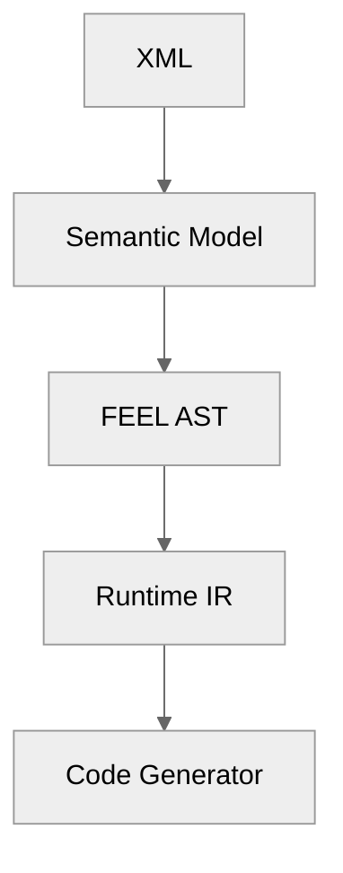
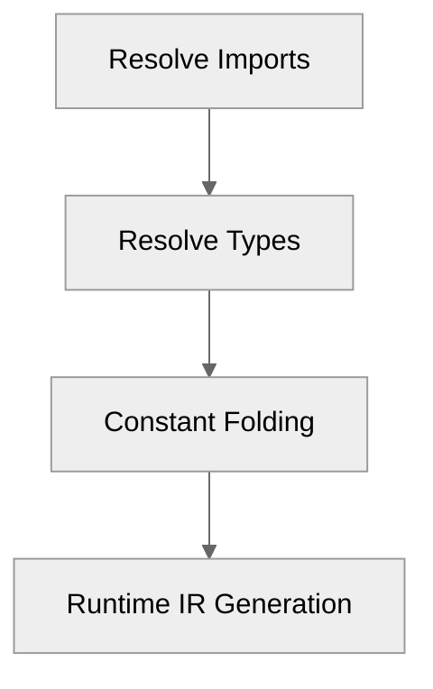

# Chapter 2 — Architecture Principles [NORMATIVE]

<!-- generated-toc:start -->
## Table of contents

- [2.1 AP-001 --- Semantic Correctness over XML Fidelity](#contents-section-1)
- [2.2 AP-002 --- Compilation before Execution](#contents-section-2)
- [2.3 AP-003 --- Layer Isolation](#contents-section-3)
- [2.4 AP-004 --- Single Responsibility per Compiler Pass](#contents-section-4)
- [2.5 AP-005 --- Immutable Intermediate Representations](#contents-section-5)
- [2.6 AP-006 --- Runtime Independence](#contents-section-6)
- [2.7 AP-007 --- Performance is a Feature](#contents-section-7)
- [2.8 AP-008 --- Deterministic Compilation](#contents-section-8)
- [2.9 AP-009 --- Explicit Dependencies](#contents-section-9)
- [2.10 AP-010 --- Strong Typing](#contents-section-10)
- [2.11 AP-011 --- Compiler over Interpreter](#contents-section-11)
- [2.12 AP-012 --- Extensible Backend Architecture](#contents-section-12)
- [2.13 AP-013 --- Specification Compliance](#contents-section-13)
- [2.14 AP-014 --- Testability](#contents-section-14)
- [2.15 AP-015 --- Open Architecture](#contents-section-15)
- [2.16 AP-016 --- Stable Public APIs](#contents-section-16)
- [2.17 AP-017 --- Documentation as Part of the Architecture](#contents-section-17)
- [2.18 AP-018 --- Long-Term Maintainability](#contents-section-18)
- [2.19 AP-019 --- Security by Design](#contents-section-19)
- [2.20 AP-020 --- Observability](#contents-section-20)
<!-- generated-toc:end -->

This chapter defines the fundamental architectural principles governing
the entire project.

These principles are considered the constitution of the DMN Compiler
Toolkit. Every architectural decision, implementation, optimization, and
future contribution should be evaluated against them.

## 2.1 AP-001 --- Semantic Correctness over XML Fidelity

The internal representation models DMN semantics rather than the XML
document structure.

XML is considered an interchange format only.

After parsing, the compiler should operate exclusively on semantic
models.

------------------------------------------------------------------------

## 2.2 AP-002 --- Compilation before Execution

Every possible validation, optimization, normalization, and analysis
shall be performed during compilation.

The runtime should execute decisions rather than interpret XML or FEEL.

------------------------------------------------------------------------

## 2.3 AP-003 --- Layer Isolation

Each architectural layer has a single responsibility.

Allowed dependencies always point downward.

Reverse dependencies are prohibited.

------------------------------------------------------------------------

## 2.4 AP-004 --- Single Responsibility per Compiler Pass

Each compiler pass performs exactly one transformation.

For example:

Compiler passes should be deterministic, independently testable, and
composable.

------------------------------------------------------------------------

## 2.5 AP-005 --- Immutable Intermediate Representations

Intermediate representations should be treated as immutable whenever
practical.

Compiler passes produce new representations instead of mutating existing
structures.

This improves correctness, testing, debugging, and parallelization.

------------------------------------------------------------------------

## 2.6 AP-006 --- Runtime Independence

The runtime must have no dependency on:

-   XML
-   VTD-XML
-   ANTLR
-   protobuf serialization
-   compiler infrastructure

Only the Runtime IR is visible to the execution engine.

------------------------------------------------------------------------

## 2.7 AP-007 --- Performance is a Feature

Performance is a primary design objective rather than a later
optimization.

Architectural decisions should minimize:

-   memory allocations
-   object creation
-   indirections
-   runtime parsing
-   reflection
-   synchronization

Compile-time complexity is acceptable if it improves runtime efficiency.

------------------------------------------------------------------------

## 2.8 AP-008 --- Deterministic Compilation

Given identical input and compiler version, compilation shall always
produce identical Runtime IR and generated source code.

This property simplifies testing, reproducibility, and debugging.

------------------------------------------------------------------------

## 2.9 AP-009 --- Explicit Dependencies

Dependencies between compiler modules must always be explicit.

No hidden coupling.

No reflection-based discovery.

No global registries.

------------------------------------------------------------------------

## 2.10 AP-010 --- Strong Typing

Every compiler phase should use strongly typed models.

Avoid generic maps, loosely typed structures, and string-based APIs
whenever possible.

------------------------------------------------------------------------

## 2.11 AP-011 --- Compiler over Interpreter

The project is designed as a compiler infrastructure.

Interpretation may be implemented later as an additional backend, but it
is not the primary execution strategy.

------------------------------------------------------------------------

## 2.12 AP-012 --- Extensible Backend Architecture

Adding a new backend should require implementing only a new code
generator.

The frontend, semantic analysis, optimization passes, and Runtime IR
should remain unchanged.

Supported examples include:

-   Java
-   Rust
-   Go
-   Spark SQL
-   LLVM
-   WebAssembly

------------------------------------------------------------------------

## 2.13 AP-013 --- Specification Compliance

The compiler shall remain compliant with the OMG DMN specification.

Internal optimizations must never change externally observable
semantics.

------------------------------------------------------------------------

## 2.14 AP-014 --- Testability

Every compiler component should be testable in isolation.

Every compiler pass should have dedicated unit tests.

The entire pipeline should support round-trip and compliance testing.

------------------------------------------------------------------------

## 2.15 AP-015 --- Open Architecture

The architecture should remain understandable and approachable.

Avoid unnecessary complexity.

Prefer simple, explicit designs over clever implementations.

------------------------------------------------------------------------

## 2.16 AP-016 --- Stable Public APIs

Public APIs should evolve conservatively.

Internal implementations may change without affecting users.

------------------------------------------------------------------------

## 2.17 AP-017 --- Documentation as Part of the Architecture

Architecture documentation, ADRs, API documentation, and design
rationale are considered part of the deliverable.

Documentation should evolve together with the implementation.

------------------------------------------------------------------------

## 2.18 AP-018 --- Long-Term Maintainability

Maintainability has priority over short-term implementation convenience.

Designs should remain understandable by contributors many years after
the initial implementation.

------------------------------------------------------------------------

## 2.19 AP-019 --- Security by Design

The compiler shall safely process untrusted DMN documents.

XML parsing should avoid common attack vectors such as entity expansion
and uncontrolled resource consumption.

Generated code should avoid introducing security risks through
reflection or dynamic code execution.

------------------------------------------------------------------------

## 2.20 AP-020 --- Observability

The compiler pipeline should expose sufficient diagnostics, metrics, and
structured logging to make compilation behavior understandable without
sacrificing performance.

Compilation errors should be precise, deterministic, and actionable.

------------------------------------------------------------------------
