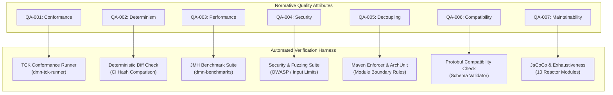

# Chapter 3 — Stakeholders and Quality Attributes [NORMATIVE]

<!-- generated-toc:start -->
## Table of contents

- [3.1 Purpose and Scope](#contents-section-1)
- [3.2 Stakeholder Ecosystem and Concerns](#contents-section-2)
- [3.3 Measurable Quality-Attribute Scenarios](#contents-section-3)
- [3.4 Quality Gate Verification Matrix](#contents-section-4)
- [3.5 Governance and Trade-off Policy](#contents-section-5)
<!-- generated-toc:end -->

## 3.1 Purpose and Scope

This chapter establishes the normative stakeholder expectations and quantifiable quality attributes that govern the architecture of the DMN Compiler Toolkit. Every architectural trade-off, compiler optimization, and runtime boundary must satisfy these criteria.

## 3.2 Stakeholder Ecosystem and Concerns

The toolkit serves distinct roles across the software engineering lifecycle, from declarative rule authoring to ultra-low latency execution:

| Stakeholder | Role in Lifecycle | Primary Concerns and Architectural Expectations |
| --- | --- | --- |
| **DMN Model Author** | Rules Modeling & Business Logic | Standards compliance (OMG DMN 1.5), accurate error diagnostics with precise line/column locations, predictable FEEL expression evaluation. |
| **Application Developer** | Business Logic Integration | Ergonomic, zero-reflection Java API, thread-safe `CompiledModel` reuse, minimal external runtime dependencies, fast feedback in local test suites. |
| **Platform Integrator** | Enterprise Infrastructure | Pluggable source resolution (`DmnModelResolver`), hermetic execution, container/gRPC adapter support, modular multi-tenant configuration. |
| **Backend Author** | Code Generation & Optimization | Clean, immutable Runtime IR contracts, comprehensive lowering passes, target-neutral semantic guarantees across backends. |
| **Operations & SRE** | Deployment & Production Monitoring | Deterministic error handling, zero memory leaks, bounded resource utilization (CPU, heap, stack), predictable GC overhead, rich telemetry. |
| **Maintainer & Architect** | Toolkit Evolution & Governance | Strict modular boundaries, hermetic builds, high test coverage, regression prevention via shared parity suites and automated enforcer gates. |
| **Security Reviewer** | Security & Compliance | Defense-in-depth against malicious XML (XXE/billion laughs), unbounded expression recursion, denial of service, secure classloading. |

## 3.3 Measurable Quality-Attribute Scenarios

The architecture enforces seven core quality attributes, each verified by automated test harnesses:

### QA-001: Correctness and Standards Conformance
- **Requirement**: The compiler must strictly adhere to the OMG DMN 1.5 specification. Every valid FEEL construct and boxed expression must execute with identical semantics across both the reference interpreter and generated backends.
- **Verification**: 100% compliance on the official OMG DMN Technology Compatibility Kit (TCK) suite and automated parity test fixtures.

### QA-002: Determinism and Reproducibility
- **Requirement**: Given identical DMN source models, compiler options, and classpath dependencies, the compiler must emit byte-identical Protobuf semantic models, Runtime IR graphs, and generated Java source files.
- **Verification**: CI deterministic build assertions comparing SHA-256 hashes across repeated clean builds.

### QA-003: Ultra-Low Latency & High Throughput
- **Requirement**: Pre-compiled decision models must evaluate in sub-microsecond latency for single transactions and sustain millions of evaluations per second in batch columnar modes without triggering garbage collection pressure.
- **Verification**: Continuous JMH benchmark regression suite (`dmn-benchmarks`) tracking latency, allocations, and throughput.

### QA-004: Hermetic Security & Resource Bounding
- **Requirement**: Untrusted input XML or complex FEEL expressions must never compromise host integrity, escape sandbox boundaries, or trigger out-of-memory crashes.
- **Verification**: Frontend VTD-XML entity expansion prevention, recursion depth limits on ANTLR parsers, and hostile payload fuzzing.

### QA-005: Strict Boundary Decoupling
- **Requirement**: Production runtime evaluation must have zero dependency on XML parsers (VTD-XML), parser generators (ANTLR), or compiler data structures.
- **Verification**: Maven Enforcer dependency convergence rules and bytecode boundary checks.

### QA-006: Schema and API Compatibility
- **Requirement**: Public APIs and Protobuf schemas must adhere to explicit backwards-compatibility policies. Runtime IR remains process-local, preventing premature persistence lock-in.
- **Verification**: Automated schema compatibility validation and binary compatibility regression testing.

### QA-007: Maintainability and Exhaustiveness
- **Requirement**: Addition of new AST nodes, FEEL operators, or boxed expression types must trigger compile-time exhaustiveness failures in all lowering passes and backends.
- **Verification**: Pattern matching over sealed hierarchies and exhaustive unit test suites across all compilation passes.

## 3.4 Quality Gate Verification Matrix

## 3.5 Governance and Trade-off Policy

When architectural quality attributes come into tension, decisions are prioritized according to the following hierarchy:

1. **Security & Correctness > Performance**: Unsound optimizations that violate DMN 1.5 semantics or introduce security vulnerabilities are strictly rejected.
2. **Determinism > Compilation Speed**: The compiler favors reproducible, canonical IR generation and bytecode generation over uncoordinated parallel optimizations.
3. **Runtime Decoupling > Developer Convenience**: Runtime dependencies are kept strictly minimal, even if it requires emitting standalone helper code rather than referencing rich compiler libraries.

