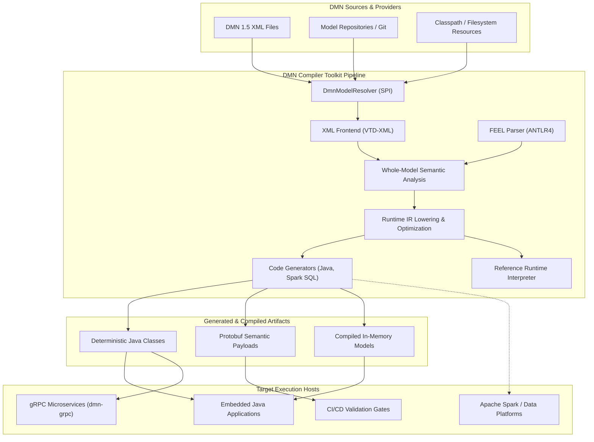

# Chapter 4 — System Context and External Interfaces [IMPLEMENTATION-ALIGNED]

<!-- generated-toc:start -->
## Table of contents

- [4.1 Purpose and System Scope](#contents-section-1)
- [4.2 System Context Architecture](#contents-section-2)
- [4.3 External Interfaces and SPI Contracts](#contents-section-3)
- [4.4 Boundary Invariants and Architectural Isolation](#contents-section-4)
<!-- generated-toc:end -->

## 4.1 Purpose and System Scope

This chapter defines the system context and external integration boundaries of the DMN Compiler Toolkit. It establishes clear architectural lines separating compiler-owned responsibilities (parsing, semantic validation, intermediate representation, optimization, and code generation) from external systems (source repositories, application hosts, deployment runtimes, and client protocols).

## 4.2 System Context Architecture

The compiler toolkit operates as a deterministic transformation pipeline and high-performance runtime engine:

## 4.3 External Interfaces and SPI Contracts

The toolkit exposes clearly defined, immutable interfaces to host applications:

| Interface / SPI | Module | Architectural Role & Contract |
| --- | --- | --- |
| `DmnModelResolver` | `dmn-frontend-xml` | **Source Provider SPI**: Resolves import URIs, namespaces, and file locations into immutable `DmnSource` instances without leaking underlying filesystem details. |
| `DmnCompiler` | `dmn-compiler` | **Compiler Facade**: Main orchestration entry point. Accepts compilation options and model sources; emits `CompilationResult` containing diagnostics and `CompiledModel`. |
| `CompiledModel` | `dmn-runtime` | **Immutable Runtime Model**: Thread-safe evaluation handle. Encapsulates decision execution graphs, slot definitions, and decision services. |
| `EvaluationContext` | `dmn-runtime` | **Execution State Container**: Supplies named inputs, resolves built-in function bindings, and collects evaluation outputs per request. |
| `DmnGrpcService` | `dmn-grpc` | **Network Transport Adapter**: Exposes compiled decision models over high-performance gRPC/Protobuf protocols without adding overhead to core evaluation. |

## 4.4 Boundary Invariants and Architectural Isolation

To maintain high performance and robust security, the toolkit enforces four strict architectural invariants:

1. **Zero Runtime XML Dependency (ADR-0008)**: The production runtime engine (`dmn-runtime`) and generated Java code have zero compile-time or runtime dependencies on XML parsers, VTD-XML, or DOM libraries.
2. **Zero Runtime Reflection (ADR-0013)**: Generated code and runtime evaluators invoke strongly typed getters, direct variable slots, and static dispatcher methods, avoiding `java.lang.reflect` and JVM dynamic proxy overhead.
3. **Hermetic Resolution (ADR-0017)**: The compiler does not perform uncontrolled ambient filesystem or network lookups. All model dependencies must be resolved through configured `DmnModelResolver` boundaries.
4. **Stateless Compiler Pipelines (ADR-0005 & ADR-0011)**: All intermediate representations (Semantic Model, FEEL AST, Runtime IR) are strictly immutable. Compilation runs produce zero shared mutable side-effects.

