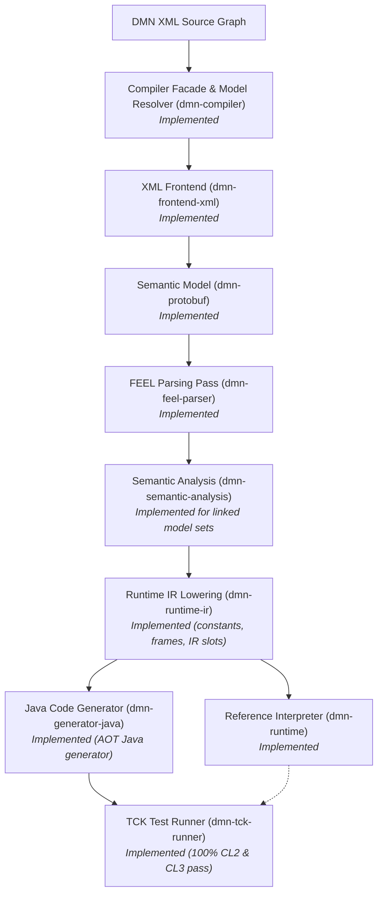
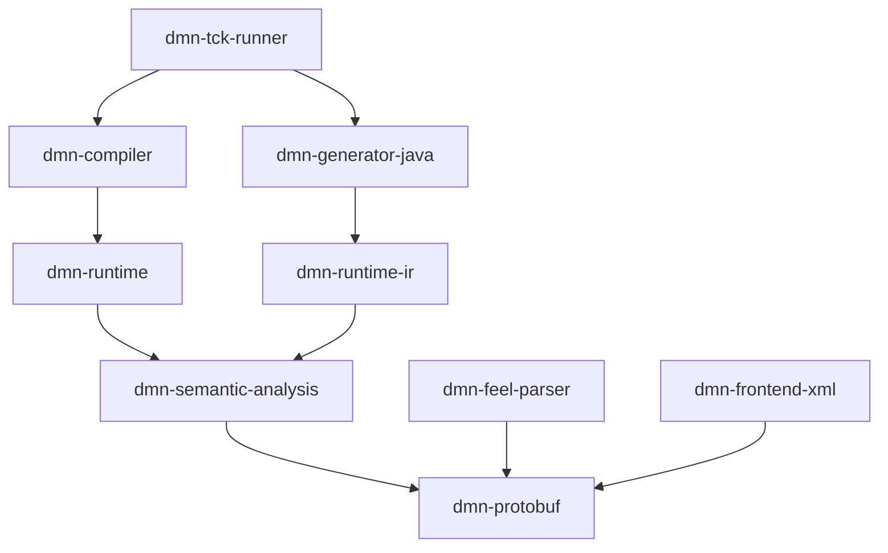

# Chapter 5 — Overall Architecture [IMPLEMENTATION-ALIGNED]

<!-- generated-toc:start -->
## Table of contents

- [3.1 Pipeline](#contents-section-1)
- [3.2 Implemented transformations](#contents-section-2)
- [3.3 Representation strategy](#contents-section-3)
- [3.4 Dependency direction](#contents-section-4)
- [3.5 Implemented semantic analysis & runtime execution](#contents-section-5)
- [3.6 Runtime boundary](#contents-section-6)
<!-- generated-toc:end -->


<a id="contents-section-1"></a>
## 3.1 Pipeline



Each stage has a stable protobuf or IR input/output boundary and treats its input as immutable.

<a id="contents-section-2"></a>
## 3.2 Implemented transformations

| Stage | Input | Output | Status |
| --- | --- | --- | --- |
| XML frontend | DMN XML | `Definitions` with FEEL text | Implemented for supported DMN subset |
| FEEL parser | Semantic `Definitions` | copied `Definitions` with parsed FEEL | Implemented |
| Semantic pipeline | parsed model set | typed models, persisted bindings, compilation order, and diagnostics | Implemented |
| Runtime IR lowerer | typed model set | immutable Runtime IR | Implemented |
| Reference interpreter | Runtime IR | `DmnEvaluationResult` | Implemented (`dmn-runtime`) |
| Java generator | Runtime IR | standalone Java source code | Implemented (`dmn-generator-java`) |
| TCK test runner | TCK XML models | execution assertions | Implemented (`dmn-tck-runner`, 100% CL2 & CL3 pass) |

<a id="contents-section-3"></a>
## 3.3 Representation strategy

The semantic and parsed compiler models share the same protobuf schema. Replaceable nodes use a `oneof`:

```text
text representation  →  parsed representation
```

The XML frontend selects the text branch. `DmnFeelParser` creates a copied model and selects the parsed branch only for successfully parsed nodes. The original semantic model remains unchanged.

<a id="contents-section-4"></a>
## 3.4 Dependency direction



The parser and XML frontend are test-scoped dependencies of semantic-analysis and runtime integration tests; they are not production dependencies of the runtime or generated Java code.

<a id="contents-section-5"></a>
## 3.5 Implemented semantic analysis & runtime execution

Implemented:

- global input, decision, and BKM declarations
- requirement-aware decision scopes
- BKM parameter scopes
- sequential context-entry scopes
- FEEL name resolution
- structured item-definition property checks
- duplicate, ambiguous, unavailable, and unknown-name diagnostics
- named-type resolution and declared-type validation
- FEEL expression and boxed-expression type inference
- unary/binary operator and built-in function validation
- decision, decision-table, BKM, item-definition, and decision-service validation
- DRG dependency validation, cycle detection, and deterministic compilation order
- Runtime IR lowering for expressions, decision tables, boxed context entries,BKMs, and imports
- Process-local Runtime IR interpreter (`dmn-runtime`)
- Ahead-Of-Time Java source generator (`dmn-generator-java`)
- strict OMG DMN TCK CL2/CL3 accounting and conformance-recovery suite (`dmn-tck-runner`)

<a id="contents-section-6"></a>
## 3.6 Runtime boundary

Runtime IR, `dmn-runtime`, and `dmn-generator-java` must remain strictly independent from XML, VTD-XML, ANTLR, source-text nodes, and frontend diagnostics.
