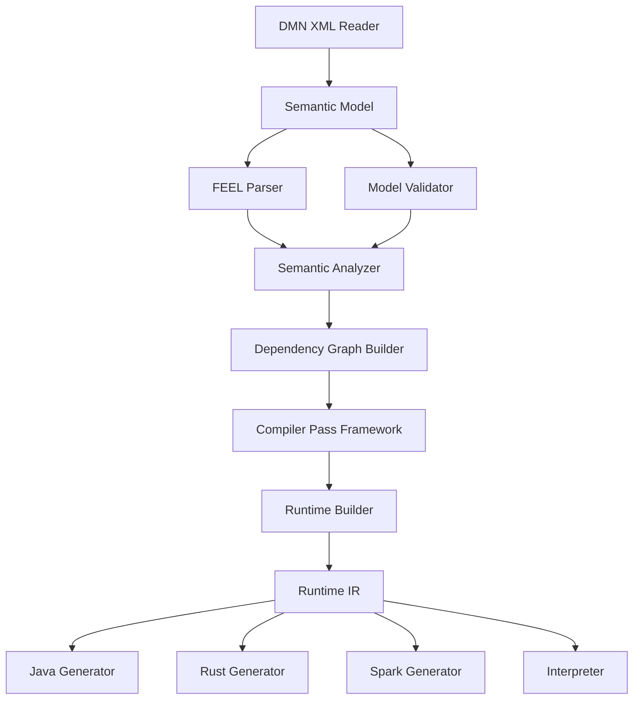
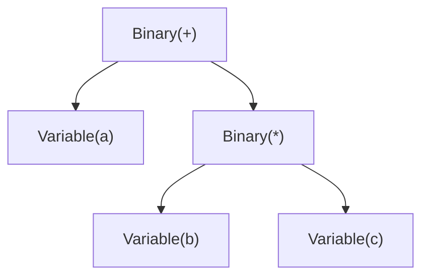
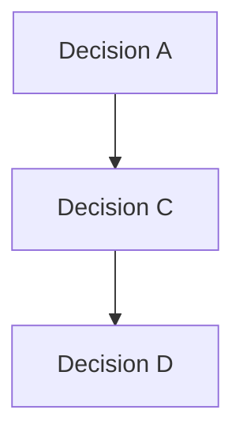
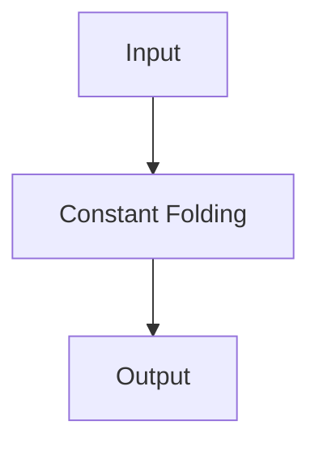

# Chapter 6 — Logical Component Architecture [NORMATIVE]

<!-- generated-toc:start -->
## Table of contents

- [6.1 Purpose](#contents-section-1)
- [6.2 Component Overview](#contents-section-2)
- [6.3 XML Frontend](#contents-section-3)
- [6.4 Semantic Model](#contents-section-4)
- [6.5 FEEL Parser](#contents-section-5)
- [6.6 Model Validator](#contents-section-6)
- [6.7 Semantic Analyzer](#contents-section-7)
- [6.8 Dependency Graph Builder](#contents-section-8)
- [6.9 Compiler Pass Framework](#contents-section-9)
- [6.10 Runtime Builder](#contents-section-10)
- [6.11 Runtime IR](#contents-section-11)
- [6.12 Code Generators](#contents-section-12)
- [6.13 Runtime Engine](#contents-section-13)
- [6.14 Diagnostics Framework](#contents-section-14)
- [6.15 Extension Framework](#contents-section-15)
- [6.16 Component Interaction Rules](#contents-section-16)
- [6.17 Component Dependency Matrix](#contents-section-17)
<!-- generated-toc:end -->


<a id="contents-section-1"></a>
## 6.1 Purpose

The DMN Compiler Toolkit is composed of a set of loosely coupled
compiler components.

Each component has a single responsibility and communicates only through
well-defined intermediate representations.

The architecture follows a pipeline model in which each component
transforms one representation into another while preserving semantic
correctness.

The objective is to maximize maintainability, extensibility,
testability, and performance.

Current implementation status:

- XML frontend and canonical semantic model are implemented.
- FEEL parsing and protobuf AST construction are implemented.
- The semantic pipeline implements local and cross-model reference resolution, type analysis, model validation, persisted/exposed bindings, and deterministic dependency analysis.
- Structural Runtime IR and deterministic graph/type lowering are implemented.
- The optimizer, Runtime IR expression lowering, generators, and runtime remain target components.

------------------------------------------------------------------------

<a id="contents-section-2"></a>
## 6.2 Component Overview



------------------------------------------------------------------------

<a id="contents-section-3"></a>
## 6.3 XML Frontend

### Responsibility

Read and write DMN XML documents.

### Responsibilities

-   XML parsing
-   namespace resolution
-   schema version detection
-   source location tracking
-   extension element preservation
-   XML serialization

### Does NOT

-   parse FEEL
-   resolve references
-   validate types
-   optimize expressions

### Input

```text
DMN XML
```
### Output
```text
Semantic Model
```
------------------------------------------------------------------------

<a id="contents-section-4"></a>
## 6.4 Semantic Model

The Semantic Model is the canonical representation of a DMN document.

It represents the specification, not the XML syntax.

### Responsibilities
Represent
-   Definitions
-   Decisions
-   BKMs
-   InputData
-   Decision Services
-   Item Definitions
-   Decision Tables
-   FEEL source expressions

The Semantic Model is immutable after construction.

------------------------------------------------------------------------

<a id="contents-section-5"></a>
## 6.5 FEEL Parser

### Responsibility

Convert FEEL source code into an Abstract Syntax Tree.

### Input
```text
"a+b*c"
```
### Output

The parser performs syntax analysis only.

------------------------------------------------------------------------

<a id="contents-section-6"></a>
## 6.6 Model Validator

The validator checks structural correctness before semantic analysis.

Examples
-   duplicate IDs
-   duplicate names
-   missing references
-   invalid namespaces
-   malformed decision tables
-   invalid XML combinations

The validator does not resolve types.

------------------------------------------------------------------------
<a id="contents-section-7"></a>
## 6.7 Semantic Analyzer

The semantic analyzer enriches the model.

Responsibilities
-   reference resolution
-   type inference
-   type checking
-   function resolution
-   dependency analysis
-   cycle detection
-   context validation
-   decision table validation

Output
```text
Validated Semantic Model
```
------------------------------------------------------------------------

<a id="contents-section-8"></a>
## 6.8 Dependency Graph Builder

Constructs the complete Decision Requirements Graph (DRG).

Produces

Used for
-   execution ordering
-   optimization
-   dead code elimination
-   incremental compilation
------------------------------------------------------------------------
<a id="contents-section-9"></a>
## 6.9 Compiler Pass Framework

All optimizations will be implemented as compiler passes.

Every pass

-   receives one model
-   produces one model

No pass mutates its input.

Example

------------------------------------------------------------------------

<a id="contents-section-10"></a>
## 6.10 Runtime Builder

Transforms the semantic model into Runtime IR.

Responsibilities

-   integer ID assignment
-   compact memory layout
-   reference flattening
-   expression lowering
-   execution graph generation

------------------------------------------------------------------------

<a id="contents-section-11"></a>
## 6.11 Runtime IR

The Runtime IR is the execution model.

Characteristics
-   immutable
-   compact
-   cache friendly
-   serialization friendly
-   XML free
-   FEEL free
Contains
```text
RuntimeDecision
RuntimeVariable
RuntimeExpression
RuntimeFunction
ExecutionGraph
```

------------------------------------------------------------------------

<a id="contents-section-12"></a>
## 6.12 Code Generators

Every generator consumes Runtime IR.

Never XML.

Never FEEL.

Never Semantic Model.

Generators

-   Java
-   Rust
-   Go
-   Spark SQL
-   Interpreter
-   Future generators

------------------------------------------------------------------------

<a id="contents-section-13"></a>
## 6.13 Runtime Engine

The runtime executes Runtime IR.

Responsibilities

-   decision execution
-   expression evaluation
-   function invocation
-   result construction

The runtime performs

-   no XML parsing
-   no FEEL parsing
-   no semantic analysis

------------------------------------------------------------------------

<a id="contents-section-14"></a>
## 6.14 Diagnostics Framework

Diagnostics are collected throughout the pipeline.

Categories

-   Error
-   Warning
-   Information
-   Hint

Every diagnostic includes

-   error code
-   message
-   source location
-   compiler phase
-   optional fix suggestion

------------------------------------------------------------------------

<a id="contents-section-15"></a>
## 6.15 Extension Framework

The architecture supports future extensions.

Examples

-   custom functions
-   custom type systems
-   optimization plugins
-   alternative generators
-   additional XML namespaces

Extensions must never violate the Architecture Principles.

------------------------------------------------------------------------

<a id="contents-section-16"></a>
## 6.16 Component Interaction Rules

The following rules are mandatory:

1.  Components communicate only through defined intermediate
    representations.
2.  Components must not access internal state of other components.
3.  Compiler passes are stateless.
4.  Runtime components never depend on compiler components.
5.  XML components never appear in runtime modules.
6.  Code generators never modify Runtime IR.
7.  Diagnostics are propagated, never ignored.

------------------------------------------------------------------------

<a id="contents-section-17"></a>
## 6.17 Component Dependency Matrix

| Component         | Depends On          |
| ----------------- | ------------------- |
| XML Reader        | VTD-XML             |
| Semantic Model    | Common Model        |
| FEEL Parser       | ANTLR               |
| Validator         | Semantic Model      |
| Semantic Analyzer | Validator, FEEL AST |
| Dependency Graph  | Semantic Analyzer   |
| Compiler Passes   | Dependency Graph    |
| Runtime Builder   | Compiler Passes     |
| Code Generator    | Runtime IR          |
| Runtime           | Runtime IR          |


No component may depend on a higher layer.

------------------------------------------------------------------------
