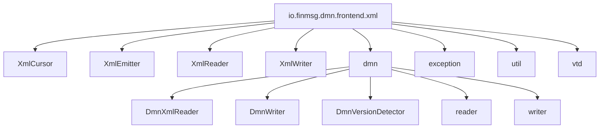
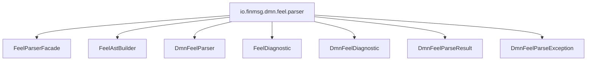
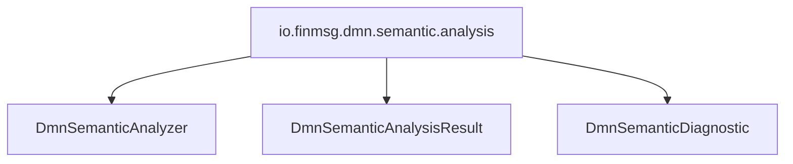

# Chapter 8 — Package Layout [IMPLEMENTATION-ALIGNED]

<!-- generated-toc:start -->
## Table of contents

- [6.1 Generated model](#contents-section-1)
- [6.2 XML frontend](#contents-section-2)
- [6.3 FEEL parser](#contents-section-3)
- [6.4 Semantic analysis](#contents-section-4)
- [6.5 Public entry points](#contents-section-5)
- [6.6 Package rules](#contents-section-6)
<!-- generated-toc:end -->


<a id="contents-section-1"></a>
## 6.1 Generated model

```text
io.finmsg.dmn.model
```

Contains all Java classes generated from the protobuf schemas, including `Definitions`, `Feel`, `FeelText`, `FeelParsed`, `Expression`, and decision-table types.

<a id="contents-section-2"></a>
## 6.2 XML frontend



Individual DMN writers belong in:

```text
io.finmsg.dmn.frontend.xml.dmn.writer
```

<a id="contents-section-3"></a>
## 6.3 FEEL parser



ANTLR-generated sources use the same parser package below `src/gen/java`.

<a id="contents-section-4"></a>
## 6.4 Semantic analysis



<a id="contents-section-5"></a>
## 6.5 Public entry points

Currently usable stage-level entry points:

```text
io.finmsg.dmn.frontend.xml.dmn.DmnXmlReader
io.finmsg.dmn.frontend.xml.dmn.DmnWriter
io.finmsg.dmn.feel.parser.FeelParserFacade
io.finmsg.dmn.feel.parser.DmnFeelParser
io.finmsg.dmn.semantic.analysis.DmnSemanticAnalyzer
```

These are compiler-stage APIs. A stable high-level compiler facade remains future work.

<a id="contents-section-6"></a>
## 6.6 Package rules

1. XML-specific code stays below `frontend.xml`.
2. Generated messages stay below `model`.
3. FEEL parsing stays below `feel.parser`.
4. Semantic passes stay below `semantic.analysis`.
5. Later stages must not import XML or ANTLR implementation types.
