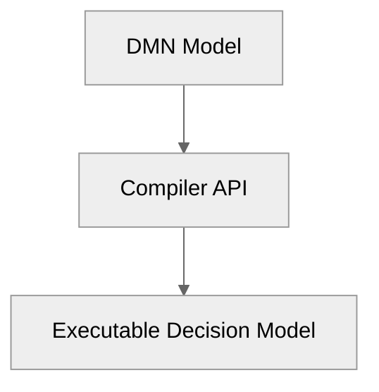
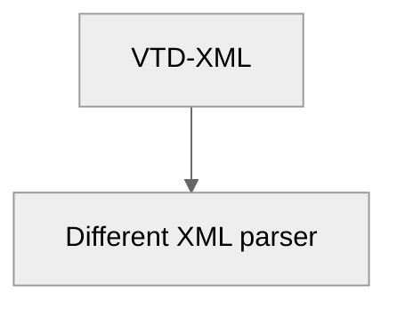
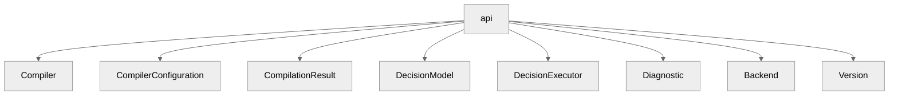
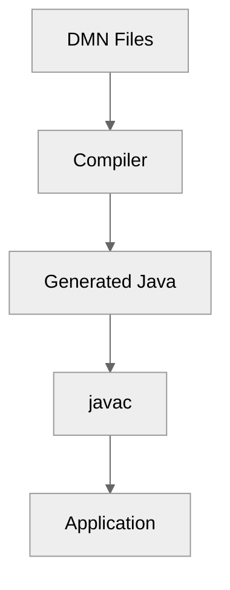
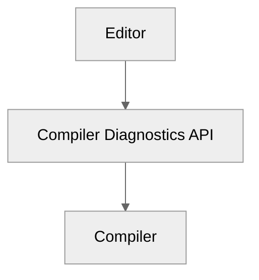
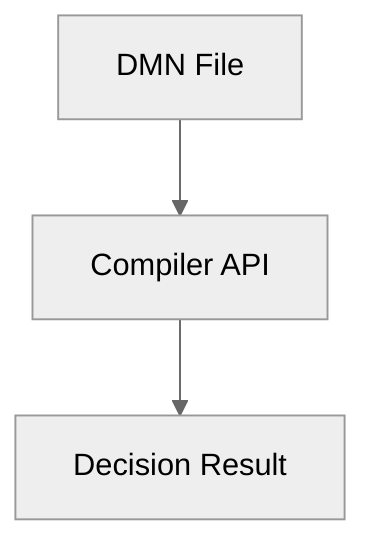

# Chapter 9 — Public API [IMPLEMENTATION-ALIGNED]

<!-- generated-toc:start -->
## Table of contents

- [9.1 Purpose](#contents-section-1)
- [9.2 API Design Principles](#contents-section-2)
- [9.3 Public API Modules](#contents-section-3)
- [9.4 Compiler API](#contents-section-4)
- [9.5 Compiler Builder](#contents-section-5)
- [9.6 Compilation Result](#contents-section-6)
- [9.7 Diagnostics API](#contents-section-7)
- [9.8 Decision Model API](#contents-section-8)
- [9.9 Decision Execution API](#contents-section-9)
- [9.10 Input API](#contents-section-10)
- [9.11 Result API](#contents-section-11)
- [9.12 Backend Selection](#contents-section-12)
- [9.13 Compilation Pipeline API](#contents-section-13)
- [9.14 Streaming Compilation API](#contents-section-14)
- [9.15 Incremental Compilation API](#contents-section-15)
- [9.16 Maven Plugin API](#contents-section-16)
- [9.17 CLI API](#contents-section-17)
- [9.18 IDE Integration](#contents-section-18)
- [9.19 Versioning Strategy](#contents-section-19)
- [9.20 API Compatibility Rules](#contents-section-20)
- [9.21 Example Complete Application](#contents-section-21)
- [9.22 Public API Summary](#contents-section-22)
<!-- generated-toc:end -->


<a id="contents-section-1"></a>
## 9.1 Purpose

The Public API defines the stable, zero-reflection integration boundary between host applications and the DMN Compiler Toolkit. Orchestrated via `io.finmsg.dmn.compiler.DmnCompiler` and `io.finmsg.dmn.runtime.DmnRuntime`, the public interface shields callers from compiler internals (VTD-XML parsing, ANTLR token trees, lowering passes, and AST optimizations).

The architecture separates:

-   internal compiler implementation
-   public developer-facing interfaces (`DmnCompiler`, `DmnCompilerOptions`, `DmnCompiledModel`, `DmnEvaluationResult`)

Users and integrations interact exclusively with high-level immutable contracts:
-   compiler passes
-   optimization
-   Runtime IR internals

The public API provides a simple abstraction:



------------------------------------------------------------------------

<a id="contents-section-2"></a>
## 9.2 API Design Principles

### 9.2.1 API-001 --- Simple Entry Point

The common use case should require minimal code.

Example:

```java
Compiler compiler =
    Compiler.builder()
            .build();

DecisionModel model =
    compiler.compile(
        Path.of("traffic.dmn")
    );
```
------------------------------------------------------------------------
### 9.2.2 API-002 --- Hide Compiler Internals

Application code should never directly access:
```java
XmlReader
FeelParser
SemanticAnalyzer
Optimizer
RuntimeBuilder
```
------------------------------------------------------------------------
Instead:
```java
Compiler
```
is the facade.
------------------------------------------------------------------------
### 9.2.3 API-003 --- Stable Contracts

Public interfaces evolve slowly.

Internal modules may change:

without affecting users.
------------------------------------------------------------------------
<a id="contents-section-3"></a>
## 9.3 Public API Modules

Recommended module:
```text
dmn-api
```
Dependencies:
```text
dmn-runtime-api
dmn-model-api
```
The API module must NOT depend on:
```text
antlr
vtd-xml
compiler passes
```
------------------------------------------------------------------------
Package:
```text
io.finmsg.dmn.api
```
Structure:

------------------------------------------------------------------------

<a id="contents-section-4"></a>
## 9.4 Compiler API

Main entry point:
```java
public interface Compiler {
    CompilationResult compile(
        Source source
    );
}
```
------------------------------------------------------------------------
Example:
```java
CompilationResult result =
    compiler.compile(
        Source.file(
            "traffic.dmn"
        )
    );
```
------------------------------------------------------------------------

<a id="contents-section-5"></a>
## 9.5 Compiler Builder

Configuration is explicit.
Example:
```java
Compiler compiler =
    Compiler.builder()
        .backend(
            Backend.JAVA
        )
        .optimization(
            OptimizationLevel.MAX
        )
        .build();
```
------------------------------------------------------------------------
Possible options:
```text
backend
optimization level
diagnostic mode
cache
security limits
source mapping
```
------------------------------------------------------------------------

<a id="contents-section-6"></a>
## 9.6 Compilation Result

Compilation returns a structured result.

Example:
```java
public interface CompilationResult {
    boolean successful();
    DecisionModel model();
    List<Diagnostic> diagnostics();
}
```
------------------------------------------------------------------------
Usage:
```java
if(result.successful()) {
    DecisionModel model =
        result.model();
}
```
------------------------------------------------------------------------

<a id="contents-section-7"></a>
## 9.7 Diagnostics API

Compiler errors are first-class objects.

Example:
```java
public record Diagnostic(
    Severity severity,
    String code,
    String message,
    SourceLocation location
){}
```
------------------------------------------------------------------------
Example result:
```text
ERROR DMN-2004
Unknown variable:
speedLimit
traffic.dmn
line 25
```
------------------------------------------------------------------------

<a id="contents-section-8"></a>
## 9.8 Decision Model API

The compiled decision model represents executable output.

Example:
```java
public interface DecisionModel {
    String name();
    DecisionExecutor executor();
}
```
------------------------------------------------------------------------

The application does not know whether the model came from:
```text
Java generation
Bytecode
Interpreter
Native backend
```
------------------------------------------------------------------------

<a id="contents-section-9"></a>
## 9.9 Decision Execution API

Runtime API:
```java
public interface DecisionExecutor {
    DecisionResult execute(
        DecisionInput input
    );
}
```
------------------------------------------------------------------------
Example:
```java
DecisionResult result =
    executor.execute(
        input
    );
```
------------------------------------------------------------------------

<a id="contents-section-10"></a>
## 9.10 Input API

Two supported modes.
------------------------------------------------------------------------
### 9.10.1 Generic Input

Flexible:
```java
DecisionInput input =
    DecisionInput.builder()
        .put(
            "speed",
            120
        )
        .build();
```
------------------------------------------------------------------------
### 9.10.2 Generated Input

High-performance:
```java
TrafficInput input =
    new TrafficInput(
        120
    );
```
------------------------------------------------------------------------

<a id="contents-section-11"></a>
## 9.11 Result API

Example:
```java
public interface DecisionResult {
    Object value();
    Map<String,Object> outputs();
}
```
------------------------------------------------------------------------
Example:
```java
Penalty penalty =
    result.value();
```
------------------------------------------------------------------------

<a id="contents-section-12"></a>
## 9.12 Backend Selection

The API supports multiple targets.

Example:
```java
Compiler compiler =
    Compiler.builder()
        .backend(
            Backend.RUST
        )
        .build();
```
------------------------------------------------------------------------
Available:
```text
JAVA
RUST
GO
SPARK_SQL
WASM
```
------------------------------------------------------------------------

<a id="contents-section-13"></a>
## 9.13 Compilation Pipeline API

Advanced users may access pipeline stages.

Example:
```java
CompilerPipeline pipeline =
    PipelineBuilder.create()
        .xmlFrontend()
        .feelParser()
        .optimizer()
        .runtimeBuilder()
        .build();
```
------------------------------------------------------------------------

This API is considered advanced.

------------------------------------------------------------------------

<a id="contents-section-14"></a>
## 9.14 Streaming Compilation API

For large environments:
Example:
```java
compiler.compile(
    InputStream stream
);
```
------------------------------------------------------------------------
Benefits:
-   lower memory
-   CI/CD integration
-   repository scanning
------------------------------------------------------------------------
<a id="contents-section-15"></a>
## 9.15 Incremental Compilation API

Large repositories require incremental builds.

Example:
```java
CompilationCache cache =
    new CompilationCache();

compiler.compileIncremental(
    source,
    cache
);
```
------------------------------------------------------------------------

Only changed artifacts are rebuilt.

------------------------------------------------------------------------

<a id="contents-section-16"></a>
## 9.16 Maven Plugin API

The compiler integrates into builds.

Example:
```xml
<plugin>
    <groupId>
        io.finmsg.dmn
    </groupId>
    <artifactId>
        dmn-maven-plugin
    </artifactId>
</plugin>
```
------------------------------------------------------------------------
Build:
```text
mvn compile
```
Pipeline:

------------------------------------------------------------------------

<a id="contents-section-17"></a>
## 9.17 CLI API

Command-line access:
Example:
```bash
dmn compile traffic.dmn
```
------------------------------------------------------------------------
Options:
```bash
--backend java
--optimize max
--output target/generated
--diagnostics verbose
```
------------------------------------------------------------------------
Example:
```bash
dmn inspect traffic.dmn
```
shows:
```text
Decisions:
Penalty
Dependencies:
SpeedCheck -> Penalty
Runtime IR size:
3.2 KB
```
------------------------------------------------------------------------

<a id="contents-section-18"></a>
## 9.18 IDE Integration

Future support:
-   IntelliJ plugin
-   VS Code extension
-   Language Server Protocol

The API enables:

------------------------------------------------------------------------

<a id="contents-section-19"></a>
## 9.19 Versioning Strategy

Public API follows semantic versioning.

Example:
```text
1.0.0
```
Meaning:
```text
Major
breaking changes
Minor
new features
Patch
bug fixes
```
------------------------------------------------------------------------

<a id="contents-section-20"></a>
## 9.20 API Compatibility Rules

Allowed:
```text
Add new methods
Add new backends
Add new diagnostics
```
------------------------------------------------------------------------
Breaking:
```text
Remove interfaces
Change method signatures
Change result semantics
```
------------------------------------------------------------------------

<a id="contents-section-21"></a>
## 9.21 Example Complete Application

Application code:
```java
public class Application {
public static void main(
    String[] args
){
Compiler compiler =
    Compiler.builder()
            .build();

DecisionModel model =
    compiler.compile(
        Path.of(
            "traffic.dmn"
        )
    )
    .model();

DecisionResult result =
    model.executor()
         .execute(
             input
         );

System.out.println(
    result.value()
);
}
}
```
------------------------------------------------------------------------

<a id="contents-section-22"></a>
## 9.22 Public API Summary

The public API provides:

-   simple compiler entry point
-   stable integration boundary
-   backend independence
-   structured diagnostics
-   runtime execution abstraction
-   Maven integration
-   CLI support
-   future IDE integration

The user sees:


The internal compiler remains free to evolve.

------------------------------------------------------------------------
