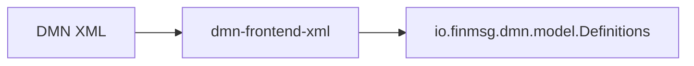

# Chapter 10 — Semantic Model [IMPLEMENTATION-ALIGNED]

<!-- generated-toc:start -->
## Table of contents

- [7.1 Canonical representation](#contents-section-1)
- [7.2 Protobuf organization](#contents-section-2)
- [7.3 Replaceable representation pattern](#contents-section-3)
- [7.4 Immutability](#contents-section-4)
- [7.5 Type model](#contents-section-5)
- [7.6 FEEL representation](#contents-section-6)
- [7.7 Current completeness boundaries](#contents-section-7)
<!-- generated-toc:end -->


<a id="contents-section-1"></a>
## 7.1 Canonical representation

The canonical semantic model is the generated protobuf `Definitions` tree. There is no handwritten domain-model layer.



<a id="contents-section-2"></a>
## 7.2 Protobuf organization

```text
common.proto          metadata, diagnostics, namespaces, references
core.proto            Node and common core structures
types.proto           semantic type references and information items
feel_text.proto       FEEL text and boxed-expression text structures
feel_parsed.proto     parsed FEEL and boxed-expression AST structures
feel.proto            replaceable text/parsed wrappers
decision_table.proto  decision tables and UnaryTest
drg.proto             DRG elements and decision logic
model.proto           Definitions, imports, item definitions, TypeConstraint
```

`feel_text.proto` has no dependency on `feel_parsed.proto`.

<a id="contents-section-3"></a>
## 7.3 Replaceable representation pattern

```protobuf
message Feel {
  oneof representation {
    FeelText text = 1;
    FeelParsed parsed = 2;
  }
}
```

The same pattern is used for:

- `ExpressionNode`
- `BoxedExpression`
- `UnaryTest`
- `TypeConstraint`

The XML frontend creates text branches. The FEEL parsing pass replaces them in a copied model with parsed branches.

<a id="contents-section-4"></a>
## 7.4 Immutability

Every compiler stage receives a built protobuf message. Transforming stages use `toBuilder()`, generated getters, and indexed repeated-field setters to produce a new built message.

The FEEL parsing tests verify:

- the semantic input remains text-based
- the returned model contains parsed nodes
- parsing an already parsed model is idempotent

<a id="contents-section-5"></a>
## 7.5 Type model

`TypeReference` currently supports:

- built-in type
- named type
- list type
- function type
- range type
- structural context type

Named types are resolved against `ItemDefinition` declarations during semantic analysis. Structured path validation uses item components.

<a id="contents-section-6"></a>
## 7.6 FEEL representation

`FeelParsed` contains the root `Expression` AST. Unary-test syntax uses `UnaryTestParsed` and `UnaryTestsExpression`.

The current AST includes literals, names, unary and binary operators, calls, invocation, paths, ranges, contexts, lists, loops, quantified expressions, filters, between/in/instance-of expressions, descendants, function definitions, and unary tests.

<a id="contents-section-7"></a>
## 7.7 Current completeness boundaries

Current boundaries include:

- XML source locations are captured only when explicitly enabled, preserving default semantic round-trip equality
- QName `typeRef` namespaces are resolved in element scope and retained in named type references
- some XML expression and requirement IDs are not represented
- recursive item components, DMNDI, artifacts, and business-context metadata require schema extensions
- resolved symbols and named types are persisted/exposed through semantic binding tables rather than embedded into FEEL AST nodes

Semantic analysis populates `Expression.inferred_type` across the currently supported FEEL and boxed-expression forms. Unsupported or invalid expressions retain an unknown type and produce diagnostics where applicable.
