# Chapter 12 — Runtime IR [IMPLEMENTATION-ALIGNED]

<!-- generated-toc:start -->
## Table of contents

- [9.1 Purpose](#contents-section-1)
- [RIR-001 --- No Source Language Concepts](#contents-section-2)
- [Model A --- Expression Graph](#contents-section-3)
- [Model B --- Instruction Stream](#contents-section-4)
- [Dead instruction elimination](#contents-section-5)
- [Constant folding](#contents-section-6)
- [Variable slot optimization](#contents-section-7)
- [Java](#contents-section-8)
- [Spark SQL](#contents-section-9)
- [Rust](#contents-section-10)
- [Compilation correctness](#contents-section-11)
- [Serialization](#contents-section-12)
- [Execution equivalence](#contents-section-13)
- [Performance](#contents-section-14)
<!-- generated-toc:end -->


<a id="contents-section-1"></a>
## 9.1 Purpose

Implementation baseline as of August 2026: `dmn-runtime-ir` provides immutable runtime model, input, decision, executable BKM, structural type, recursive expression, relation, and decision-table contracts. `RuntimeIrLowerer` assigns deterministic integer IDs, global value slots, lexical local slots, and stable context-field indices; combines linked semantic models into one namespace-free runtime slot space; lowers every protobuf FEEL AST expression variant and all modeled decision logic; resolves statically known path and descendant members; lowers executable BKM functions; persists lexical frame layouts; merges declared and recursively discovered expression references into dependencies; recomputes deterministic runtime topological order; and rejects unsuccessful semantic results. Aggregate constructors enforce ID/slot uniqueness and bounds, dependency and evaluation-order integrity, table widths and aggregation compatibility, and lexical-frame reference bounds. `RuntimeIrOptimizer` builds typed constant pools and stable built-in bindings without changing lossless IR. The `dmn-runtime` module interprets scheduled decisions/BKMs, lexical closures, contexts, relations, collections, unary tests, built-ins, and decision tables. External JAVA/PMML host bindings, serialization, and further optimization remain future targets.

Internal lowering is separated by responsibility: `RuntimeModelIndex` owns linked-model source
addresses and type catalogs, while `RuntimeTypeLowerer` owns DMN/FEEL structural types and member
indices. `RuntimeExpressionLowerer` owns recursive FEEL expressions and lexical-local allocation,
with child and closure-capture transitions shared through `RuntimeLexicalFrame`.
`RuntimeDecisionTableLowerer` owns table structure and policy metadata, and
`RuntimeBoxedExpressionLowerer` owns recursive boxed logic. `RuntimeIrLowerer` remains the public
orchestration facade.

The Runtime Intermediate Representation (Runtime IR) is the central
execution representation of the DMN Compiler Toolkit.

It is the final internal representation before:

-   generated source code
-   native execution
-   interpreted execution
-   distributed execution

The Runtime IR is designed for **execution efficiency**, not for human
readability.

The compiler transforms:

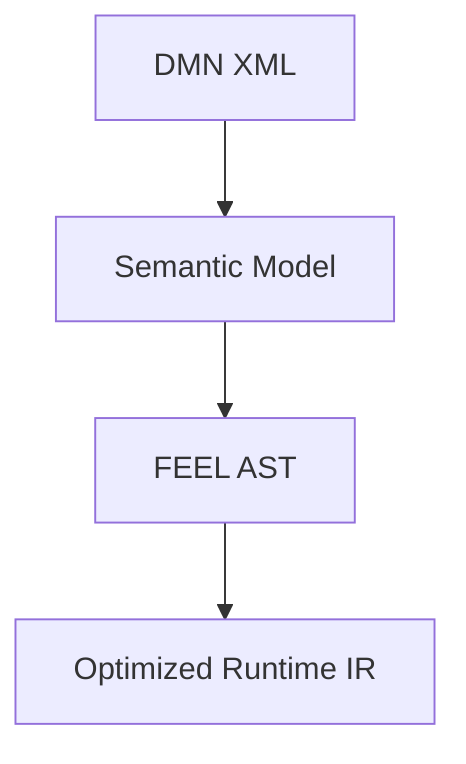

At runtime:

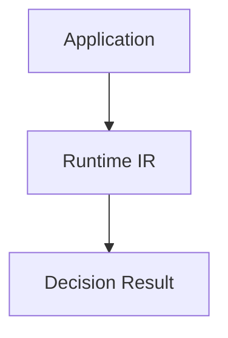

No XML processing, FEEL parsing, or semantic analysis occurs.

------------------------------------------------------------------------

# 9.2 Design Goals

The Runtime IR is optimized for:

-   minimal memory usage
-   fast execution
-   cache locality
-   deterministic behavior
-   language independence
-   serialization
-   code generation
-   parallel execution

------------------------------------------------------------------------

# 9.3 Architectural Position

The Runtime IR is the stable contract between compiler and execution
targets.

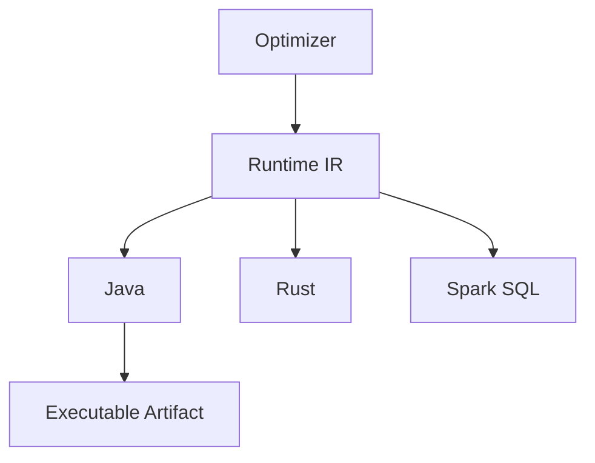

------------------------------------------------------------------------

# 9.4 Runtime IR Principles

<a id="contents-section-2"></a>
## RIR-001 --- No Source Language Concepts

Runtime IR must not contain:

-   XML elements
-   DMN XML identifiers
-   FEEL source strings
-   parser objects
-   AST nodes

Example:

Forbidden:

``` java
RuntimeExpression {

    String feelExpression;

}
```

Correct:

``` java
RuntimeExpression {

    opcode;

    operands;

}
```

------------------------------------------------------------------------

# RIR-002 --- Integer-Based References

Runtime execution should avoid string lookup.

Bad:

``` text
lookup variable "customerAge"
```

Good:

``` text
LOAD_VARIABLE 12
```

Example:

Compilation:

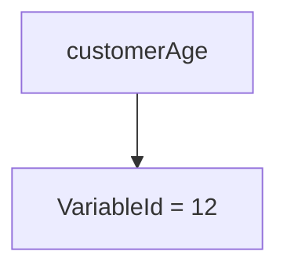

Runtime:

``` text
variables[12]
```

Benefits:

-   faster access
-   lower memory usage
-   better cache locality

------------------------------------------------------------------------

# RIR-003 --- Immutable Representation

Runtime IR objects are immutable.

Example:

``` java
public final class RuntimeDecision {

    private final int id;

    private final int rootExpression;

}
```

No runtime mutation.

Benefits:

-   thread safety
-   sharing between requests
-   safe caching

------------------------------------------------------------------------

# 9.5 Runtime IR Package

Package:

``` text
io.finmsg.dmn.ir
```

Structure:

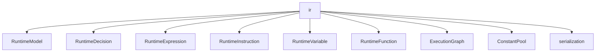

------------------------------------------------------------------------

# 9.6 Runtime Model

The root execution artifact.

Example:

``` java
public final class RuntimeModel {

    private final List<RuntimeDecision> decisions;

    private final List<RuntimeExpression> expressions;

    private final ConstantPool constants;

}
```

Contains:

-   executable decisions
-   expressions
-   variables
-   functions
-   constants

------------------------------------------------------------------------

Example:

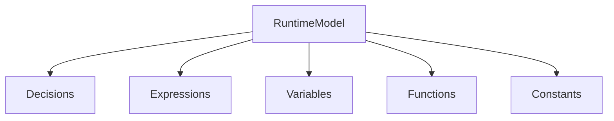

------------------------------------------------------------------------

# 9.7 Runtime Decision

Represents an executable decision.

Example:

Semantic Model:

``` text
Decision:

DeterminePenalty
```

Runtime IR:

``` text
RuntimeDecision

id:

42

rootExpression:

105
```

------------------------------------------------------------------------

Java:

``` java
public record RuntimeDecision(

    int id,

    int expressionId

){}
```

------------------------------------------------------------------------

# 9.8 Runtime Variable

Variables are resolved during compilation.

Semantic Model:

``` text
speed
```

Runtime IR:

``` text
VariableId:

7
```

------------------------------------------------------------------------

Example:

``` java
public record RuntimeVariable(

    int id,

    Type type

){}
```

------------------------------------------------------------------------

Runtime access:

``` java
Object value =
    context.get(7);
```

------------------------------------------------------------------------

# 9.9 Runtime Expression

Expressions are represented as executable operations.

Example:

FEEL:

``` feel
speed > 100
```

Runtime IR:

``` text
Expression 200

LOAD_VARIABLE 7

LOAD_CONSTANT 3

GREATER_THAN
```

------------------------------------------------------------------------

Model:

``` java
public final class RuntimeExpression {

    private final Opcode opcode;

    private final int[] operands;

}
```

------------------------------------------------------------------------

# 9.10 Instruction Model

The Runtime IR can use an instruction-based design.

Example:

``` text
Instruction

opcode

operand1

operand2
```

------------------------------------------------------------------------

Example:

``` text
0001 LOAD_VARIABLE 7

0002 LOAD_CONSTANT 3

0003 GREATER_THAN

0004 RETURN
```

------------------------------------------------------------------------

Java representation:

``` java
public record Instruction(

    Opcode opcode,

    int operand

){}
```

------------------------------------------------------------------------

# 9.11 Opcode Design

Opcodes represent executable operations.

Example:

``` text
LOAD_CONSTANT

LOAD_VARIABLE

STORE_VARIABLE

ADD

SUBTRACT

MULTIPLY

DIVIDE

COMPARE_EQ

COMPARE_GT

AND

OR

CALL_FUNCTION

JUMP

RETURN
```

------------------------------------------------------------------------

Example:

``` text
Opcode.COMPARE_GREATER_THAN
```

replaces:

``` text
FEEL operator >
```

------------------------------------------------------------------------

# 9.12 Expression Graph vs Instruction Stream

Two possible execution models are supported.

------------------------------------------------------------------------

<a id="contents-section-3"></a>
## Model A --- Expression Graph

Example:

``` text
        >
       / \
    speed 100
```

Advantages:

-   easy optimization
-   common subexpression elimination
-   graph analysis

------------------------------------------------------------------------

<a id="contents-section-4"></a>
## Model B --- Instruction Stream

Example:

``` text
LOAD speed

LOAD 100

COMPARE_GT
```

Advantages:

-   fast interpreter
-   simple execution loop
-   good cache behavior

------------------------------------------------------------------------

Recommended architecture:

Use both.

Compiler:

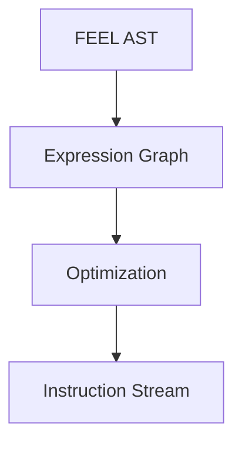

------------------------------------------------------------------------

# 9.13 Execution Graph

The Runtime IR contains the Decision Requirements Graph.

Example:

``` text
InputData

   |

Decision A

   |

Decision B

   |

Decision C
```

Runtime:

``` java
evaluate(C)

requires:

    B

requires:

    A
```

------------------------------------------------------------------------

Model:

``` java
public final class ExecutionGraph {

    List<Node> nodes;

    List<Edge> dependencies;

}
```

------------------------------------------------------------------------

# 9.14 Constant Pool

Constants are stored separately.

Example:

Instead of:

``` text
100

100

100
```

Store:

``` text
ConstantPool

[0]

100
```

Instructions:

``` text
LOAD_CONSTANT 0
```

Benefits:

-   memory reduction
-   sharing
-   serialization efficiency

------------------------------------------------------------------------

# 9.15 Runtime IR Serialization

Current policy: Runtime IR is process-local. The Java records are immutable compiler/runtime
contracts, but they are not a persistence or wire format and do not implement Java
`Serializable`. Their record shape, enum ordering, expression ordinals, and Java class names must
not be stored as durable compatibility identifiers.

No versioned persistence schema is implemented because the repository currently has no persistent
compilation cache, runtime artifact loader, or deployment transport that consumes Runtime IR.
In-memory compilation and the optimized companion model are the only active use cases.

Introduce a persistence schema only when one of these concrete consumers is implemented:

- a compilation cache that survives process or compiler restarts;
- deployment of precompiled IR independently from generated code;
- transport of IR between compiler and runtime processes or languages.

When triggered, persistence must use a separate versioned schema owned by `dmn-runtime-ir`; it
must not reuse the semantic protobuf model and must not serialize Java records directly. The
envelope must contain at least:

- schema major/minor version;
- required feature/capability identifiers;
- compiler version and deterministic source/model-set fingerprint;
- the lossless or optimized IR payload kind;
- integrity metadata and configured size/depth limits.

Compatibility rules:

- readers reject unknown major versions and unsupported required capabilities;
- readers may accept newer minor versions only when unknown fields are safely ignorable;
- stable numeric IDs must be explicitly assigned in the schema, never derived from Java enum
  ordinals;
- migrations occur between persistence messages, not by mutating historical Java records;
- deterministic byte serialization and read/write/read equivalence require conformance tests;
- deserialization is untrusted input and must enforce bounds before allocation.

Protocol Buffers is the preferred first candidate once a consumer exists, subject to a dedicated
ADR covering that consumer's compatibility lifetime and deployment constraints.

------------------------------------------------------------------------

# 9.16 Example Transformation

Input FEEL:

``` feel
speed > 100 and age < 25
```

FEEL AST:

``` text
             AND

          /       \

         >         <

      speed      age

        100       25
```

Runtime IR:

``` text
0 LOAD_VARIABLE speedId

1 LOAD_CONSTANT 100

2 GREATER_THAN

3 LOAD_VARIABLE ageId

4 LOAD_CONSTANT 25

5 LESS_THAN

6 AND

7 RETURN
```

------------------------------------------------------------------------

# 9.17 Runtime Execution Loop

A simple interpreter:

``` java
while(true){

    Instruction instruction =
        code[ip++];

    switch(instruction.opcode()){

        case LOAD_CONSTANT:
            stack.push(
              constants.get(
                instruction.argument()
              )
            );
            break;

        case ADD:
            executeAdd();
            break;

    }
}
```

------------------------------------------------------------------------

Later this can be replaced by:

-   generated Java
-   bytecode generation
-   GraalVM native image
-   LLVM backend

------------------------------------------------------------------------

# 9.18 Runtime IR Optimization

Optimizations target the Runtime IR.

Examples:

------------------------------------------------------------------------

<a id="contents-section-5"></a>
## Dead instruction elimination

Before:

``` text
LOAD x

LOAD y

ADD

POP
```

After:

``` text
removed
```

------------------------------------------------------------------------

<a id="contents-section-6"></a>
## Constant folding

Before:

``` text
LOAD 10

LOAD 20

ADD
```

After:

``` text
LOAD 30
```

------------------------------------------------------------------------

<a id="contents-section-7"></a>
## Variable slot optimization

Before:

``` text
variable lookup:

customer.age
```

After:

``` text
slot 12
```

------------------------------------------------------------------------

# 9.19 Code Generation

Runtime IR becomes:

<a id="contents-section-8"></a>
## Java

``` java
if(speed > 100){

 return HIGH;

}
```

------------------------------------------------------------------------

<a id="contents-section-9"></a>
## Spark SQL

``` sql
CASE
WHEN speed > 100
THEN 'HIGH'
END
```

------------------------------------------------------------------------

<a id="contents-section-10"></a>
## Rust

``` rust
if speed > 100 {
    Result::High
}
```

------------------------------------------------------------------------

# 9.20 Performance Considerations

Runtime IR avoids:

  Traditional Engine   Runtime IR
  -------------------- -----------------
  XML parsing          none
  FEEL parsing         none
  reflection           none
  string lookup        integer IDs
  dynamic dispatch     opcode dispatch
  object graphs        compact arrays

------------------------------------------------------------------------

# 9.21 Thread Safety

Runtime IR is immutable.

Therefore:

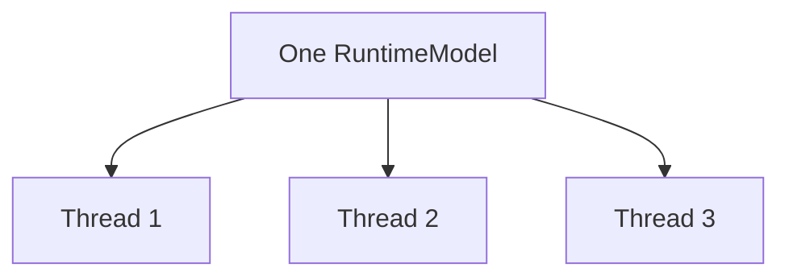

No synchronization required.

------------------------------------------------------------------------

# 9.22 Testing Strategy

Runtime IR tests:

<a id="contents-section-11"></a>
## Compilation correctness

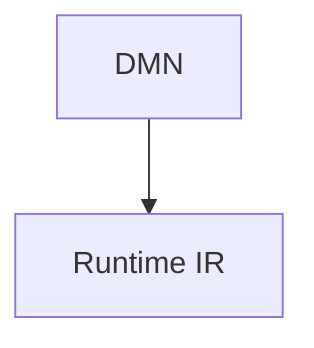

------------------------------------------------------------------------

<a id="contents-section-12"></a>
## Serialization

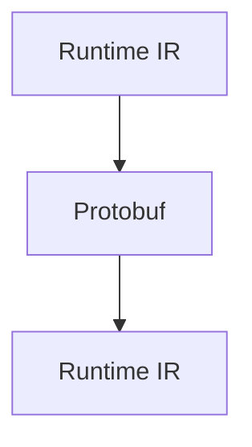

------------------------------------------------------------------------

<a id="contents-section-13"></a>
## Execution equivalence

Compare:

``` text
Reference DMN Engine

vs

Runtime IR Execution
```

------------------------------------------------------------------------

<a id="contents-section-14"></a>
## Performance

Measure:

-   execution latency
-   throughput
-   memory allocation
-   startup time

------------------------------------------------------------------------

# 9.23 Summary

Runtime IR is the key architectural differentiator.

It provides:

-   compiler/runtime separation
-   high-performance execution
-   multi-language generation
-   deterministic artifacts
-   low memory footprint

The final compiler pipeline is:

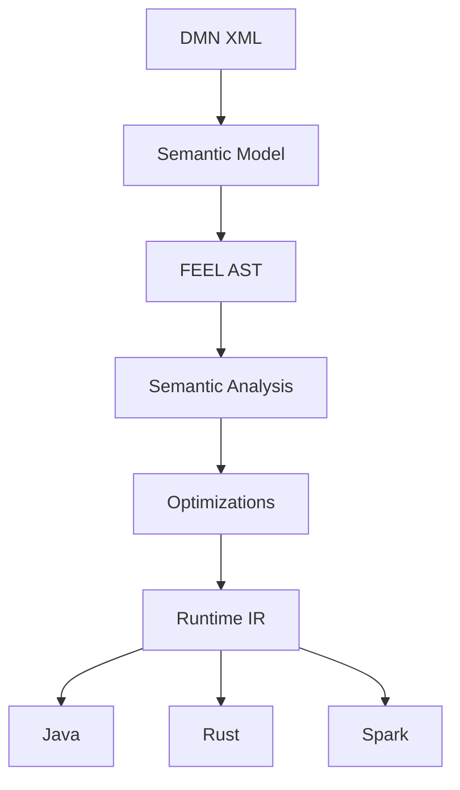

------------------------------------------------------------------------
