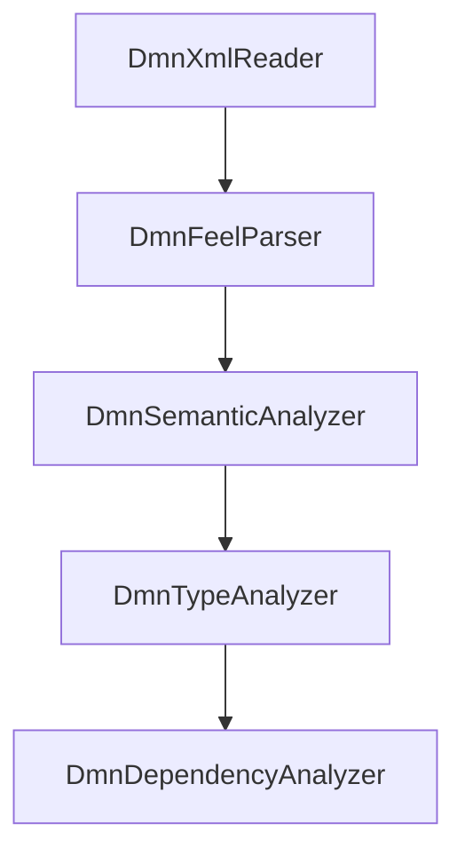
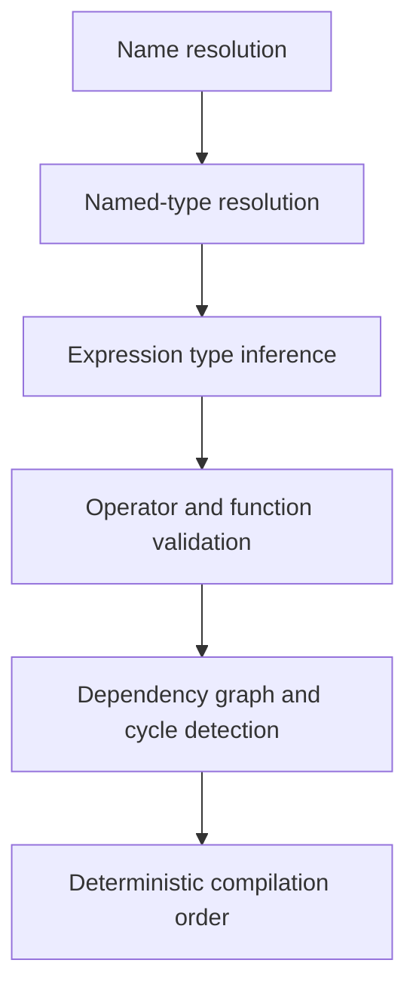
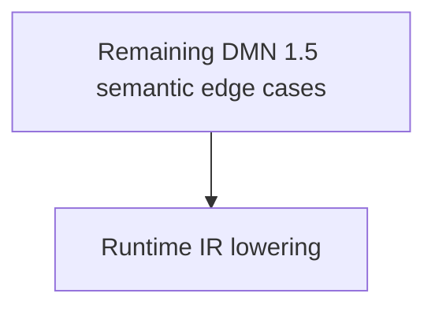

# Chapter 16 — Compiler Passes [IMPLEMENTATION-ALIGNED]

<!-- generated-toc:start -->
## Table of contents

- [16.1 Implemented Passes](#contents-section-1)
- [16.2 Pass Principles](#contents-section-4)
- [16.3 Current Order](#contents-section-5)
- [16.4 Implemented Semantic Pass Order](#contents-section-6)
- [16.5 Future Pass Infrastructure](#contents-section-7)
- [16.6 Implemented Semantic Pass Contract](#contents-section-8)
<!-- generated-toc:end -->


<a id="contents-section-1"></a>
## 16.1 Implemented passes

<a id="contents-section-2"></a>
### FEEL parsing pass

```java
DmnFeelParseResult result =
    new DmnFeelParser().parseWithDiagnostics(semanticModel);
```

Responsibilities:

- copy the semantic protobuf model
- traverse all supported FEEL-bearing paths depth-first
- parse expressions and unary tests
- replace successful text branches with parsed branches
- preserve invalid nodes as text
- collect every syntax error with a semantic-model path

The strict `parse(Definitions)` API throws `DmnFeelParseException` after collection.

<a id="contents-section-3"></a>
### Semantic-analysis pipeline

```java
DmnSemanticPipelineResult result =
    new DmnSemanticPipeline().analyze(parsedModel);
```

Responsibilities currently implemented:

- collect item definitions and DRG declarations
- create requirement-aware scopes
- create function and context scopes
- resolve FEEL names
- validate structured property access
- resolve named types and infer expression types
- validate operators and built-in function calls
- validate declared types, item definitions, BKMs, decision services, and decision tables
- validate DRG dependencies and detect cycles
- produce a deterministic compilation order
- aggregate and deduplicate structured diagnostics

The pipeline runs `DmnSemanticAnalyzer`, `DmnTypeAnalyzer`, and `DmnDependencyAnalyzer` in dependency order. It returns a copied model containing inferred expression types, a deterministic compilation order, diagnostics, and an immutable side table of resolved symbol and named-type bindings. Bindings are not persisted in protobuf AST nodes. The model-set overload validates imports by namespace, resolves external references and named types, and includes imported decisions and BKMs in dependency ordering.

<a id="contents-section-4"></a>
## 16.2 Pass principles

1. **Single responsibility** — parsing and semantic analysis remain separate.
2. **Immutable input** — transformations create copied protobuf messages.
3. **Deterministic traversal** — repeated fields are processed in index order.
4. **Generated accessors** — hot compiler paths avoid protobuf reflection.
5. **Independent tests** — each pass has focused unit and integration tests.
6. **Structured diagnostics** — errors include a model path and source location where available.

<a id="contents-section-5"></a>
## 16.3 Current order



FEEL parsing must precede semantic analysis.

<a id="contents-section-6"></a>
## 16.4 Implemented semantic pass order



Decision-table and other DMN structure validation run within `DmnTypeAnalyzer`. The next semantic work is:



<a id="contents-section-7"></a>
## 16.5 Future pass infrastructure

A generic pass manager, shared compiler context, optimization pipeline, and timing metrics should be introduced only when multiple later passes require them. The current explicit stage APIs keep dependencies and failure behavior clear.

<a id="contents-section-8"></a>
## 16.6 Implemented semantic pass contract

Semantic-analysis stages implement `DmnSemanticPass<R>`. The contract keeps orchestration dependent
on a stable pass abstraction while allowing each stage to expose its purpose-specific result type.
Passes receive an immutable `Definitions` model and must remain stateless.
