# Chapter 17 — Internal Compiler Architecture [IMPLEMENTATION-ALIGNED]

<!-- generated-toc:start -->
## Table of contents

- [17.1 Purpose](#contents-section-1)
- [17.2 Compiler Overview](#contents-section-2)
- [17.3 Compiler Context](#contents-section-3)
- [17.4 Compiler Pipeline](#contents-section-4)
- [17.5 Compiler Pass](#contents-section-5)
- [17.6 Pass Categories](#contents-section-6)
- [17.7 Pass Manager](#contents-section-7)
- [17.8 Pass Scheduling](#contents-section-8)
- [17.9 Pass Dependencies](#contents-section-9)
- [17.10 Compiler Phases](#contents-section-10)
- [17.11 Intermediate Representations](#contents-section-11)
- [17.12 Diagnostics Propagation](#contents-section-12)
- [17.13 Incremental Compilation](#contents-section-13)
- [17.14 Parallel Compilation](#contents-section-14)
- [17.15 Pass Metrics](#contents-section-15)
- [17.16 Pipeline Visualization](#contents-section-16)
- [17.17 Extension Points](#contents-section-17)
- [17.18 Failure Handling](#contents-section-18)
- [17.19 Compiler Observability](#contents-section-19)
- [17.20 Reference Pipeline](#contents-section-20)
- [17.21 Internal Package Layout](#contents-section-21)
- [17.22 Summary](#contents-section-22)
<!-- generated-toc:end -->

!!! note "Implementation & Evolution Baseline"
    The core multi-pass pipeline (XML parsing, FEEL AST construction, whole-model semantic analysis, Runtime IR lowering, and Java code generation) is fully implemented across the 10 reactor modules orchestrated by `dmn-compiler`. Advanced infrastructure features (dynamic external plugin passes, parallel multi-file dispatch, and distributed compilation caches) evolve under the extension roadmap.


<a id="contents-section-1"></a>
## 17.1 Purpose

The previous chapters describe the logical architecture of the DMN
Compiler Toolkit.

This chapter proposes internal compiler infrastructure that could implement that
architecture as the compiler facade and backend ecosystem mature.

The compiler is built as a configurable pipeline of independent compiler
passes. Each pass transforms one intermediate representation into
another or enriches an existing representation.

The goals of the internal architecture are:

-   modularity
-   deterministic execution
-   extensibility
-   incremental compilation
-   parallel execution
-   comprehensive diagnostics
-   observability
-   testability

------------------------------------------------------------------------

## 17.2 Compiler Overview

The compiler is organized as a pipeline.

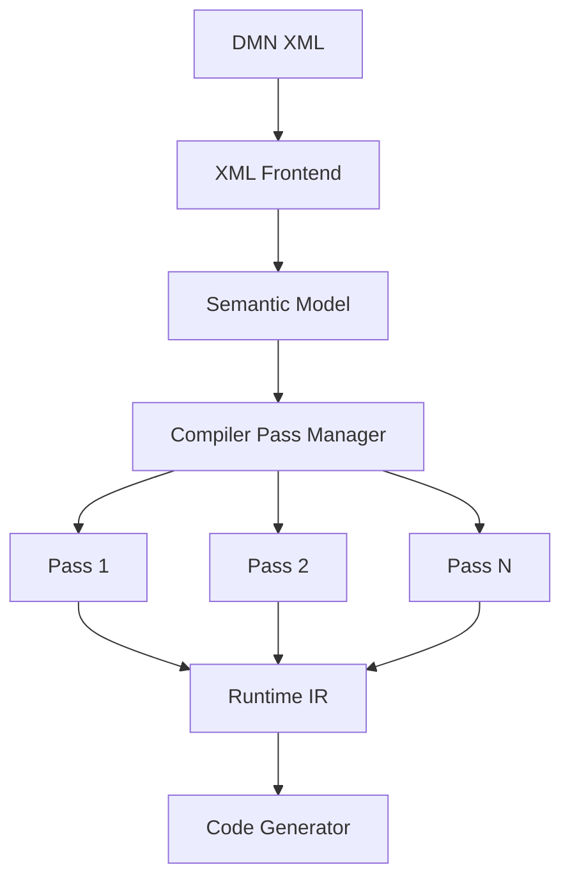
The **Pass Manager** orchestrates the complete compilation process.

------------------------------------------------------------------------

## 17.3 Compiler Context

Compilation state is maintained in a single immutable context.
```java
public interface CompilerContext {
    SemanticModel semanticModel();
    FeelAstRepository astRepository();
    RuntimeModel runtimeModel();
    DiagnosticCollector diagnostics();
    CompilerConfiguration configuration();
}
```
The context is passed to compiler passes.

Compiler passes must never access global state.

------------------------------------------------------------------------
<a id="contents-section-2"></a>
### 17.3.1 Why a Compiler Context?

Without a context:
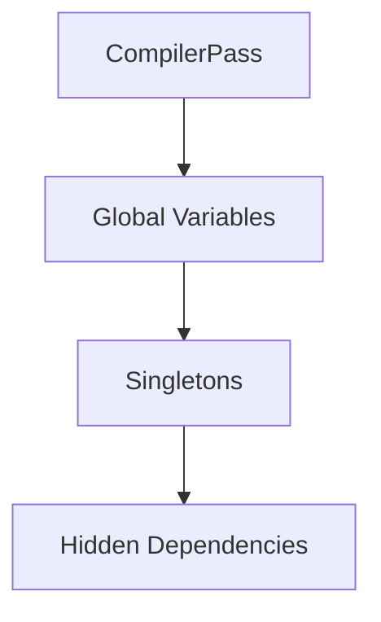
With a context:
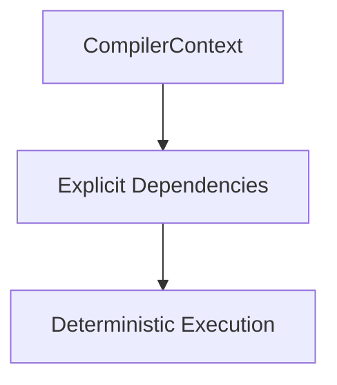
------------------------------------------------------------------------

## 17.4 Compiler Pipeline

The compiler executes a sequence of passes.

Example:
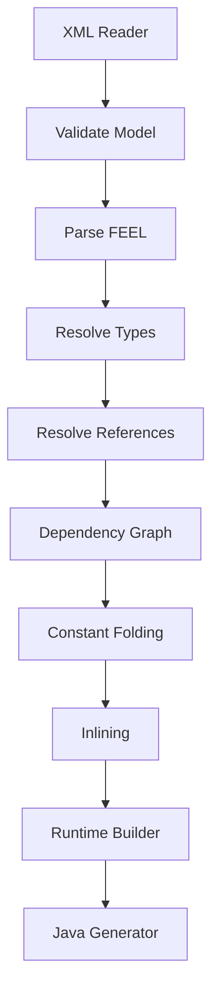
Each stage has exactly one responsibility.

------------------------------------------------------------------------

## 17.5 Compiler Pass

Every compiler pass implements a common interface.
```java
public interface CompilerPass {
    String name();
    CompilerPhase phase();

    void execute(
        CompilerContext context
    );
}
```
Characteristics:
-   stateless
-   deterministic
-   independently testable
-   reusable
------------------------------------------------------------------------

## 17.6 Pass Categories

Compiler passes fall into several categories.

<a id="contents-section-3"></a>
### Validation
Examples:
-   duplicate IDs
-   duplicate names
-   XML consistency
------------------------------------------------------------------------
<a id="contents-section-4"></a>
### Analysis
Examples:
-   type inference
-   dependency graph
-   symbol resolution
------------------------------------------------------------------------
<a id="contents-section-5"></a>
### Optimization
Examples:
-   constant folding
-   inlining
-   dead decision elimination

------------------------------------------------------------------------
<a id="contents-section-6"></a>
### Transformation
Examples:
-   Runtime IR generation
-   Java generation
-   Rust generation
------------------------------------------------------------------------
## 17.7 Pass Manager

The Pass Manager coordinates execution.
```java
public interface PassManager {
    void register(
        CompilerPass pass
    );

    void execute(
        CompilerContext context
    );
}
```
Responsibilities:
-   ordering
-   diagnostics
-   timing
-   metrics
-   dependency checking
------------------------------------------------------------------------
## 17.8 Pass Scheduling

Passes execute in dependency order.

Example:
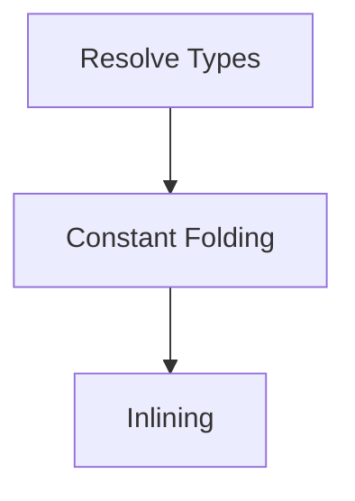
Invalid ordering:
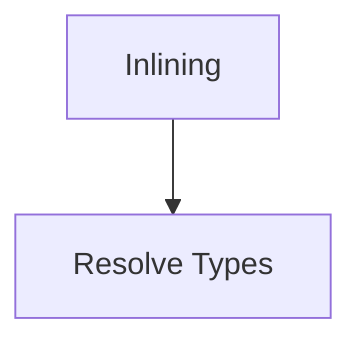
because type information is required first.

The Pass Manager validates scheduling rules.

------------------------------------------------------------------------

## 17.9 Pass Dependencies

Each pass declares its prerequisites.

Example:
```java
public interface CompilerPass {
    Set<Class<?>> requires();
}
```
Example:
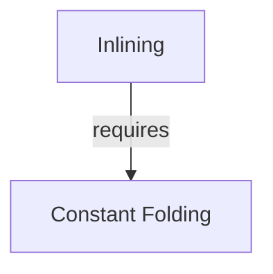
The Pass Manager constructs a dependency graph.

------------------------------------------------------------------------

## 17.10 Compiler Phases

The compiler groups passes into phases.
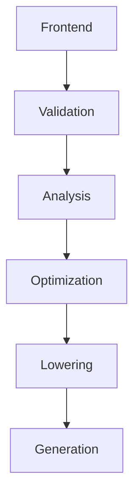
Phases simplify diagnostics and tooling.

------------------------------------------------------------------------

## 17.11 Intermediate Representations

The compiler operates on three primary representations.
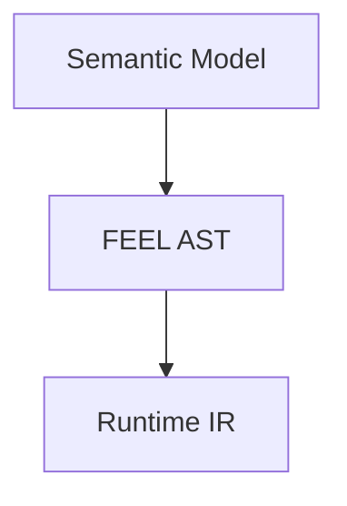
Each representation is immutable.

Compiler passes replace representations rather than mutating them.

------------------------------------------------------------------------

## 17.12 Diagnostics Propagation

Compiler passes report diagnostics through the context.
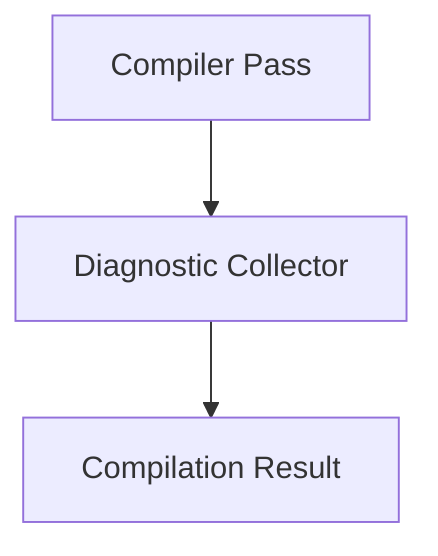
Passes never print directly to the console.

------------------------------------------------------------------------

## 17.13 Incremental Compilation

Large repositories benefit from incremental builds.

Example:
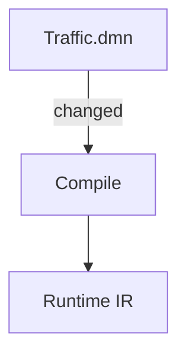
Unchanged models reuse cached artifacts.
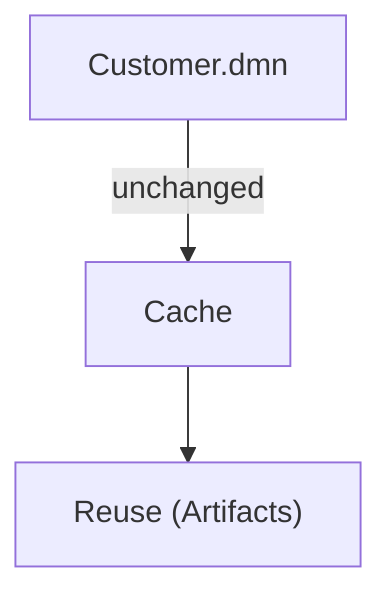
The Pass Manager determines which passes must be rerun.

------------------------------------------------------------------------

## 17.14 Parallel Compilation

Independent models can compile simultaneously.
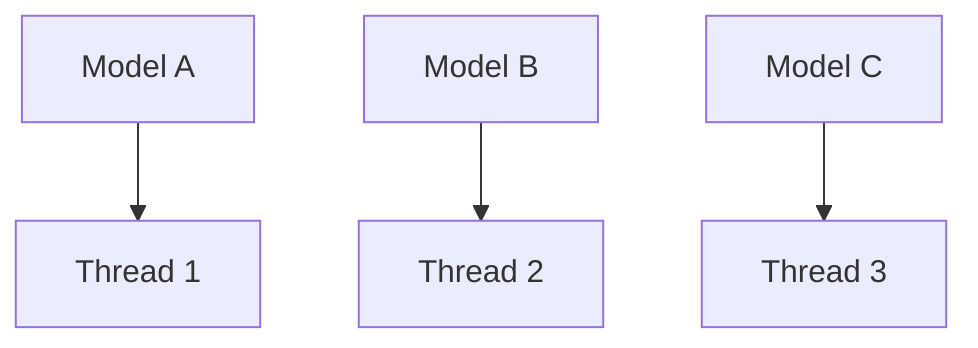
Compiler passes remain thread-safe by avoiding mutable shared state.

------------------------------------------------------------------------

## 17.15 Pass Metrics

Each pass records execution statistics.

Example:
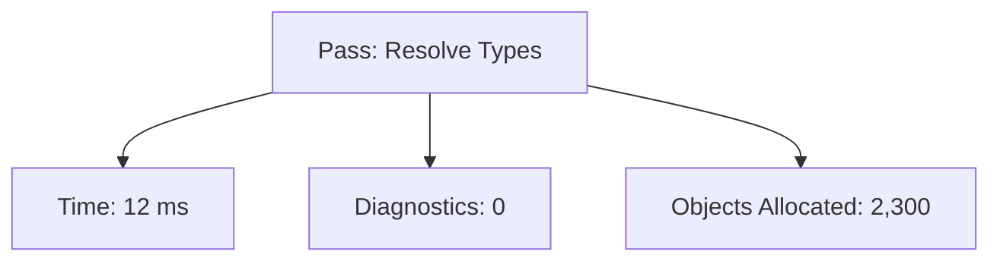
Metrics help identify performance bottlenecks.

------------------------------------------------------------------------

## 17.16 Pipeline Visualization

The compiler can expose its execution graph.
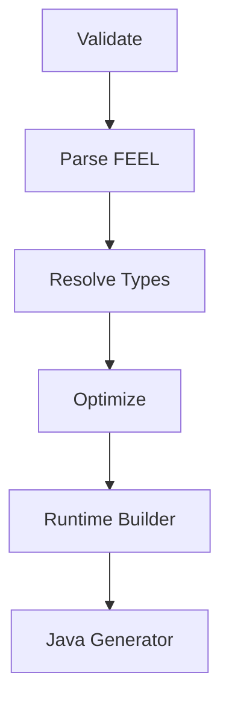
Useful for:
-   debugging
-   documentation
-   IDE integration
------------------------------------------------------------------------
## 17.17 Extension Points

New compiler passes can be added without modifying existing code.

Example:
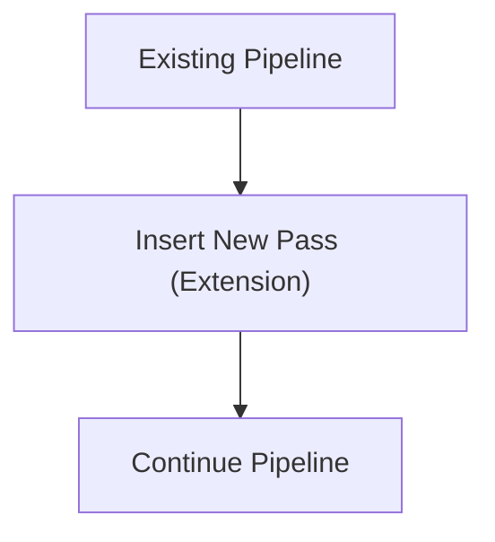
Typical extensions:
-   custom optimization
-   static analysis
-   code quality checks
-   company-specific validations
------------------------------------------------------------------------
## 17.18 Failure Handling

Compilation stops when a phase produces fatal diagnostics.
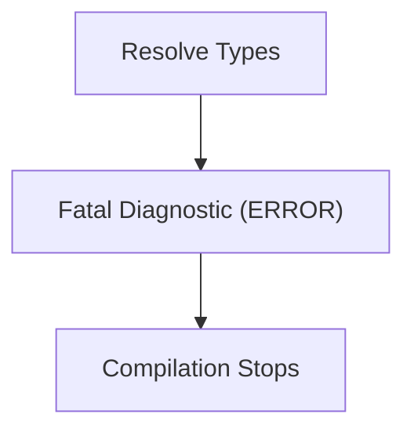
Warnings and informational diagnostics do not stop compilation.

------------------------------------------------------------------------

## 17.19 Compiler Observability

The compiler emits structured events during execution.

Example:
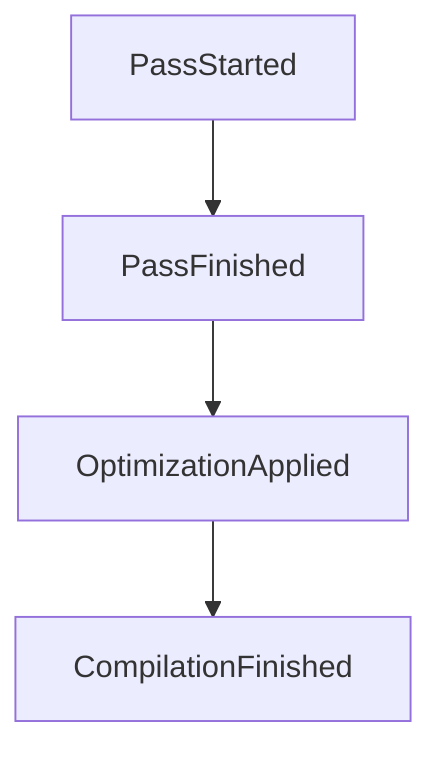
These events can feed logging, profiling, or IDE integrations without
coupling the compiler to a specific logging framework.

------------------------------------------------------------------------

## 17.20 Reference Pipeline

The default pipeline for Version 1.0 is:
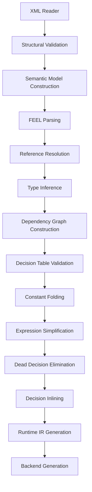
Future releases may add passes, but existing pass contracts should
remain stable.
------------------------------------------------------------------------

## 17.21 Internal Package Layout

A recommended package organization is:
```text
io.finmsg.dmn.compiler
    Compiler
    CompilerContext
    CompilerConfiguration
    PassManager
    CompilerPass
    CompilerPhase
    CompilerPipeline
    CompilerMetrics
    DiagnosticCollector
    pipeline/
    pass/
        validation/
        analysis/
        optimization/
        lowering/
        generation/
    context/
    metrics/
    diagnostics/
```

This mirrors the logical architecture while keeping the implementation
modular.

------------------------------------------------------------------------

## 17.22 Summary

The internal compiler architecture provides:

-   a deterministic execution pipeline
-   explicit pass dependencies
-   immutable intermediate representations
-   incremental and parallel compilation
-   extensible compiler passes
-   comprehensive diagnostics
-   structured observability

The result is a compiler framework that can evolve over time without
disrupting existing functionality or backend generators.

------------------------------------------------------------------------
