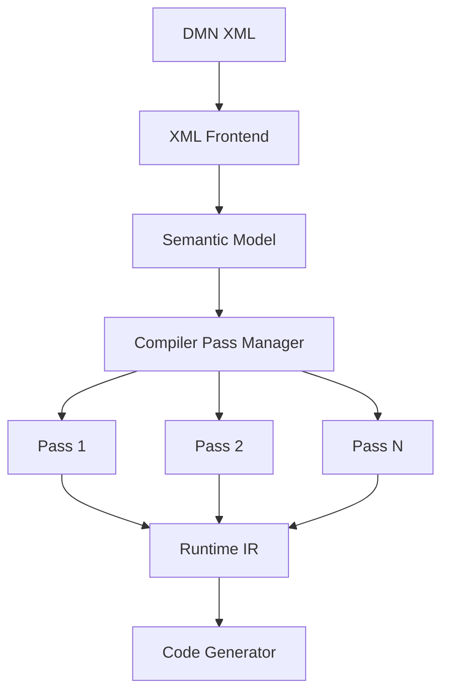

# Chapter 17 — Internal Compiler Architecture [FUTURE]

<!-- generated-toc:start -->
## Table of contents

- [19.1 Purpose](#contents-section-1)
- [Why a Compiler Context?](#contents-section-2)
<!-- generated-toc:end -->

!!! note "Status boundary"
    This chapter is a target design for compiler infrastructure that does not yet
    exist as one unified framework. The current repository has explicit XML, FEEL,
    semantic-analysis, Runtime IR, optimization, and interpreter stages, but it does
    not yet provide the proposed `CompilerContext`, general `PassManager`,
    incremental compilation, parallel compilation, pass metrics, or plugin
    extension system. See the [implementation overview](../../architecture.md) and
    [development plan](../../development-plan.md) for current status.


<a id="contents-section-1"></a>
## 19.1 Purpose

The previous chapters describe the logical architecture of the DMN
Compiler Toolkit.

This chapter proposes internal compiler infrastructure that could implement that
architecture as the compiler facade and backend ecosystem mature.

The compiler is built as a configurable pipeline of independent compiler
passes. Each pass transforms one intermediate representation into
another or enriches an existing representation.

The goals of the internal architecture are:

-   modularity
-   deterministic execution
-   extensibility
-   incremental compilation
-   parallel execution
-   comprehensive diagnostics
-   observability
-   testability

------------------------------------------------------------------------

# 19.2 Compiler Overview

The compiler is organized as a pipeline.



The **Pass Manager** orchestrates the complete compilation process.

------------------------------------------------------------------------

# 19.3 Compiler Context

Compilation state is maintained in a single immutable context.

``` java
public interface CompilerContext {

    SemanticModel semanticModel();

    FeelAstRepository astRepository();

    RuntimeModel runtimeModel();

    DiagnosticCollector diagnostics();

    CompilerConfiguration configuration();

}
```

The context is passed to compiler passes.

Compiler passes must never access global state.

------------------------------------------------------------------------

<a id="contents-section-2"></a>
## Why a Compiler Context?

Without a context:

    CompilerPass

    ↓

    Global Variables

    ↓

    Singletons

    ↓

    Hidden Dependencies

With a context:

    CompilerContext

    ↓

    Explicit Dependencies

    ↓

    Deterministic Execution

------------------------------------------------------------------------

# 19.4 Compiler Pipeline

The compiler executes a sequence of passes.

Example:

    XML Reader

    ↓

    Validate Model

    ↓

    Parse FEEL

    ↓

    Resolve Types

    ↓

    Resolve References

    ↓

    Dependency Graph

    ↓

    Constant Folding

    ↓

    Inlining

    ↓

    Runtime Builder

    ↓

    Java Generator

Each stage has exactly one responsibility.

------------------------------------------------------------------------

# 19.5 Compiler Pass

Every compiler pass implements a common interface.

``` java
public interface CompilerPass {

    String name();

    CompilerPhase phase();

    void execute(
        CompilerContext context
    );

}
```

Characteristics:

-   stateless
-   deterministic
-   independently testable
-   reusable

------------------------------------------------------------------------

# 19.6 Pass Categories

Compiler passes fall into several categories.

<a id="contents-section-3"></a>
### Validation

Examples:

-   duplicate IDs
-   duplicate names
-   XML consistency

------------------------------------------------------------------------

<a id="contents-section-4"></a>
### Analysis

Examples:

-   type inference
-   dependency graph
-   symbol resolution

------------------------------------------------------------------------

<a id="contents-section-5"></a>
### Optimization

Examples:

-   constant folding
-   inlining
-   dead decision elimination

------------------------------------------------------------------------

<a id="contents-section-6"></a>
### Transformation

Examples:

-   Runtime IR generation
-   Java generation
-   Rust generation

------------------------------------------------------------------------

# 19.7 Pass Manager

The Pass Manager coordinates execution.

``` java
public interface PassManager {

    void register(
        CompilerPass pass
    );

    void execute(
        CompilerContext context
    );

}
```

Responsibilities:

-   ordering
-   diagnostics
-   timing
-   metrics
-   dependency checking

------------------------------------------------------------------------

# 19.8 Pass Scheduling

Passes execute in dependency order.

Example:

    Resolve Types

    ↓

    Constant Folding

    ↓

    Inlining

Invalid ordering:

    Inlining

    ↓

    Resolve Types

because type information is required first.

The Pass Manager validates scheduling rules.

------------------------------------------------------------------------

# 19.9 Pass Dependencies

Each pass declares its prerequisites.

Example:

``` java
public interface CompilerPass {

    Set<Class<?>> requires();

}
```

Example:

    Inlining

    requires

    ↓

    Constant Folding

The Pass Manager constructs a dependency graph.

------------------------------------------------------------------------

# 19.10 Compiler Phases

The compiler groups passes into phases.

    Frontend

    ↓

    Validation

    ↓

    Analysis

    ↓

    Optimization

    ↓

    Lowering

    ↓

    Generation

Phases simplify diagnostics and tooling.

------------------------------------------------------------------------

# 19.11 Intermediate Representations

The compiler operates on three primary representations.

    Semantic Model

    ↓

    FEEL AST

    ↓

    Runtime IR

Each representation is immutable.

Compiler passes replace representations rather than mutating them.

------------------------------------------------------------------------

# 19.12 Diagnostics Propagation

Compiler passes report diagnostics through the context.

    Pass

    ↓

    Diagnostic Collector

    ↓

    Compilation Result

Passes never print directly to the console.

------------------------------------------------------------------------

# 19.13 Incremental Compilation

Large repositories benefit from incremental builds.

Example:

    Traffic.dmn

    changed

    ↓

    Compile

    ↓

    Runtime IR

Unchanged models reuse cached artifacts.

    Customer.dmn

    ↓

    Cache

    ↓

    Reuse

The Pass Manager determines which passes must be rerun.

------------------------------------------------------------------------

# 19.14 Parallel Compilation

Independent models can compile simultaneously.

    Model A

    ↓

    Thread 1

    Model B

    ↓

    Thread 2

    Model C

    ↓

    Thread 3

Compiler passes remain thread-safe by avoiding mutable shared state.

------------------------------------------------------------------------

# 19.15 Pass Metrics

Each pass records execution statistics.

Example:

    Pass

    Resolve Types

    Time

    12 ms

    Diagnostics

    0

    Objects Allocated

    2,300

Metrics help identify performance bottlenecks.

------------------------------------------------------------------------

# 19.16 Pipeline Visualization

The compiler can expose its execution graph.

    Validate

    ↓

    Parse FEEL

    ↓

    Resolve Types

    ↓

    Optimize

    ↓

    Runtime Builder

    ↓

    Java Generator

Useful for:

-   debugging
-   documentation
-   IDE integration

------------------------------------------------------------------------

# 19.17 Extension Points

New compiler passes can be added without modifying existing code.

Example:

    Existing Pipeline

    ↓

    Insert New Pass

    ↓

    Continue Pipeline

Typical extensions:

-   custom optimization
-   static analysis
-   code quality checks
-   company-specific validations

------------------------------------------------------------------------

# 19.18 Failure Handling

Compilation stops when a phase produces fatal diagnostics.

    Resolve Types

    ↓

    ERROR

    ↓

    Compilation Stops

Warnings and informational diagnostics do not stop compilation.

------------------------------------------------------------------------

# 19.19 Compiler Observability

The compiler emits structured events during execution.

Example:

    PassStarted

    ↓

    PassFinished

    ↓

    OptimizationApplied

    ↓

    CompilationFinished

These events can feed logging, profiling, or IDE integrations without
coupling the compiler to a specific logging framework.

------------------------------------------------------------------------

# 19.20 Reference Pipeline

The default pipeline for Version 1.0 is:

    XML Reader
          ↓
    Structural Validation
          ↓
    Semantic Model Construction
          ↓
    FEEL Parsing
          ↓
    Reference Resolution
          ↓
    Type Inference
          ↓
    Dependency Graph Construction
          ↓
    Decision Table Validation
          ↓
    Constant Folding
          ↓
    Expression Simplification
          ↓
    Dead Decision Elimination
          ↓
    Decision Inlining
          ↓
    Runtime IR Generation
          ↓
    Backend Generation

Future releases may add passes, but existing pass contracts should
remain stable.

------------------------------------------------------------------------

# 19.21 Internal Package Layout

A recommended package organization is:

``` text
io.finmsg.dmn.compiler

    Compiler

    CompilerContext

    CompilerConfiguration

    PassManager

    CompilerPass

    CompilerPhase

    CompilerPipeline

    CompilerMetrics

    DiagnosticCollector

    pipeline/

    pass/

        validation/

        analysis/

        optimization/

        lowering/

        generation/

    context/

    metrics/

    diagnostics/
```

This mirrors the logical architecture while keeping the implementation
modular.

------------------------------------------------------------------------

# 19.22 Summary

The internal compiler architecture provides:

-   a deterministic execution pipeline
-   explicit pass dependencies
-   immutable intermediate representations
-   incremental and parallel compilation
-   extensible compiler passes
-   comprehensive diagnostics
-   structured observability

The result is a compiler framework that can evolve over time without
disrupting existing functionality or backend generators.

------------------------------------------------------------------------
