# Chapter 18 — Java Generator [IMPLEMENTATION-ALIGNED]

<!-- generated-toc:start -->
## Table of contents

- [18.1 Purpose](#contents-section-1)
- [18.2 Design Goals](#contents-section-2)
- [18.3 Generator Module](#contents-section-3)
- [18.4 Generation Strategy](#contents-section-4)
- [18.5 Generated Class Structure](#contents-section-5)
- [18.6 Generated API](#contents-section-6)
- [18.7 Input Model Generation](#contents-section-7)
- [18.8 Output Model Generation](#contents-section-8)
- [18.9 Expression Generation](#contents-section-9)
- [18.10 Opcode Mapping](#contents-section-10)
- [18.11 Generated Code Optimization](#contents-section-11)
- [18.12 Decision Graph Generation](#contents-section-12)
- [18.13 Function Generation](#contents-section-13)
- [18.14 Custom Functions](#contents-section-14)
- [18.15 Error Handling](#contents-section-15)
- [18.16 Generated Artifact Layout](#contents-section-16)
- [18.17 Maven Plugin Integration](#contents-section-17)
- [18.18 Incremental Generation](#contents-section-18)
- [18.19 Testing Strategy](#contents-section-19)
- [18.20 JVM Optimization Strategy](#contents-section-20)
- [18.21 Future Bytecode Backend](#contents-section-21)
- [18.22 Example Complete Flow](#contents-section-22)
- [18.23 Summary](#contents-section-23)
<!-- generated-toc:end -->


<a id="contents-section-1"></a>
## 18.1 Purpose

The Java Generator is the first production backend of the DMN Compiler
Toolkit.

Its responsibility is to transform optimized Runtime IR into highly
optimized Java source code or JVM executable artifacts.

The Java Generator consumes **only Runtime IR**.

It must never depend on:

-   DMN XML
-   VTD-XML
-   FEEL parser
-   ANTLR
-   Semantic Model

The architecture:

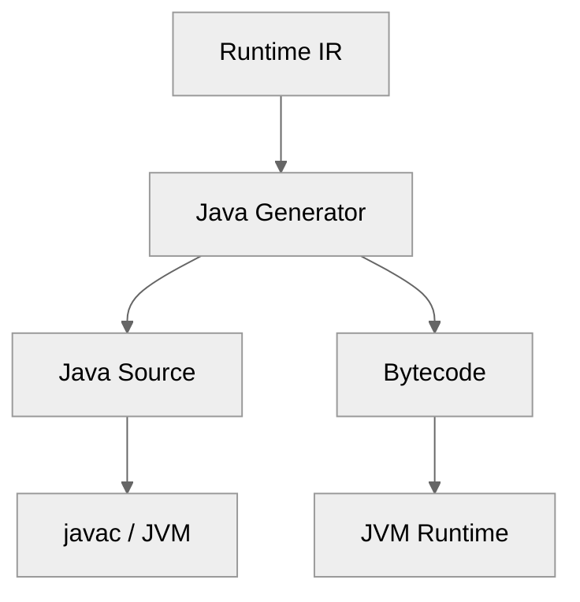
------------------------------------------------------------------------
<a id="contents-section-2"></a>
## 18.2 Design Goals

The Java backend should provide:

-   maximum JVM performance
-   zero reflection
-   static typing where possible
-   small generated artifacts
-   easy debugging
-   normal Java integration
-   native-image compatibility
-   predictable execution
------------------------------------------------------------------------
<a id="contents-section-3"></a>
## 18.3 Generator Module

Maven module:
```text
dmn-generator-java
```
Dependencies:
```text
dmn-runtime-ir
dmn-common
```
Forbidden:
```text
dmn-xml
dmn-feel
antlr
```
------------------------------------------------------------------------
Package:
```text
io.finmsg.dmn.generator.java
```
Structure:
```text
generator.java
├── JavaGenerator
├── ClassEmitter
├── ExpressionEmitter
├── TypeMapper
├── MethodEmitter
├── TemplateEngine
├── SourceWriter
└── NamingStrategy
```
------------------------------------------------------------------------
<a id="contents-section-4"></a>
## 18.4 Generation Strategy

The Java backend supports two modes.

------------------------------------------------------------------------

### Mode 1 — Java Source Generation

Runtime IR:
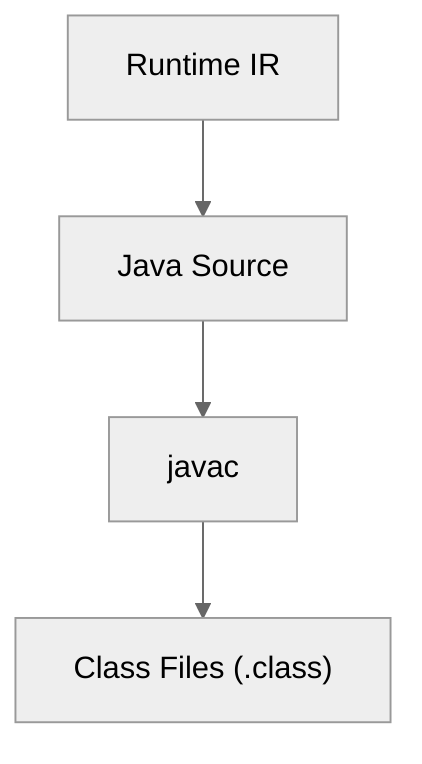
Advantages:
-   easy debugging
-   readable output
-   IDE support
-   simple deployment
------------------------------------------------------------------------
### Mode 2 — Direct Bytecode Generation

Runtime IR:
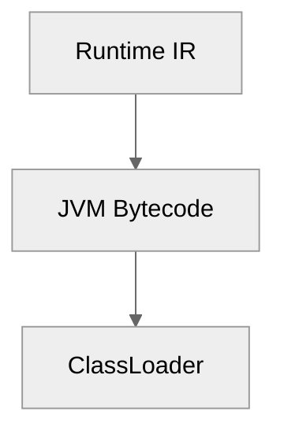
Using:
-   ASM
-   ByteBuddy
Advantages:
-   faster build
-   no javac dependency
-   dynamic deployment
------------------------------------------------------------------------
Recommended architecture:
Start with source generation. Add bytecode generation later.

------------------------------------------------------------------------
<a id="contents-section-5"></a>
## 18.5 Generated Class Structure

Example DMN model:
```text
TrafficViolation
```
Package:
```text
io.finmsg.generated.dmn
```
Generated class:
```java
public final class TrafficViolationDecision {
    public Result evaluate(
        Input input
    ) {
        // ...
    }
}
```
------------------------------------------------------------------------
<a id="contents-section-6"></a>
## 18.6 Generated API

The generated API should be simple.

Example:
```java
TrafficViolationDecision decision =
    new TrafficViolationDecision();

Penalty result =
    decision.evaluate(
        input
    );
```
No runtime framework required.

------------------------------------------------------------------------
<a id="contents-section-7"></a>
## 18.7 Input Model Generation

Two strategies are supported.

------------------------------------------------------------------------

### Strategy A — Generic Context

Example:
```java
Map<String, Object>
```
Advantages:
-   flexible
Disadvantages:
-   slower
-   allocations
-   type checks
------------------------------------------------------------------------
### Strategy B — Generated Types

Example:
```java
public record TrafficInput(
    int speed,
    int age
) {}
```
Advantages:
-   fast
-   type safe
-   JVM optimized

Recommended: Use generated types for production.

------------------------------------------------------------------------
<a id="contents-section-8"></a>
## 18.8 Output Model Generation

Example:
DMN output: `PenaltyCategory`
Generated:
```java
public enum PenaltyCategory {
    LOW,
    MEDIUM,
    HIGH
}
```
------------------------------------------------------------------------
<a id="contents-section-9"></a>
## 18.9 Expression Generation

Runtime IR:
```text
LOAD_VARIABLE speed
LOAD_CONSTANT 100
COMPARE_GREATER_THAN
```
Generated Java:
```java
if (input.speed() > 100) {
    return HIGH;
}
```
------------------------------------------------------------------------
The generator performs:
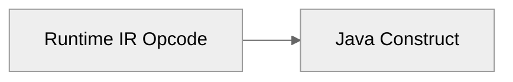
------------------------------------------------------------------------
<a id="contents-section-10"></a>
## 18.10 Opcode Mapping

Example mapping:

| Runtime IR Opcode | Generated Java Construct |
| :--- | :--- |
| `LOAD_VARIABLE` | getter call (`input.speed()`) |
| `LOAD_CONSTANT` | literal constant (`100`) |
| `ADD` | `+` |
| `SUBTRACT` | `-` |
| `MULTIPLY` | `*` |
| `COMPARE_GT` | `>` |
| `AND` | `&&` |
| `OR` | `\|\|` |
| `RETURN` | `return` |

------------------------------------------------------------------------
Example:
Runtime IR:
```text
ADD
```
Generated:
```java
a + b
```
------------------------------------------------------------------------

<a id="contents-section-11"></a>
## 18.11 Generated Code Optimization

The generator should produce JVM-friendly code.

------------------------------------------------------------------------
### 18.11.1 Avoid Boxing

Bad:
```java
Integer speed;
```
Good:
```java
int speed;
```
------------------------------------------------------------------------
### 18.11.2 Avoid Reflection

Forbidden:
```java
field.get(object)
```
------------------------------------------------------------------------
Preferred:
```java
input.speed()
```
------------------------------------------------------------------------
### 18.11.3 Avoid Generic Dispatch

Bad:
```java
evaluate(Expression e)
```
------------------------------------------------------------------------
Good:
```java
evaluateDecision()
```
------------------------------------------------------------------------

<a id="contents-section-12"></a>
## 18.12 Decision Graph Generation

Runtime graph:
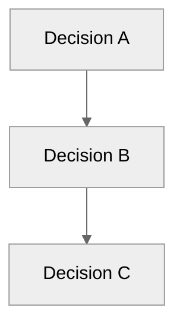
Generated Java:
```java
public Result evaluate() {
    AResult a = evaluateA();
    BResult b = evaluateB(a);
    return evaluateC(b);
}
```
------------------------------------------------------------------------
<a id="contents-section-13"></a>
## 18.13 Function Generation

Built-in FEEL functions are mapped.

Example:
FEEL:
```feel
substring(name, 1, 3)
```
Runtime IR:
```text
CALL SUBSTRING
```
Generated:
```java
name.substring(1, 4)
```
------------------------------------------------------------------------
<a id="contents-section-14"></a>
## 18.14 Custom Functions

Extension point:
```java
public interface DmnFunction {
    Object invoke(
        Object[] args
    );
}
```
------------------------------------------------------------------------
Generated code:
```java
functions.substring(
    name,
    1,
    3
);
```
------------------------------------------------------------------------
<a id="contents-section-15"></a>
## 18.15 Error Handling

Generated code should use domain exceptions.

Example:
```java
public class DecisionExecutionException
extends RuntimeException {
}
```
------------------------------------------------------------------------
Example:
```java
throw new DecisionExecutionException(
    "Invalid input"
);
```
------------------------------------------------------------------------
<a id="contents-section-16"></a>
## 18.16 Generated Artifact Layout

Example directory structure:
```text
target/generated-sources/dmn/
├── TrafficViolationDecision.java
├── TrafficInput.java
└── Penalty.java
```
------------------------------------------------------------------------
Maven integration:
```xml
<generatedSources>
    target/generated-sources/dmn
</generatedSources>
```
------------------------------------------------------------------------
<a id="contents-section-17"></a>
## 18.17 Maven Plugin Integration

The compiler can expose:
```xml
<plugin>
    <groupId>
        io.finmsg.dmn
    </groupId>
    <artifactId>
        dmn-maven-plugin
    </artifactId>
</plugin>
```
------------------------------------------------------------------------
Build:
```text
mvn compile
```
executes:
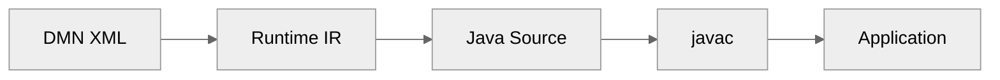
------------------------------------------------------------------------
<a id="contents-section-18"></a>
## 18.18 Incremental Generation

The generator supports caching.

Example:
Input:
```text
TrafficViolation.dmn
```
Hash:
```text
abc123
```
Generated:
```text
TrafficViolationDecision.java
```
If unchanged:
```text
skip generation
```
Pipeline:
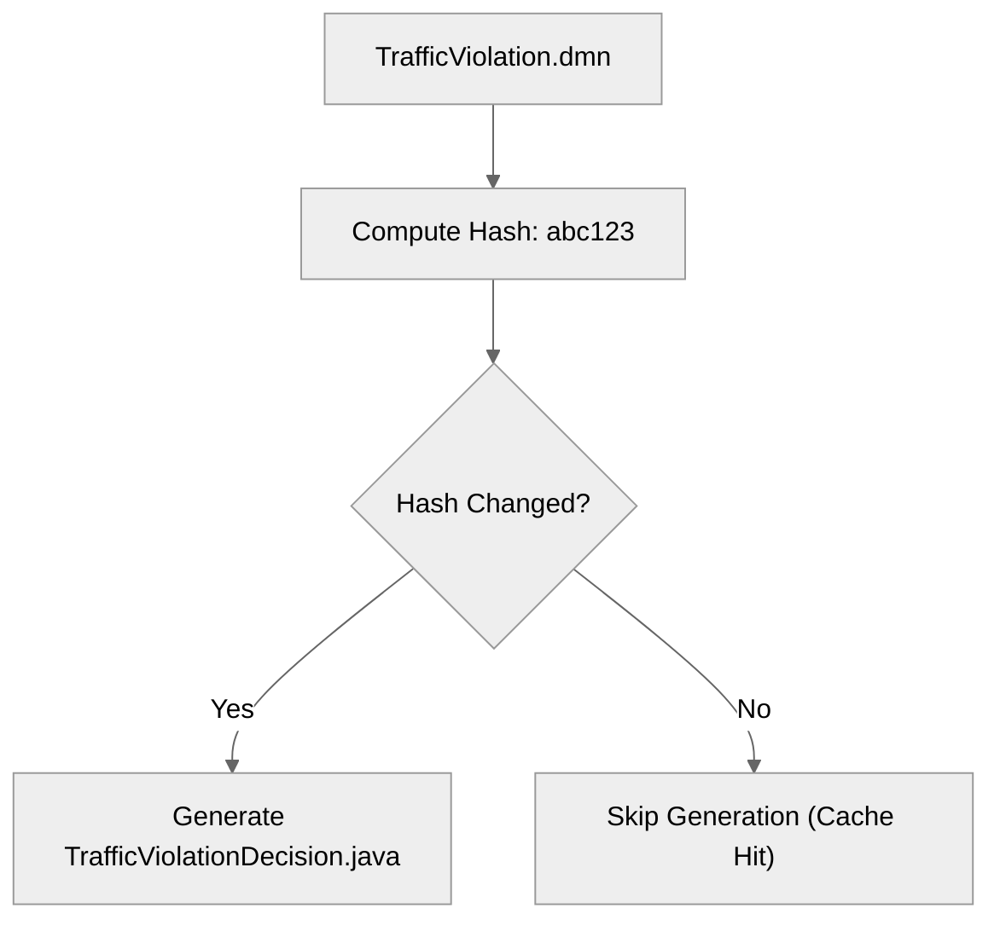
------------------------------------------------------------------------
<a id="contents-section-19"></a>
## 18.19 Testing Strategy

### Golden Source Tests

Input:
```text
Runtime IR
```
Expected:
```java
Generated Java
```
------------------------------------------------------------------------
### Compilation Tests
Generated source:
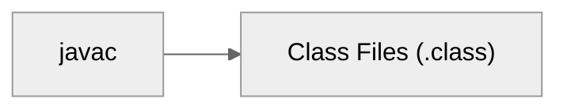
must succeed.
------------------------------------------------------------------------
### Behavioral Tests
Compare:
```text
Reference Engine
vs
Generated Java
```

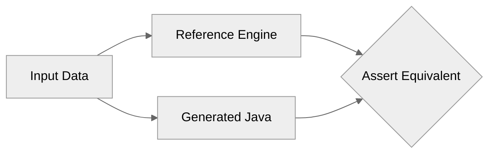
------------------------------------------------------------------------
### Performance Tests
Measure:
-   throughput
-   latency
-   allocations
-   JIT behavior
------------------------------------------------------------------------
<a id="contents-section-20"></a>
## 18.20 JVM Optimization Strategy

Generated code should enable:

### Method Inlining
Small decision methods:
```java
private int calculateAge()
```
can be inlined by JVM.

------------------------------------------------------------------------
### Escape Analysis
Avoid:
```java
new TemporaryObject()
```
------------------------------------------------------------------------
### Branch Prediction
Generate:
```java
if (condition)
```
rather than:
```java
switch (expressionTree)
```
where possible.
------------------------------------------------------------------------
### Vectorization

In high-throughput decision processing (such as batch evaluation over large datasets or stream processing), conventional row-oriented evaluation (`TrafficInput[]`) suffers from reference indirection, cache thrashing, and scalar branch mispredictions.

The Java Generator can emit batch evaluation kernels that operate over **columnar primitive buffers (Structure-of-Arrays / SoA)**, enabling hardware-level SIMD execution via JVM HotSpot C2 SuperWord auto-vectorization or the Java Vector API (`jdk.incubator.vector`):
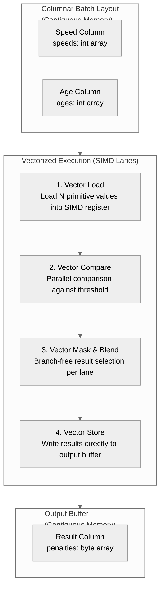
#### Vectorized Batch Kernel Example

Branch-free evaluation loop allowing the HotSpot C2 compiler to emit SIMD instructions:
```java
public static void evaluateBatch(
    int[] speeds,
    byte[] results,
    int count
) {
    // Unboxed unit-stride loop compiled to AVX2 / AVX-512 by HotSpot C2
    for (int i = 0; i < count; i++) {
        results[i] = (speeds[i] > 100) ? PENALTY_HIGH : PENALTY_LOW;
    }
}
```
------------------------------------------------------------------------
<a id="contents-section-21"></a>
## 18.21 Future Bytecode Backend

Architecture allows direct bytecode generation:
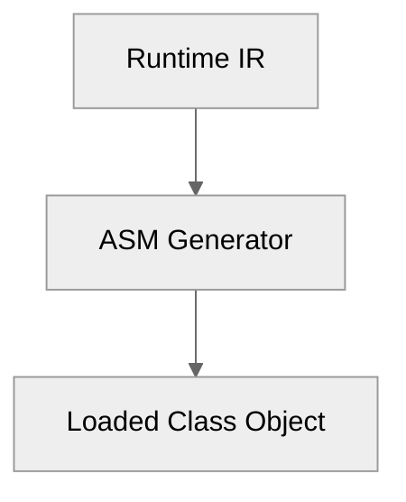
Benefits:

-   no source generation
-   runtime deployment
-   dynamic compilation
------------------------------------------------------------------------
<a id="contents-section-22"></a>
## 18.22 Example Complete Flow

DMN:
```text
DeterminePenalty
```
Runtime IR:
```text
LOAD speed
LOAD 100
COMPARE_GT
RETURN HIGH
```
Generated Java:
```java
public final class DeterminePenalty {
    public Penalty evaluate(
        TrafficInput input
    ) {
        if (input.speed() > 100) {
            return Penalty.HIGH;
        }
        return Penalty.LOW;
    }
}
```
------------------------------------------------------------------------
<a id="contents-section-23"></a>
## 18.23 Summary

The Java Generator transforms optimized Runtime IR into
production-quality Java.
It provides:

-   zero XML dependency
-   zero FEEL dependency
-   zero reflection
-   JVM optimized execution
-   normal Java APIs
-   future bytecode support

The complete backend architecture:
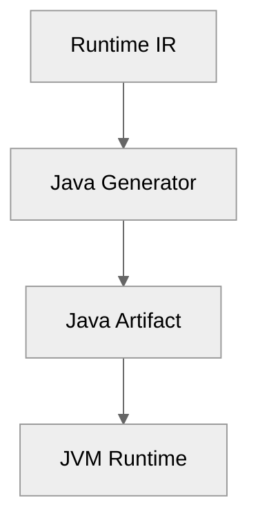

------------------------------------------------------------------------
