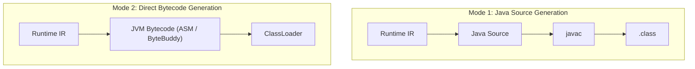
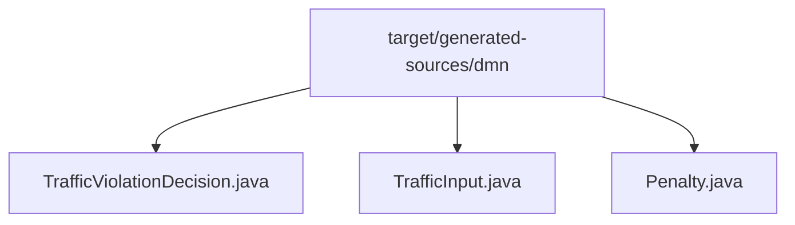
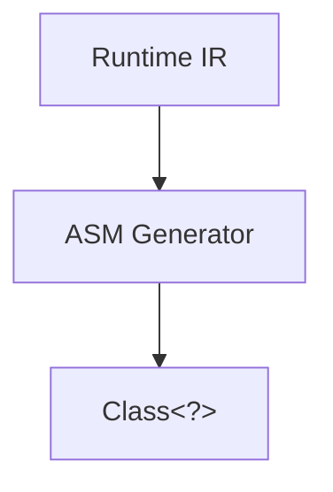
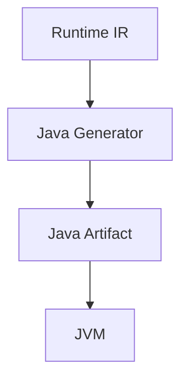

# Chapter 18 — Java Generator [IMPLEMENTATION-ALIGNED]

<!-- generated-toc:start -->
## Table of contents

- [13.1 Purpose](#contents-section-1)
- [Mode 2 --- Direct Bytecode Generation](#mode-2-----direct-bytecode-generation)
- [Strategy A --- Generic Context](#contents-section-2)
- [Strategy B --- Generated Types](#contents-section-3)
- [Avoid Boxing](#contents-section-4)
- [Avoid Reflection](#contents-section-5)
- [Avoid Generic Dispatch](#contents-section-6)
- [Golden Source Tests](#golden-source-tests)
- [Compilation Tests](#compilation-tests)
- [Behavioral Tests](#behavioral-tests)
- [Performance Tests](#performance-tests)
- [Method Inlining](#method-inlining)
- [Escape Analysis](#escape-analysis)
- [Branch Prediction](#branch-prediction)
- [Vectorization](#vectorization)
<!-- generated-toc:end -->


<a id="contents-section-1"></a>
## 13.1 Purpose

The Java Generator is the first production backend of the DMN Compiler
Toolkit.

Its responsibility is to transform optimized Runtime IR into highly
optimized Java source code or JVM executable artifacts.

The Java Generator consumes **only Runtime IR**.

It must never depend on:

-   DMN XML
-   VTD-XML
-   FEEL parser
-   ANTLR
-   Semantic Model

The architecture:

\`\`\`text id="9f0d2m" Runtime IR

                  |

                  v

        +-------------------+
        |  Java Generator   |
        +-------------------+

                  |

        +---------+----------+

        |                    |

        v                    v

Java Source Bytecode

        |                    |

        v                    v

javac / JVM JVM Runtime


    ---

    # 13.2 Design Goals

    The Java backend should provide:

    * maximum JVM performance
    * zero reflection
    * static typing where possible
    * small generated artifacts
    * easy debugging
    * normal Java integration
    * native-image compatibility
    * predictable execution

    ---

    # 13.3 Generator Module

    Maven module:

    ```text id="8d3v2m"
    dmn-generator-java

Dependencies:

\`\`\`text id="1a7f3n" dmn-runtime-ir

dmn-common


    Forbidden:

    ```text id="77kzq9"
    dmn-xml

    dmn-feel

    antlr

------------------------------------------------------------------------

Package:

`text id="4k0z8w" io.finmsg.dmn.generator.java`

Structure:

\`\`\`text id="i4s6dz" generator.java

├── JavaGenerator

├── ClassEmitter

├── ExpressionEmitter

├── TypeMapper

├── MethodEmitter

├── TemplateEngine

├── SourceWriter

└── NamingStrategy


    ---

    # 13.4 Generation Strategy

    The Java backend supports two modes.

    ---

    ## Mode 1 — Java Source Generation

    Runtime IR:



Advantages Mode 1:
- easy debugging
- readable output
- IDE support
- simple deployment

<a id="mode-2-----direct-bytecode-generation"></a>
## Mode 2 --- Direct Bytecode Generation

Advantages Mode 2:
- faster build
- no javac dependency
- dynamic deployment

Recommended architecture: Start with source generation; add bytecode generation later.

------------------------------------------------------------------------

## 13.5 Generated Class Structure

Example DMN model:

    ```text id="5x6y0k"
    TrafficViolation

Generated class:

``` java
public final class TrafficViolationDecision {

}
```

------------------------------------------------------------------------

Package:

`text id="p4h2c3" io.finmsg.generated.dmn`

------------------------------------------------------------------------

Example:

``` java
public final class TrafficViolationDecision {

    public Result evaluate(
        Input input
    ) {

        ...

    }

}
```

------------------------------------------------------------------------

# 13.6 Generated API

The generated API should be simple.

Example:

``` java
TrafficViolationDecision decision =
    new TrafficViolationDecision();

Penalty result =
    decision.evaluate(
        input
    );
```

------------------------------------------------------------------------

No runtime framework required.

------------------------------------------------------------------------

# 13.7 Input Model Generation

Two strategies are supported.

------------------------------------------------------------------------

<a id="contents-section-2"></a>
## Strategy A --- Generic Context

Example:

``` java
Map<String,Object>
```

Advantages:

-   flexible

Disadvantages:

-   slower
-   allocations
-   type checks

------------------------------------------------------------------------

<a id="contents-section-3"></a>
## Strategy B --- Generated Types

Example:

``` java
public record TrafficInput(

    int speed,

    int age

){}
```

Advantages:

-   fast
-   type safe
-   JVM optimized

------------------------------------------------------------------------

Recommended:

Use generated types for production.

------------------------------------------------------------------------

# 13.8 Output Model Generation

Example:

DMN output:

`text id="7x0yq1" PenaltyCategory`

Generated:

``` java
public enum PenaltyCategory {

    LOW,

    MEDIUM,

    HIGH

}
```

------------------------------------------------------------------------

------------------------------------------------------------------------

# 13.9 Expression Generation

Runtime IR:

\`\`\`text id="a6k8j2" LOAD_VARIABLE speed

LOAD_CONSTANT 100

COMPARE_GREATER_THAN


    Generated Java:

    ```java
    if(input.speed() > 100){

        return HIGH;

    }

------------------------------------------------------------------------

The generator performs:

\`\`\`text id="q4r7b2" Opcode

        |

        v

Java construct


    ---

    # 13.10 Opcode Mapping

    Example mapping:

    | Runtime IR    | Java        |   |   |
    | ------------- | ----------- | - | - |
    | LOAD_VARIABLE | getter call |   |   |
    | LOAD_CONSTANT | constant    |   |   |
    | ADD           | +           |   |   |
    | SUBTRACT      | -           |   |   |
    | MULTIPLY      | *           |   |   |
    | COMPARE_GT    | >           |   |   |
    | AND           | &&          |   |   |
    | OR            |             |   |   |
    | RETURN        | return      |   |   |

    ---

    Example:

    Runtime IR:

    ```text
    ADD

Generated:

``` java
a + b
```

------------------------------------------------------------------------

# 13.11 Generated Code Optimization

The generator should produce JVM-friendly code.

------------------------------------------------------------------------

<a id="contents-section-4"></a>
## Avoid Boxing

Bad:

``` java
Integer speed;
```

Good:

``` java
int speed;
```

------------------------------------------------------------------------

<a id="contents-section-5"></a>
## Avoid Reflection

Forbidden:

``` java
field.get(object)
```

------------------------------------------------------------------------

Preferred:

``` java
input.speed()
```

------------------------------------------------------------------------

<a id="contents-section-6"></a>
## Avoid Generic Dispatch

Bad:

``` java
evaluate(Expression e)
```

------------------------------------------------------------------------

Good:

``` java
evaluateDecision()
```

------------------------------------------------------------------------

# 13.12 Decision Graph Generation

Runtime graph:

``` text
A

|

B

|

C
```

Generated Java:

``` java
public Result evaluate(){

    AResult a =
        evaluateA();

    BResult b =
        evaluateB(a);

    return evaluateC(b);

}
```

------------------------------------------------------------------------

# 13.13 Function Generation

Built-in FEEL functions are mapped.

Example:

FEEL:

``` feel
substring(name,1,3)
```

Runtime IR:

``` text
CALL SUBSTRING
```

Generated:

``` java
name.substring(1,4)
```

------------------------------------------------------------------------

# 13.14 Custom Functions

Extension point:

``` java
public interface DmnFunction {

    Object invoke(
        Object[] args
    );

}
```

------------------------------------------------------------------------

Generated code:

``` java
functions.substring(
    name,
    1,
    3
);
```

------------------------------------------------------------------------

# 13.15 Error Handling

Generated code should use domain exceptions.

Example:

``` java
public class DecisionExecutionException
extends RuntimeException {

}
```

------------------------------------------------------------------------

Example:

``` java
throw new DecisionExecutionException(
    "Invalid input"
);
------------------------------------------------------------------------

# 13.16 Generated Artifact Layout

Example:



Maven integration:xml
    <generatedSources>
        target/generated-sources/dmn
    </generatedSources>

------------------------------------------------------------------------

# 13.17 Maven Plugin Integration

The compiler can expose:

``` xml
<plugin>

    <groupId>
        io.finmsg.dmn
    </groupId>

    <artifactId>
        dmn-maven-plugin
    </artifactId>

</plugin>
```

------------------------------------------------------------------------

Build:

``` text
mvn compile
```

executes:

``` text
DMN XML

↓

Runtime IR

↓

Java Source

↓

javac

↓

Application
```

------------------------------------------------------------------------

# 13.18 Incremental Generation

The generator supports caching.

Example:

Input:

``` text
TrafficViolation.dmn
```

Hash:

``` text
abc123
```

Generated:

``` text
TrafficViolationDecision.java
```

If unchanged:

``` text
skip generation
```

------------------------------------------------------------------------

# 13.19 Testing Strategy

## Golden Source Tests

Input:

``` text
Runtime IR
```

Expected:

``` java
Generated Java
```

------------------------------------------------------------------------

## Compilation Tests

Generated source:

``` text
javac

↓

.class
```

must succeed.

------------------------------------------------------------------------

## Behavioral Tests

Compare:

``` text
Reference Engine

vs

Generated Java
```

------------------------------------------------------------------------

## Performance Tests

Measure:

-   throughput
-   latency
-   allocations
-   JIT behavior

------------------------------------------------------------------------

# 13.20 JVM Optimization Strategy

Generated code should enable:

## Method Inlining

Small decision methods:

``` java
private int calculateAge()
```

can be inlined by JVM.

------------------------------------------------------------------------

## Escape Analysis

Avoid:

``` java
new TemporaryObject()
```

------------------------------------------------------------------------

## Branch Prediction

Generate:

``` java
if(condition)
```

rather than:

``` java
switch(expression tree)
```

where possible.

------------------------------------------------------------------------

## Vectorization

For batch execution:

``` text
Decision[]

↓

SIMD-friendly processing
```

------------------------------------------------------------------------

# 13.21 Future Bytecode Backend

Architecture allows:



Benefits:

-   no source generation
-   runtime deployment
-   dynamic compilation

------------------------------------------------------------------------

# 13.22 Example Complete Flow

DMN:

``` text
DeterminePenalty
```

Runtime IR:

``` text
LOAD speed

LOAD 100

COMPARE_GT

RETURN HIGH
```

Generated Java:

``` java
public final class DeterminePenalty {

public Penalty evaluate(
    TrafficInput input
){

    if(input.speed() > 100){

        return Penalty.HIGH;

    }

    return Penalty.LOW;

}

}
```

------------------------------------------------------------------------

# 13.23 Summary

The Java Generator transforms optimized Runtime IR into
production-quality Java.

It provides:

-   zero XML dependency
-   zero FEEL dependency
-   zero reflection
-   JVM optimized execution
-   normal Java APIs
-   future bytecode support

The complete backend architecture:



------------------------------------------------------------------------
