# Chapter 19 — Future Generators [FUTURE]

<!-- generated-toc:start -->
## Table of contents

- [19.1 Purpose](#contents-section-1)
- [19.2 Backend Design Principle](#contents-section-2)
- [19.3 Backend Module Architecture](#contents-section-3)
- [19.4 Generator SPI](#contents-section-4)
- [19.5 Backend Capability Model](#contents-section-5)
- [19.6 Rust Generator](#contents-section-6)
- [19.7 Go Generator](#contents-section-7)
- [19.8 Spark SQL Generator](#contents-section-8)
- [19.9 Spark Optimization](#contents-section-9)
- [19.10 LLVM Generator](#contents-section-10)
- [19.11 WebAssembly Generator](#contents-section-11)
- [19.12 Backend Optimization Layer](#contents-section-12)
- [19.13 Backend Validation](#contents-section-13)
- [19.14 Backend Registry](#contents-section-14)
- [19.15 Custom Backend Development](#contents-section-15)
- [19.16 Example: Adding Python Backend](#contents-section-16)
- [19.17 Generated Artifact Metadata](#contents-section-17)
- [19.18 Performance Comparison](#contents-section-18)
- [19.19 Long-Term Vision](#contents-section-19)
- [19.20 Summary](#contents-section-20)
<!-- generated-toc:end -->

!!! note "Backend Status Baseline"
    The primary production Java generator (`dmn-generator-java`) is fully implemented in the main reactor. The distributed Spark SQL generator (`dmn-generator-sparksql`) and gRPC adapter (`dmn-grpc`) are implemented in the incubating profile (`-Pincubator`). The remaining language backends (Rust, Go, LLVM, WebAssembly, and Python) are planned extensions following the decoupled Generator SPI.

<a id="contents-section-1"></a>
## 19.1 Purpose

The DMN Compiler Toolkit is designed as a **multi-backend compiler
platform**.

The primary architectural goal is that all future targets consume the
same optimized Runtime IR.

A new backend must not require:

-   changes to XML parsing
-   changes to FEEL parsing
-   changes to semantic analysis
-   changes to optimization passes

The architecture:

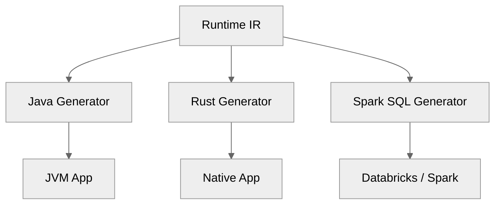
------------------------------------------------------------------------
<a id="contents-section-2"></a>
## 19.2 Backend Design Principle

### BG-001 --- Runtime IR Is the Universal Contract

Every backend consumes **only Runtime IR**.
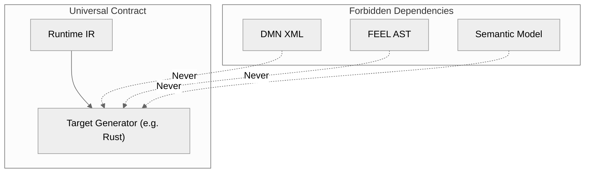
------------------------------------------------------------------------

Example: Adding a Rust backend

Requires:
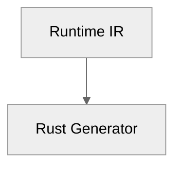
Does not require:
-   XML changes
-   FEEL changes
-   Compiler frontend changes

------------------------------------------------------------------------
<a id="contents-section-3"></a>
## 19.3 Backend Module Architecture

Recommended Maven structure:
```text
dmn-generator-java
dmn-generator-rust
dmn-generator-go
dmn-generator-spark
dmn-generator-llvm
dmn-generator-wasm
```
------------------------------------------------------------------------
Dependency rule:
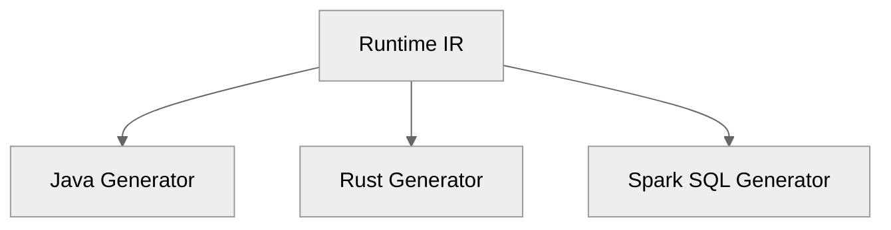
Forbidden dependency:
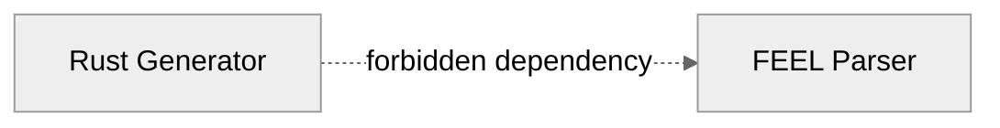
------------------------------------------------------------------------
<a id="contents-section-4"></a>
## 19.4 Generator SPI

All generators implement the same interface:
```java
public interface CodeGenerator {
    String target();

    GeneratedArtifact generate(
        RuntimeModel model
    );
}
```
------------------------------------------------------------------------
Example:
Java:
```java
public class JavaGenerator
implements CodeGenerator {
    public String target() {
        return "java";
    }
}
```
------------------------------------------------------------------------
Rust:
```java
public class RustGenerator
implements CodeGenerator {
    public String target() {
        return "rust";
    }
}
```
------------------------------------------------------------------------
<a id="contents-section-5"></a>
## 19.5 Backend Capability Model

Not every backend supports every feature:
```java
public interface BackendCapabilities {
    boolean supportsContexts();
    boolean supportsDates();
    boolean supportsCustomFunctions();
}
```
------------------------------------------------------------------------

Compiler validates capabilities before emission:
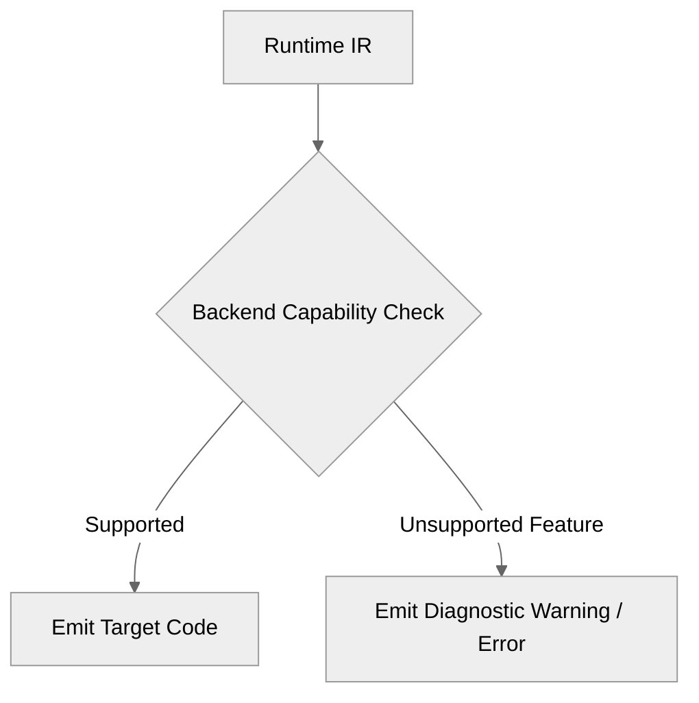
------------------------------------------------------------------------

Example: Spark SQL limitation

A recursive FEEL function may not be supported by distributed SQL engines.

------------------------------------------------------------------------
<a id="contents-section-6"></a>
## 19.6 Rust Generator

Generate native high-performance decision engines.

Architecture:
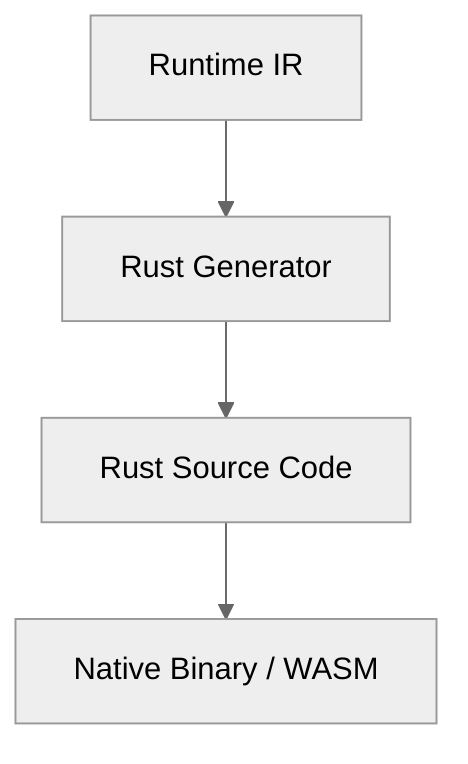
------------------------------------------------------------------------
Generated example:
Runtime IR:
```text
LOAD speed
LOAD 100
COMPARE_GT
```
Rust:
```rust
pub fn evaluate(
    input: &TrafficInput
) -> Penalty {
    if input.speed > 100 {
        Penalty::High
    } else {
        Penalty::Low
    }
}
```
------------------------------------------------------------------------
Advantages:
-   native execution
-   low latency
-   zero JVM overhead
-   embedded systems
-   WASM compatibility
------------------------------------------------------------------------
<a id="contents-section-7"></a>
## 19.7 Go Generator

Generate cloud-native, statically compiled decision services with minimal memory footprint.

Architecture:
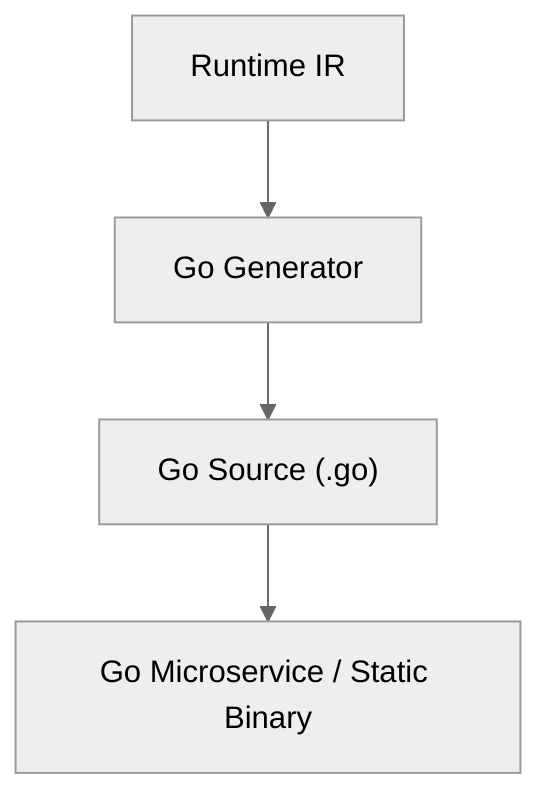
------------------------------------------------------------------------
Generated example:
Runtime IR:
```text
LOAD speed
LOAD 100
COMPARE_GT
```
Go:
```go
package decision

type TrafficInput struct {
    Speed int
    Age   int
}
type Penalty int
const (
    Low Penalty = iota
    Medium
    High
)

func Evaluate(input TrafficInput) Penalty {
    if input.Speed > 100 {
        return High
    }
    return Low
}
```
------------------------------------------------------------------------
Advantages:

-   statically linked single binary deployment
-   minimal memory footprint and instant cold starts
-   idiomatic cloud-native microservices
-   serverless functions (AWS Lambda / Google Cloud Functions)
-   edge execution
------------------------------------------------------------------------
<a id="contents-section-8"></a>
## 19.8 Spark SQL Generator

Generate distributed decision execution pipelines for massive tabular datasets and data warehouses.

Architecture:
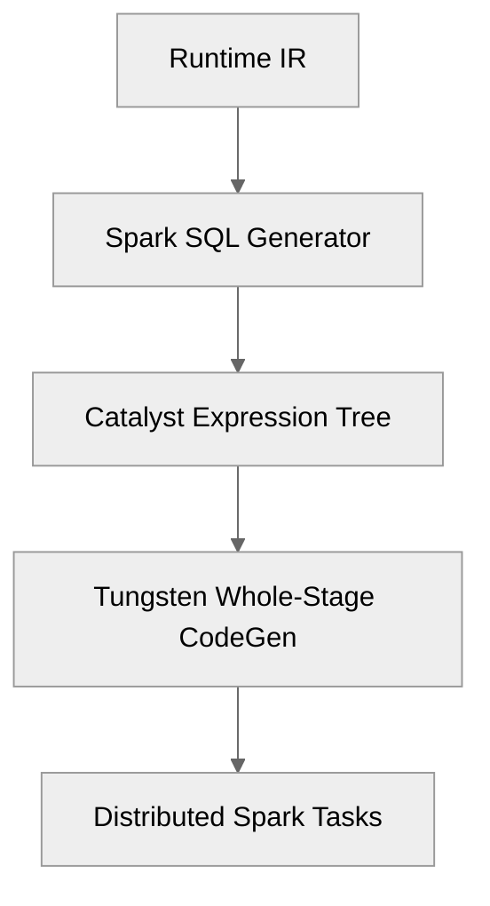
------------------------------------------------------------------------
Generated example:
DMN Decision:
```text
if speed > 100
then "HIGH"
else "LOW"
```
Generated Spark SQL query:
```sql
SELECT
    transaction_id,
    speed,
    CASE
        WHEN speed > 100 THEN 'HIGH'
        ELSE 'LOW'
    END AS penalty_category
FROM traffic_events
```
------------------------------------------------------------------------
Advantages:

-   distributed execution across clusters (Databricks, EMR, BigQuery)
-   processes millions of records per second without per-row JVM object allocation
-   native integration with Spark DataFrame and Catalyst optimization pipelines

------------------------------------------------------------------------
<a id="contents-section-9"></a>
## 19.9 Spark Optimization

Runtime IR enables advanced distributed query optimizations:

### Predicate Pushdown

Filter upstream partitions and parquet row groups before evaluating decisions:
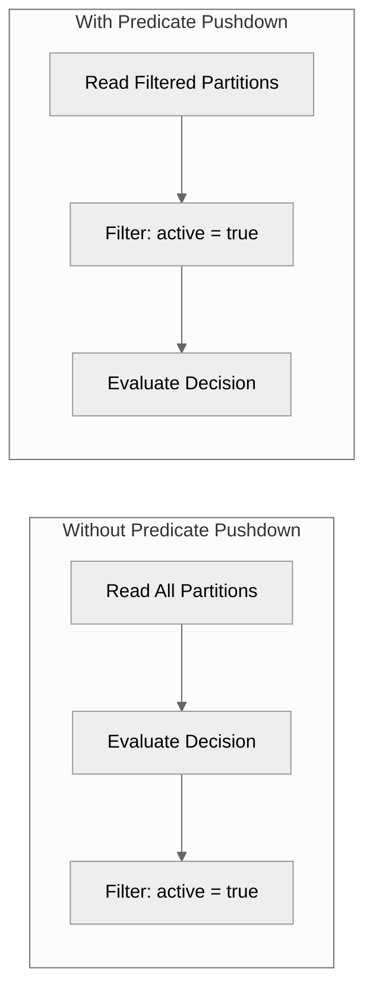
------------------------------------------------------------------------
### Column Pruning
Only required decision inputs are loaded into memory:
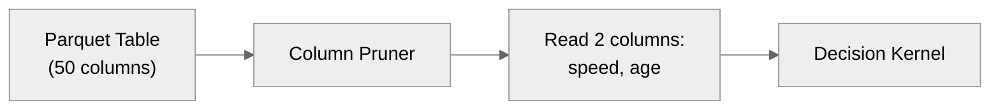
------------------------------------------------------------------------
### Vectorized Execution
Emits columnar batch operations targeting Spark Tungsten and Apache Arrow memory:
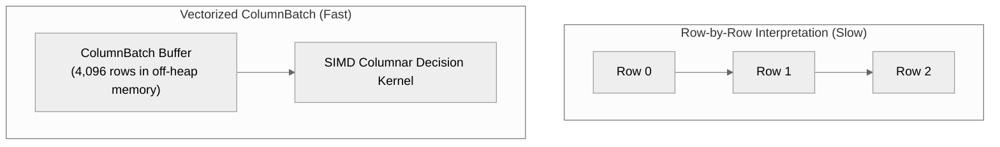
------------------------------------------------------------------------
<a id="contents-section-10"></a>
## 19.10 LLVM Generator

Generate bare-metal, native machine code via LLVM compiler infrastructure.

Architecture:
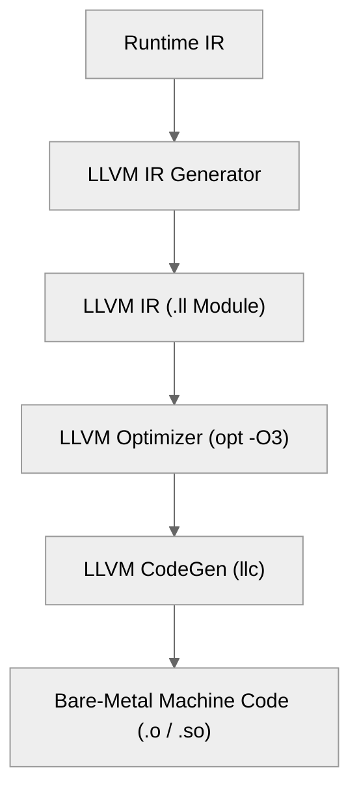
------------------------------------------------------------------------
Generated example:
Runtime IR:
```text
LOAD speed
LOAD 100
COMPARE_GT
```
LLVM IR:
```llvm
define i32 @evaluate_penalty(i32 %speed) {
entry:
  %cmp = icmp sgt i32 %speed, 100
  %res = select i1 %cmp, i32 3, i32 1
  ret i32 %res
}
```
------------------------------------------------------------------------
Benefits:

-   sub-nanosecond execution latency
-   hardware-specific CPU instruction scheduling (AVX-512, NEON)
-   zero runtime dependency or virtual machine overhead

------------------------------------------------------------------------
<a id="contents-section-11"></a>
## 19.11 WebAssembly Generator

Execute decisions in client-side browsers, edge workers, and sandboxed runtimes.

Architecture:
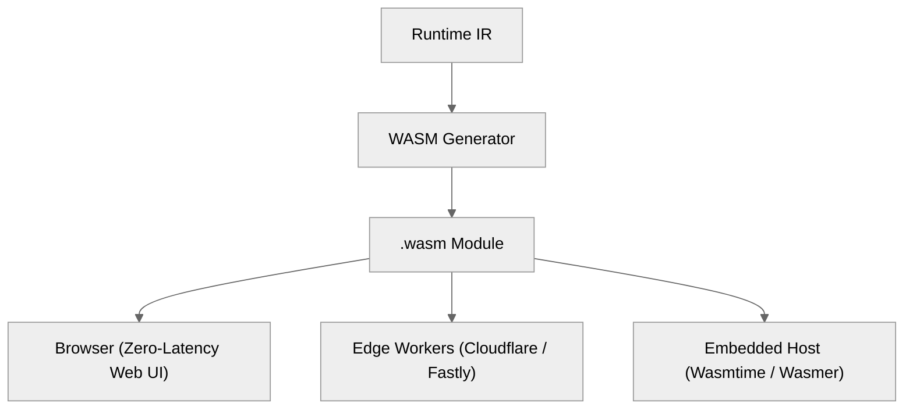
------------------------------------------------------------------------
Advantages:

-   instant startup with zero installation
-   deterministic and sandboxed security boundary
-   near-native execution performance across platforms

------------------------------------------------------------------------
<a id="contents-section-12"></a>
## 19.12 Backend Optimization Layer

Each backend performs target-specific instruction mappings while preserving exact mathematical and logical semantics:

| Runtime IR Opcode | Java | Rust | Spark SQL | LLVM IR |
| :--- | :--- | :--- | :--- | :--- |
| `COMPARE_GT` | `>` | `>` | `>` | `icmp sgt` |
| `ADD` | `+` | `+` | `+` | `add` |
| `MULTIPLY` | `*` | `*` | `*` | `mul` |
| `SUBTRACT` | `-` | `-` | `-` | `sub` |

------------------------------------------------------------------------
<a id="contents-section-13"></a>
## 19.13 Backend Validation

Every backend target must satisfy 100% semantic equivalence against the reference interpreter:

### Semantic Equivalence Tests
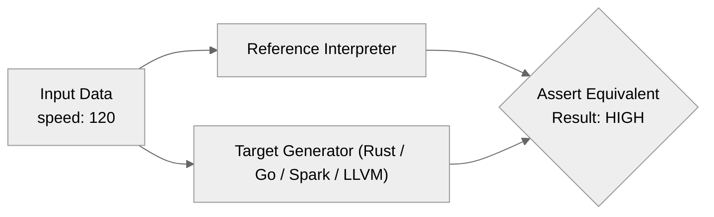
------------------------------------------------------------------------
<a id="contents-section-14"></a>
## 19.14 Backend Registry

Decoupled SPI mechanism for pluggable generator registration:
```java
public final class BackendRegistry {
    private static final Map<String, CodeGenerator> GENERATORS = new ConcurrentHashMap<>();
    public static void register(CodeGenerator generator) {
        GENERATORS.put(generator.target(), generator);
    }

    public static CodeGenerator get(String target) {
        CodeGenerator gen = GENERATORS.get(target);
        if (gen == null) {
            throw new IllegalArgumentException("Unknown backend target: " + target);
        }
        return gen;
    }
}
```
------------------------------------------------------------------------
<a id="contents-section-15"></a>
## 19.15 Custom Backend Development

A contributor creating a new backend implements four discrete stages:
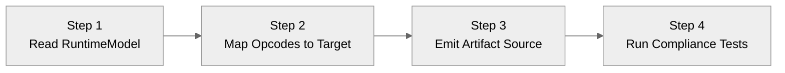
1. **Read RuntimeModel**: Consume the immutable Runtime IR graph.
2. **Map Opcodes**: Translate IR opcodes into target language constructs.
3. **Emit Artifact Source**: Output clean, compilable source code or binary files.
4. **Run Compliance Tests**: Validate against the Technology Compatibility Kit (TCK).

------------------------------------------------------------------------
<a id="contents-section-16"></a>
## 19.16 Example: Adding Python Backend

Adding a new target backend requires **zero modifications** to frontend parsing, FEEL AST construction, or semantic analysis:
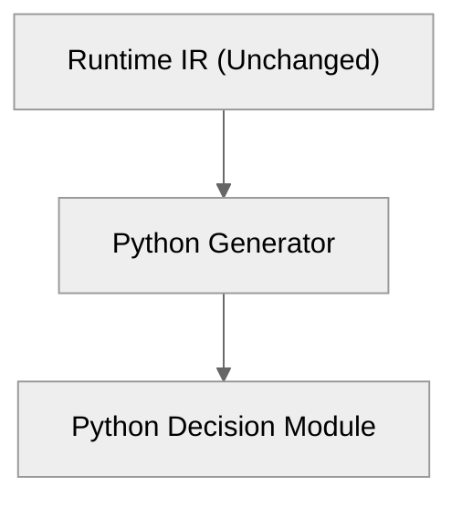
Generated Python example:
```python
from dataclasses import dataclass
from enum import Enum

class Penalty(Enum):
    LOW = 1
    MEDIUM = 2
    HIGH = 3
@dataclass(frozen=True)
class TrafficInput:
    speed: int
    age: int

def evaluate(input_data: TrafficInput) -> Penalty:
    if input_data.speed > 100:
        return Penalty.HIGH
    return Penalty.LOW
```
------------------------------------------------------------------------
<a id="contents-section-17"></a>
## 19.17 Generated Artifact Metadata

Every generated artifact includes structured provenance metadata:
```json
{
  "compilerVersion": "1.0",
  "backend": "java",
  "model": "TrafficViolation",
  "runtimeIRChecksum": "a1b2c3d4e5f6",
  "timestamp": "2026-09-06T00:00:00Z"
}
```
Benefits:

-   traceability across build environments
-   runtime version compatibility checks
-   reproducible builds
------------------------------------------------------------------------
<a id="contents-section-18"></a>
## 19.18 Performance Comparison

| Backend | Typical Target Use Case | Latency Profile | Memory Overhead |
| :--- | :--- | :--- | :--- |
| **Java** | Enterprise backend microservices | Microseconds | Managed JVM heap |
| **Rust** | Ultra-low latency & embedded systems | Sub-microsecond | Zero runtime overhead |
| **Go** | Cloud microservices & Kubernetes | Microseconds | Minimal GC footprint |
| **Spark SQL** | Distributed big data analytics | Batch / Columnar | Off-heap column buffers |
| **LLVM** | Maximum bare-metal performance | Nanoseconds | Pure register / stack |
| **WASM** | Browser edge & sandboxed plugins | Near-native | Isolated linear memory |

------------------------------------------------------------------------
<a id="contents-section-19"></a>
## 19.19 Long-Term Vision

The DMN Compiler Toolkit follows the multi-target architectural paradigm established by modern compiler frameworks like LLVM:
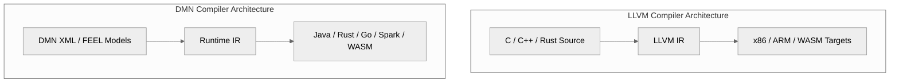
------------------------------------------------------------------------
<a id="contents-section-20"></a>
## 19.20 Summary

The universal Runtime IR enables:

-   multiple target execution environments
-   complete language independence
-   backend innovation and specialized code generation
-   future extensibility without compiler pipeline regressions
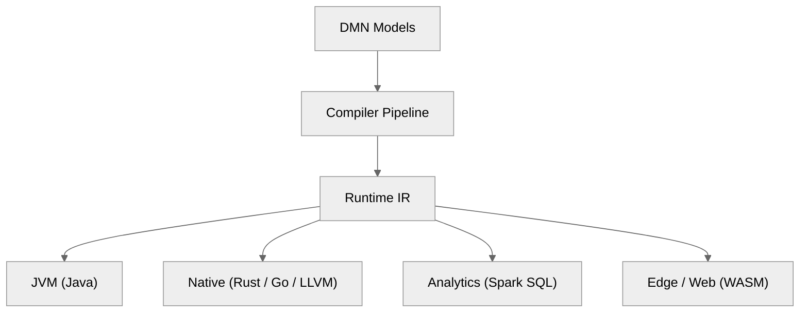

------------------------------------------------------------------------
