# Chapter 19 — Future Generators [FUTURE]

<!-- generated-toc:start -->
## Table of contents

- [14.1 Purpose](#contents-section-1)
- [BG-001 --- Runtime IR Is the Universal Contract](#contents-section-2)
- [Purpose](#contents-section-3)
- [Purpose](#contents-section-4)
- [Purpose](#contents-section-5)
- [Predicate Pushdown](#contents-section-6)
- [Column Pruning](#contents-section-7)
- [Vectorized Execution](#contents-section-8)
- [Purpose](#contents-section-9)
- [Purpose](#contents-section-10)
- [Semantic Equivalence Tests](#contents-section-11)
- [Step 1](#contents-section-12)
- [Step 2](#contents-section-13)
- [Step 3](#contents-section-14)
- [Step 4](#contents-section-15)
<!-- generated-toc:end -->


<a id="contents-section-1"></a>
## 14.1 Purpose

The DMN Compiler Toolkit is designed as a **multi-backend compiler
platform**.

The primary architectural goal is that all future targets consume the
same optimized Runtime IR.

A new backend must not require:

-   changes to XML parsing
-   changes to FEEL parsing
-   changes to semantic analysis
-   changes to optimization passes

The architecture:

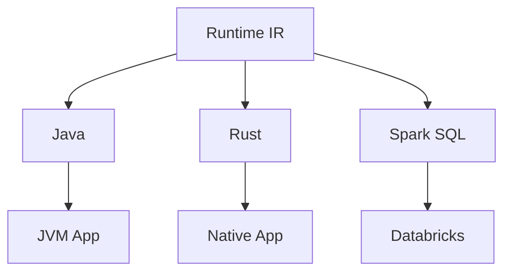

------------------------------------------------------------------------

# 14.2 Backend Design Principle

<a id="contents-section-2"></a>
## BG-001 --- Runtime IR Is the Universal Contract

Every backend consumes:

``` text
Runtime IR
```

Never:

``` text
DMN XML
```

Never:

``` text
FEEL AST
```

Never:

``` text
Semantic Model
```

------------------------------------------------------------------------

Example:

Adding a Rust backend:

Requires:

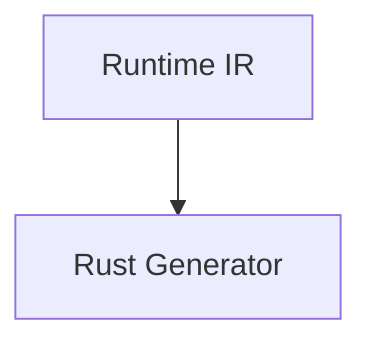

Does not require:

``` text
XML changes

FEEL changes

Compiler changes
```

------------------------------------------------------------------------

# 14.3 Backend Module Architecture

Recommended Maven structure:

``` text
dmn-generator-java

dmn-generator-rust

dmn-generator-go

dmn-generator-spark

dmn-generator-llvm

dmn-generator-wasm
```

------------------------------------------------------------------------

Dependency rule:

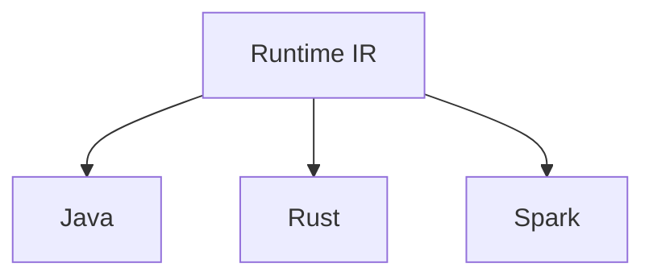

------------------------------------------------------------------------

Forbidden:

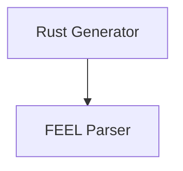

------------------------------------------------------------------------

# 14.4 Generator SPI

All generators implement the same interface.

Example:

``` java
public interface CodeGenerator {

    String target();

    GeneratedArtifact generate(
        RuntimeModel model
    );

}
```

------------------------------------------------------------------------

Example:

Java:

``` java
public class JavaGenerator
implements CodeGenerator {

    public String target(){

        return "java";

    }

}
```

------------------------------------------------------------------------

Rust:

``` java
public class RustGenerator
implements CodeGenerator {

    public String target(){

        return "rust";

    }

}
```

------------------------------------------------------------------------

# 14.5 Backend Capability Model

Not every backend supports every feature.

Example:

``` java
public interface BackendCapabilities {

    boolean supportsContexts();

    boolean supportsDates();

    boolean supportsCustomFunctions();

}
```

------------------------------------------------------------------------

Compiler can validate:

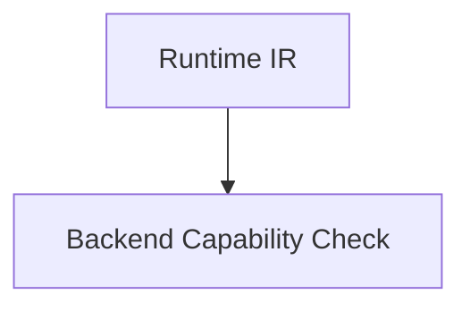

------------------------------------------------------------------------

Example:

Spark SQL limitation:

``` text
recursive FEEL function
```

may not be supported.

------------------------------------------------------------------------

# 14.6 Rust Generator

<a id="contents-section-3"></a>
## Purpose

Generate native high-performance decision engines.

Architecture:

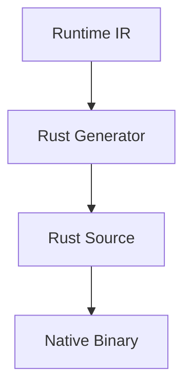

------------------------------------------------------------------------

Generated example:

Runtime IR:

``` text
LOAD speed

LOAD 100

COMPARE_GT
```

Rust:

``` rust
pub fn evaluate(
    input: &TrafficInput
)
-> Penalty {

    if input.speed > 100 {

        Penalty::High

    }
    else {

        Penalty::Low

    }

}
```

------------------------------------------------------------------------

Advantages:

-   native execution
-   low latency
-   no JVM
-   embedded systems
-   WASM compatibility

------------------------------------------------------------------------

# 14.7 Go Generator

<a id="contents-section-4"></a>
## Purpose

Generate cloud-native decision services.

Architecture:

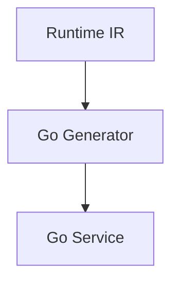

------------------------------------------------------------------------

Example:

``` go
func Evaluate(
    input TrafficInput,
) Penalty {

    if input.Speed > 100 {

        return High

    }

    return Low

}
```

------------------------------------------------------------------------

Use cases:

-   Kubernetes services
-   serverless functions
-   edge execution

------------------------------------------------------------------------

# 14.8 Spark SQL Generator

<a id="contents-section-5"></a>
## Purpose

Generate distributed decision execution.

Architecture:

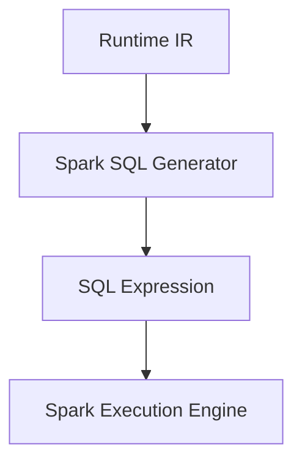

------------------------------------------------------------------------

Example:

DMN:

``` text
if amount > 1000
then "HIGH"
else "LOW"
```

Generated:

``` sql
CASE

WHEN amount > 1000

THEN 'HIGH'

ELSE 'LOW'

END
```

------------------------------------------------------------------------

Advantages:

-   massive data processing
-   Databricks integration
-   no row-by-row interpretation

------------------------------------------------------------------------

# 14.9 Spark Optimization

Runtime IR enables:

<a id="contents-section-6"></a>
## Predicate Pushdown

Example:

Before:

``` text
Decision

|

Filter
```

After:

``` text
Filter

|

Decision
```

------------------------------------------------------------------------

<a id="contents-section-7"></a>
## Column Pruning

Only required inputs are selected.

Example:

Decision uses:

``` text
customer.age
```

Spark reads only:

``` text
age column
```

------------------------------------------------------------------------

<a id="contents-section-8"></a>
## Vectorized Execution

Instead of:

``` text
row 1
decision

row 2
decision

row 3
decision
```

Generate:

``` text
column batch

      |

vector evaluation
```

------------------------------------------------------------------------

# 14.10 LLVM Generator

<a id="contents-section-9"></a>
## Purpose

Generate native machine code.

Architecture:

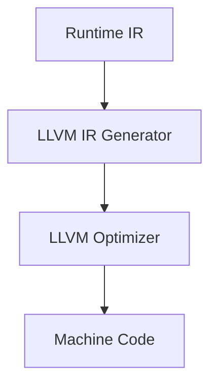

------------------------------------------------------------------------

Benefits:

-   highest performance potential
-   CPU optimization
-   SIMD support

------------------------------------------------------------------------

Example:

Runtime IR:

``` text
ADD
COMPARE
BRANCH
```

LLVM:

``` llvm
add

icmp

br
```

------------------------------------------------------------------------

# 14.11 WebAssembly Generator

<a id="contents-section-10"></a>
## Purpose

Execute decisions everywhere.

Targets:

-   browsers
-   edge computing
-   embedded systems

Architecture:

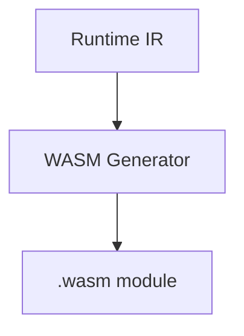

------------------------------------------------------------------------

Advantages:

-   sandboxed execution
-   portable
-   fast startup

------------------------------------------------------------------------

# 14.12 Backend Optimization Layer

Each backend may perform target-specific optimizations.

Example:

Runtime IR:

``` text
COMPARE_GT
```

Java:

``` java
>
```

Rust:

``` rust
>
```

Spark:

``` sql
>
```

LLVM:

``` llvm
icmp sgt
```

------------------------------------------------------------------------

The semantic meaning remains identical.

------------------------------------------------------------------------

# 14.13 Backend Validation

Every generator must pass:

<a id="contents-section-11"></a>
## Semantic Equivalence Tests

Example:

Input:

``` text
speed=120
```

Expected:

``` text
HIGH
```

All backends must return:

``` text
HIGH
```

------------------------------------------------------------------------

Test:

``` text
Reference Interpreter

        vs

Generated Backend
```

------------------------------------------------------------------------

# 14.14 Backend Registry

Optional extension mechanism:

``` java
BackendRegistry.register(
    new JavaGenerator()
);

BackendRegistry.register(
    new RustGenerator()
);
```

------------------------------------------------------------------------

However:

Avoid:

-   global mutable registries
-   reflection scanning

Preferred:

explicit configuration.

------------------------------------------------------------------------

# 14.15 Custom Backend Development

A contributor creating a new backend implements:

<a id="contents-section-12"></a>
## Step 1

Runtime IR reader

``` java
RuntimeModel
```

------------------------------------------------------------------------

<a id="contents-section-13"></a>
## Step 2

Target mapping

Example:

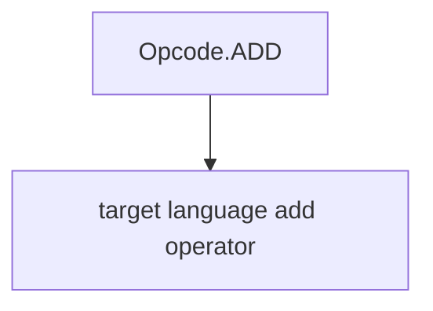

------------------------------------------------------------------------

<a id="contents-section-14"></a>
## Step 3

Artifact writer

Example:

``` text
.java

.rs

.sql

.wasm
```

------------------------------------------------------------------------

<a id="contents-section-15"></a>
## Step 4

Compliance tests

------------------------------------------------------------------------

# 14.16 Example: Adding Python Backend

No changes required:

``` text
Existing:

DMN XML

FEEL Parser

Optimizer

Runtime IR

New:

Python Generator
```

------------------------------------------------------------------------

Architecture:

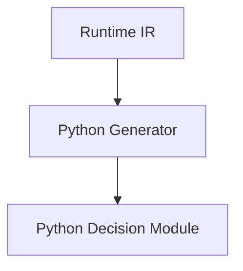

------------------------------------------------------------------------

# 14.17 Generated Artifact Metadata

Every generated artifact should include metadata.

Example:

``` json
{
 "compilerVersion":"1.0",
 "backend":"java",
 "model":"TrafficViolation",
 "runtimeIR":"abc123"
}
```

------------------------------------------------------------------------

Benefits:

-   traceability
-   debugging
-   reproducibility

------------------------------------------------------------------------

# 14.18 Performance Comparison

Potential targets:

  Backend     Typical Use
  ----------- ---------------------
  Java        enterprise services
  Rust        ultra-low latency
  Go          cloud services
  Spark SQL   analytics
  LLVM        maximum performance
  WASM        edge/browser

------------------------------------------------------------------------

# 14.19 Long-Term Vision

The toolkit evolves from:

``` text
DMN Engine
```

into:

``` text
DMN Compiler Platform
```

Comparable architecture:

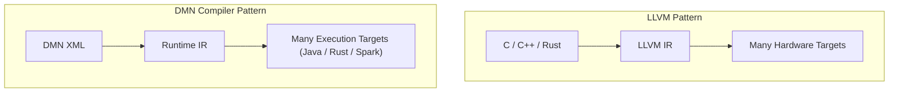

------------------------------------------------------------------------

# 14.20 Summary

The Runtime IR enables:

-   multiple execution environments
-   language independence
-   backend innovation
-   future extensibility

The final architecture:

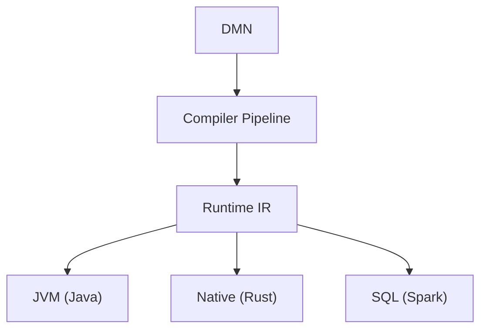

------------------------------------------------------------------------
