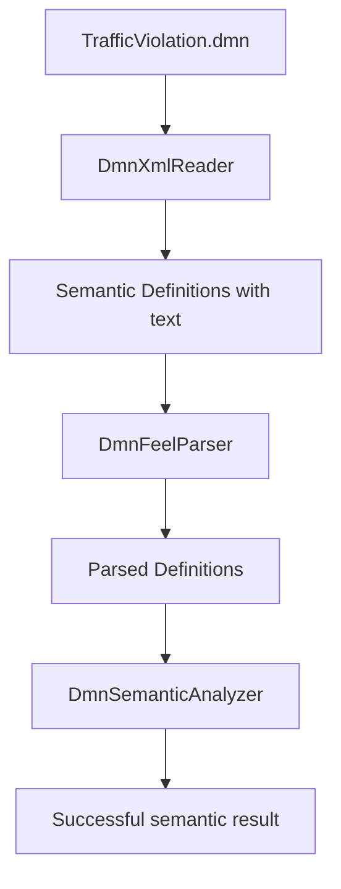
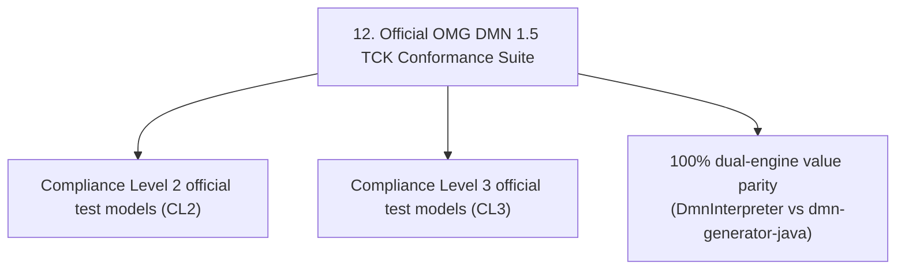

# Chapter 20 — Testing Strategy [NORMATIVE]

<!-- generated-toc:start -->
## Table of contents

- [15.1 Current test layers](#contents-section-1)
- [15.2 Traffic Violation pipeline](#contents-section-2)
- [15.3 Diagnostic tests](#contents-section-3)
- [15.4 Official OMG DMN 1.5 TCK Conformance Suite](#contents-section-4)
<!-- generated-toc:end -->


<a id="contents-section-1"></a>
## 15.1 Current test layers

```text
1. FEEL grammar conformance tests
2. FeelParserFacade tests
3. FeelAstBuilder structure tests
4. DmnFeelParser traversal and idempotency tests
5. model-aware multi-error diagnostic tests
6. XML semantic round-trip tests
7. XML multi-version, namespace, malformed-input, DTD/XXE, and depth-limit tests
8. Traffic Violation XML-to-FEEL integration test
9. semantic-analysis unit and cross-model tests
10. Traffic Violation full frontend-to-semantic-analysis test
11. structural Runtime IR lowering tests
```

<a id="contents-section-2"></a>
## 15.2 Traffic Violation pipeline

The representative integration path is:



Assertions cover input-model immutability, decision-table expressions, unary tests, type constraints, boxed context expressions, AST structure, name resolution, property resolution, and parser idempotency.

<a id="contents-section-3"></a>
## 15.3 Diagnostic tests

FEEL diagnostic tests verify:

- collection of multiple independent syntax errors
- precise semantic-model paths
- preservation of invalid text branches
- continued parsing of valid branches
- strict API exception behavior

Semantic-analysis tests verify:

- unknown names
- names unavailable through requirements
- duplicate global declarations
- invalid structured properties
- successful Traffic Violation resolution

<a id="contents-section-4"></a>
## 15.4 Official OMG DMN 1.5 TCK Conformance Suite

The primary correctness oracle for the entire toolkit is the official OMG DMN TCK suite executed by `dmn-tck-runner`:



- **Pass rate**: 72 / 72 official models passing (100% pass rate, 0 skipped, 0 failures, 0 errors).
- **Reactor test cases**: 621 total passing test cases.
