# Chapter 21 — Performance [IMPLEMENTATION-ALIGNED]

<!-- generated-toc:start -->
## Table of contents

- [21.1 Purpose](#contents-section-1)
- [21.2 Performance Philosophy](#contents-section-2)
- [21.3 Performance Goals](#contents-section-3)
- [21.4 Performance Principles](#contents-section-4)
- [21.5 No Runtime XML Processing](#contents-section-5)
- [21.6 No Runtime FEEL Parsing](#contents-section-6)
- [21.7 Memory Efficiency](#contents-section-7)
- [21.8 Integer-Based References](#contents-section-8)
- [21.9 Immutable Runtime IR](#contents-section-9)
- [21.10 Zero Reflection](#contents-section-10)
- [21.11 Generated Code Optimization](#contents-section-11)
- [21.12 JVM Optimization Strategy](#contents-section-12)
- [21.13 Runtime IR Memory Layout](#contents-section-13)
- [21.14 Decision Graph Optimization](#contents-section-14)
- [21.15 Constant Folding](#contents-section-15)
- [21.16 Decision Inlining](#contents-section-16)
- [21.17 Common Subexpression Elimination](#contents-section-17)
- [21.18 Batch Execution](#contents-section-18)
- [21.19 Parallel Execution](#contents-section-19)
- [21.20 Compilation Performance](#contents-section-20)
- [21.21 Performance Metrics](#contents-section-21)
- [21.22 Benchmark Strategy](#contents-section-22)
- [21.23 Performance Testing Rules](#contents-section-23)
- [21.24 Expected Performance Levels](#contents-section-24)
- [21.25 Performance Summary](#contents-section-25)
<!-- generated-toc:end -->

!!! note "Performance Verification Baseline"
    The performance architectural principles (zero reflection, integer slot dispatch, constant folding, and XML-free execution) are implemented across `dmn-runtime` and `dmn-generator-java`. Latency and memory allocation are continuously tracked and asserted using the JMH microbenchmark suite in `dmn-benchmarks` (`mvn -Pbenchmarks test`).

<a id="contents-section-1"></a>
## 21.1 Purpose

Performance is a primary architectural objective of the DMN Compiler
Toolkit.

The project is designed around the principle:

> Spend complexity during compilation to achieve minimal complexity
> during execution.

Traditional DMN engines frequently perform:

-   XML interpretation
-   FEEL parsing
-   type resolution
-   dependency analysis
-   expression evaluation

during runtime.

The DMN Compiler Toolkit moves these activities into the compilation
phase.

The runtime executes only optimized Runtime IR or generated code.

------------------------------------------------------------------------

<a id="contents-section-2"></a>
## 21.2 Performance Philosophy

The architecture follows a compiler-oriented performance model.

Traditional interpreter:

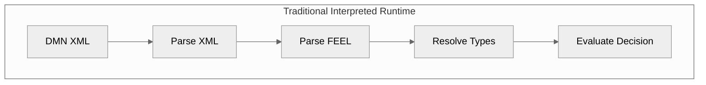
Every execution repeats work.

------------------------------------------------------------------------
Compiler approach:
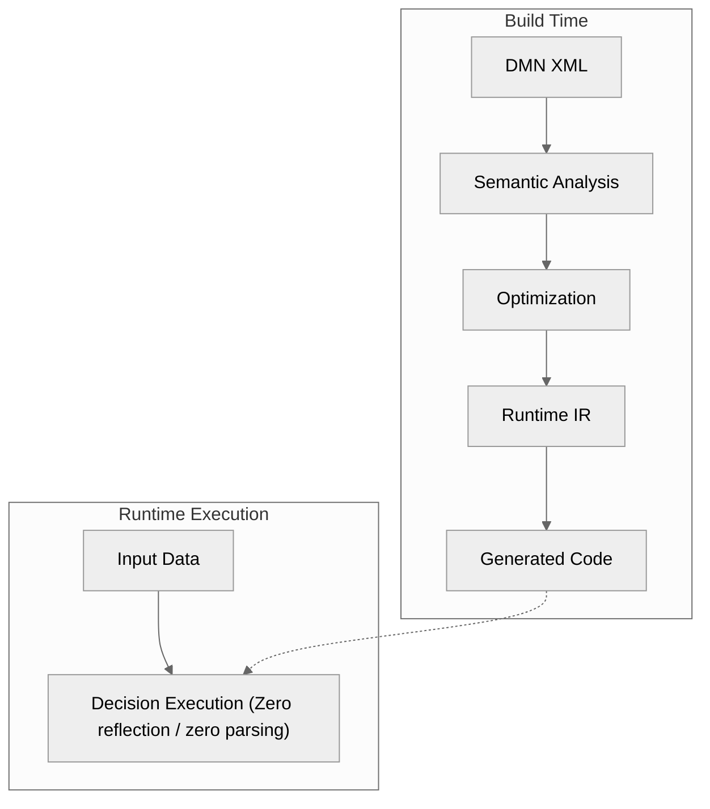
------------------------------------------------------------------------
<a id="contents-section-3"></a>
## 21.3 Performance Goals

Target characteristics:
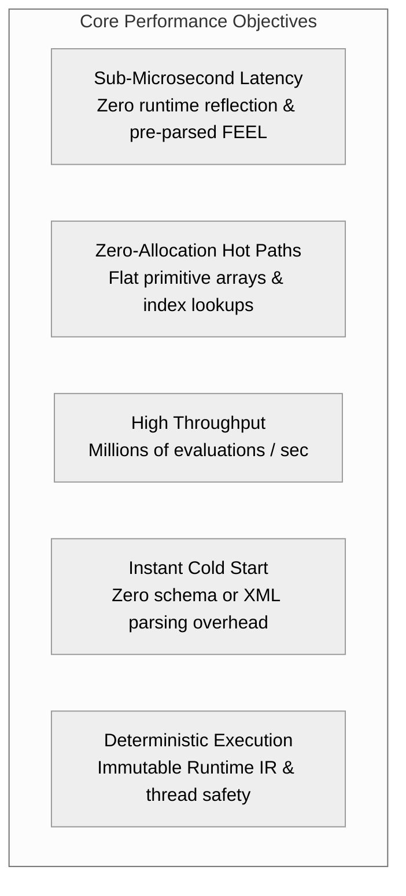
| Area | Goal |
| :--- | :--- |
| **Runtime latency** | Microsecond to low millisecond range |
| **Memory footprint** | Minimal allocations (zero-allocation hot paths) |
| **Throughput** | Millions of evaluations/sec possible |
| **Startup time** | Immediate execution |
| **Predictability** | Deterministic performance |
| **Scalability** | Horizontal scaling and batch execution |

------------------------------------------------------------------------
<a id="contents-section-4"></a>
## 21.4 Performance Principles

### PERF-001 --- Compile Once, Execute Many Times

The most fundamental optimization.

One compilation:
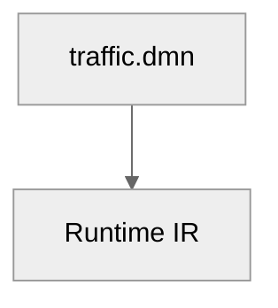
Millions of executions:
```text
request 1
request 2
request 3
...
request N
```
No repeated parsing.
------------------------------------------------------------------------
<a id="contents-section-5"></a>
## 21.5 No Runtime XML Processing

Forbidden:
```java
Decision execute() {
    parseXml();
}
```
Correct:
```java
Decision execute() {
    executeRuntimeIR();
}
```
Benefits:

-   no XML allocations
-   no parsing overhead
-   no schema validation during evaluation

------------------------------------------------------------------------
<a id="contents-section-6"></a>
## 21.6 No Runtime FEEL Parsing

Traditional:
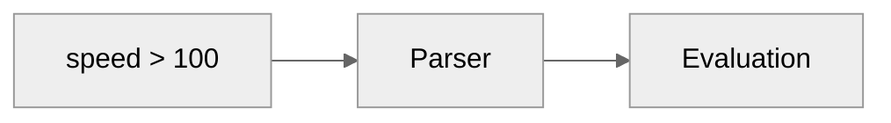
Every execution re-parses expressions.

------------------------------------------------------------------------
Compiler:
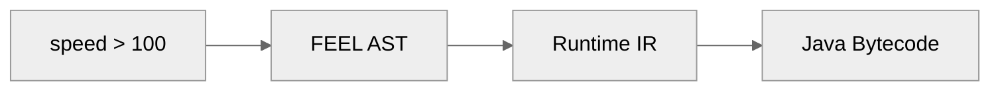
Parsed once at compile time.

------------------------------------------------------------------------
<a id="contents-section-7"></a>
## 21.7 Memory Efficiency

The runtime avoids heap object churn.

### Object-heavy design
```java
public class Expression {
    Operator operator;
    List<Expression> children;
    Metadata metadata;
}
```
Many allocations per node.

------------------------------------------------------------------------

### Runtime IR design
```text
ExpressionOpcode
operand1
operand2
```
Compact representation:
```text
COMPARE_GT
variableId = 5
constantId = 12
```
------------------------------------------------------------------------
<a id="contents-section-8"></a>
## 21.8 Integer-Based References

Runtime IR avoids string map lookups.

Slow:
```java
variables.get("customer.age");
```
Fast:
```java
variables[12];
```
Runtime representation:
```text
Variable Table
0 -> customerId
1 -> age
2 -> country
```
Expression:
```text
LOAD_VARIABLE 1
```
Benefits:
-   cache friendly
-   faster array-index lookup
-   smaller memory footprint

------------------------------------------------------------------------
<a id="contents-section-9"></a>
## 21.9 Immutable Runtime IR

Runtime IR is completely immutable.

Benefits:
-   thread safe
-   reusable
-   cacheable
-   shareable
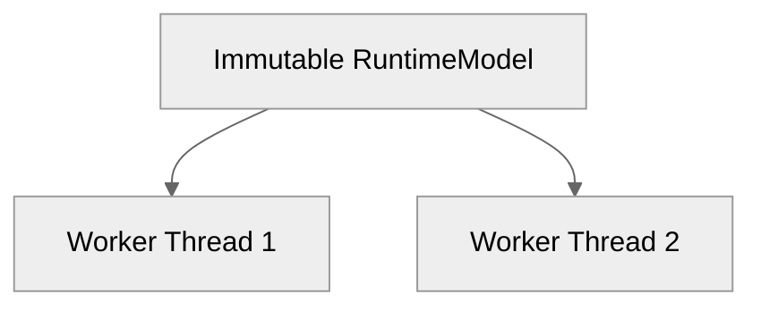
Zero synchronization overhead.
------------------------------------------------------------------------
<a id="contents-section-10"></a>
## 21.10 Zero Reflection

Reflection introduces performance degradation, prevents JIT inlining, and creates extra metadata:

Forbidden:
```java
method.invoke(target, args);
```
Preferred (Generated direct calls):
```java
decision.evaluate(input);
```
Benefits:
-   JVM inlining
-   escape analysis
-   predictable branch execution

------------------------------------------------------------------------
<a id="contents-section-11"></a>
## 21.11 Generated Code Optimization

Generated Java looks like manually tuned, idiomatic Java code.

Generated:
```java
if (input.speed() > 100) {
    return HIGH;
}
return LOW;
```
Not:
```java
Expression.evaluate(tree, context);
```
The JVM HotSpot JIT compiler can aggressively optimize direct code.

------------------------------------------------------------------------
<a id="contents-section-12"></a>
## 21.12 JVM Optimization Strategy

The Java backend leverages key JVM optimization mechanisms:

-   **Method Inlining**: Small decision methods (`calculatePenalty()`) are inlined into callers.
-   **Branch Prediction**: Direct `if (condition)` branches allow hardware branch prediction.
-   **Escape Analysis**: Scalar replacement eliminates temporary heap allocations.
-   **JIT Compilation**: Warm code paths compile directly into optimized native machine instructions.

------------------------------------------------------------------------
<a id="contents-section-13"></a>
## 21.13 Runtime IR Memory Layout

The Runtime IR layout prioritizes contiguous array storage over pointer-rich node graphs:
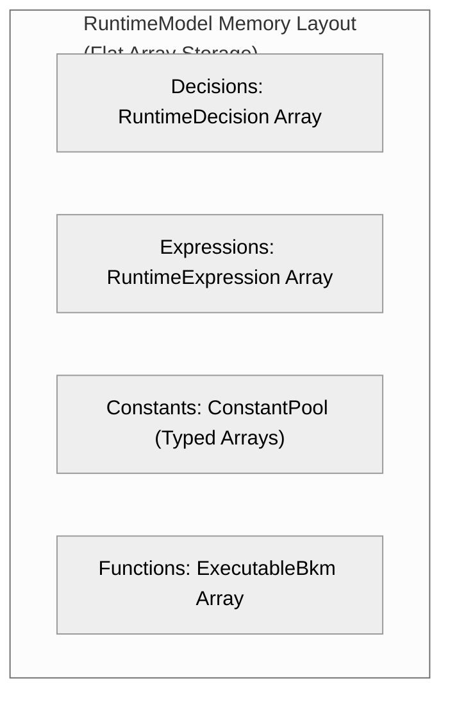
Contiguous primitive arrays are preferred over linked heap structures:
```java
RuntimeExpression[] expressions;
```
instead of:
```java
List<Node> expressionTree;
```
Benefits:

-   optimal CPU L1/L2 cache locality
-   zero pointer chasing
-   minimal GC overhead and memory fragmentation

------------------------------------------------------------------------
<a id="contents-section-14"></a>
## 21.14 Decision Graph Optimization

DMN decision requirements form an execution graph:
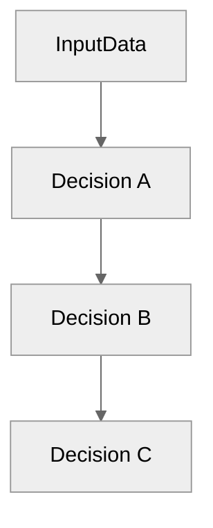
### Dead Decision Elimination

Unused decision nodes and unreachable logic branches are pruned at compile time:
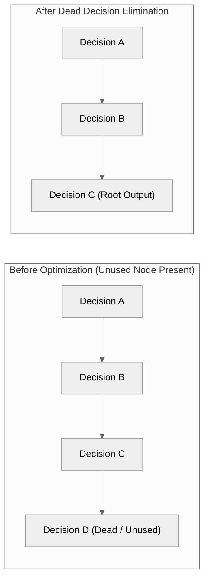
------------------------------------------------------------------------
<a id="contents-section-15"></a>
## 21.15 Constant Folding

Expressions with compile-time known constants are evaluated ahead of time:

Compile time:

-   FEEL expression: `10 + 20`
-   Compiler fold: `30`

Runtime:
```java
return 30;
```
Zero evaluation overhead during runtime execution.

------------------------------------------------------------------------
<a id="contents-section-16"></a>
## 21.16 Decision Inlining

Small intermediate decisions are collapsed directly into downstream expressions:
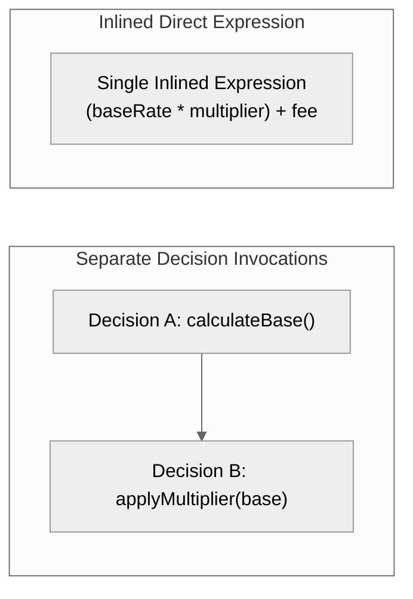
Benefits:

-   eliminates method invocation frame overhead
-   exposes broader cross-expression optimization opportunities to the JIT compiler

------------------------------------------------------------------------
<a id="contents-section-17"></a>
## 21.17 Common Subexpression Elimination

Redundant identical subexpressions within a decision scope are computed once:

Before:
```text
customer.age > 18
...
customer.age > 18
```
After:
```text
isAdult = customer.age > 18
// Reuse isAdult across all downstream rules
```
------------------------------------------------------------------------
<a id="contents-section-18"></a>
## 21.18 Batch Execution

High-throughput dataset processing avoids per-row object instantiation by evaluating contiguous columnar vectors:
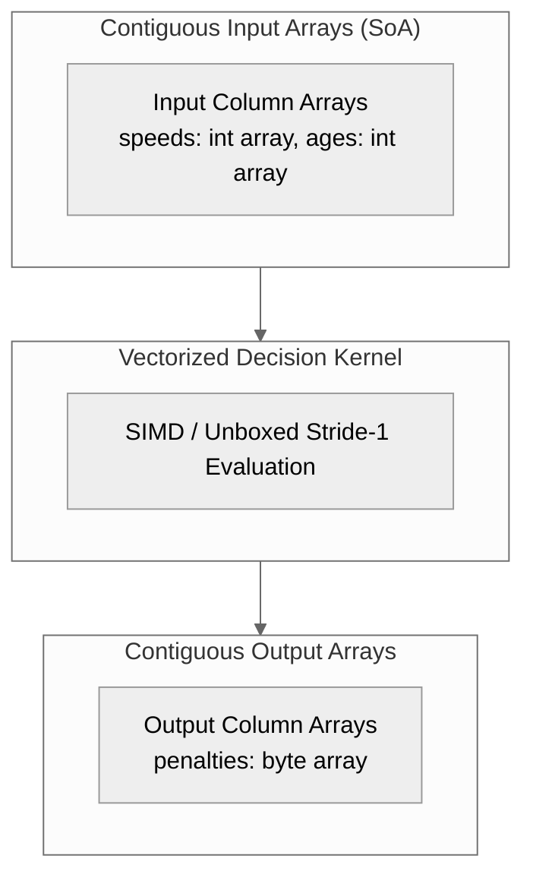
Essential for distributed processing engines (Spark SQL, Databricks, Flink).

------------------------------------------------------------------------
<a id="contents-section-19"></a>
## 21.19 Parallel Execution

Independent decision branches within a DAG can execute concurrently across threads:
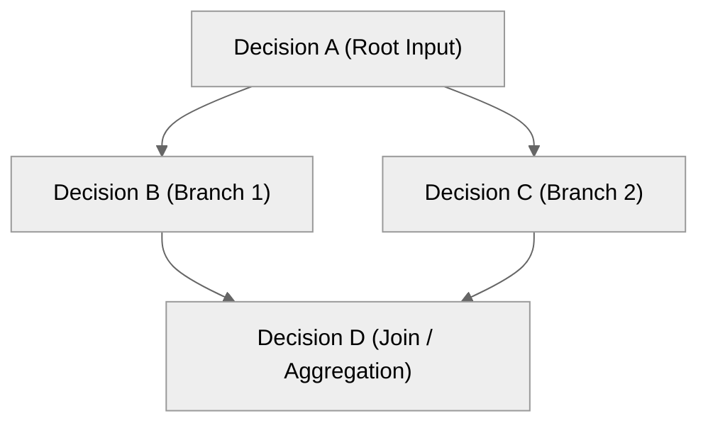
Branch `B` and Branch `C` execute concurrently via Java Virtual Threads (Project Loom) or `ForkJoinPool`.

------------------------------------------------------------------------
<a id="contents-section-20"></a>
## 21.20 Compilation Performance

The compilation pipeline scales horizontally across large enterprise DMN repositories:

### Compiler Caching

Models are hashed using SHA-256 to enable instant build caching:
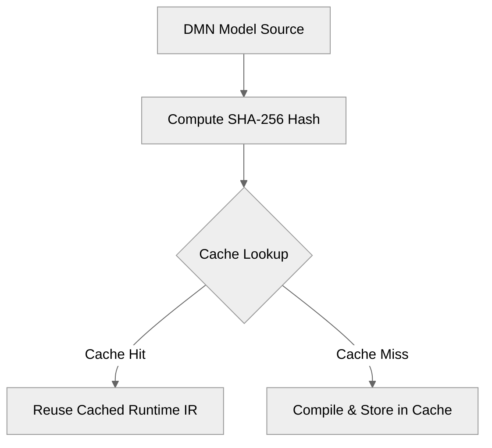
### Parallel Compilation

Independent DMN files compile simultaneously across available CPU cores:
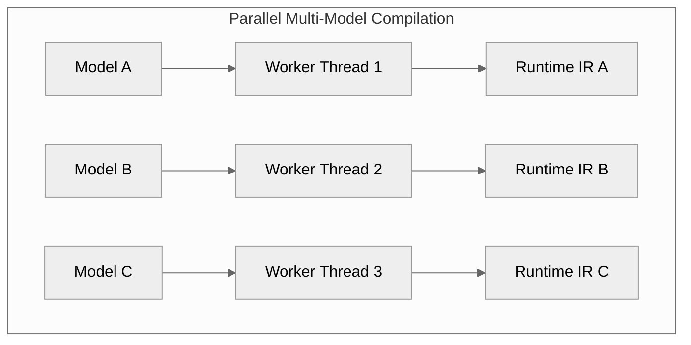
------------------------------------------------------------------------
<a id="contents-section-21"></a>
## 21.21 Performance Metrics

The compiler and runtime expose fine-grained telemetry:

### Compilation Metrics

| Stage | Duration |
| :--- | :--- |
| **XML Parsing & Validation** | 42 ms |
| **FEEL AST Construction** | 15 ms |
| **Semantic Analysis & Type Inference** | 12 ms |
| **IR Optimization Passes** | 8 ms |
| **Code Generation** | 20 ms |

### Runtime Metrics

| Metric | Target Profile |
| :--- | :--- |
| **Decision Model** | `TrafficViolation` |
| **Throughput** | 1,000,000 evaluations / sec |
| **Mean Latency** | 4 µs |
| **P99 Latency** | 12 µs |
| **Hot Path Allocations** | 0 bytes |

------------------------------------------------------------------------
<a id="contents-section-22"></a>
## 21.22 Benchmark Strategy

Rigorous benchmarking encompasses three distinct scopes:

-   **Micro Benchmarks (JMH)**: Measure individual opcode dispatch, function calls, and variable index lookups.
-   **Macro Benchmarks**: End-to-end evaluation over complex enterprise rule sets (e.g. SWIFT MT564 message validation).
-   **Comparison Benchmarks**: Cross-target performance tracking (Reference Interpreter vs. Runtime IR vs. Generated Java vs. Native).

------------------------------------------------------------------------
<a id="contents-section-23"></a>
## 21.23 Performance Testing Rules

Every optimization must satisfy three non-negotiable criteria:

1. **Exact Semantic Parity**: 100% test pass rate across TCK test suites.
2. **Statistically Significant Improvement**: Verified via JMH benchmark runs.
3. **Bounded Architectural Complexity**: No unmaintainable heuristics or fragile global state.

------------------------------------------------------------------------
<a id="contents-section-24"></a>
## 21.24 Expected Performance Levels

Target latency hierarchy across execution targets:
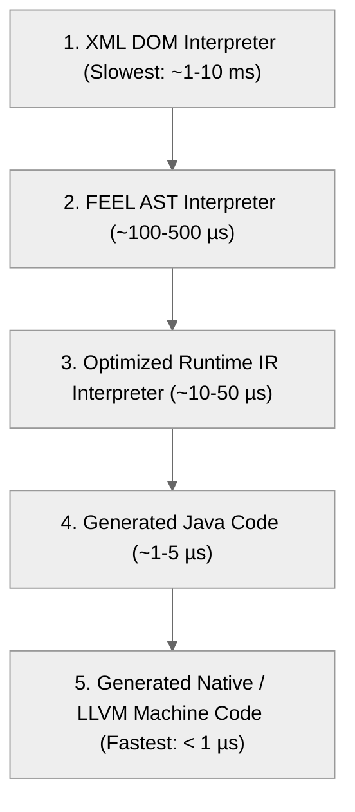
------------------------------------------------------------------------
<a id="contents-section-25"></a>
## 21.25 Performance Summary

The toolkit achieves predictable, ultra-low latency execution by shifting complexity:
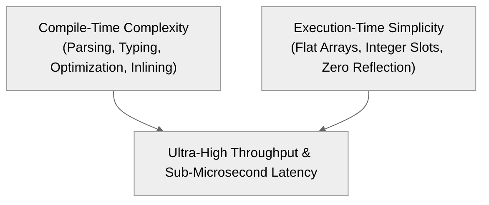

------------------------------------------------------------------------
