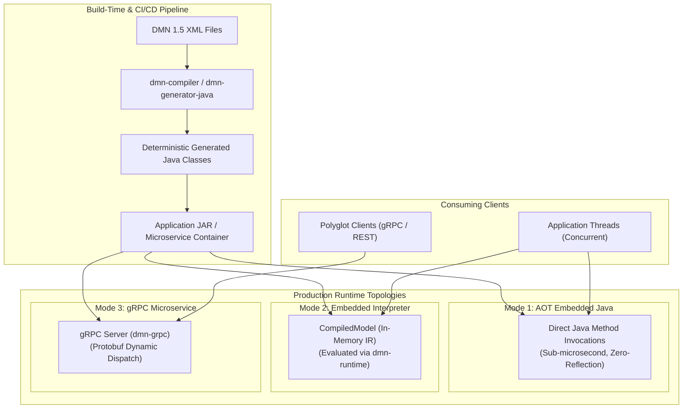

# Chapter 22 — Deployment and Operational Architecture [IMPLEMENTATION-ALIGNED]

<!-- generated-toc:start -->
## Table of contents

- [22.1 Purpose and Operational Overview](#contents-section-1)
- [22.2 Deployment Topologies and Operating Modes](#contents-section-2)
- [22.3 Deployment Architecture Pipeline](#contents-section-3)
- [22.4 Concurrency, Lifecycle, and Thread-Safety Invariants](#contents-section-4)
- [22.5 Resource Bounding and Operational Isolation](#contents-section-5)
<!-- generated-toc:end -->

## 22.1 Purpose and Operational Overview

This chapter defines the deployment topologies, execution lifecycle, concurrency rules, and operational boundaries of the DMN Compiler Toolkit across enterprise production environments. The toolkit is engineered for zero-footprint embedding, high-throughput batch execution, and low-latency microservice serving.

## 22.2 Deployment Topologies and Operating Modes

The toolkit supports four distinct operational deployment topologies:

| Deployment Mode | Build vs Runtime Characteristics | Target Use Case & Operational Profile |
| --- | --- | --- |
| **Ahead-of-Time (AOT) Generation** | XML parsed & compiled during Maven build. Generates pure Java source classes compiled directly into application JARs. | Mission-critical low-latency systems (HFT, risk engines). Zero XML/FEEL parsing overhead at runtime; instant cold-start. |
| **Embedded In-Process Engine** | DMN sources compiled in-process at application startup into immutable `CompiledModel` instances. | Long-running microservices, Spring Boot applications, dynamic decision management platforms. |
| **gRPC Decision Microservice** | Compiled models packaged behind a high-performance gRPC network daemon (`dmn-grpc`). | Polyglot enterprise ecosystems (Python, Go, Node.js, C#) requiring centralized, high-throughput decision services. |
| **Offline CI/CD Validation Gate** | Command-line and build-time analysis of entire DMN model repositories. Emits machine-readable diagnostics. | Continuous integration pipelines, model governance, pull-request verification before production promotion. |

## 22.3 Deployment Architecture Pipeline

## 22.4 Concurrency, Lifecycle, and Thread-Safety Invariants

The operational runtime architecture strictly enforces immutability and thread safety:

- **Immutable `CompiledModel`**: Once compiled, `CompiledModel` instances are completely immutable and thread-safe. A single instance can be shared across thousands of concurrent worker threads without synchronization locks.
- **Invocation-Scoped `EvaluationContext`**: All evaluation state (input bindings, intermediate slot values, transient collections) is strictly scoped to the invoking thread or request. No state is persisted across requests.
- **Garbage Collection Optimization**: Slot-based evaluation and primitive boxing elimination minimize runtime object allocations, maintaining flat GC pause profiles even under heavy load.
- **Zero Background Threads**: The core compiler and runtime do not spawn daemon threads, thread pools, or static background workers. Resource management remains completely under host application control.

## 22.5 Resource Bounding and Operational Isolation

To prevent resource exhaustion and noisy-neighbor interference in shared container environments:

1. **Stack Depth Bounding**: The FEEL evaluator and compiler AST walkers enforce configurable recursion limits to prevent `StackOverflowError` attacks from deeply nested expressions.
2. **Deterministic Memory Footprint**: Memory consumption during compilation scales linearly $O(N)$ with model size (number of decision rules and AST nodes) without quadratic blowout.
3. **Graceful Degradation**: Input resolution failures or invalid types result in structured error objects (`EvaluationResult.hasErrors()`) rather than JVM crashes or unhandled runtime exceptions.

