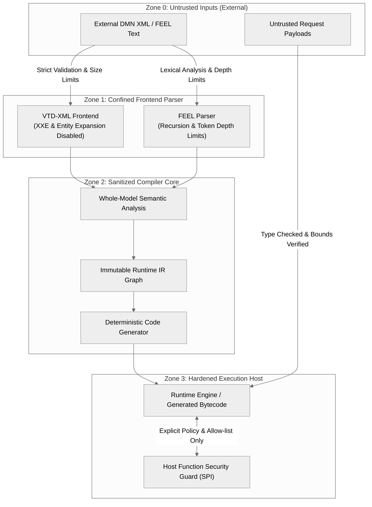

# Chapter 23 — Security and Trust Boundaries [NORMATIVE]

<!-- generated-toc:start -->
## Table of contents

- [23.1 Purpose and Threat Landscape](#contents-section-1)
- [23.2 Trust Boundaries and Security Architecture](#contents-section-2)
- [23.3 Frontend Hardening and Input Sanitization](#contents-section-3)
- [23.4 Code Generation Security and Injection Defense](#contents-section-4)
- [23.5 External Function Isolation and Governance](#contents-section-5)
<!-- generated-toc:end -->

## 23.1 Purpose and Threat Landscape

This chapter establishes normative security controls, trust boundaries, and threat mitigation strategies for the DMN Compiler Toolkit. Because the compiler ingests external declarative XML models and evaluates complex user-supplied input data, the architecture is hardened against untrusted inputs, denial-of-service (DoS) payloads, code injection, and unauthorized host access.

## 23.2 Trust Boundaries and Security Architecture

The toolkit partitions data flow across four distinct security trust domains:

## 23.3 Frontend Hardening and Input Sanitization

To defend against XML vulnerabilities and parser exploits:

1. **XML Entity Expansion & XXE Protection**: The XML frontend (`dmn-frontend-xml`) uses VTD-XML configured to strictly prohibit inline DTD entity expansions, external general entities, and parameter entities. External schema resolution over arbitrary network protocols is blocked.
2. **Denial-of-Service (Billion Laughs / Quadratic Blowup)**: Input byte sizes are strictly bounded. Circular entity references and oversized element trees are rejected before memory allocation occurs.
3. **FEEL Parser Recursion Bounding**: The ANTLR-based FEEL parser (`dmn-feel-parser`) limits expression nesting depth to prevent stack overflow exploits from adversarial bracket nesting.
4. **Hermetic Import Resolution**: All model imports (`<import>`) must resolve through configured `DmnModelResolver` boundaries. Traversal outside designated repository or classpath roots (e.g., path traversal via `../`) is strictly rejected.

## 23.4 Code Generation Security and Injection Defense

When transforming DMN decision tables and literal expressions into Java source code:

- **Strict Identifier Sanitization**: All business model names, decision IDs, variable identifiers, and FEEL symbols are canonically sanitized into valid, escaped Java identifiers. Malicious identifier names containing injected Java syntax (e.g., `decisionName"); System.exit(0); //`) cannot escape literal string boundaries.
- **Constant Literal Sanitization**: String literals emitted in generated code are fully escaped using standard unicode escape sequences to prevent string literal breakout attacks.
- **Deterministic Emission**: Code generators produce deterministic AST representations without dynamic string concatenation or unsafe template execution.

## 23.5 External Function Isolation and Governance

DMN 1.5 supports external Java and PMML function invocations via BKM definitions. The toolkit applies strict controls:

- **Zero Ambient Reflection (ADR-0013)**: The toolkit never discovers or invokes arbitrary classes via uncontrolled reflection or runtime class loading.
- **Explicit Host Binding SPI**: All external Java method invocations must be explicitly declared and registered with the execution host environment via an authorized function registry.
- **Execution Timeouts & Guardrails**: Host adapters can wrap external function bindings with timeouts and circuit breakers to prevent rogue external code from blocking decision evaluation threads.

