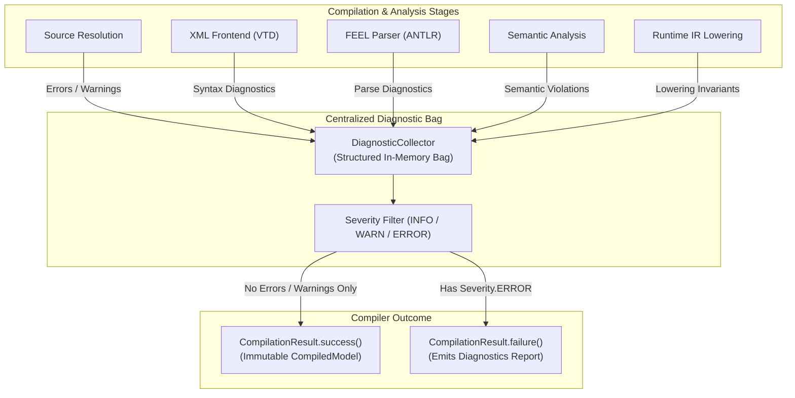

# Chapter 24 — Failure Model and Resilience [IMPLEMENTATION-ALIGNED]

<!-- generated-toc:start -->
## Table of contents

- [24.1 Purpose and Resilient Architecture](#contents-section-1)
- [24.2 Unified Failure Taxonomy](#contents-section-2)
- [24.3 Diagnostic Lifecycle Pipeline](#contents-section-3)
- [24.4 Structured Diagnostic Contracts](#contents-section-4)
- [24.5 Evaluation-Time Resilience and DMN Null Semantics](#contents-section-5)
<!-- generated-toc:end -->

## 24.1 Purpose and Resilient Architecture

This chapter defines the unified failure model, error classification taxonomy, and resilience strategies of the DMN Compiler Toolkit. The architecture establishes clear separation between deterministic compilation diagnostics, recoverable runtime evaluation errors, and fatal internal invariant violations.

## 24.2 Unified Failure Taxonomy

Failures are categorized into distinct phases, each handled with dedicated diagnostic propagation mechanisms:

| Phase Category | Root Cause Examples | Error Handling Strategy |
| --- | --- | --- |
| **Source Resolution** | Missing import file, unresolvable namespace URI, circular import graph. | Emits structured `RESOLVER_ERROR` diagnostics; halts compilation before parsing. |
| **XML Frontend** | Corrupted XML, schema validation failure, unsupported DMN element. | Emits `XML_SYNTAX_ERROR` or `UNSUPPORTED_ELEMENT` diagnostics with exact line numbers. |
| **FEEL Lexing / Parsing** | Syntax error in literal expression, mismatched parentheses, invalid token. | Collects syntax diagnostics; continues parsing remaining expressions if possible. |
| **Semantic Analysis** | Undefined variable reference, type mismatch, circular decision dependency. | Aggregates whole-model semantic errors; emits actionable diagnostics with source context. |
| **Lowering & Generation** | Unsupported language target construct, slot assignment conflict. | Fails fast with compiler diagnostic; prevents invalid bytecode emission. |
| **Runtime Evaluation** | Missing required input variable, divide-by-zero, invalid date string format. | Complies with DMN 1.5 ternary logic & null-propagation rules; logs evaluation warning. |
| **Internal Defects** | Invariant assertion failure, unhandled sealed AST variant. | Throws fatal `DmnCompilerInternalException` with preserved stack traces for bug reporting. |

## 24.3 Diagnostic Lifecycle Pipeline

## 24.4 Structured Diagnostic Contracts

In accordance with **ADR-0012 (Diagnostics as First-Class Objects)**, all compiler errors and warnings are emitted as immutable, strongly typed `Diagnostic` records:

- **Phase**: Identifies the emitting compiler phase (`RESOLUTION`, `FRONTEND_XML`, `FEEL_PARSER`, `SEMANTIC_ANALYSIS`, `OPTIMIZER`, `GENERATOR`).
- **Severity**: Categorized as `INFO`, `WARNING`, or `ERROR`.
- **Code**: Stable, machine-readable diagnostic code (e.g., `DMN-SEM-0104: Undefined Input Variable Reference`).
- **Source Location**: Precise file URI, line number, column offset, and DMN element ID (`drgElementId`).
- **Formatted Message**: Contextual, human-readable remediation advice.

## 24.5 Evaluation-Time Resilience and DMN Null Semantics

During runtime evaluation, decision models must exhibit high resilience:

1. **DMN 1.5 Null-Propagation**: In accordance with the standard, arithmetic errors (e.g., divide by zero) and invalid type conversions evaluate to `null` rather than terminating the decision service with an unhandled exception.
2. **Hit Policy Resilience**: Decision tables with `UNIQUE` hit policy report a runtime evaluation warning if multiple conflicting rules match, gracefully defaulting to `null` in non-strict modes.
3. **Deterministic Fault Isolation**: An evaluation error in a single independent decision sub-branch does not crash unrelated parallel decision evaluations in the same graph.

