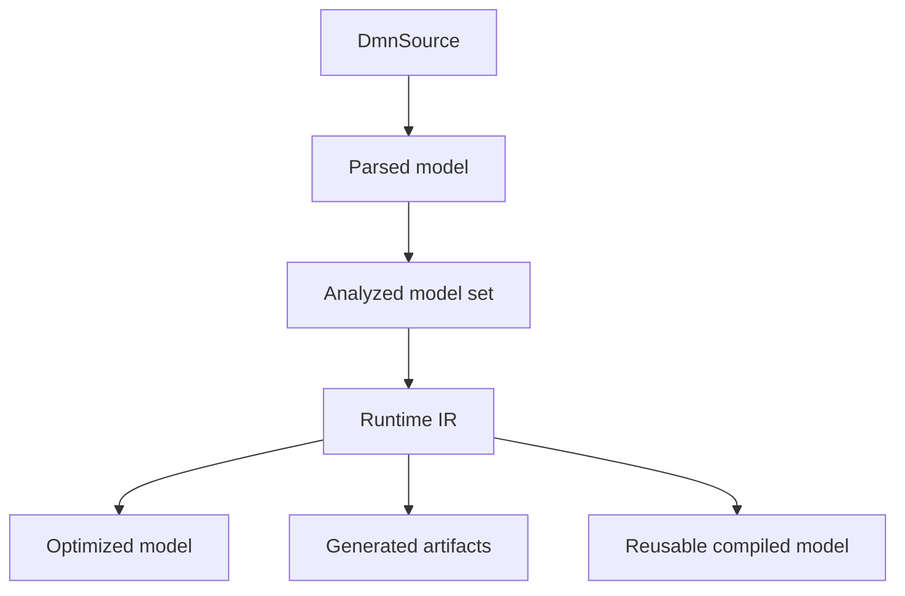

# Chapter 25 — Data Lifecycle, Caching, and Compatibility [FUTURE — UNREVIEWED]

<!-- generated-toc:start -->
## Table of contents

- [Status and purpose](#contents-section-1)
- [Proposed artifact lifecycle](#contents-section-2)
- [Proposed cache rules](#contents-section-3)
- [Proposed compatibility domains](#contents-section-4)
- [Open review questions](#contents-section-5)
<!-- generated-toc:end -->

> **Review status: UNREVIEWED PROPOSAL.** No cache or compatibility guarantee is established here.

## Status and purpose

This chapter proposes ownership, lifetime, invalidation, and compatibility boundaries for source,
semantic, Runtime IR, compiled, and generated artifacts.

## Proposed artifact lifecycle

Every artifact should be immutable. Each result should identify the source set and compiler options
from which it was derived.

## Proposed cache rules

- Cache source loads by stable `DmnSourceId` within one compilation.
- Include content fingerprints, compiler version, options, and dependency fingerprints in durable
  cache keys.
- Do not cache failures indefinitely without source/version-aware invalidation.
- Keep caller/tenant cache namespaces isolated.
- Treat process-local Runtime IR records as non-serializable under ADR-0025 until a durable schema
  and consumer lifetime exist.

## Proposed compatibility domains

- Public compiler/runtime Java APIs.
- Semantic protobuf schema and serialized models.
- Process-local Runtime IR Java contracts.
- Generated Java source/binary contracts.
- Generic and typed Protobuf/gRPC contracts.
- Diagnostic codes and metadata.

These domains should not inherit one another’s compatibility promises implicitly.

## Open review questions

- Which artifacts require durable caching first?
- What is the supported public API compatibility window?
- How are generated contract changes detected and versioned?
- Are diagnostic codes stable enough for tooling integrations?

