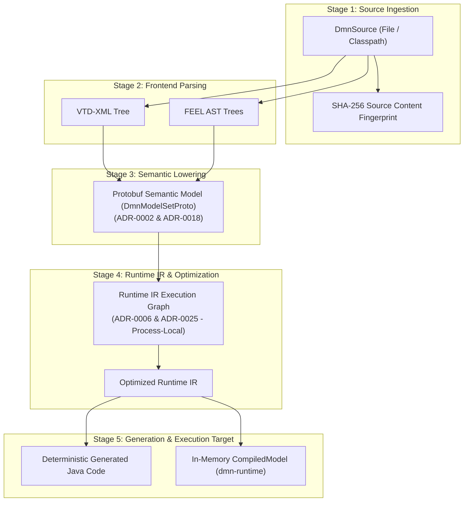

# Chapter 25 — Data Lifecycle, Caching, and Compatibility [IMPLEMENTATION-ALIGNED]

<!-- generated-toc:start -->
## Table of contents

- [25.1 Purpose and Lifecycle Overview](#contents-section-1)
- [25.2 Compiler Artifact Transformation Pipeline](#contents-section-2)
- [25.3 Caching Invalidation and Fingerprinting Rules](#contents-section-3)
- [25.4 Compatibility Domains and Evolution Policies](#contents-section-4)
<!-- generated-toc:end -->

## 25.1 Purpose and Lifecycle Overview

This chapter defines the end-to-end data lifecycle, caching invalidation semantics, and compatibility boundaries across the compiler pipeline. Each intermediate artifact (source, Protobuf semantic model, Runtime IR, generated Java, compiled model) has an explicit lifetime, mutability constraint, and versioning contract.

## 25.2 Compiler Artifact Transformation Pipeline

The compilation lifecycle transforms raw declarative sources through progressively lower, immutable intermediate representations:

## 25.3 Caching Invalidation and Fingerprinting Rules

To support high-performance incremental compilation and build-tool caching:

1. **Deterministic Fingerprinting (ADR-0011)**: Every compilation output is keyed by a composite SHA-256 hash comprising:
   - Content hashes of all primary and transitively imported DMN XML files.
   - Exact toolkit version (`1.0.0-SNAPSHOT` / release tag).
   - Normalized `CompilerOptions` (optimization levels, package names, target dialect).
2. **Compilation-Scoped Resolution Cache**: The `DmnModelResolver` maintains a cache during a single compilation run to prevent redundant parsing of shared imported sub-models.
3. **No Stale Failure Caching**: Diagnostic failures are never cached indefinitely across file modification boundaries; any change in source timestamp or hash invalidates the cache immediately.

## 25.4 Compatibility Domains and Evolution Policies

The architecture partitions compatibility into five decoupled governance domains:

| Domain | Boundary Contract | Evolution & Compatibility Policy |
| --- | --- | --- |
| **Public Java API** | `dmn-compiler`, `dmn-runtime` | Semantic Versioning (SemVer). Public interfaces (e.g., `DmnCompiler`, `CompiledModel`) maintain backwards compatibility across minor releases. |
| **Protobuf Semantic Schema** | `dmn-protobuf` | **ADR-0018**: Protobuf field numbers and wire formats are append-only. Deprecated fields are reserved to prevent wire-format collisions. |
| **Runtime IR** | `dmn-runtime-ir` | **ADR-0025**: Strictly process-local and transient. No cross-version serialization guarantees are promised; IR is re-derived per compilation. |
| **Generated Java Source** | `dmn-generator-java` | Generated code depends only on lightweight `dmn-runtime` helper classes matching the major compiler version. |
| **gRPC Service Schema** | `dmn-grpc` | **ADR-0019**: Generic dynamic Protobuf value schemas ensure forward and backward transport compatibility. |

