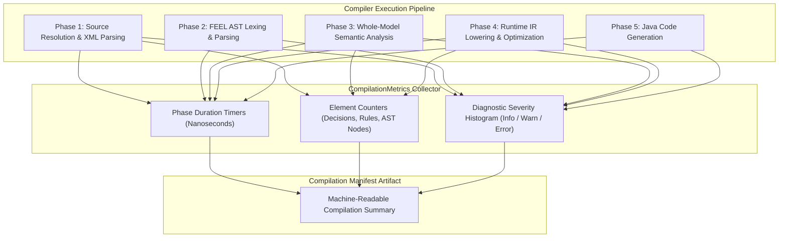

# Chapter 26 — Observability and Supportability [IMPLEMENTATION-ALIGNED]

<!-- generated-toc:start -->
## Table of contents

- [26.1 Purpose and Observability Philosophy](#contents-section-1)
- [26.2 Compilation Telemetry and Phase Profiling](#contents-section-2)
- [26.3 Runtime Evaluation Tracing and Metrics](#contents-section-3)
- [26.4 Provenance Manifests and Supportability Artifacts](#contents-section-4)
<!-- generated-toc:end -->

## 26.1 Purpose and Observability Philosophy

This chapter defines the observability architecture, performance profiling hooks, audit tracing, and supportability artifacts of the DMN Compiler Toolkit. The design adheres to a **Zero-Overhead Default Principle**: when observability is disabled, execution paths incur zero telemetry allocation or synchronization penalty.

## 26.2 Compilation Telemetry and Phase Profiling

During model compilation, the compiler tracks structured phase timings and model cardinality metrics:

### Measured Compilation Metrics
- **Phase Duration**: Wall-clock and CPU time spent in XML extraction, FEEL parsing, semantic analysis, optimizer passes, and code emission.
- **Model Cardinality**: Number of resolved DMN files, decisions, business knowledge models (BKMs), decision tables, input data nodes, and total rule rows.
- **Diagnostic Counts**: Total warnings, errors, and informational notices emitted per phase.

## 26.3 Runtime Evaluation Tracing and Metrics

For production execution monitoring, the runtime provides pluggable listeners via `EvaluationListener`:

- **Decision Execution Tracing**: Captures entry timestamp, evaluated decision ID, rule matches, and exit timestamp.
- **Rule Hit Logging**: Tracks hit rule indices for multi-hit (`COLLECT`, `RULE ORDER`) and single-hit (`UNIQUE`, `FIRST`) decision tables.
- **Data Privacy & Redaction**: Input payload values and output evaluations can be redacted or masked to comply with enterprise data protection (GDPR, PCI-DSS) requirements.

## 26.4 Provenance Manifests and Supportability Artifacts

To enable deterministic support and bug reproducibility, compiled models and generated classes embed a provenance metadata block:

1. **Compiler Identification**: Exact version string, commit hash, and build timestamp.
2. **Source Fingerprints**: Cryptographic SHA-256 hashes of all input DMN models.
3. **Compiler Options**: Exact optimization flags, target JDK release, and package configurations used during code generation.
4. **Reproducibility CLI Command**: Exact command-line invocation required to recreate the identical compilation artifact.

