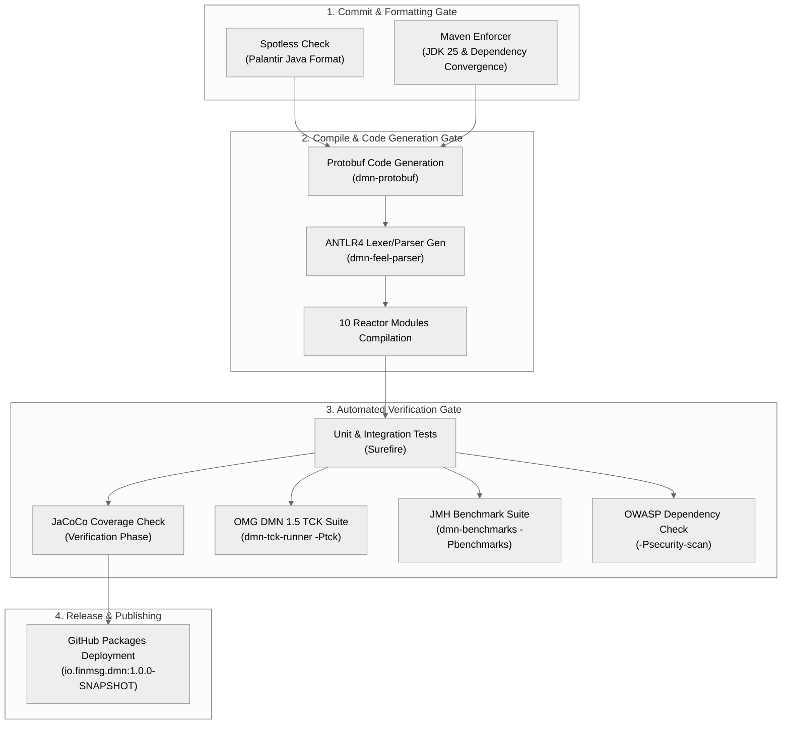

# Chapter 27 — Build, Release, and Supply Chain [IMPLEMENTATION-ALIGNED]

<!-- generated-toc:start -->
## Table of contents

- [27.1 Purpose and Toolchain Architecture](#contents-section-1)
- [27.2 CI/CD Verification Pipeline Architecture](#contents-section-2)
- [27.3 Deterministic Builds and Supply Chain Hardening](#contents-section-3)
- [27.4 Release Governance and Distribution](#contents-section-4)
<!-- generated-toc:end -->

## 27.1 Purpose and Toolchain Architecture

This chapter defines the multi-module build system, continuous integration (CI) pipeline, supply chain security controls, and release distribution policies of the DMN Compiler Toolkit. The build infrastructure guarantees reproducible builds, automated code formatting, dependency convergence, and strict security scanning.

### Core Toolchain Stack
- **Build System**: Apache Maven 3.9+
- **JDK Target**: Java 25 (`<maven.compiler.release>25</maven.compiler.release>`)
- **Code Formatter**: Spotless (`spotless-maven-plugin:2.46.1`) with Palantir Java Format (`2.50.0`)
- **Dependency Guard**: Maven Enforcer (`maven-enforcer-plugin:3.5.0`) with strict dependency convergence
- **Test & Coverage**: JUnit 5 (`5.13.4`), AssertJ (`3.27.6`), JaCoCo (`0.8.14`)
- **Vulnerability Scanner**: OWASP Dependency Check (`12.1.3`)

## 27.2 CI/CD Verification Pipeline Architecture

The automated continuous integration pipeline executes across discrete quality gates:

## 27.3 Deterministic Builds and Supply Chain Hardening

To safeguard supply chain integrity:

1. **Dependency Convergence (ADR-0014)**: The root `pom.xml` strictly enforces exact version alignment across all transitive dependencies (Protobuf, gRPC, ANTLR, SLF4J, JUnit), preventing classpath pollution.
2. **Reproducible Code Generation**: Generated ANTLR parsers and Protobuf Java stubs are regenerated and verified in CI to ensure that checked-in code never drifts from source grammar definitions.
3. **Automated Vulnerability Scanning**: Continuous execution of the OWASP Dependency-Check plugin alerts against known CVEs in upstream dependencies.

## 27.4 Release Governance and Distribution

- **Artifact Group ID**: `io.finmsg.dmn`
- **Distribution Repository**: Published to GitHub Packages (`https://maven.pkg.github.com/finmsg-io/dmn-compiler-toolkit`).
- **Release Profile (`-Prelease`)**: Attaches source JARs (`maven-source-plugin`) and Javadoc JARs (`maven-javadoc-plugin`) for enterprise consumers.
- **Fast Reactor vs Incubator Profiles**: Default reactor builds focus on core stable modules (10 modules); experimental backends (`dmn-grpc`, `dmn-generator-sparksql`) are partitioned into the `-Pincubator` profile.

