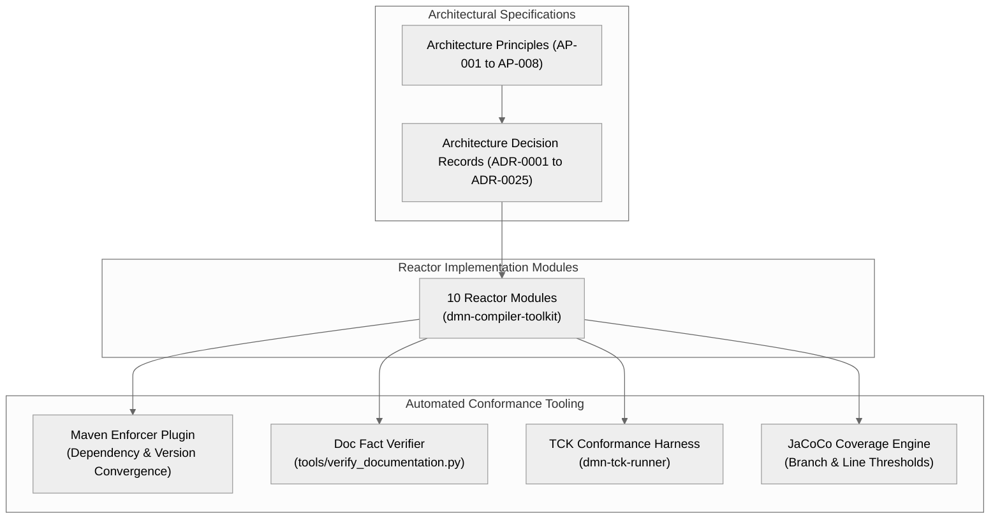

# Chapter 28 — Architecture Traceability and Conformance [NORMATIVE]

<!-- generated-toc:start -->
## Table of contents

- [28.1 Purpose and Traceability Principles](#contents-section-1)
- [28.2 Architecture Traceability Matrix](#contents-section-2)
- [28.3 Conformance Verification Architecture](#contents-section-3)
- [28.4 Automated Conformance Checks and Tooling](#contents-section-4)
- [28.5 Architecture Governance and Evolution](#contents-section-5)
<!-- generated-toc:end -->

## 28.1 Purpose and Traceability Principles

This chapter establishes normative traceability standards and automated conformance checks for the DMN Compiler Toolkit. Architectural decisions (ADRs) and architectural principles (APs) must remain verifiably linked to source code modules, build enforcements, and continuous verification tests.

## 28.2 Architecture Traceability Matrix

The toolkit enforces bi-directional traceability from core architecture principles down to executable test suites:

| Architecture Principle | Primary ADR | Owning Module(s) | Automated Verification Mechanism |
| --- | --- | --- | --- |
| **AP-001: Compiler Pipeline** | ADR-0001, ADR-0007 | `dmn-compiler` | Multi-pass compiler test suites; AST transformation tests. |
| **AP-002: Semantic Neutrality** | ADR-0002, ADR-0018 | `dmn-protobuf` | Schema compatibility checks; Protobuf serialization tests. |
| **AP-003: Memory Efficiency** | ADR-0003 | `dmn-frontend-xml` | VTD-XML benchmark suite; allocation profiling. |
| **AP-004: Standards Conformance**| ADR-0004 | `dmn-feel-parser` | Official OMG DMN 1.5 TCK test suite (`dmn-tck-runner`). |
| **AP-005: Immutability** | ADR-0005, ADR-0006 | `dmn-runtime-ir` | Invariant assertion checks; concurrent evaluation tests. |
| **AP-006: Zero Runtime XML** | ADR-0008 | `dmn-runtime` | Maven Enforcer banned dependency rules; classpath inspection. |
| **AP-007: Zero Reflection** | ADR-0013 | `dmn-generator-java`| Bytecode inspection; benchmark micro-profiling. |
| **AP-008: Deterministic Build** | ADR-0011 | Root `pom.xml` | CI SHA-256 build artifact hash comparison. |

## 28.3 Conformance Verification Architecture

## 28.4 Automated Conformance Checks and Tooling

Architecture conformance is continuously asserted through automated build scripts:

1. **Documentation Fact Verification (`tools/verify_documentation.py`)**: Validates that all reactor modules in `pom.xml` match the documented modules in `docs/modules.md`, checks for prohibited unsupported claims, and verifies documentation integrity.
2. **Maven Enforcer Boundary Guard**: Enforces strict module dependency hierarchy (e.g., ensuring `dmn-runtime` cannot depend on `dmn-compiler` or `dmn-frontend-xml`).
3. **TCK Regression Protection**: All FEEL and boxed expression evaluations must pass the OMG DMN 1.5 compliance suite before pull-request merges.

## 28.5 Architecture Governance and Evolution

- **ADR Supersession**: Any fundamental architectural change requires an updated or superseding Architecture Decision Record submitted with code changes.
- **Architectural Regression Prevention**: Pull requests introducing architectural deviations (such as unapproved transitive dependencies or reflection) are automatically blocked by CI enforcer gates.

