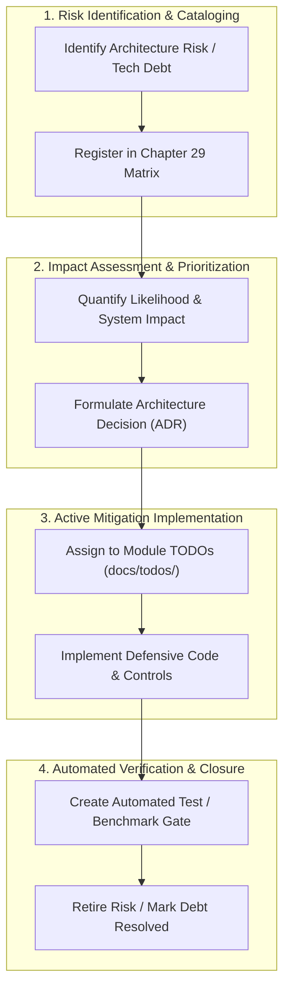

# Chapter 29 — Architecture Risks and Technical Debt [IMPLEMENTATION-ALIGNED]

<!-- generated-toc:start -->
## Table of contents

- [29.1 Purpose and Risk Management Framework](#contents-section-1)
- [29.2 Architectural Risk Register and Mitigations](#contents-section-2)
- [29.3 Risk Governance Lifecycle Pipeline](#contents-section-3)
- [29.4 Technical Debt Retirement Strategy](#contents-section-4)
<!-- generated-toc:end -->

## 29.1 Purpose and Risk Management Framework

This chapter maintains the active architectural risk register and technical debt management strategy for the DMN Compiler Toolkit. The architecture proactively tracks, quantifies, and mitigates risks related to standards compliance, semantic divergence, generator correctness, and performance degradation.

## 29.2 Architectural Risk Register and Mitigations

The project monitors eight core architectural risks:

| Risk ID | Architectural Risk Description | Severity | Concrete Mitigation & Guardrail |
| --- | --- | --- | --- |
| **RSK-001** | **Interpreter vs Generator Semantic Divergence**: Discrepancies in FEEL evaluation semantics between reference interpreter and Java generated code. | High | Shared canonical test fixtures evaluated against both execution engines in continuous CI. |
| **RSK-002** | **Complex Import Graph Resolution Cycles**: Multi-file DMN models containing cyclic or unresolvable namespace references. | Medium | Topological sort and cycle detection in `dmn-frontend-xml` and `dmn-semantic-analysis`. |
| **RSK-003** | **Unbounded Hostile XML / FEEL Payloads**: Memory exhaustion via nested entity expansion or recursive expressions. | High | VTD-XML entity expansion disabled; recursion depth limits in ANTLR FEEL parser. |
| **RSK-004** | **Premature Runtime IR Serialization Lock-in**: Exposing volatile internal IR over network or disk boundaries. | Medium | **ADR-0025**: Runtime IR remains strictly process-local and non-serializable until schema stabilizes. |
| **RSK-005** | **Generated Source Compilation Drift**: Grammar modifications diverging from checked-in generated parser code. | Medium | Automated CI source generation and diff verification gate. |
| **RSK-006** | **Performance Regression in Evaluation Loops**: Unintended object allocations inside hot-path rule execution loops. | High | Continuous JMH benchmark regression tracking (`dmn-benchmarks`) with zero-allocation assertions. |
| **RSK-007** | **External Java Function Security Escapes**: Rogue Java methods invoked via BKM escaping isolation. | High | **ADR-0013**: Zero reflection; strict host SPI binding and explicit function allow-listing. |
| **RSK-008** | **Downstream Dependency Version Conflicts**: Upstream libraries introducing conflicting transitive dependencies. | Medium | Root `pom.xml` Maven Enforcer dependency convergence enforcement. |

## 29.3 Risk Governance Lifecycle Pipeline

## 29.4 Technical Debt Retirement Strategy

Technical debt items are not left to accumulate in unstructured backlogs. Instead, they are systematically resolved through canonical project planning channels:

- **Module-Specific TODOs**: Local refactorings, lowering pass cleanups, and test additions are tracked in [`docs/todos/index.md`](../../todos/index.md).
- **Milestone Roadmap**: High-impact architectural improvements and generator optimizations are sequenced in the [Roadmap](../../roadmap.md).
- **Continuous Evidence**: A technical debt item is marked closed only when accompanied by passing unit tests, JMH benchmark data, or an accepted ADR.

