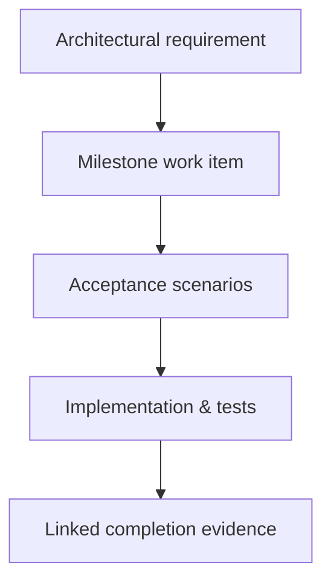

# Evidence-Backed Specification-Driven Development

<!-- generated-toc:start -->
## Table of contents

- [Purpose](#contents-section-1)
- [Core principle](#contents-section-2)
- [Development loop](#contents-section-3)
- [Canonical document roles](#contents-section-4)
- [When a slice is ready](#contents-section-5)
- [Reusable completion gate](#contents-section-6)
- [Proportional verification](#contents-section-7)
- [Example: P1.3 transitive import loading](#contents-section-8)
- [Reusable slice template](#contents-section-12)
- [Process guardrails](#contents-section-13)
<!-- generated-toc:end -->

<a id="contents-section-1"></a>
## Purpose

This guide defines the project’s lightweight approach to specification-driven development. It
preserves architectural discipline without requiring a complete design for every future capability
before implementation can proceed.

The approach is called **evidence-backed specification-driven development**: specify one observable
slice, implement it vertically, prove it with executable evidence, and update only the canonical
documentation affected by the result.

<a id="contents-section-2"></a>
## Core principle



A specification states intent and observable behavior. Tests, benchmarks, generated artifacts, and
validated documentation establish whether the intent has actually been achieved.

The process is deliberately not “specify the entire product first.” Future material may remain
`UNREVIEWED`; only the decisions and requirements needed by the next slice must be ready.

<a id="contents-section-3"></a>
## Development loop

1. Select one requirement or milestone work item.
2. Write a short slice specification containing observable behavior, non-goals, constraints,
   acceptance scenarios, affected modules, and open decisions.
3. Mark the slice `ready` only when implementation can proceed without a major unresolved design
   choice.
4. Implement the smallest end-to-end behavior that produces useful evidence.
5. Add positive, negative, and deterministic tests proportional to the slice’s risk.
6. Run focused verification first, then downstream or full-reactor checks where required.
7. Link the evidence from the development plan and update only canonical status documents.
8. Create an ADR only when the slice makes a durable architectural decision.

<a id="contents-section-4"></a>
## Canonical document roles

| Artifact | Role |
| --- | --- |
| [Architecture specification](../architecture/architecture-spec.md) | Enduring requirements, boundaries, and intended system structure |
| [ADRs](../architecture/adr/generall-adr.md) | Significant decisions, alternatives, rationale, and consequences |
| [Roadmap](../roadmap.md) | Milestone sequencing, acceptance criteria, state, and evidence |
| [Module TODOs](../todos/index.md) | Current module-local gaps, not completion history |
| [Slice specification](slices/index.md) | Temporary implementation contract for one bounded increment |
| Tests and benchmarks | Executable behavioral and quality evidence |
| Assessments | Dated snapshots; not active work queues |

Avoid duplicating the same requirement across several narrative documents. Link to the authoritative
source and add detail only where the document has a distinct responsibility.

<a id="contents-section-5"></a>
## When a slice is ready

A slice may move to `ready` when:

- its observable outcome and non-goals are explicit;
- acceptance scenarios cover the primary success and failure behavior;
- affected architectural requirements and modules are known;
- no unresolved choice would materially change public contracts or module boundaries;
- required fixtures and test boundaries are identifiable;
- any necessary ADR is accepted, or the slice intentionally avoids that decision.

Implementation details that can be changed locally do not need to be decided before work begins.

<a id="contents-section-6"></a>
## Reusable completion gate

A normal slice is complete when all applicable items are satisfied:

- [ ] Acceptance scenarios are implemented as executable tests.
- [ ] Positive, negative, and boundary behavior is covered.
- [ ] Deterministic ordering or output is tested where relevant.
- [ ] Focused module tests pass.
- [ ] Affected downstream modules pass when a shared contract changed.
- [ ] The complete reactor passes when dependencies, POMs, schemas, or public shared contracts changed.
- [ ] Strict documentation and internal-link validation pass for documentation changes.
- [ ] Public contracts and compatibility implications are documented.
- [ ] The development-plan item links to completion evidence and has the correct state.
- [ ] Completed module TODO entries are removed; historical context remains in Git and assessments.
- [ ] No unrelated files or generated artifacts are included.

<a id="contents-section-7"></a>
## Proportional verification

| Change | Minimum verification |
| --- | --- |
| Local implementation detail | Focused module tests |
| Shared Java/protobuf contract | Owning module and affected downstream modules |
| Module dependency or parent POM | Complete Maven reactor |
| Documentation only | TOC/link validation, `git diff --check`, strict MkDocs build |
| Runtime semantics | Focused conformance cases and shared corpus parity |
| Generator behavior | Deterministic output, generated-source compilation, interpreter parity |
| Security/resource limit | Positive behavior, rejection boundary, and adversarial test |
| Performance claim | Reproducible JMH benchmark plus retained semantic parity |

Verification should be strong enough to detect the likely failure modes of the change, without
running every expensive check for an isolated low-risk edit.

<a id="contents-section-8"></a>
## Example: P1.3 transitive import loading

This example applies the process to development-plan item P1.3: load transitive imports with
deterministic ordering and caching. Its specification, delivery sequence, acceptance scenarios,
and completion evidence now live in the standalone
[P1.3 transitive-import slice](slices/P1.3-load-transitive-imports.md).

See the [development slice catalog](slices/index.md) for subsequent examples that apply the same
process to import diagnostics and shared compiler diagnostic context.

<a id="contents-section-12"></a>
## Reusable slice template

Copy the following template into the development-plan work item, an issue, or a temporary design
note. A separate document is unnecessary for a small slice when the plan entry remains readable.
For serialized examples, see [P1.3](slices/P1.3-load-transitive-imports.md),
[P1.4](slices/P1.4-diagnose-invalid-import-structures.md), and
[P1.5](slices/P1.5-add-shared-diagnostic-context.md).

```markdown
# <Slice ID> — <Outcome-oriented title>

Status: proposed | ready | in progress | blocked | done
Owner: <person or team, if useful>
Requirements: <AR IDs and links>
Milestone: <plan item>
## Outcome
<One paragraph describing the externally observable result.>

## In scope
- <behavior or contract included in this slice>
- <behavior or contract included in this slice>

## Non-goals

- <explicitly deferred behavior>
- <adjacent concern owned by another slice>

## Architectural constraints
- <module/dependency rule>
- <determinism, immutability, compatibility, security, or runtime rule>

## Affected modules and contracts

| Module/contract | Expected change |
| --- | --- |
| `<module>` | <change> |

## Acceptance scenarios

1. Given <context>, when <action>, then <observable result>.
2. Given <invalid/boundary context>, when <action>, then <diagnostic/failure>.
3. Repeated or reordered execution produces <deterministic result>.

## Open decisions

- <decision required before ready, or “None”>

## Verification plan

- Focused: `<command or test class>`
- Downstream: `<affected modules or “not required”>`
- Full reactor: required | not required — <reason>
- Documentation: `<checks>`
## Completion evidence
- Tests: <links/names>
- Documentation/API: <links>
- ADR: <link or not required>
- Benchmark/artifact: <link or not applicable>

## Result

<Fill when done: implementation summary, deviations, and follow-up items.>
```

<a id="contents-section-13"></a>
## Process guardrails

- Prefer a thin vertical slice over completing one layer exhaustively without integration evidence.
- Do not review every future proposal before implementing the next ready milestone.
- Do not create an ADR for a local reversible implementation choice.
- Do not mark a slice done because code exists; require linked acceptance evidence.
- Do not use an assessment as a TODO list.
- Do not let a context/options object become a mutable service locator.
- Automate recurring integrity checks instead of repeating manual documentation audits.
- Revisit the process when it adds delay without finding defects or when escaped defects reveal a
  missing gate.
