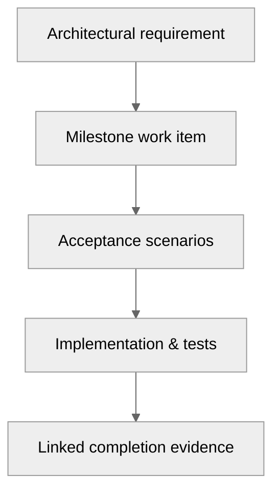

# Evidence-Backed Specification-Driven Development

<!-- generated-toc:start -->
## Table of contents

- [Purpose](#contents-section-1)
- [Core principle](#contents-section-2)
- [Development loop](#contents-section-3)
- [Canonical document roles](#contents-section-4)
- [When a slice is ready](#contents-section-5)
- [Reusable completion gate](#contents-section-6)
- [Proportional verification](#contents-section-7)
- [Example: P1.3 transitive import loading](#contents-section-8)
- [Reusable slice template](#contents-section-12)
- [Process guardrails](#contents-section-13)
<!-- generated-toc:end -->

<a id="contents-section-1"></a>
## Purpose

This guide defines the project’s lightweight approach to specification-driven development. It
preserves architectural discipline without requiring a complete design for every future capability
before implementation can proceed.

The approach is called **evidence-backed specification-driven development**: specify one observable
slice, implement it vertically, prove it with executable evidence, and update only the canonical
documentation affected by the result.

<a id="contents-section-2"></a>
## Core principle


```mermaid
%%{init: {'theme':'neutral'}}%%
flowchart TD
    Req["Architectural requirement"] --> Item["Milestone work item"]
    Item --> Scenarios["Acceptance scenarios"]
    Scenarios --> Tests["Implementation & tests"]
    Tests --> Evidence["Linked completion evidence"]
```

A specification states intent and observable behavior. Tests, benchmarks, generated artifacts, and
validated documentation establish whether the intent has actually been achieved.

The process is deliberately not “specify the entire product first.” Future material may remain
`UNREVIEWED`; only the decisions and requirements needed by the next slice must be ready.

<a id="contents-section-3"></a>
## Development loop

1. Select one requirement or milestone work item.
2. Write a short slice specification containing observable behavior, non-goals, constraints,
   acceptance scenarios, affected modules, and open decisions.
3. Mark the slice `ready` only when implementation can proceed without a major unresolved design
   choice.
4. Implement the smallest end-to-end behavior that produces useful evidence.
5. Add positive, negative, and deterministic tests proportional to the slice’s risk.
6. Run focused verification first, then downstream or full-reactor checks where required.
7. Link the evidence from the development plan and update only canonical status documents.
8. Create an ADR only when the slice makes a durable architectural decision.

<a id="contents-section-4"></a>
## Canonical document roles

| Artifact | Role |
| --- | --- |
| [Architecture specification](../architecture/architecture-spec.md) | Enduring requirements, boundaries, and intended system structure |
| [ADRs](../architecture/adr/generall-adr.md) | Significant decisions, alternatives, rationale, and consequences |
| [Roadmap](../roadmap.md) | Milestone sequencing, acceptance criteria, state, and evidence |
| [Module TODOs](../todos/index.md) | Current module-local gaps, not completion history |
| [Slice specification](slices/index.md) | Temporary implementation contract for one bounded increment |
| Tests and benchmarks | Executable behavioral and quality evidence |
| Assessments | Dated snapshots; not active work queues |

Avoid duplicating the same requirement across several narrative documents. Link to the authoritative
source and add detail only where the document has a distinct responsibility.

<a id="contents-section-5"></a>
## When a slice is ready

A slice may move to `ready` when:

- its observable outcome and non-goals are explicit;
- acceptance scenarios cover the primary success and failure behavior;
- affected architectural requirements and modules are known;
- no unresolved choice would materially change public contracts or module boundaries;
- required fixtures and test boundaries are identifiable;
- any necessary ADR is accepted, or the slice intentionally avoids that decision.

Implementation details that can be changed locally do not need to be decided before work begins.

<a id="contents-section-6"></a>
## Reusable completion gate

A normal slice is complete when all applicable items are satisfied:

- [ ] Acceptance scenarios are implemented as executable tests.
- [ ] Positive, negative, and boundary behavior is covered.
- [ ] Deterministic ordering or output is tested where relevant.
- [ ] Focused module tests pass.
- [ ] Affected downstream modules pass when a shared contract changed.
- [ ] The complete reactor passes when dependencies, POMs, schemas, or public shared contracts changed.
- [ ] Strict documentation and internal-link validation pass for documentation changes.
- [ ] Public contracts and compatibility implications are documented.
- [ ] The development-plan item links to completion evidence and has the correct state.
- [ ] Completed module TODO entries are removed; historical context remains in Git and assessments.
- [ ] No unrelated files or generated artifacts are included.

<a id="contents-section-7"></a>
## Proportional verification

| Change | Minimum verification |
| --- | --- |
| Local implementation detail | Focused module tests |
| Shared Java/protobuf contract | Owning module and affected downstream modules |
| Module dependency or parent POM | Complete Maven reactor |
| Documentation only | TOC/link validation, `git diff --check`, strict MkDocs build |
| Runtime semantics | Focused conformance cases and shared corpus parity |
| Generator behavior | Deterministic output, generated-source compilation, interpreter parity |
| Security/resource limit | Positive behavior, rejection boundary, and adversarial test |
| Performance claim | Reproducible JMH benchmark plus retained semantic parity |

Verification should be strong enough to detect the likely failure modes of the change, without
running every expensive check for an isolated low-risk edit.

<a id="contents-section-8"></a>
## Example: P1.3 transitive import loading

This example applies the process to development-plan item P1.3: load transitive imports with
deterministic ordering and caching. Its specification, delivery sequence, acceptance scenarios,
and completion evidence now live in the standalone
[P1.3 transitive-import slice](slices/P1.3-load-transitive-imports.md).

See the [development slice catalog](slices/index.md) for subsequent examples that apply the same
process to import diagnostics and shared compiler diagnostic context.

<a id="contents-section-12"></a>
## Reusable slice template

Copy the following template into the development-plan work item, an issue, or a temporary design
note. A separate document is unnecessary for a small slice when the plan entry remains readable.
For serialized examples, see [P1.3](slices/P1.3-load-transitive-imports.md),
[P1.4](slices/P1.4-diagnose-invalid-import-structures.md), and
[P1.5](slices/P1.5-add-shared-diagnostic-context.md).

```markdown
# <Slice ID> — <Outcome-oriented title>

Status: proposed | ready | in progress | blocked | done
Owner: <person or team, if useful>
Requirements: <AR IDs and links>
Milestone: <plan item>
## Outcome
<One paragraph describing the externally observable result.>

## In scope
- <behavior or contract included in this slice>
- <behavior or contract included in this slice>

## Non-goals

- <explicitly deferred behavior>
- <adjacent concern owned by another slice>

## Architectural constraints
- <module/dependency rule>
- <determinism, immutability, compatibility, security, or runtime rule>

## Affected modules and contracts

| Module/contract | Expected change |
| --- | --- |
| `<module>` | <change> |

## Acceptance scenarios

1. Given <context>, when <action>, then <observable result>.
2. Given <invalid/boundary context>, when <action>, then <diagnostic/failure>.
3. Repeated or reordered execution produces <deterministic result>.

## Open decisions

- <decision required before ready, or “None”>

## Verification plan

- Focused: `<command or test class>`
- Downstream: `<affected modules or “not required”>`
- Full reactor: required | not required — <reason>
- Documentation: `<checks>`
## Completion evidence
- Tests: <links/names>
- Documentation/API: <links>
- ADR: <link or not required>
- Benchmark/artifact: <link or not applicable>

## Result

<Fill when done: implementation summary, deviations, and follow-up items.>
```

<a id="contents-section-13"></a>
## Process guardrails

### Spark SQL continuation handover — 2026-10-04 continuation

Active check-in repair continuation: 439-case affected-suite TCK verified at **439 total; 439 passed (100.00%); 232 native; 195 fallback; 12 provisional expected rejections; 0 failed; 0 errors**. Scoped generator tests in `dmn-generator-sparksql`: **30 passed, 0 failures, 0 errors, 0 skips**; Spotless formatted cleanly. Enforced declared BKM and invocation return types via `declaredBkmReturnType`, parameter/body conformance in `inlineBkm`, and invocation typeRef checking in `emitInvocation`. This resolved both `0082#decision_bkm_004_a` and `0082#invoke_002` (suite `0082-feel-coercion` is now 36/36 passed, 14 native, 12 fallback, 10 expected rejections, 0 failures/errors). Next: run the full optimized hybrid Spark SQL TCK (3,391 cases) with 4 GB heap and history limits 20/20/40. Preserve all edits/deletions. Prior metrics below are historical.

Prior affected-suite rerun: **439 total; 437 passed; 228 native; 197 fallback; 12 provisional expected rejections; 2 failed; 0 errors**. Remaining blockers were `0082#decision_bkm_004_a` and `0082#invoke_002` (BKM declared return-type enforcement), now completely resolved above.

Check-in preparation usage stop: **18% five-hour / 67% weekly remaining** triggered the user-required implementation stop. Working-tree changes are preserved; **not ready for a clean conformance check-in**. Latest focused TCK filter `0057,0069,0070,0074,0081,0082,0085,0094,0095,0096,0097,0098,1148,1149,1156`: **439 total, 432 passed (98.41%), 226 native, 194 fallback, 12 provisional expected rejections, 6 failed, 1 error**. Evidence: `dmn-tck-runner/target/checkin-structural-tck.log` and `checkin-structural-accounting.json`. Focused generator build/install and 30 tests passed (0 failures/errors/skips), scoped Spotless ran successfully; evidence: `dmn-generator-sparksql/target/checkin-structural-focused.log`. Native fixes cover temporal try-casts, now/today arity, product scalar/null/arity handling, strict named product arguments, non-string range parsing, missing context fields, BKM known-kind checking/singleton coercion and call arity. Added recursive compile-time structural instance checks fixed five prior mismatches but **introduced context_019 regression**: resolve this first by validating the static structural inference against actual FEEL matching rules; do not claim zero regression. Remaining cases: `0070#context_019`, `0074#range_011` (equality unary range end emitted null), `0081#decision_002` (get entries passes struct to map_entries), `0082#decision_bkm_002`, `0082#decision_bkm_004_a`, `0082#invoke_002` (composite parameter validation/coercion), and `0082#decision_context_02` (declared context conversion drops a field). Full TCK has **not** been rerun after these changes because focused prerequisites remain failing. The preceding full metrics below are historical. Next safe action: repair context_019, implement the remaining semantic fixes, rerun this exact 439-case filter and focused generator checks, then complete full optimized Spark SQL hybrid TCK with 4 GB heap and 20/20/40 history limits before check-in. Recheck usage before resuming. No reset, clean, commit or push was performed.

Latest verified interval-native checkpoint: full optimized hybrid Spark SQL TCK **3,391 total; 3,357 passed (99.00%); 1,363 native (50.20% of 2,715 executable); 1,318 fallback (48.55% executable); 18 failed; 16 errors; 676 provisional expected rejections; 0 compilation errors**. Compared with the preceding full run: **+12 native, -12 fallback**, with total passes/failures/errors/rejections unchanged. All 14 interval relation TCK cases now pass natively (0 fallback/failures/errors/rejections), following endpoint/boundary SQL implementations for containment, meeting, starts/finishes, coincidence and overlaps. Focused generator tests: 30 passed, 0 failures/errors/skips. The interval fallback routing has been removed. Evidence: `dmn-generator-sparksql/target/interval-overlap-focused.log`; `dmn-tck-runner/target/interval-overlap-tck.log`, `interval-native-full.log`, `interval-native-full-accounting.json`, `interval-native-full-rejections.tsv`, and `interval-native-full-gc.log`. Maven exited 1 for the existing 34 residual conformance defects; native coverage remains below the goal. Documentation facts validation and diff whitespace check passed. Next bounded native promotion: implement correct median/mode/stddev list semantics and null/type validation to replace their temporary fallback, verify the corresponding TCK suites, and measure the full delta. Rejection audit remains outstanding. Preserve all edits/deletions. This supersedes earlier checkpoint metrics and statements that interval relations remain fallback below.

Latest native implementation checkpoint: **3,391 total; 3,357 passed (99.00%); 1,351 native (49.76% of 2,715 executable); 1,330 fallback (48.99% executable); 18 failed; 16 errors; 676 provisional expected rejections; 0 compilation errors**. Maven exited 1 for the residual conformance defects. Compared with the preceding string-join full run: +31 passed, +19 native, +12 fallback, -16 failed, -15 errors; rejections unchanged. Native number conversion now validates separators, null handling, arity and named arguments; native all/any support scalar booleans and reject invalid arity/names/varargs; native before/after compare range endpoints with open/closed boundary semantics. The other 12 interval relations temporarily use explained fallback and should be converted to endpoint SQL next, not treated as permanent exceptions. Focused generator tests: 30 passed, 0 failures/errors/skips; targeted TCK 0058,0059,0060,1130: 71/71 passed, 52 native, 19 fallback, 0 failures/errors/rejections. Evidence: `dmn-generator-sparksql/target/interval-boolean-native-focused.log`; `dmn-tck-runner/target/interval-boolean-native-tck.log`, `interval-boolean-full.log`, `interval-boolean-full-accounting.json`, and `interval-boolean-full-rejections.tsv`. Remaining 34 non-passing cases include coercion (6), instance-of (5), product (5), decision services (3), temporal functions (10), and five singleton groups. Prioritize native implementations and fallback conversions per the user's latest clarification. The rejection audit remains outstanding, and the native milestone remains unmet. Preserve all edits/deletions. This supersedes earlier checkpoint metrics below.

Latest 2026-10-04 checkpoint: full optimized Spark SQL hybrid TCK **3,391 total; 3,326 passed (98.08%); 1,332 native (49.06% of 2,715 executable); 1,318 fallback (48.55% executable); 34 failed; 31 errors; 676 provisional expected rejections; 0 compilation errors**. Maven exited 1 for remaining conformance failures. Compared with the 3,229-pass full run: +97 passed, -18 native, +115 fallback, -26 failed, -71 errors; rejections unchanged. Context/statistical functions now route to fallback with explicit implementation-limit reasons; native string join validates arity/names/types, handles null delimiter as empty, and coerces a string to a singleton list. Focused generator tests: 30 passed, 0 failures/errors/skips. Targeted context/statistical/matches TCK: 141/141 passed with fallback. String-join TCK: 22/22 passed, 18 native, 4 fallback, 0 failures/errors/rejections. Evidence in `dmn-tck-runner/target`: `conformance-routing-tck.log`, `conformance-routing-full-accounting.json`, `string-join-tck.log`, `string-join-full.log`, `string-join-full-accounting.json`, and `string-join-full-rejections.tsv`. Generator evidence: `dmn-generator-sparksql/target/string-join-focused.log`. Documentation facts validation passed for 12 modules; source whitespace check passed. Earlier strict MkDocs warnings remain unresolved. Next: investigate the remaining 65 non-passing cases, starting with interval handling (14), then number conversion and boolean aggregates; audit the 676 rejection diagnostics before changing the denominator. Native fallback promotion and rejection correctness remain outstanding. Preserve all edits/deletions. This supersedes earlier checkpoint metrics below.

Subsequent user authorization requested a full TCK run only. It completed all 3,391 cases: 3,229 passed, 1,350 native, 1,203 fallback, 60 failed, 102 errors, 676 expected rejections, 0 compilation errors. Maven exit 1 reflects remaining conformance failures. Native/executable coverage is 49.72%; fallback/executable is 44.31%. Versus the baseline: +40 native, +12 fallback, -52 failures; errors and rejections unchanged. Preserved evidence: `dmn-tck-runner/target/native-coverage-rounding-full.log`, `native-coverage-rounding-full-accounting.json`, and `native-coverage-rounding-full-rejections.tsv` (676 diagnostic rows).

Latest verification update (2026-10-04 handover):
- Scoped Spotless formatting verified across `dmn-generator-sparksql` and `dmn-tck-runner` (`BUILD SUCCESS`).
- Focused generator tests in `dmn-generator-sparksql` passed: **30 tests run, 0 failures, 0 errors, 0 skipped**.
- Re-ran the targeted 105-case TCK filter (`0035,0056,1100,1141,1142,1143,1144`) against the installed extreme-scale rounding fallback guard (> 308 scale):
  **Total tests: 105; Passed: 105 (100.00%); Native: 88 (83.81%); Fallback: 17 (16.19%); Failed: 0; Errors: 0; Expected rejections: 0**.
  This completely eliminated the prior 8 failures and 3 errors in that suite, restoring 100% conformance for decimal and rounding operations.
- Root cause diagnosis of remaining 162 non-passing cases across the suite:
  - `1111-feel-matches-function` (21 failures/errors): FEEL/XQuery regex flags (`(?p)`, `(? )`, `(?X)`) and syntax crash Spark's Java `Pattern.compile` with `PatternSyntaxException`. Verified fix: adding `"matches"` to `NON_NATIVE_FUNCTIONS` in `SparkSqlCapabilityAnalyzer` restored 100% conformance on filter `1111` (**40 total, 40 passed, 0 native, 40 fallback, 0 failures, 0 errors**).
  - `1146-feel-context-put-function` (16 errors), `1147-feel-context-merge-function` (9 errors), `1145-feel-context-function` (14 errors): Attempted native `map_concat` / `map_from_entries` on Spark `named_struct`, causing Catalyst `DATATYPE_MISMATCH.MAP_CONCAT_DIFF_TYPES` and `UNEXPECTED_INPUT_TYPE`.
  - `1130-feel-interval` (14 errors): Direct comparisons (`<`, `>`) between scalars and interval structs (`named_struct('start', ..., 'end', ...)`), causing Catalyst `DATATYPE_MISMATCH.BINARY_OP_DIFF_TYPES`, plus unsupported routines like `coincides`.
  - `0061-feel-median-function` (11 failures/errors), `0062-feel-mode-function` (11 failures/errors), `0063-feel-stddev-function` (7 errors): `mode` returns a list in FEEL but SQL emitted scalar `element_at(..., 1)`; `median` on even-length lists returns average of two elements but SQL emitted single element; untyped `NULL` inputs cause Catalyst `UNEXPECTED_INPUT_TYPE` on `array_sort(NULL, ...)`.
- Working tree state: Preserved all changes. `SparkSqlCapabilityAnalyzer` has `"matches"` in `NON_NATIVE_FUNCTIONS`.
- Next safe action: Route the remaining verified non-native constructs (`context put/merge/get entries`, `median`, `mode`, `stddev`, range binary comparisons) to conformant hybrid fallback or implement safe null-guarded native versions to reach 0 failures and 0 errors across the full reactor, then run the full 3,391-case suite with 4 GB heap and 20/20/40 Spark history limits.

- Prefer a thin vertical slice over completing one layer exhaustively without integration evidence.
- Do not review every future proposal before implementing the next ready milestone.
- Do not create an ADR for a local reversible implementation choice.
- Do not mark a slice done because code exists; require linked acceptance evidence.
- Do not use an assessment as a TODO list.
- Do not let a context/options object become a mutable service locator.
- Automate recurring integrity checks instead of repeating manual documentation audits.
- Revisit the process when it adds delay without finding defects or when escaped defects reveal a
  missing gate.
