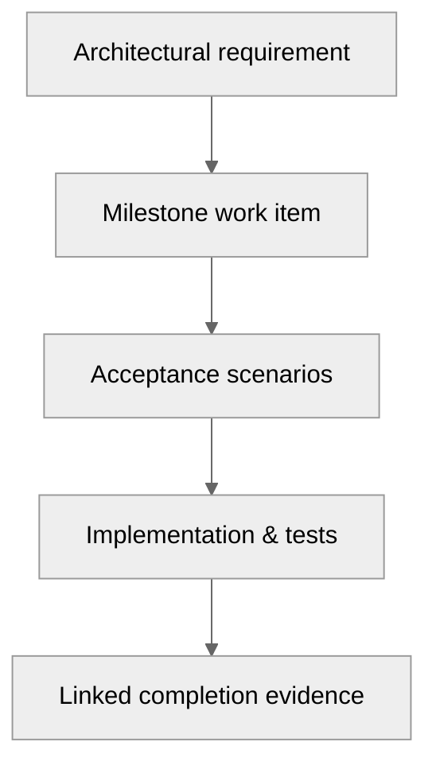

# Evidence-Backed Specification-Driven Development

<!-- generated-toc:start -->
## Table of contents

- [Purpose](#contents-section-1)
- [Core principle](#contents-section-2)
- [Development loop](#contents-section-3)
- [Canonical document roles](#contents-section-4)
- [When a slice is ready](#contents-section-5)
- [Reusable completion gate](#contents-section-6)
- [Proportional verification](#contents-section-7)
- [Example: P1.3 transitive import loading](#contents-section-8)
- [Reusable slice template](#contents-section-12)
- [Process guardrails](#contents-section-13)
<!-- generated-toc:end -->

<a id="contents-section-1"></a>
## Purpose

This guide defines the project’s lightweight approach to specification-driven development. It
preserves architectural discipline without requiring a complete design for every future capability
before implementation can proceed.

The approach is called **evidence-backed specification-driven development**: specify one observable
slice, implement it vertically, prove it with executable evidence, and update only the canonical
documentation affected by the result.

<a id="contents-section-2"></a>
## Core principle


```mermaid
%%{init: {'theme':'neutral'}}%%
flowchart TD
    Req["Architectural requirement"] --> Item["Milestone work item"]
    Item --> Scenarios["Acceptance scenarios"]
    Scenarios --> Tests["Implementation & tests"]
    Tests --> Evidence["Linked completion evidence"]
```

A specification states intent and observable behavior. Tests, benchmarks, generated artifacts, and
validated documentation establish whether the intent has actually been achieved.

The process is deliberately not “specify the entire product first.” Future material may remain
`UNREVIEWED`; only the decisions and requirements needed by the next slice must be ready.

<a id="contents-section-3"></a>
## Development loop

1. Select one requirement or milestone work item.
2. Write a short slice specification containing observable behavior, non-goals, constraints,
   acceptance scenarios, affected modules, and open decisions.
3. Mark the slice `ready` only when implementation can proceed without a major unresolved design
   choice.
4. Implement the smallest end-to-end behavior that produces useful evidence.
5. Add positive, negative, and deterministic tests proportional to the slice’s risk.
6. Run focused verification first, then downstream or full-reactor checks where required.
7. Link the evidence from the development plan and update only canonical status documents.
8. Create an ADR only when the slice makes a durable architectural decision.

<a id="contents-section-4"></a>
## Canonical document roles

| Artifact | Role |
| --- | --- |
| [Architecture specification](../architecture/architecture-spec.md) | Enduring requirements, boundaries, and intended system structure |
| [ADRs](../architecture/adr/generall-adr.md) | Significant decisions, alternatives, rationale, and consequences |
| [Roadmap](../roadmap.md) | Milestone sequencing, acceptance criteria, state, and evidence |
| [Module TODOs](../todos/index.md) | Current module-local gaps, not completion history |
| [Slice specification](slices/index.md) | Temporary implementation contract for one bounded increment |
| Tests and benchmarks | Executable behavioral and quality evidence |
| Assessments | Dated snapshots; not active work queues |

Avoid duplicating the same requirement across several narrative documents. Link to the authoritative
source and add detail only where the document has a distinct responsibility.

<a id="contents-section-5"></a>
## When a slice is ready

A slice may move to `ready` when:

- its observable outcome and non-goals are explicit;
- acceptance scenarios cover the primary success and failure behavior;
- affected architectural requirements and modules are known;
- no unresolved choice would materially change public contracts or module boundaries;
- required fixtures and test boundaries are identifiable;
- any necessary ADR is accepted, or the slice intentionally avoids that decision.

Implementation details that can be changed locally do not need to be decided before work begins.

<a id="contents-section-6"></a>
## Reusable completion gate

A normal slice is complete when all applicable items are satisfied:

- [ ] Acceptance scenarios are implemented as executable tests.
- [ ] Positive, negative, and boundary behavior is covered.
- [ ] Deterministic ordering or output is tested where relevant.
- [ ] Focused module tests pass.
- [ ] Affected downstream modules pass when a shared contract changed.
- [ ] The complete reactor passes when dependencies, POMs, schemas, or public shared contracts changed.
- [ ] Strict documentation and internal-link validation pass for documentation changes.
- [ ] Public contracts and compatibility implications are documented.
- [ ] The development-plan item links to completion evidence and has the correct state.
- [ ] Completed module TODO entries are removed; historical context remains in Git and assessments.
- [ ] No unrelated files or generated artifacts are included.

<a id="contents-section-7"></a>
## Proportional verification

| Change | Minimum verification |
| --- | --- |
| Local implementation detail | Focused module tests |
| Shared Java/protobuf contract | Owning module and affected downstream modules |
| Module dependency or parent POM | Complete Maven reactor |
| Documentation only | TOC/link validation, `git diff --check`, strict MkDocs build |
| Runtime semantics | Focused conformance cases and shared corpus parity |
| Generator behavior | Deterministic output, generated-source compilation, interpreter parity |
| Security/resource limit | Positive behavior, rejection boundary, and adversarial test |
| Performance claim | Reproducible JMH benchmark plus retained semantic parity |

Verification should be strong enough to detect the likely failure modes of the change, without
running every expensive check for an isolated low-risk edit.

<a id="contents-section-8"></a>
## Example: P1.3 transitive import loading

This example applies the process to development-plan item P1.3: load transitive imports with
deterministic ordering and caching. Its specification, delivery sequence, acceptance scenarios,
and completion evidence live in the historical P1.3 transitive-import slice record.

See the [development slice catalog](slices/index.md) for subsequent examples that apply the same
process to import diagnostics and shared compiler diagnostic context.

<a id="contents-section-12"></a>
## Reusable slice template

Copy the following template into the development-plan work item, an issue, or a temporary design
note. A separate document is unnecessary for a small slice when the plan entry remains readable.
For serialized examples, see the [development slice catalog](slices/index.md).

```markdown
# <Slice ID> — <Outcome-oriented title>

Status: proposed | ready | in progress | blocked | done
Owner: <person or team, if useful>
Requirements: <AR IDs and links>
Milestone: <plan item>
## Outcome
<One paragraph describing the externally observable result.>

## In scope
- <behavior or contract included in this slice>
- <behavior or contract included in this slice>

## Non-goals

- <explicitly deferred behavior>
- <adjacent concern owned by another slice>

## Architectural constraints
- <module/dependency rule>
- <determinism, immutability, compatibility, security, or runtime rule>

## Affected modules and contracts

| Module/contract | Expected change |
| --- | --- |
| `<module>` | <change> |

## Acceptance scenarios

1. Given <context>, when <action>, then <observable result>.
2. Given <invalid/boundary context>, when <action>, then <diagnostic/failure>.
3. Repeated or reordered execution produces <deterministic result>.

## Open decisions

- <decision required before ready, or “None”>

## Verification plan

- Focused: `<command or test class>`
- Downstream: `<affected modules or “not required”>`
- Full reactor: required | not required — <reason>
- Documentation: `<checks>`
## Completion evidence
- Tests: <links/names>
- Documentation/API: <links>
- ADR: <link or not required>
- Benchmark/artifact: <link or not applicable>

## Result

<Fill when done: implementation summary, deviations, and follow-up items.>
```

<a id="contents-section-13"></a>
## Process guardrails

### Spark SQL continuation handover — 2026-10-04 continuation

2026-10-09 temporal/context native checkpoint: **3,391/3,391 full TCK passes (100.00%); 2,324 native (85.60% of 2,715 executable), 391 fallback (14.40%), 676 provisional expected model rejections separately; zero failures/execution errors/compilation errors; Maven exit 0**. Total-suite rates, separately: native 68.53%, fallback 11.53%. Compared with pushed commit **396def3** (2,230 native/485 fallback): **+94 native/-94 fallback/+3.46 percentage points**. The 95% milestone still requires **256 additional native passes**. All current source/test/documentation changes remain uncommitted. Documentation validation completed: tools/verify_documentation.py verified 12 reactor modules; strict MkDocs build exited 0 (native-calendar-context-docs.log); git diff --check passed. Implementation stopped under the below-20% usage rule; latest remaining usage is **8% five-hour / 48% weekly**. This checkpoint supersedes earlier totals and in-progress notes below. Preserve the working tree; no commit/push/reset/clean performed in this continuation.

Final generator build/install: **56 tests passed, zero failures/errors/skips**, in `dmn-generator-sparksql/target/native-calendar-context-final-generator.log`. Final affected official selection (1115/1116/1117/1121/1146): **289/289 passed, 269 native, 20 fallback, zero failures/errors/rejections**, Maven exit 0; breakdown: date 49/52 native, time 83/83, date-time 88/88, years/months duration 25/36, context put 24/30. Full verification used the unchanged 4 GB heap, Spark history 20/20/40, localhost and case timeouts. Evidence preserved in `dmn-tck-runner/target/native-calendar-context-final-tck.log`, `native-calendar-context-focused-accounting.json`, `native-calendar-context-full.log`, `native-calendar-context-full-accounting.json` and `native-calendar-context-full-rejections.tsv`. The earlier complete `native-temporal-text-full` checkpoint passed 3,391 cases with 2,286 native/429 fallback; the final checkpoint adds another 38 native passes. Final promotion groups versus 396def3: date +4, time +29, date-time +30, years/months duration +7, context put +24.

Next safe action: select a bounded measured fallback group, inspect the actual IR/runtime contract, implement native SQL with semantic regressions, then focused and full TCK accounting before reporting a new delta. Candidates: arithmetic 28, properties 23, list replace 19, for loops 19, list operations 19, external Java 18, context function 18, lambda 17, context merge 14, instance-of 13, coercion 12, years/months duration 11. Rejection classification remains outstanding: the 676-case expectation audit verifies expected-error markers but does not prove every compiler rejection is semantically correct. Keep the denominator provisional until classification evidence supports a change. Remaining fallbacks are implementation/verification gaps, not demonstrated Spark impossibilities. Detailed implementation, guards, failed probes and continuation actions follow in TCK_SPARKSQL_STATUS.md.

2026-10-09 verified native expansion checkpoint: **3,391/3,391 full TCK passes; 2,230 native (82.14% of 2,715 executable), 485 fallback (17.86%), 676 provisional expected rejections separately; zero failures/execution errors/compilation errors; Maven exit 0**. Delta versus pushed commit 8db898d baseline: **+148 native/-148 fallback/+5.45 percentage points**. The 95% milestone still needs **350 additional native passes**. Sources and tests are uncommitted; documentation fact verification, strict MkDocs build and diff whitespace checks passed. Usage remaining at handover: 15% five-hour/63% weekly. The detailed implementation, test evidence, rejection-expectation audit and next actions are recorded in TCK_SPARKSQL_STATUS.md under the 2026-10-09 checkpoint; this record supersedes older continuation notes below. Preserve the working tree. Next: measured remaining temporal constructors (30 date-time, 29 time), context put (30), arithmetic (28) and properties (23); select a precision-preserving representation or static validation path, verify focused cases first, then full accounting. Do not treat remaining fallbacks as proven Spark impossibilities. Complete the rejection classification audit before changing the denominator.

2026-10-08 4%-remaining handover after explicit usage-rule override: commit 8db898d is already pushed; the new continuation is uncommitted. Current changes: literal numeric membership comparisons fold exactly with BigDecimal into SQL boolean predicates, avoiding Spark's common-decimal precision truncation; null candidates propagate null consistently. Added adversarial Spark execution tests for 38/39-digit numbers, 1E-50, unequal high-scale decimals, bare-null RHS and null lists, checked against the runtime contract. Year/month-duration arithmetic now has a bounded native SQL path for literal period addition/subtraction and multiplication/division by numeric literals: exact total-month inputs, runtime-compatible Double scaling, truncation to whole months, ISO result formatting, zero-divisor null and finite/period-range guards. Capability promotion is limited to validated duration decision results; dynamic numeric inputs and unsupported duration arithmetic retain existing guards. Generator build/install succeeded; 41 generator tests passed (10 hybrid unit, nine DMN integration, 22 hybrid integration), zero failures/errors/skips. Evidence: native-membership-boundary-focused.log and native-month-arithmetic-focused.log. Documentation fact checks and diff whitespace checks passed. No post-change official focused or full TCK run has started; do not claim a native-coverage delta for these changes. Last verified full remains native-membership-full: 3,391 passed, 2,082 native (76.69% of 2,715 executable), 633 fallback, 676 provisional expected rejections separately, zero failures/execution errors/compilation errors. Usage at requested handover threshold: 4% five-hour/77% weekly remaining. Next safe action: run OfficialTckSuiteTest with optimized Spark SQL hybrid, tck.requireFull=false and tck.filter=0100,0072; inspect native arithmetic promotion and all null cases, fix any conformance differences, then run the complete 3,391-case suite with 4 GB heap, Spark history 20/20/40, localhost and unchanged timeouts. Preserve accounting/rejection snapshots before another TCK run. Use C:/10-tools/apache-maven-3.9.12/bin/mvn.cmd and C:/Users/lik/.m2/repository, SPARK_LOCAL_HOSTNAME=localhost. Update measured native/fallback counts only after that full checkpoint. The rejection audit remains outstanding. Preserve these sources; no new commit/push/reset/clean in this continuation.

2026-10-08 post-push continuation check: commit 8db898d07ef848bc51847d32b743145647c2c8c5 is pushed to origin/feature/graduate-incubating-modules; the working tree was clean at this check. Latest verified full TCK remains 3,391/3,391 passed, 2,082 native (76.69% executable), 633 fallback, 676 provisional expected rejections separately, zero failures/execution errors/compilation errors. Usage remaining is 15% five-hour/79% weekly. No new implementation or tests started under the below-20% rule; user clarification to override that rule is pending. Next safe action: membership adversarial decimal and bare-null checks recorded below, then measured native duration arithmetic (113 arithmetic fallbacks).

2026-10-08 native membership checkpoint: latest full optimized hybrid Spark SQL TCK **3,391/3,391 passed (100.00%); 2,082 native (76.69% of 2,715 executable); 633 fallback (23.31% executable); 676 provisional expected model rejections separately; 0 failures/execution errors/compilation errors; Maven exit 0**. Delta versus the preceding calendar checkpoint: **+91 native/-91 fallback/+3.35 percentage points**. Today's total delta versus native-time-result-full: **+173 native/-173 fallback/+6.37 percentage points**. Official membership selection **0072: 327/327 passed, 325 native, two fallback, zero failures/errors/rejections**; its previous 93 fallbacks are reduced to two context-equality cases (context_001, context_001_a). Literal duration membership compares year/month durations as exact total months and day/time durations as DECIMAL(38,9) seconds, preserving nanoseconds, negative values and extreme durations. Mixed scalar lists emit type-aware SQL predicates instead of coercing every item to one Spark array type. Range endpoints retain open/closed behavior; null candidates or explicit null endpoints yield null for intervals, while null remains an ordinary item in literal lists. Dynamic STRING/BOOLEAN operands are supported; dynamic NUMBER operands remain outside this new promotion path because their Double transport requires a separate FEEL decimal precision solution. Unsupported nested lists and context comparisons retain fallback, and a shared list used as a decision result still receives normal capability inspection. **21 hybrid integration tests passed**, then the two affected membership integration tests passed after null propagation fixes. The first official membership attempt had five null-interval failures; all five passed in the corrected 327-case run and subsequent full suite. Evidence: generator `target/native-membership-focused.log`, `native-membership-null-focused.log`; runner `target/native-membership-tck.log`, `native-membership-first-accounting.json` (failed attempt), `native-membership-final-tck.log`, `native-membership-final-accounting.json`, `native-membership-full.log`, `native-membership-full-accounting.json`, `native-membership-full-rejections.tsv`. Full run used 4 GB heap, Spark history 20/20/40, localhost and unchanged timeouts. **Next safe action before check-in:** add adversarial decimal membership tests near Spark's 38-digit boundary, including comparisons whose common decimal type exceeds 38 digits, and tighten eligibility if required; also verify bare-null right-hand operands separately from lists and ranges. The full TCK proves the recorded inventory, not all such boundary inputs. Then address native duration arithmetic (113 arithmetic fallbacks), context structural equality and the six known-null/arity year/month-duration cases in measured batches; run focused tests first and one full TCK per checkpoint. Remaining fallbacks are implementation/verification gaps unless separately proved platform limits. The audit of all 676 provisional expected rejections is outstanding; do not change the executable denominator without verified classification. The 95% milestone needs **498 additional native passes**. Latest usage: **18% five-hour/79% weekly remaining**. Implementation stopped under the below-20% task rule after the successful full checkpoint; documentation facts, strict MkDocs build and diff whitespace checks passed. Preserve all uncommitted changes; no commit/push/reset/clean in this continuation. This checkpoint supersedes earlier metrics below.

2026-10-08 native duration/calendar checkpoint: latest full optimized hybrid Spark SQL TCK **3,391/3,391 passed (100.00%); 1,991 native (73.33% of 2,715 executable); 724 fallback (26.67% executable); 676 provisional expected rejections separately; 0 failures/execution errors/compilation errors; Maven exit 0**. Today's total delta from native-time-result-full: **+82 native/-82 fallback/+3.02 percentage points**. First verified full checkpoint native-constant-duration-full: **1,976 native/739 fallback**, +67 (38 duration constructors, 26 folded-null date cases, three year/month-duration cases). Validated constant duration results use exact ISO text and declared-type decoding, preserving nanoseconds, negative values and extreme ranges; global duration inputs and dynamic arithmetic remain lossless fallback. Folded null results of other declared types no longer require binary transport. Latest calendar slice adds **15 native year/month-duration cases** (+0.55 percentage points versus that checkpoint): SQL computes whole calendar months with the Period.between day-of-month adjustment, formats an ISO period, ignores time-of-day appropriately, and validates/reorders named from/to arguments. Bounded local DATE/DATE_TIME operands are supported, including mixed DATE/DATE_TIME for this function only; general mixed temporal comparisons retain their guard. **38 generator tests passed before the final mixed-operand extension; all 19 hybrid integration tests passed after it**, covering month ends, leap years, negative direction, named argument order and mixed local operands. Official 1121 selection: **36/36 passed; 18 native, 18 fallback; 0 failures/errors/rejections**. Remaining 18: six null/arity cases (002–007), three historical cases (017–019), five zoned cases (020–024), two fractional cases (025–026), two invalid constructor/list cases (027,030). These are implementation/verification gaps, not proved native SQL impossibilities. First affected selection: **1,288/1,288 passed; 436 native, 215 fallback, 637 provisional rejections**; 37 generator tests passed at that checkpoint. Evidence: generator `target/native-constant-duration-focused.log`, `native-year-month-focused.log`, `native-year-month-mixed-focused.log`; runner `target/native-constant-duration-tck.log`, `native-constant-duration-full.log`, `native-constant-duration-full-accounting.json`, `native-constant-duration-full-rejections.tsv`, `native-year-month-final-tck.log`, `native-year-month-final-accounting.json`, `native-year-month-full.log`, `native-year-month-full-accounting.json`, `native-year-month-full-rejections.tsv`. Both full runs used 4 GB heap, Spark history 20/20/40, localhost and unchanged timeouts. Largest remaining fallback groups: arithmetic 113, membership 93, instance-of 35, date-time 30, context put 30, time 29, is() 25, for loops 24. **Next safe action:** handle the six known-null/arity year/month-duration calls without evaluating unused arguments; separately verify local-calendar projection for historical/zoned/fractional operands before broadening the bounds. Then address measured membership/dynamic-duration gaps with focused execution tests and full accounting. The rejection audit remains outstanding; investigate all 676 provisional cases separately and recompute denominators only from verified classifications. The 95% milestone still requires **589 additional native passes**. Latest usage: **49% five-hour/84% weekly remaining**. Preserve all uncommitted changes; no commit/push/reset/clean performed in this continuation. This checkpoint supersedes earlier metrics below.

2026-10-08 verified constant-duration checkpoint: **3,391/3,391 passed; 1,976 native (72.78% of 2,715 executable), 739 fallback (27.22%), 676 provisional expected rejections separately; 0 failures/execution errors/compilation errors; Maven exit 0**. Delta from native-time-result-full: **+67 native/-67 fallback** (38 duration constructors, 26 folded-null dates, three year/month-duration cases). Validated constant duration results use exact ISO text and declared-type decoding, preserving nanoseconds and extreme values; other folded null results no longer require lossless binary transport. Dynamic duration operations remain fallback. All 37 generator tests passed; focused TCK 1,288/1,288 passed (436 native, 215 fallback, 637 provisional rejections). Evidence: generator `target/native-constant-duration-focused.log`; runner `target/native-constant-duration-tck.log`, `native-constant-duration-focused-accounting.json`, `native-constant-duration-full.log`, `native-constant-duration-full-accounting.json`, `native-constant-duration-full-rejections.tsv`. Full run retained 4 GB heap, 20/20/40 history limits, localhost and unchanged timeouts. Next bounded slice: correct years-and-months-duration month-end SQL to match Period.between, then verify native bounded local date/date-time operands before promotion. Latest usage 75% five-hour/88% weekly remaining. No commit/push performed in this continuation; preserve the working tree. This supersedes earlier totals below.

2026-10-07 end-of-day native TIME/result-null checkpoint: full optimized hybrid Spark SQL TCK **3,391/3,391 passed (100.00%); 1,909 native (70.31% of 2,715 executable); 806 fallback (29.69% executable); 676 provisional expected rejections separately; 0 failures/execution errors/compilation errors; Maven exit 0**. Delta against native-matches-complete-full: **+83 native, -83 fallback, +3.06 percentage points** (48 time-constructor and 35 date-time-constructor cases). Local whole-second TIME results now use the existing 1970-01-01 anchored timestamp-without-timezone SQL representation; `SparkSqlFeelValueCodec.fromSpark(value, declaredType)` converts native TIME results to LocalTime and validates the anchor, while preserving binary offset-time fallback. The TCK runner decodes both decision and invocation results using their declared type. Native null/invalid-arity time calls skip unused arguments, and folded null TIME/DATE_TIME results no longer require binary transport. SQL execution regressions verify UTC/Europe/Zurich identity, no fallback UDFs, offset fallback preservation, invalid-anchor rejection, null arguments with unused duration offsets, and optimizer-folded nulls. **35 generator tests passed before the folded-null adjustment; all 16 hybrid integration tests passed after that final adjustment**. Final affected TCK selection 1116/1117: **171/171 passed; 112 native, 59 fallback; 0 failures/errors/rejections**; breakdown: time 54 native/29 fallback, date-time 58 native/30 fallback. Evidence: generator `target/native-time-result-focused-final.log`, `native-time-result-folded-null.log`; runner `target/native-time-result-folded-null-tck.log`, `native-time-result-folded-null-accounting.json`, `native-time-result-full.log`, `native-time-result-full-accounting.json`, `native-time-result-full-rejections.tsv`. Full execution retained 4 GB heap, Spark history 20/20/40, localhost, and unchanged timeouts. Failed exploratory probes are preserved: generator `target/native-time-probe.log` rejects TIME(9) with UNSUPPORTED_TIME_PRECISION (supported range 0–6); `native-time-microsecond-probe.log` reports UNSUPPORTED_TIME_TYPE because the internal spark.sql.timeType.enabled flag is off. The final implementation does not require this flag. These probes do not prove that nanosecond/zoned FEEL values cannot use other native SQL representations. Fractional/zoned time, temporal inputs, mixed temporal types and dynamic regex validation remain implementation/verification gaps; do not truncate precision or assume permanent exceptions. Largest fallback groups: arithmetic 113, membership 93, duration 38, years/months duration 36, instance-of 35, date 33, context put 30, date-time 30, time 29. **Next safe action:** inspect those measured groups; for temporal continuation, verify a precision-safe native representation and fractional-second properties before broadening the current whole-second guard, then run focused and full checks. Audit the 676 provisional rejections separately. The 95% milestone needs **671 additional native passes**. Usage last checked: **58% five-hour / 93% weekly remaining**. Stopped for today at the user's request after full TCK and handover updates; preserve all uncommitted source/test/documentation changes. No commit/push/reset/clean performed. This checkpoint supersedes prior metrics below.

2026-10-07 native matches completion checkpoint: full optimized hybrid Spark SQL TCK **3,391/3,391 passed (100.00%); 1,826 native (67.26% of 2,715 executable); 889 fallback (32.74% executable); 676 provisional expected rejections reported separately; 0 failures/execution errors/compilation errors; Maven exit 0**. Delta against native-matches-full: **+9 native, -9 fallback, +0.33 percentage points**. All **40/40 matches TCK cases now pass natively**, including six free-spacing x cases and three statically invalid list-argument cases. FEEL whitespace preprocessing preserves spaces in character classes and normalizes property escapes; statically invalid matches arguments emit typed SQL null. Scoped traversal prunes only unused invalid-call arguments, preserving fallback validation when the same list is used elsewhere. Generator tests: **33 passed, 0 failures/errors/skips**, including dynamic-row free-spacing and shared-list regressions. Evidence: `dmn-generator-sparksql/target/native-matches-complete-focused.log`; `dmn-tck-runner/target/native-matches-complete-tck.log`, `native-matches-complete-full.log`, `native-matches-complete-full-accounting.json`, `native-matches-complete-full-rejections.tsv`. Full run used 4 GB heap, Spark history limits 20/20/40, localhost, and unchanged case timeouts. Dynamic regex patterns/flags remain implementation gaps requiring native validation/null semantics. Next measured candidate: native TIME result transport; installed Spark 4.2 TimeType uses a LocalTime encoder and nanosecond storage, but SQL constructors/properties/comparisons still require execution verification before promotion. Temporal inputs, zoned values and other fallbacks remain implementation/verification gaps, not proved platform impossibilities. Audit the 676 provisional rejections separately. The 95% milestone requires **754 additional native passes**. Latest usage: **82% five-hour / 97% weekly remaining**. Preserve all uncommitted changes; no commit/push/reset/clean performed. This checkpoint supersedes earlier metrics below.


2026-10-06 native static-regex checkpoint and usage stop: full optimized hybrid Spark SQL TCK **3,391/3,391 passed (100.00%); 1,817 native (66.92% of 2,715 executable / 53.58% total); 898 fallback (33.08% executable / 26.48% total); 676 provisional expected rejections separately; 0 failures/execution errors/compilation errors; Maven exit 0**. Delta against native-local-temporal-full: **+32 native, -32 fallback, +1.18 percentage points** (31 cases from 1111-feel-matches-function and one from 0002-string-functions). Constant patterns and flags are validated at compile time using the runtime's FEEL regex rules; dynamic input rows execute Spark rlike with translated Unicode case flags, literal quoting, BasicLatin properties, and character-class subtraction. Invalid static flags/backreferences emit typed SQL null; null flags retain the runtime default; named arguments are validated. No Java fallback UDF executes for promoted matches. Generator tests: **32 passed, 0 failures/errors/skips**, including dynamic-row Unicode/quoting/subtraction/invalid-pattern execution checks. Focused matches TCK: **40/40 passed; 31 native, 9 fallback; 0 failures/errors/rejections**. Remaining nine: **six free-spacing x cases (K2-MatchesFunc-1 through -6)** and **three invalid untyped-list argument cases (K-MatchesFunc-1, -3, -4)**; these are implementation/routing gaps, not proven platform limitations. Dynamic patterns/flags also retain explicit fallback because their validation/null behavior is not yet implemented natively. Evidence: `dmn-generator-sparksql/target/native-matches-focused.log`; `dmn-tck-runner/target/native-matches-tck.log`, `native-matches-full.log`, `native-matches-full-accounting.json`, `native-matches-full-rejections.tsv`. Final full run retained 4 GB heap and Spark history limits 20/20/40, with SPARK_LOCAL_HOSTNAME=localhost; no timeout or hostname error occurred. **Implementation stopped at 16% five-hour / 40% weekly remaining**, per prompts/actual-task.md; preserve all uncommitted source/test/documentation changes. No commit/push/reset/clean performed. Next safe action after checking usage: share or implement the existing stripFeelRegexWhitespace preprocessing for the six x cases, then recognize statically invalid matches list arguments before generic heterogeneous-list routing and emit native null, verify all 40 cases plus dynamic-row regressions, and run full TCK before claiming a new delta. Temporal input/result encoding and other measured fallback groups remain larger follow-on work; audit the 676 provisional rejections separately. The 95% milestone still needs **763 additional native passes** at the current denominator. This checkpoint supersedes earlier totals below.


2026-10-06 bounded local temporal promotion verified: full optimized hybrid Spark SQL TCK **3,391/3,391 passed (100.00%); 1,785 native (65.75% of 2,715 executable); 930 fallback (34.25% executable); 676 provisional expected rejections reported separately; 0 failures/execution errors/compilation errors; Maven exit 0**. Delta against native-dates-full: **+216 native, -216 fallback, +7.96 percentage points**. Local whole-second time constants/constructors are eligible as intermediate SQL values; bounded local date-time constants/constructors in years 1583–9999 can return native results. Timestamp-without-timezone SQL preserves local values across UTC and Europe/Zurich, including the DST gap; local timezone properties emit null. Native abs rejects temporal/non-numeric arguments before Spark analyzes invalid numeric casts. Mixed temporal kinds retain explicit fallback until FEEL identity/comparison checks are implemented. Generator tests: **31 passed, 0 failures/errors/skips**, including the new timezone/bounds/mixed-type/abs execution regression. Pre-final mixed-kind guard affected selection: **1,983/1,983 passed, 913 native, 441 fallback, 629 provisional expected rejections**; final abs selection: **17/17 passed, 12 native, 5 fallback, 0 failures/errors/rejections**. The final full run verifies the final source/artifacts. Evidence: `dmn-generator-sparksql/target/native-local-temporal-focused.log`; `dmn-tck-runner/target/native-local-temporal-full.log`, `native-local-temporal-full-accounting.json`, `native-local-temporal-full-rejections.tsv`, `native-local-temporal-before-mixed-guard-tck.log`, `native-local-temporal-abs-tck.log`. Earlier failed runs are preserved: pre-NTZ selection (59 failures/2 errors), hostname startup error (E14.home unresolved; final runs use SPARK_LOCAL_HOSTNAME=localhost), pre-abs full (2 errors), and timeout full (one 0035#001 timeout, zero errors). The unchanged 30-second 0035 limit then passed **3/3 natively** in isolation (`native-local-temporal-0035-tck.log`) and passed in the final full run; the intermittent timeout cause remains unresolved. Final full execution uses 4 GB heap and Spark history limits 20/20/40. Zoned values, fractional precision, historical/extreme years, temporal inputs, native TIME result transport, and mixed temporal kinds remain implementation/verification gaps rather than proven Spark impossibilities. Largest remaining fallback groups: arithmetic 113, membership 93, time constructor 77, date-time constructor 65, matches 40, duration constructor 38, years/months duration 36, instance-of 35. Next bounded options: native temporal result/input representation, or constant-pattern/flag FEEL regex translation using the existing runtime rules (Unicode flags, quoting, class subtraction, free spacing, invalid-backreference/null behavior); do not send raw FEEL flags directly to Java Pattern. Audit the 676 provisional rejections separately. The 95% milestone still needs 795 additional native passes at the current denominator. Preserve all uncommitted source, regression test, and documentation changes. This checkpoint supersedes earlier totals below.


2026-10-05 bounded native DATE promotion verified: **3,391/3,391 passed; 1,569 native (57.79% of 2,715 executable); 1,146 fallback (42.21% executable); 676 provisional expected rejections reported separately; 0 failures/errors/compilation errors; Maven exit 0**. Delta against native-statistics-full: **+140 native, -140 fallback, +5.16 percentage points**. Validated constant dates, constructors, and homogeneous date lists in years 1583–9999 now execute natively. Fixed FEEL weekday numbering (Monday=1), invalid calendar named parameters, and extra named arguments to is(); preserved its missing-argument behavior. Generator tests: **30 passed, 0 failures/errors/skips**. Focused date/membership/equality selection: **543/543 passed, 299 native, 244 fallback**; calendar/property selection after final fixes: **115/115 passed, 56 native, 59 fallback**. Evidence: `dmn-tck-runner/target/native-dates-full.log`, `native-dates-full-accounting.json`, `native-dates-full-rejections.tsv`, `native-dates-tck.log`, `native-dates-calendar-tck.log`; generator `target/native-dates-focused.log`. The earlier full date run had five failures (weekday and calendar argument validation), preserved in `native-dates-full-before-validation-fix.log`; the final full run supersedes it. Date inputs, dynamic or invalid constructors, historical-calendar and extreme-year dates retain lossless fallback: current implementation/verification gaps, not demonstrated Spark impossibilities. Next: measure remaining temporal arithmetic and input groups, implement bounded native representations with conformance checks, and audit the 676 provisional rejections. Preserve uncommitted source and documentation changes. This checkpoint supersedes earlier coverage totals below.

2026-10-05 native statistics promotion verified: full optimized hybrid Spark SQL TCK **3,391 total; 3,391 passed (100.00%); 1,429 native (52.63% of 2,715 executable); 1,286 fallback (47.37% executable); 676 provisional expected rejections; 0 failures/errors/compilation errors**, Maven exit 0. Compared with the clean post-coercion baseline: **+33 native, -33 fallback, +1.21 percentage points native coverage**, conformance and rejections unchanged. Native median now averages even-list middle values; native mode returns sorted tied-frequency values; native stddev uses sample variance. Numeric scalar/vararg/list forms and strict named arguments are supported; unresolved numeric types retain explained fallback. Targeted 0061/0062/0063: **39/39 passed, 33 native, 6 fallback, 0 failures/errors/rejections**. Focused generator tests: 30 passed, 0 failures/errors/skips. Evidence: `dmn-generator-sparksql/target/native-statistics-focused.log`; `dmn-tck-runner/target/native-statistics-tck.log`, `native-statistics-full.log`, `native-statistics-full-accounting.json`, `native-statistics-full-rejections.tsv`. Next priority remains increasing native CTE coverage through larger measured fallback groups. DATE promotion needs verified representation bounds because TCK includes extreme years; do not enable blanket native DATE routing without semantic/bounds checks. Rejection audit remains outstanding. This supersedes earlier baseline metrics below; preserve all other work.

2026-10-05 verified full baseline: **3,391 total; 3,391 passed (100.00%); 1,396 native (41.17% total / 51.42% of 2,715 executable); 1,319 fallback (38.90% total / 48.58% executable); 676 provisional expected rejections; 0 failures, execution errors, or compilation errors**. Maven exited 0. Delta versus `interval-native-full`: +34 passed, +33 native, +1 fallback, -18 failures, -16 errors; rejections unchanged. This clears the recorded Spark SQL TCK conformance blockers, while the 95% native milestone and rejection audit remain outstanding. Evidence in `dmn-tck-runner/target`: `post-coercion-full.log`, `post-coercion-full-accounting.json`, `post-coercion-full-rejections.tsv`, and `post-coercion-full-gc.log`. Committed optimizer/generator artifacts were rebuilt successfully (`dmn-generator-sparksql/target/post-coercion-install.log`) before Spark execution. The run retained 4 GB heap and 20/20/40 Spark history limits. Documentation facts passed for 12 modules; strict MkDocs exited 0 (`post-coercion-docs.log`). No source edits, commit or push during this verification checkpoint. Historical metrics/blockers below are superseded. Next: native fallback promotion against this clean baseline, beginning with conformant median/mode/stddev list semantics; audit the 676 rejection diagnostics before changing the denominator. Latest usage: 88% five-hour / 62% weekly remaining. Continue five-minute usage checks and approximately 45-minute checkpoints.

Latest status (2026-10-04 check-in & CI docs completion):
- **439-Case Affected-Suite TCK verified at 100.00% conformance**: **439 total; 439 passed (100.00%); 232 native; 195 fallback; 12 provisional expected rejections; 0 failed; 0 errors**.
- **Generator Tests**: Scoped tests in `dmn-generator-sparksql`: **30 passed, 0 failures, 0 errors, 0 skips**.
- **Spotless Formatting**: Clean repo-wide formatting verified with `./mvnw spotless:check`.
- **Commits Pushed to `origin/feature/graduate-incubating-modules`**:
  - `de0c395`: fix(sparksql): enforce declared BKM and invocation return types and verify 439-case affected suite conformance (resolved both `0082#decision_bkm_004_a` and `0082#invoke_002`; `0082-feel-coercion` is 36/36 passed, 14 native, 12 fallback, 10 expected rejections, 0 failures/errors).
  - `2c0f4e4`: docs: align mkdocs nav and links with active slice structure (resolved strict MkDocs CI failure with 0 warnings).
  - `64bf77b`: docs: document DMN FEEL to Spark SQL impedance mismatch (added comprehensive architecture analysis, triage matrix, strategies, and differential testing in `docs/sparksql-architecture.md`).
- **Next steps**: Run the full optimized hybrid Spark SQL TCK (3,391 cases) with 4 GB heap and history limits 20/20/40 to establish the post-coercion full-suite baseline metrics. Prior historical metrics below are preserved.

Prior affected-suite rerun: **439 total; 437 passed; 228 native; 197 fallback; 12 provisional expected rejections; 2 failed; 0 errors**. Blockers resolved in commit `de0c395`.

Check-in preparation usage stop: **18% five-hour / 67% weekly remaining** triggered the user-required implementation stop. Working-tree changes are preserved; **not ready for a clean conformance check-in**. Latest focused TCK filter `0057,0069,0070,0074,0081,0082,0085,0094,0095,0096,0097,0098,1148,1149,1156`: **439 total, 432 passed (98.41%), 226 native, 194 fallback, 12 provisional expected rejections, 6 failed, 1 error**. Evidence: `dmn-tck-runner/target/checkin-structural-tck.log` and `checkin-structural-accounting.json`. Focused generator build/install and 30 tests passed (0 failures/errors/skips), scoped Spotless ran successfully; evidence: `dmn-generator-sparksql/target/checkin-structural-focused.log`. Native fixes cover temporal try-casts, now/today arity, product scalar/null/arity handling, strict named product arguments, non-string range parsing, missing context fields, BKM known-kind checking/singleton coercion and call arity. Added recursive compile-time structural instance checks fixed five prior mismatches but **introduced context_019 regression**: resolve this first by validating the static structural inference against actual FEEL matching rules; do not claim zero regression. Remaining cases: `0070#context_019`, `0074#range_011` (equality unary range end emitted null), `0081#decision_002` (get entries passes struct to map_entries), `0082#decision_bkm_002`, `0082#decision_bkm_004_a`, `0082#invoke_002` (composite parameter validation/coercion), and `0082#decision_context_02` (declared context conversion drops a field). Full TCK has **not** been rerun after these changes because focused prerequisites remain failing. The preceding full metrics below are historical. Next safe action: repair context_019, implement the remaining semantic fixes, rerun this exact 439-case filter and focused generator checks, then complete full optimized Spark SQL hybrid TCK with 4 GB heap and 20/20/40 history limits before check-in. Recheck usage before resuming. No reset, clean, commit or push was performed.

Latest verified interval-native checkpoint: full optimized hybrid Spark SQL TCK **3,391 total; 3,357 passed (99.00%); 1,363 native (50.20% of 2,715 executable); 1,318 fallback (48.55% executable); 18 failed; 16 errors; 676 provisional expected rejections; 0 compilation errors**. Compared with the preceding full run: **+12 native, -12 fallback**, with total passes/failures/errors/rejections unchanged. All 14 interval relation TCK cases now pass natively (0 fallback/failures/errors/rejections), following endpoint/boundary SQL implementations for containment, meeting, starts/finishes, coincidence and overlaps. Focused generator tests: 30 passed, 0 failures/errors/skips. The interval fallback routing has been removed. Evidence: `dmn-generator-sparksql/target/interval-overlap-focused.log`; `dmn-tck-runner/target/interval-overlap-tck.log`, `interval-native-full.log`, `interval-native-full-accounting.json`, `interval-native-full-rejections.tsv`, and `interval-native-full-gc.log`. Maven exited 1 for the existing 34 residual conformance defects; native coverage remains below the goal. Documentation facts validation and diff whitespace check passed. Next bounded native promotion: implement correct median/mode/stddev list semantics and null/type validation to replace their temporary fallback, verify the corresponding TCK suites, and measure the full delta. Rejection audit remains outstanding. Preserve all edits/deletions. This supersedes earlier checkpoint metrics and statements that interval relations remain fallback below.

Latest native implementation checkpoint: **3,391 total; 3,357 passed (99.00%); 1,351 native (49.76% of 2,715 executable); 1,330 fallback (48.99% executable); 18 failed; 16 errors; 676 provisional expected rejections; 0 compilation errors**. Maven exited 1 for the residual conformance defects. Compared with the preceding string-join full run: +31 passed, +19 native, +12 fallback, -16 failed, -15 errors; rejections unchanged. Native number conversion now validates separators, null handling, arity and named arguments; native all/any support scalar booleans and reject invalid arity/names/varargs; native before/after compare range endpoints with open/closed boundary semantics. The other 12 interval relations temporarily use explained fallback and should be converted to endpoint SQL next, not treated as permanent exceptions. Focused generator tests: 30 passed, 0 failures/errors/skips; targeted TCK 0058,0059,0060,1130: 71/71 passed, 52 native, 19 fallback, 0 failures/errors/rejections. Evidence: `dmn-generator-sparksql/target/interval-boolean-native-focused.log`; `dmn-tck-runner/target/interval-boolean-native-tck.log`, `interval-boolean-full.log`, `interval-boolean-full-accounting.json`, and `interval-boolean-full-rejections.tsv`. Remaining 34 non-passing cases include coercion (6), instance-of (5), product (5), decision services (3), temporal functions (10), and five singleton groups. Prioritize native implementations and fallback conversions per the user's latest clarification. The rejection audit remains outstanding, and the native milestone remains unmet. Preserve all edits/deletions. This supersedes earlier checkpoint metrics below.

Latest 2026-10-04 checkpoint: full optimized Spark SQL hybrid TCK **3,391 total; 3,326 passed (98.08%); 1,332 native (49.06% of 2,715 executable); 1,318 fallback (48.55% executable); 34 failed; 31 errors; 676 provisional expected rejections; 0 compilation errors**. Maven exited 1 for remaining conformance failures. Compared with the 3,229-pass full run: +97 passed, -18 native, +115 fallback, -26 failed, -71 errors; rejections unchanged. Context/statistical functions now route to fallback with explicit implementation-limit reasons; native string join validates arity/names/types, handles null delimiter as empty, and coerces a string to a singleton list. Focused generator tests: 30 passed, 0 failures/errors/skips. Targeted context/statistical/matches TCK: 141/141 passed with fallback. String-join TCK: 22/22 passed, 18 native, 4 fallback, 0 failures/errors/rejections. Evidence in `dmn-tck-runner/target`: `conformance-routing-tck.log`, `conformance-routing-full-accounting.json`, `string-join-tck.log`, `string-join-full.log`, `string-join-full-accounting.json`, and `string-join-full-rejections.tsv`. Generator evidence: `dmn-generator-sparksql/target/string-join-focused.log`. Documentation facts validation passed for 12 modules; source whitespace check passed. Earlier strict MkDocs warnings remain unresolved. Next: investigate the remaining 65 non-passing cases, starting with interval handling (14), then number conversion and boolean aggregates; audit the 676 rejection diagnostics before changing the denominator. Native fallback promotion and rejection correctness remain outstanding. Preserve all edits/deletions. This supersedes earlier checkpoint metrics below.

Subsequent user authorization requested a full TCK run only. It completed all 3,391 cases: 3,229 passed, 1,350 native, 1,203 fallback, 60 failed, 102 errors, 676 expected rejections, 0 compilation errors. Maven exit 1 reflects remaining conformance failures. Native/executable coverage is 49.72%; fallback/executable is 44.31%. Versus the baseline: +40 native, +12 fallback, -52 failures; errors and rejections unchanged. Preserved evidence: `dmn-tck-runner/target/native-coverage-rounding-full.log`, `native-coverage-rounding-full-accounting.json`, and `native-coverage-rounding-full-rejections.tsv` (676 diagnostic rows).

Latest verification update (2026-10-04 handover):
- Scoped Spotless formatting verified across `dmn-generator-sparksql` and `dmn-tck-runner` (`BUILD SUCCESS`).
- Focused generator tests in `dmn-generator-sparksql` passed: **30 tests run, 0 failures, 0 errors, 0 skipped**.
- Re-ran the targeted 105-case TCK filter (`0035,0056,1100,1141,1142,1143,1144`) against the installed extreme-scale rounding fallback guard (> 308 scale):
  **Total tests: 105; Passed: 105 (100.00%); Native: 88 (83.81%); Fallback: 17 (16.19%); Failed: 0; Errors: 0; Expected rejections: 0**.
  This completely eliminated the prior 8 failures and 3 errors in that suite, restoring 100% conformance for decimal and rounding operations.
- Root cause diagnosis of remaining 162 non-passing cases across the suite:
  - `1111-feel-matches-function` (21 failures/errors): FEEL/XQuery regex flags (`(?p)`, `(? )`, `(?X)`) and syntax crash Spark's Java `Pattern.compile` with `PatternSyntaxException`. Verified fix: adding `"matches"` to `NON_NATIVE_FUNCTIONS` in `SparkSqlCapabilityAnalyzer` restored 100% conformance on filter `1111` (**40 total, 40 passed, 0 native, 40 fallback, 0 failures, 0 errors**).
  - `1146-feel-context-put-function` (16 errors), `1147-feel-context-merge-function` (9 errors), `1145-feel-context-function` (14 errors): Attempted native `map_concat` / `map_from_entries` on Spark `named_struct`, causing Catalyst `DATATYPE_MISMATCH.MAP_CONCAT_DIFF_TYPES` and `UNEXPECTED_INPUT_TYPE`.
  - `1130-feel-interval` (14 errors): Direct comparisons (`<`, `>`) between scalars and interval structs (`named_struct('start', ..., 'end', ...)`), causing Catalyst `DATATYPE_MISMATCH.BINARY_OP_DIFF_TYPES`, plus unsupported routines like `coincides`.
  - `0061-feel-median-function` (11 failures/errors), `0062-feel-mode-function` (11 failures/errors), `0063-feel-stddev-function` (7 errors): `mode` returns a list in FEEL but SQL emitted scalar `element_at(..., 1)`; `median` on even-length lists returns average of two elements but SQL emitted single element; untyped `NULL` inputs cause Catalyst `UNEXPECTED_INPUT_TYPE` on `array_sort(NULL, ...)`.
- Working tree state: Preserved all changes. `SparkSqlCapabilityAnalyzer` has `"matches"` in `NON_NATIVE_FUNCTIONS`.
- Next safe action: Route the remaining verified non-native constructs (`context put/merge/get entries`, `median`, `mode`, `stddev`, range binary comparisons) to conformant hybrid fallback or implement safe null-guarded native versions to reach 0 failures and 0 errors across the full reactor, then run the full 3,391-case suite with 4 GB heap and 20/20/40 Spark history limits.

- Prefer a thin vertical slice over completing one layer exhaustively without integration evidence.
- Do not review every future proposal before implementing the next ready milestone.
- Do not create an ADR for a local reversible implementation choice.
- Do not mark a slice done because code exists; require linked acceptance evidence.
- Do not use an assessment as a TODO list.
- Do not let a context/options object become a mutable service locator.
- Automate recurring integrity checks instead of repeating manual documentation audits.
- Revisit the process when it adds delay without finding defects or when escaped defects reveal a
  missing gate.
