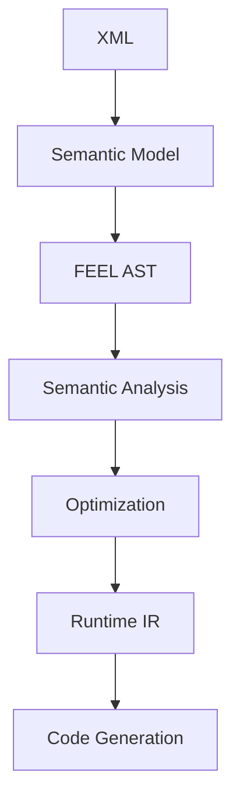
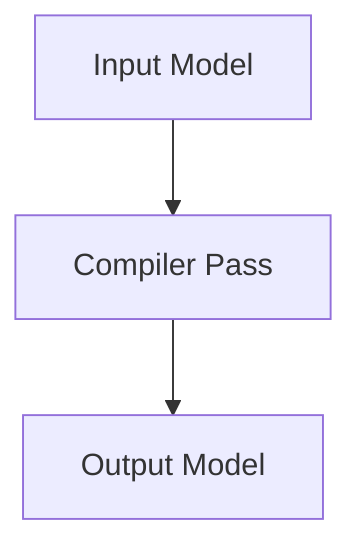
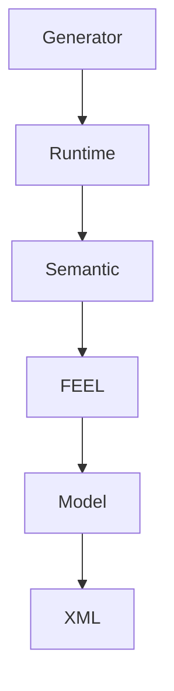
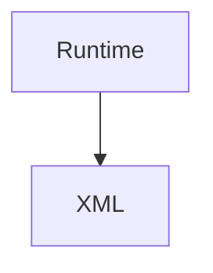

# STYLE.md

<!-- generated-toc:start -->
## Table of contents

- [Project Style Guide](#contents-section-1)
- [One message = one concept](#contents-section-2)
- [Messages use singular names](#contents-section-3)
- [Repeated fields use plural names](#contents-section-4)
- [IDs](#contents-section-5)
- [Names](#contents-section-6)
- [Labels](#contents-section-7)
- [Documentation](#contents-section-8)
- [Extension Elements](#contents-section-9)
- [Field numbering](#contents-section-10)
- [Enum values](#contents-section-11)
- [Imports](#contents-section-12)
<!-- generated-toc:end -->

# DMN Compiler Toolkit

<a id="contents-section-1"></a>
## Project Style Guide

**Version 1.0**

---

# 1. Purpose

This document defines the architectural and coding conventions for the DMN Compiler Toolkit.

Its purpose is to ensure that every module follows consistent design principles and that the codebase remains maintainable as it evolves.

When in doubt, consistency is preferred over personal preference.

---

# 2. General Principles

The project follows the Architecture Specification.

Every implementation should satisfy the Architecture Principles.

In particular:

* Semantic correctness has priority over XML fidelity.
* Compilation has priority over interpretation.
* Runtime must remain independent from XML.
* Simplicity is preferred over cleverness.
* Explicit code is preferred over implicit behavior.

---

# 3. Package Naming

Packages use lower case.

Example

```
io.finmsg.dmn.model

io.finmsg.dmn.frontend

io.finmsg.dmn.feel

io.finmsg.dmn.semantic

io.finmsg.dmn.runtime

io.finmsg.dmn.generator.java

io.finmsg.dmn.generator.spark
```

Avoid abbreviations.

---

# 4. Java Naming

Classes

```
Decision

DecisionTable

RuntimeExpression

TypeResolver
```

Interfaces

```
ExpressionVisitor

CompilerPass

CodeGenerator
```

Enums

```
HitPolicy

BuiltinType

BinaryOperator
```

Methods

```
compile()

parse()

resolveTypes()

generate()

evaluate()
```

Variables

```
decision

expression

runtimeModel
```

Constants

```
DEFAULT_NAMESPACE

MAX_RULES

EMPTY_CONTEXT
```

---

# 5. Protobuf Conventions

<a id="contents-section-2"></a>
## One message = one concept

Good

```
Decision

InputData

DecisionTable
```

Avoid

```
DecisionOrInput

GenericNode
```

---

<a id="contents-section-3"></a>
## Messages use singular names

Correct

```
message Decision
```

Not

```
message Decisions
```

---

<a id="contents-section-4"></a>
## Repeated fields use plural names

Correct

```
repeated Decision decisions = 1;

repeated Rule rules = 2;
```

---

<a id="contents-section-5"></a>
## IDs

Every DMN element contains

```
string id = 1;
```

---

<a id="contents-section-6"></a>
## Names

```
string name = 2;
```

---

<a id="contents-section-7"></a>
## Labels

```
string label = 3;
```

---

<a id="contents-section-8"></a>
## Documentation

```
Documentation documentation = 10;
```

---

<a id="contents-section-9"></a>
## Extension Elements

```
ExtensionElements extension_elements = 11;
```

---

<a id="contents-section-10"></a>
## Field numbering

Reserve numbers by responsibility.

```
1-9

Identity

10-19

Metadata

20-49

Relationships

50-99

Contents

100+

Future extensions
```

Avoid renumbering fields after publication.

---

<a id="contents-section-11"></a>
## Enum values

Always prefix enum constants.

Correct

```
HIT_POLICY_FIRST

HIT_POLICY_ANY

BINARY_OPERATOR_ADD

BUILTIN_TYPE_STRING
```

Never

```
FIRST

ANY

ADD

STRING
```

This avoids protobuf namespace collisions.

---

<a id="contents-section-12"></a>
## Imports

Only import files that are actually required.

Avoid circular dependencies.

Dependency direction must always follow the architecture.

---

# 6. Compiler Architecture

Each compiler stage has exactly one responsibility.



No stage performs work belonging to another stage.

---

# 7. Compiler Passes

Every compiler pass

* has one responsibility
* is deterministic
* is independently testable
* does not mutate its input

Preferred



Avoid hidden side effects.

---

# 8. Runtime

The runtime must not depend on

* XML
* ANTLR
* protobuf compiler
* parser infrastructure

The runtime executes Runtime IR only.

---

# 9. Error Handling

Use exceptions only for unrecoverable failures.

Compilation errors are reported as diagnostics.

Diagnostics contain

* severity
* error code
* message
* source location
* optional fix suggestion

Example

```
DMN-1004

Unknown decision "RiskScore"

Line 43
Column 17
```

---

# 10. Logging

Use SLF4J.

Log levels

ERROR

WARN

INFO

DEBUG

TRACE

Avoid logging inside tight execution loops.

---

# 11. Testing

Every public component requires tests.

Required

* Unit tests
* Round-trip tests
* Compliance tests

Recommended

* Property tests
* Performance benchmarks
* Mutation tests

---

# 12. Performance

Performance is a design requirement.

Prefer

* immutable objects
* compact data structures
* primitive collections
* explicit algorithms

Avoid

* reflection
* unnecessary allocations
* repeated parsing
* unnecessary synchronization

---

# 13. Documentation

Every public class requires Javadoc.

Every compiler pass documents

* purpose
* input
* output
* assumptions
* complexity

Every public API includes examples.

---

# 14. Dependency Rules

Allowed



Forbidden



Compiler components never depend upward.

---

# 15. Design Rules

Prefer

* composition
* immutable models
* explicit APIs
* deterministic behavior
* strongly typed interfaces

Avoid

* inheritance
* global state
* reflection
* stringly typed APIs
* hidden dependencies

---

# 16. Source Formatting

Indentation

```
4 spaces
```

Maximum line length

```
120
```

UTF-8 only.

Unix line endings preferred.

One public class per file.

---

# 17. Branching

Main branch

```
main
```

Development

```
develop
```

Feature branches

```
feature/xml-reader

feature/runtime-ir

feature/java-generator
```

---

# 18. Commit Messages

Examples

```
Add Runtime IR builder

Implement FEEL parser

Refactor DecisionTable normalization

Optimize dependency graph generation
```

Avoid

```
fix

changes

update

misc
```

---

# 19. Versioning

Semantic Versioning

```
Major.Minor.Patch
```

Example

```
1.0.0

1.1.0

1.1.1

2.0.0
```

---

# 20. Guiding Philosophy

The DMN Compiler Toolkit is a compiler platform.

It is **not** an XML object model.

It is **not** a workflow engine.

It is **not** a BPMN implementation.

The project exists to transform DMN models into efficient executable artifacts while remaining faithful to the DMN specification.

Every contribution should make the compiler simpler, faster, more maintainable, or more extensible.
