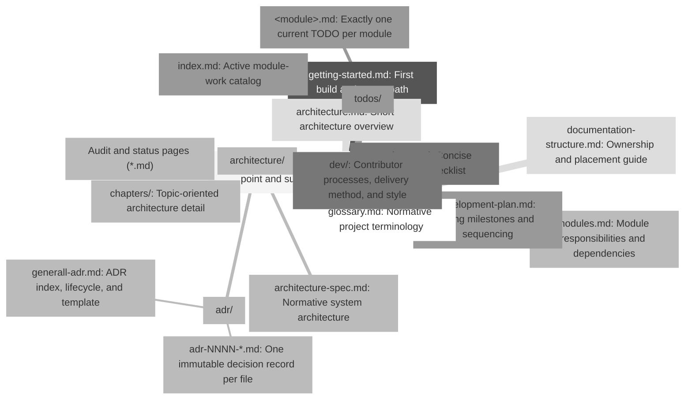

# Documentation Structure

<!-- generated-toc:start -->
## Table of contents

- [Proposed structure](#contents-section-1)
- [Document authority](#contents-section-2)
- [Maintenance rules](#contents-section-3)
- [Architecture chapter classifications](#contents-section-4)
<!-- generated-toc:end -->

This page defines the proposed long-term organization of project documentation.
The goal is to make every document's authority and update cadence obvious.

## Proposed structure

The filename `generall-adr.md` follows the requested repository convention. New ADR
files should retain four-digit identifiers and descriptive slugs (`adr-0026-title.md`, not `adr-26.md`) so names
sort correctly and existing references remain stable.

## Document authority

| Question | Authoritative document |
| --- | --- |
| What is the system intended to be? | `architecture/architecture-spec.md` and accepted ADRs |
| What is implemented now? | Code, tests, then `index.md`/`modules.md` summaries |
| What is the delivery sequence? | `development-plan.md` |
| Which broad capabilities remain? | `roadmap.md` |
| What remains inside one module? | `todos/<module>.md` |
| Why was an architectural choice made? | `architecture/adr/adr-NNNN-title.md` |
| What does a project term mean? | `glossary.md` |

## Maintenance rules

1. Do not use audits as TODO lists; copy still-valid actions into the module TODO.
2. Keep one active TODO file per module and delete completed entries rather than
   accumulating completion diaries.
3. Do not edit an accepted ADR to change its decision. Add a superseding ADR and
   cross-link both records.
4. Keep the roadmap compact. Put acceptance criteria and sequencing in the living plan.
5. Link documents through relative Markdown paths and validate them with MkDocs.
6. Update implementation summaries in the same change that crosses a material
   capability boundary.

## Architecture chapter classifications

Every architecture chapter carries exactly one classification in its title:

| Classification | Meaning |
| --- | --- |
| `NORMATIVE` | Intended rules or vocabulary; implementation should conform or record a contrary ADR |
| `IMPLEMENTATION-ALIGNED` | Describes the current implementation and must be updated with material code changes |
| `FUTURE` | Target or exploratory design that is not a statement of present capability |

An unaccepted proposal may append the review-state modifier `— UNREVIEWED` to its single
classification and must include a prominent notice stating that it is not authoritative.

Chapter 18 points to the canonical planning documents instead of duplicating their
checklists. Chapter 19 is explicitly future compiler-infrastructure design and names
the major facilities that do not yet exist. Chapter 20 links to canonical reference
documents. The glossary is maintained independently at `docs/glossary.md` and is
available globally through site navigation.

Accepted ADR decision bodies were not changed during this classification cleanup.
