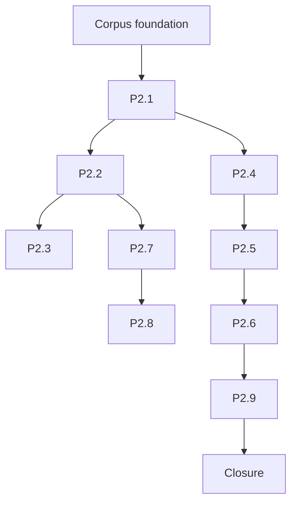
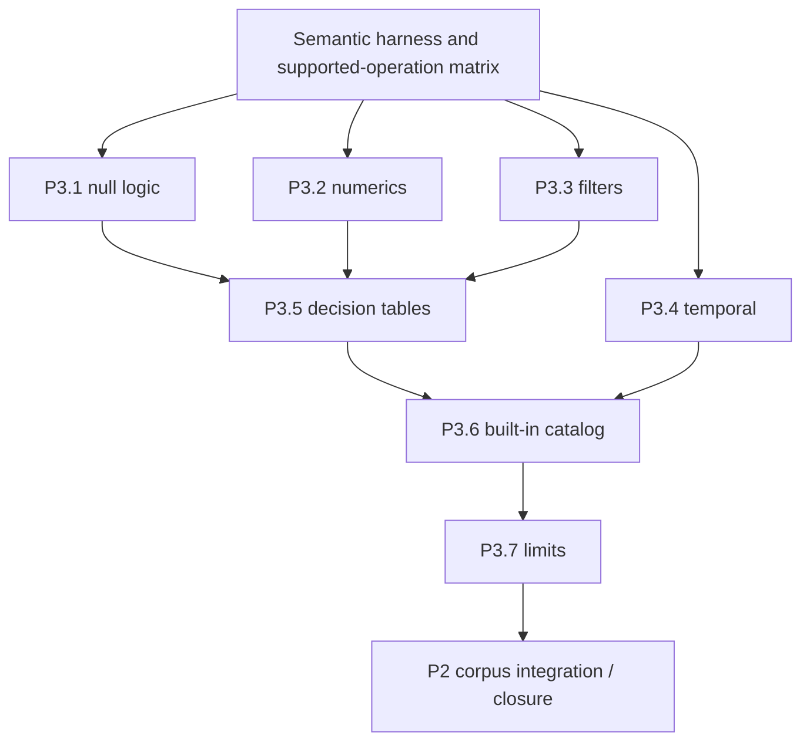
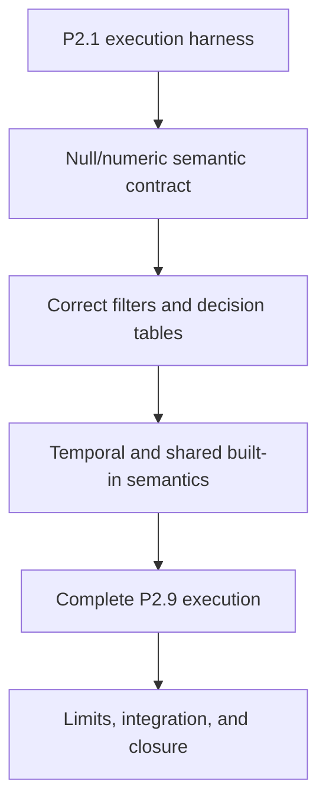

# P2–P3 completion effort estimate

Estimate ID: EST-001  
Prepared: 2026-08-02  
Estimate class: planning range  
Confidence: medium-low for P2; low-to-medium for P3  
Source of scope: [`development-plan.md`](../development-plan.md), current module TODOs, tests, and implementation

## Executive estimate

| Scope | Expected effort | Plausible range | Confidence |
| --- | ---: | ---: | --- |
| P2 — Real multi-file DMN corpus | 24 person-days | 18–32 person-days | medium-low |
| P3 — Runtime semantic baseline | 58 person-days | 42–78 person-days | low-to-medium |
| Cross-milestone integration and closure | 8 person-days | 5–12 person-days | medium |
| **P2 + P3 total** | **90 person-days** | **65–122 person-days** | **low-to-medium** |

Recommended planning commitment: **90 person-days with a management reserve up to 120
person-days**, released incrementally after each semantic slice. The reserve is not pre-authorized
scope; it covers semantic discoveries, fixture incompatibilities, and conformance edge cases.

Approximate calendar duration:

| Staffing | Expected elapsed time | Plausible range | Assumptions |
| --- | ---: | ---: | --- |
| One focused engineer | 18 weeks | 13–24 weeks | About five effective engineering days per week, few external interruptions |
| Two engineers | 11 weeks | 8–15 weeks | Clear ownership split, integration overhead, regular pairing on semantic contracts |
| Three engineers | 9 weeks | 7–13 weeks | Third engineer focuses on corpus/conformance and test infrastructure; limited shared-file contention |

Adding more than three engineers is unlikely to shorten this phase materially. P3 contains semantic
decisions and shared runtime contracts that form a sequential critical path.

## What “complete” means

This estimate does not mean full DMN 1.4 or complete TCK conformance.

### P2 completion boundary

- P2.1–P2.9 are represented by actual version-controlled `.dmn` files.
- Valid fixtures compile through `DmnCompiler` and execute through the interpreter.
- Invalid repositories produce stable phase-aware and source-aware diagnostics.
- One small realistic business repository includes inputs, decisions, imports, BKMs, item
  definitions, and decision tables.
- Fixtures are backend-neutral and reusable by later Java, TCK, and gRPC parity work.
- Tests and documentation provide linked completion evidence.

P2 fixtures should deliberately use the semantic subset being established in P3. P2 is not allowed
to hide arbitrary new semantic scope inside fixture creation.

### P3 completion boundary

- P3.1–P3.7 satisfy their acceptance criteria for the modeled and explicitly supported FEEL/DMN
  subset.
- Null, numeric, filter, temporal, decision-table, built-in, and execution-limit behavior is
  defined by table-driven tests.
- Every operation accepted by semantic analysis either executes with defined behavior or is rejected
  earlier through an explicit diagnostic.
- The interpreter is credible as the behavioral oracle for P5 Java generation.
- The complete P2 corpus executes deterministically with stable results and errors.
- Unsupported behavior is documented explicitly; it is not silently approximated.

The estimate excludes broad external Java/PMML function execution, full public P4 evaluation APIs,
Java generation, complete TCK adaptation, JMH implementation, Runtime IR serialization, and the
ideation portfolio.

## Estimation basis

One person-day represents approximately six focused engineering hours, including implementation,
tests, review preparation, documentation, and normal local verification. It excludes organization-wide
meetings, prolonged external approval, and unrelated support work.

The range uses three-point judgment informed by the current repository:

- P1 is complete and supplies model loading, diagnostics, whole-model-set semantics, and the compiler
  facade.
- Only one real DMN fixture currently exists: `TrafficViolation.dmn`, repeated across modules.
- Linked-model tests mainly construct models programmatically.
- Runtime IR already represents all currently modeled FEEL expressions and decision logic.
- The interpreter executes the broad Runtime IR shape but currently has five focused unit tests.
- Known shortcuts remain in null logic, per-item filter evaluation, decision-table priority/order,
  numeric power/division, temporal operations, built-in dispatch, host conversion, and resource
  limits.
- P3 semantic behavior must align across semantic analysis, Runtime IR, interpreter, and later
  generators, so superficially small runtime fixes often require cross-module contracts and tests.

## P2 work breakdown

Some effort is shared across several scenario IDs. The estimate avoids charging a new test harness
to every fixture.

| Work package | Expected | Range | Notes |
| --- | ---: | ---: | --- |
| P2 foundation: corpus layout, loader harness, named inputs/results, fixture conventions | 4 days | 3–6 days | Establish once; reuse across P2 and later backends |
| P2.1 root imports one decision | 2 days | 1–3 days | First vertical acceptance path exposes integration gaps |
| P2.2 three-level transitive import | 1.5 days | 1–2 days | Primarily fixture and assertions after P2.1 |
| P2.3 diamond import | 2 days | 1–3 days | Must prove compile-once and deterministic execution |
| P2.4 imported BKM invocation | 2.5 days | 2–4 days | Higher runtime/lexical-frame integration risk |
| P2.5 imported item definition | 2.5 days | 2–4 days | Cross-model type and host-value shape risk |
| P2.6 same model name, distinct namespaces | 1.5 days | 1–2 days | Resolution and identity assertions |
| P2.7 missing or ambiguous import | 1.5 days | 1–3 days | Mostly existing loader capability applied to real files |
| P2.8 cross-model dependency cycle | 2 days | 1–3 days | Real-file semantic diagnostic and source identity |
| P2.9 realistic business repository | 5 days | 4–8 days | Includes domain selection, model authoring, expected results, reviewability |
| P2 closure: determinism, docs, evidence, fixture reuse cleanup | 2 days | 1–3 days | Marks items done only after reactor evidence |
| **P2 total after overlap/rounding** | **24 days** | **18–32 days** | Work-package maxima are not assumed to occur together |

### Suggested P2 sequencing



P2.1 should establish the reusable execution harness. P2.2–P2.8 then add small focused repositories.
P2.9 should be designed after those fixtures reveal which model constructs are reliable and easy to
review.

## P3 work breakdown

| Work package | Expected | Range | Main uncertainty |
| --- | ---: | ---: | --- |
| P3 semantic test harness and supported-operation matrix | 4 days | 3–6 days | Defining one reusable oracle and avoiding duplicated test styles |
| P3.1 null propagation and three-valued boolean logic | 7 days | 5–10 days | Operator, predicate, unary-test, conditional, table, and error interactions |
| P3.2 deterministic numeric operations and errors | 6 days | 4–9 days | Decimal division, power, comparisons, coercion, overflow/precision policy |
| P3.3 item-aware filter lowering/evaluation | 6 days | 4–9 days | Runtime IR item slots, lexical capture, position versus predicate behavior |
| P3.4 temporal and duration arithmetic | 9 days | 6–14 days | FEEL rules across local/offset time, dates, date-times, two duration families |
| P3.5 decision-table policies and allowed values | 9 days | 6–13 days | Priority/output order, collect, defaults, multi-output, errors, allowed values |
| P3.6 shared versioned built-in catalog and dispatch | 9 days | 6–14 days | Existing parser/semantic/runtime duplication, arity, overloads, named arguments, null rules |
| P3.7 execution limits and cycle-safe host conversion | 6 days | 4–10 days | Limit accounting, adversarial values, deterministic structured errors |
| P3 integration: P2 corpus, negative cases, determinism, documentation | 5 days | 3–8 days | Cross-slice failures and supported-subset reconciliation |
| **P3 total after overlap/rounding** | **58 days** | **42–78 days** | Built-in and temporal scope must be bounded before commitment |

### Suggested P3 sequencing



Null and numeric semantics should be defined before decision-table completion. Temporal behavior and
built-in catalog work can overlap after canonical value rules are agreed. Execution limits should be
added after core evaluator paths stabilize, then exercised across the integrated corpus.

## Cross-milestone work

| Work package | Expected | Range |
| --- | ---: | ---: |
| Resolve supported-subset contradictions across semantics, IR, and runtime | 3 days | 2–5 days |
| Full reactor stabilization and deterministic repeated runs | 2 days | 1–3 days |
| Completion evidence, TODO/roadmap/plan synchronization, supported behavior documentation | 2 days | 1–3 days |
| Final independent review and defect allowance | 1 day | 1–2 days |
| **Total** | **8 days** | **5–12 days** |

## Recommended ownership for two engineers

| Owner | Primary responsibility |
| --- | --- |
| Engineer A | P2 corpus and harness, P3.3 filters, P3.5 decision tables, integration evidence |
| Engineer B | P3.1 nulls, P3.2 numerics, P3.4 temporal behavior, P3.6 built-ins, P3.7 limits |
| Shared | Semantic contracts, supported-operation matrix, fixture review, cross-module changes, closure |

This is an ownership split rather than two independent streams. Pairing is recommended when changing
null/error semantics, built-in contracts, canonical host values, or decision-table behavior.

## Critical path and decision deadlines

The likely critical path is:



Decisions required early:

| Decision | Needed before | Estimate impact if delayed |
| --- | --- | --- |
| P2.9 business domain | End of P2.3 | Adds idle/rework around realistic fixture design |
| Supported numeric precision/error policy | P3.2 | Affects constants, operators, built-ins, tables, and parity |
| FEEL null/error representation | P3.1 | Affects nearly every later runtime slice |
| Temporal value and arithmetic policy | P3.4 | Affects canonical values and built-ins |
| MVP built-in catalog boundary | P3.6 | Unbounded catalog can expand P3 indefinitely |
| Host-value conversion boundary versus P4 | P3.7 | Prevents accidental inclusion of the complete public API milestone |

## Principal risks

| Risk | Effect | Response |
| --- | --- | --- |
| “Credible oracle” is interpreted as full FEEL conformance | P3 becomes open-ended | Freeze an explicit supported-operation matrix and unsupported diagnostics |
| P2 fixtures introduce unsupported features opportunistically | Hidden P3 scope | Review fixture capability budget before implementation |
| Built-in catalog has no MVP boundary | Large schedule expansion | Include only currently accepted/required operations plus P2 needs; backlog the rest |
| Null/error representation requires IR redesign | Rework across lowering and runtime | Spike P3.1 first and record an ADR/semantic contract |
| Temporal semantics reveal Java type mismatch | Additional canonical value work | Prototype representative date/time/duration matrix before full implementation |
| Decision-table behavior differs from DMN expectations | Rework in IR and interpreter | Add table-driven policy cases before restructuring runtime code |
| Current interpreter decomposition impedes testing | Slower P3 implementation | Lock semantics first; decompose only where a slice needs isolation |
| One engineer owns all semantic decisions | Throughput and review bottleneck | Use focused reviews and paired contract work even with one primary implementer |

## Confidence and reserve policy

P2 has medium-low uncertainty because its acceptance matrix is concrete and P1 infrastructure is
complete. Its main risk is that real files expose frontend/runtime gaps absent from programmatic tests.

P3 has lower confidence because the plan describes semantic outcomes rather than a finite operation
matrix, and several behaviors interact. The estimate should be recalibrated after:

1. P2.1 is complete;
2. the supported-operation matrix exists;
3. P3.1 null semantics is complete;
4. a temporal arithmetic spike has run;
5. the initial built-in catalog boundary is approved.

At that point, replace the broad reserve with work-item ranges backed by executable case counts.

## Recommended delivery forecast

For one focused engineer, communicate externally:

- **P2:** approximately 4–7 weeks;
- **P3:** approximately 9–16 additional weeks;
- **P2 + P3:** approximately 3–6 months, with 4–5 months the responsible working forecast.

For two engineers with shared semantic review:

- **P2:** approximately 3–5 weeks;
- **P3:** approximately 6–11 additional weeks with some overlap;
- **P2 + P3:** approximately 2–4 months, with about 11 weeks the expected case.

Forecast milestones should be evidence-based rather than date-only:

1. real two-file DMN executes;
2. complete linked fixture matrix passes;
3. null/numeric/filter semantic baseline passes;
4. temporal/table/built-in baseline passes;
5. realistic repository and adversarial limits pass;
6. plans, supported behavior, and evidence are synchronized.

## Recommendation

Commit only the first planning horizon initially:

```text
P2 foundation + P2.1–P2.3 + P3 supported-operation matrix + P3.1
```

Expected effort: **14–22 person-days**.

This horizon establishes real-file execution and resolves the highest-leverage semantic uncertainty.
Re-estimate the remaining work from its evidence before committing the full P3 date. This preserves a
credible forecast while preventing the management reserve from turning into silent scope expansion.
