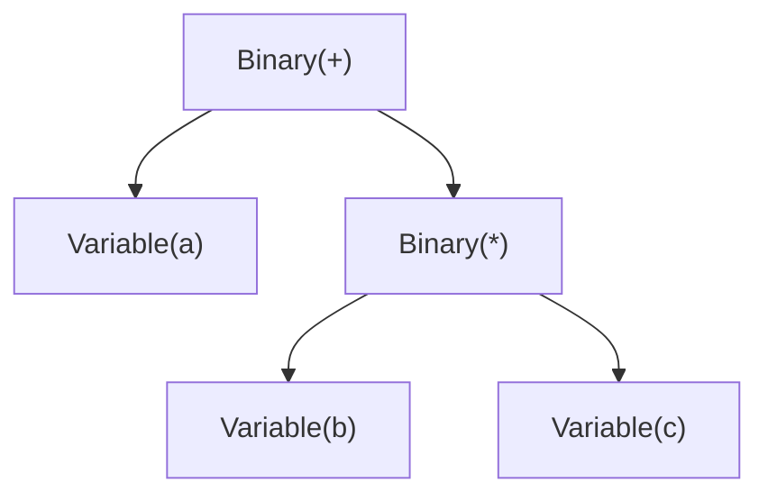
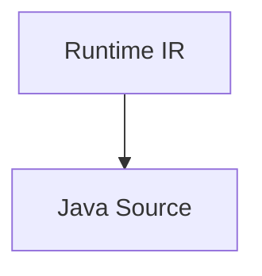
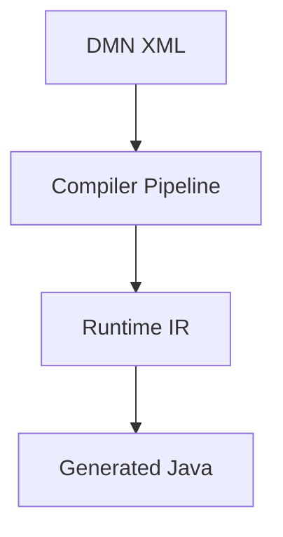
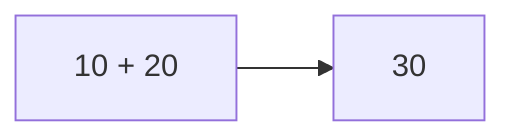
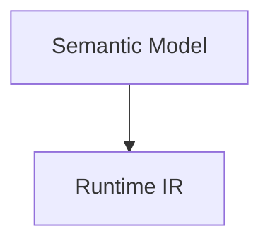
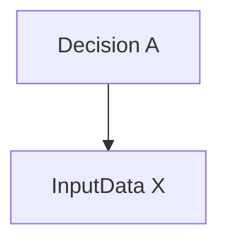
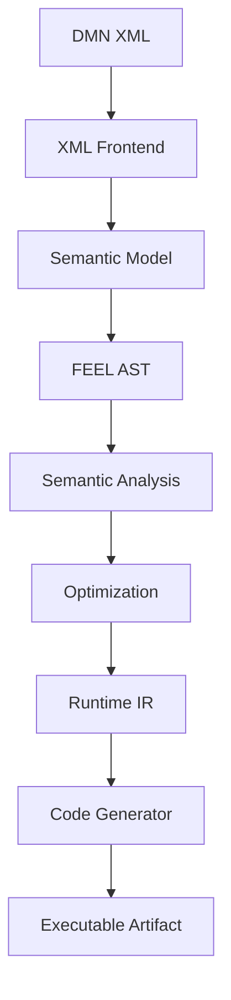

# Glossary [NORMATIVE]

<!-- generated-toc:start -->
## Table of contents

- [Terms and definitions](#contents-section-1)
<!-- generated-toc:end -->

Accepted design decisions are indexed in the
[ADR guide](architecture/adr/generall-adr.md); they are not duplicated here. Module dependency
rules are defined by [Chapter 7](architecture/chapters/07-Maven%20Modules.md) and contributor
conventions by the [style guide](dev/style.md).

<a id="contents-section-1"></a>
## Terms and definitions

<a id="contents-section-2"></a>
### Purpose

This glossary defines the terminology used throughout the DMN Compiler Toolkit.

The definitions are normative for this project and may differ from informal usage in compiler literature.

---

<a id="contents-section-3"></a>
### A

#### Abstract Syntax Tree (AST)

A tree representation of a parsed FEEL expression.

The AST represents the syntactic structure of an expression while removing the concrete grammar syntax.

Example:



---

<a id="contents-section-4"></a>
### B

#### Backend

A component that transforms the Runtime IR into an executable target.

Examples:

* Java
* Rust
* Go
* Spark SQL
* LLVM
* WebAssembly

---

#### BKM (Business Knowledge Model)

A reusable decision logic component defined by the DMN specification.

A BKM behaves similarly to a function.

---

<a id="contents-section-5"></a>
### C

#### Canonical Representation

The authoritative internal representation used by the compiler.

For this project:

```text
Semantic Model
```

is the canonical representation of a DMN model.

---

#### Code Generation

The compiler stage that converts Runtime IR into executable artifacts.

Example:



---

#### Compilation

The complete transformation from DMN XML into executable output.

Example:



---

#### Compiler Facade

The public one-call compiler orchestration API (`DmnCompiler`) that loads model source graphs, drives parsing, semantic analysis, and lowers models into executable Runtime IR (`DmnCompiledModel`).

---

#### Compiler Pass

An isolated transformation or analysis step within the compiler.

Each pass has exactly one responsibility.

Examples:

* Type Resolution
* Constant Folding
* Runtime IR Generation

---

#### Compiler Pipeline

The ordered sequence of compiler passes executed during compilation.

---

#### Constant Folding

An optimization that evaluates constant expressions during compilation.

Example:



---

<a id="contents-section-6"></a>
### D

#### Decision

A unit of executable business logic defined by DMN.

---

#### Decision Graph

The directed dependency graph connecting decisions, input data, and BKMs.

Also known as the Decision Requirements Graph (DRG).

---

#### Decision Table

A tabular representation of business rules consisting of:

* inputs
* outputs
* rules
* hit policy

---

#### Diagnostic

A structured message produced during compilation.

Categories include:

* Error
* Warning
* Information
* Hint

---

#### DRG (Decision Requirements Graph)

The dependency graph defined by the DMN specification.

---

<a id="contents-section-7"></a>
### E

#### Execution Graph

The optimized runtime dependency graph stored inside Runtime IR.

Unlike the DRG, it contains only executable runtime information.

---

#### Extension Point

A stable interface intended for future compiler extensions.

Examples:

* Compiler passes
* Code generators
* Custom functions

---

<a id="contents-section-8"></a>
### F

#### FEEL

Friendly Enough Expression Language.

The expression language defined by the OMG DMN specification.

---

#### FEEL AST

The Abstract Syntax Tree produced from FEEL expressions.

All compiler analysis operates on the AST rather than source text.

---

#### Frontend

The compiler component responsible for reading DMN XML.

Responsibilities include:

* XML parsing
* namespace handling
* diagnostics

---

<a id="contents-section-9"></a>
### I

#### Immutable

An object whose state cannot change after creation.

The Semantic Model, FEEL AST, and Runtime IR are immutable.

---

#### Intermediate Representation (IR)

A representation used internally by the compiler between stages.

Examples:

* Semantic Model
* Runtime IR

---

<a id="contents-section-10"></a>
### J

#### Java Generator

The backend that produces Java source code from Runtime IR.

---

<a id="contents-section-11"></a>
### L

#### Lowering

The process of transforming a high-level representation into a lower-level representation suitable for execution.

Example:



---

<a id="contents-section-12"></a>
### M

#### Model Validator

A compiler component responsible for structural validation.

It performs checks before semantic analysis.

---

<a id="contents-section-13"></a>
### O

#### Optimization

A compiler transformation that improves performance without changing observable behavior.

Examples:

* Constant Folding
* Inlining
* Dead Decision Elimination

---

<a id="contents-section-14"></a>
### P

#### Pass

See **Compiler Pass**.

---

#### Pass Manager

The compiler component responsible for scheduling and executing compiler passes.

---

#### Pipeline

The ordered sequence of compiler stages.

---

#### Protobuf

Protocol Buffers.

The schema language used for the Semantic Model.

---

<a id="contents-section-15"></a>
### R

#### Reference Resolution

The compiler process that connects symbolic references with their targets.

Example:



---

#### Runtime

The execution engine responsible for evaluating compiled decisions.

The runtime performs:

* no XML parsing
* no FEEL parsing
* no semantic analysis

---

#### Runtime IR

The Runtime Intermediate Representation.

A compact execution-oriented representation consumed by code generators and interpreters.

Characteristics:

* immutable
* optimized
* XML independent
* FEEL independent

---

<a id="contents-section-16"></a>
### S

#### Semantic Analysis

Compiler phase that verifies semantic correctness.

Examples:

* type checking
* reference resolution
* dependency analysis

---

#### Semantic Model

The compiler's canonical representation of a DMN model.

It contains business semantics but no XML-specific information.

---

#### Source Location

The position of an element within the original DMN source document.

Typically:

* file
* line
* column

Used for diagnostics.

---

<a id="contents-section-17"></a>
### T

#### TCK (Technology Compatibility Kit) Runner

The conformance test execution harness (`dmn-tck-runner`) that verifies DMN specification compliance against standard OMG DMN TCK test cases.

---

#### Type Inference

Automatic determination of FEEL expression types.

---

#### Type Resolution

The compiler process of resolving named types into internal representations.

---

<a id="contents-section-18"></a>
### V

#### Validation

The process of checking whether a model satisfies structural and semantic constraints.

Validation occurs in multiple compiler stages.

---

<a id="contents-section-19"></a>
### X

#### XML Frontend

The compiler component responsible for reading and writing DMN XML.

The XML Frontend is not part of the runtime.

---

<a id="contents-section-20"></a>
### Acronyms

| Acronym  | Meaning                             |
| -------- | ----------------------------------- |
| ADR      | Architecture Decision Record        |
| API      | Application Programming Interface   |
| AST      | Abstract Syntax Tree                |
| BKM      | Business Knowledge Model            |
| CI       | Continuous Integration              |
| CLI      | Command Line Interface              |
| DMN      | Decision Model and Notation         |
| DRG      | Decision Requirements Graph         |
| FEEL     | Friendly Enough Expression Language |
| IR       | Intermediate Representation         |
| JVM      | Java Virtual Machine                |
| JIT      | Just-In-Time Compiler               |
| LSP      | Language Server Protocol            |
| OMG      | Object Management Group             |
| POJO     | Plain Old Java Object               |
| protobuf | Protocol Buffers                    |

---

<a id="contents-section-21"></a>
### Compiler pipeline terminology

The following terms describe the progression of a DMN model through the compiler.



Each stage has a clearly defined input and output, ensuring that responsibilities remain separated and transformations are deterministic.

---

<a id="contents-section-22"></a>
### Naming conventions

Throughout this specification, the following naming conventions are used consistently:

| Term          | Meaning                                                                                       |
| ------------- | --------------------------------------------------------------------------------------------- |
| **Model**     | A high-level representation of DMN semantics (e.g., Semantic Model, Runtime Model).           |
| **IR**        | An intermediate representation optimized for compiler processing or execution.                |
| **Pass**      | A single compiler transformation or analysis step.                                            |
| **Phase**     | A group of related compiler passes (e.g., Semantic Analysis, Optimization).                   |
| **Frontend**  | Components that ingest and parse source artifacts.                                            |
| **Backend**   | Components that generate executable artifacts from the Runtime IR.                            |
| **Runtime**   | Components responsible only for executing compiled models.                                    |
| **Generator** | A backend that emits code or executable artifacts for a specific target language or platform. |

---

<a id="contents-section-23"></a>
### Summary

The glossary establishes a common vocabulary for contributors, reviewers, and users of the DMN Compiler Toolkit. By using these definitions consistently across the architecture specification, source code, API documentation, and ADRs, the project minimizes ambiguity and makes collaboration easier as the codebase and community grow.
