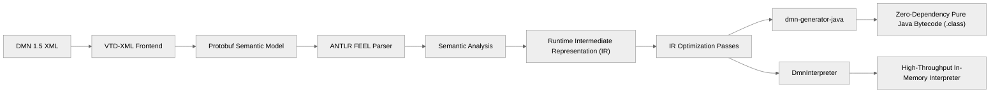
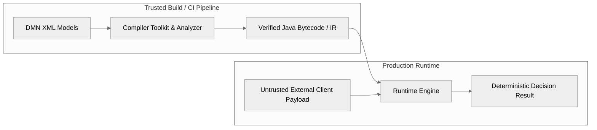

# Enterprise Architect Guide

This guide provides technical decision-makers and enterprise system architects with an evaluation framework for embedding and operating the **DMN Compiler Toolkit** within mission-critical architectures.

---

## 1. Architectural Philosophy: Compilation vs. Interpretation

Traditional rule engines (e.g., Drools/KIE, Camunda DMN) rely on runtime interpretation: parsing XML models into runtime graphs, using reflection to bind properties, and maintaining stateful execution sessions.

The **DMN Compiler Toolkit** adopts an ahead-of-time (AOT) compiler architecture:

### Key Architectural Advantages

1. **Zero Runtime Reflection & Dependencies**: Generated Java classes (`dmn-generator-java`) compile directly to pure Java bytecode with zero third-party runtime dependencies. Evaluation involves direct method calls, avoiding reflection overhead or complex classloader hierarchies (see [ADR-0013](../architecture/adr/adr-0013-no-reflection-in-generated-code.md) and [ADR-0017](../architecture/adr/adr-0017-runtime-independence-and-minimal-dependency-boundary.md)).
2. **Sub-Microsecond Latency**: Decision evaluation executes in hundreds of nanoseconds to low single-digit microseconds, eliminating GC pressure and runtime parser thrashing.
3. **Immutable Thread-Safe Artifacts**: Compiled models, Runtime IR representations, and generated Java decision engines are completely immutable and safe for concurrent execution across arbitrary thread pools without synchronization locks.
4. **Deterministic Execution**: Given identical inputs, decision evaluation is strictly deterministic with predictable, bounded resource consumption.

---

## 2. Deployment Topologies

The toolkit supports three primary enterprise deployment topologies:

```mermaid
%%{init: {'theme':'neutral'}}%%
flowchart TD
    subgraph Topology1["1. Direct Embedded Java Library"]
        App["Host Application / JVM"] --> Gen["Generated Decision Engine JAR"]
    end
    subgraph Topology2["2. Low-Latency Microservice / Sidecar"]
        Mesh["Service Mesh Client"] -->|gRPC / Protobuf| Daemon["dmn-server-grpc Container"]
        Daemon --> Direct["In-Memory Decision Engine"]
    end
    subgraph Topology3["3. Distributed Batch & Stream Processing"]
        Spark["Apache Spark / Flink Job"] --> UDF["Generated DMN UDF / Spark SQL Expression"]
        UDF --> Lake["Parquet / Delta Lake / Iceberg"]
    end
```

### Deployment Trade-Offs

| Attribute | Embedded Java (`dmn-generator-java`) | Sidecar Service (`dmn-server-grpc`) | Distributed Engine (`dmn-generator-spark-sql`) |
|---|---|---|---|
| **Target Runtime** | Any JVM (JDK 21+) | Linux Container / Kubernetes | Apache Spark 4.x Cluster |
| **Invocation Latency** | **100 ns – 2 µs** (In-process) | **0.5 ms – 2 ms** (Network/IPC) | Batch / High-Volume Streaming |
| **Throughput (1 Core)** | **> 1,000,000 ops/sec** | **50,000 – 150,000 ops/sec** | **Millions ops/sec per worker** |
| **Coupling** | Direct Maven dependency | Polyglot gRPC contract | Spark SQL Catalyst expression |
| **Use Cases** | Ultra-low-latency financial trading, fraud scoring, inline payload validation | Microservice architectures, polyglot clients (Go, Python, .NET) | Enterprise data quality pipelines, risk modeling, ETL batch reconciliation |

---

## 3. Trust Boundaries & Security Architecture

The toolkit enforces strict boundaries between trusted build-time compilation and untrusted runtime execution (see `SECURITY.md` at repository root):

- **Input Boundary**: DMN XML models are assumed to originate from authenticated authoring pipelines. Runtime payload inputs (numbers, strings, dates, nested JSON/Protobuf contexts) are treated as untrusted and safely validated against FEEL type constraints without arbitrary code execution risks.
- **Recursion & Hostile Input Limits**: The parser incorporates recursion depth limits (tested up to 200+ nested AST levels) and rejects malformed Unicode or adversarial token streams gracefully with structured diagnostics.
- **Vulnerability SLAs**: Supported versions (`1.0.x`) adhere to a 48-hour initial response SLA and 5-business-day critical remediation SLA.

---

## 4. Standards Conformance & Governance

- **100% OMG DMN 1.5 Compliance**: Verified against 3,391 test cases (6,782 backend outcomes) across Compliance Level 2 (CL2) and Compliance Level 3 (CL3) for both `DmnInterpreter` and `dmn-generator-java`.
- **Zero Silent Failures**: All parsing, type-checking, and evaluation diagnostics are captured in first-class `DiagnosticSink` structures rather than silent `null` fallbacks or uncaught exceptions.
- **Architectural Decision Index**: Formal ADRs (ADR-0001 through ADR-0025) document all system design decisions, naming policies, boundary constraints, and evolution contracts.
