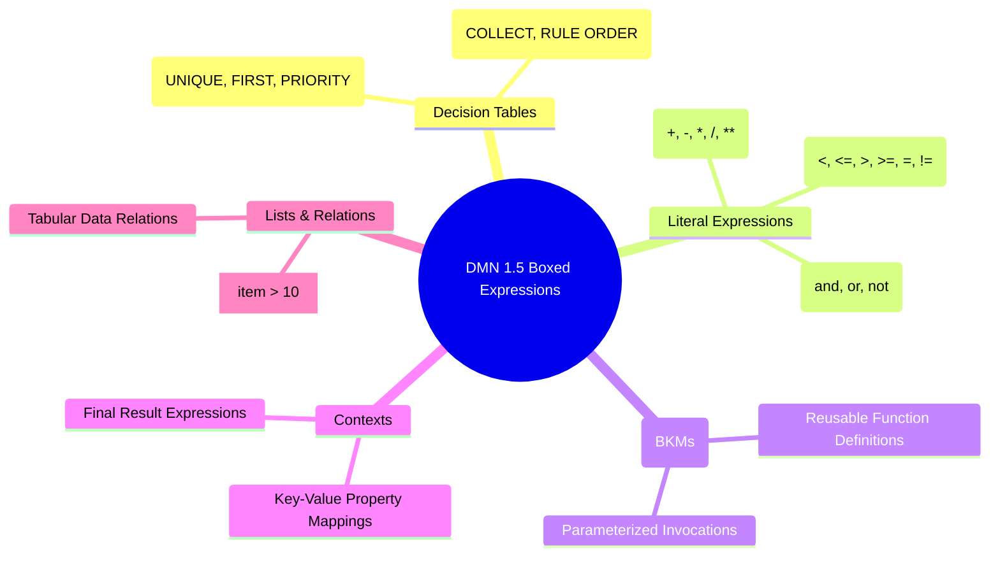

# DMN Modeler & Business Analyst Guide

This guide explains supported DMN 1.5 concepts, FEEL expressions, decision table hit policies, and validation practices for business analysts and decision modelers.

---

## 1. Supported DMN 1.5 Specification Scope

The **DMN Compiler Toolkit** achieves **100.00% strict self-verified conformance** across all 3,391 declared OMG DMN TCK test cases (Compliance Levels 2 and 3):

| Compliance Level | Scope | Conformance Rate |
|---|---|---|
| **Compliance Level 2 (CL2)** | Decision Tables, S-FEEL expressions, basic input/decision nodes | **100.00%** (116/116 cases) |
| **Compliance Level 3 (CL3)** | Full FEEL grammar, Boxed Expressions (BKMs, Contexts, Invocations, Relations), Decision Requirements Graphs (DRG) | **100.00%** (3,275/3,275 cases) |

---

## 2. Supported Boxed Expressions



---

## 3. FEEL Expression Syntax Reference

### Numeric & String Operations
```feel
// Arithmetic
annualIncome * 0.35 - totalDebts
(loanAmount / monthlyIncome) ** 2

// Strings
"Applicant " + applicant.lastName + " is " + (if approved then "APPROVED" else "REJECTED")
substring(accountNumber, 1, 4)
```

### Date, Time & Duration Expressions
```feel
date("2026-09-04")
date and time("2026-09-04T14:30:00Z")
duration("P3Y6M")  // 3 years, 6 months
duration("PT4H30M") // 4 hours, 30 minutes

// Date arithmetic
date("2026-12-31") - date("2026-01-01") // returns duration
effectiveDate + duration("P30D") > settlementDate
```

### List & Filter Expressions
```feel
// Range checks
creditScore in [650..850]
age in (18..65]

// Filter expressions
transactions[amount > 10000.00 and currency = "USD"]
all(items.isApproved)
some(riskFlags, item = "HIGH_VOLATILITY")
```

---

## 4. Decision Table Hit Policies

| Hit Policy | Code | Behavior |
|---|---|---|
| **Unique** | `U` | Exactly one rule must match. If multiple rules match, an error is reported. |
| **First** | `F` | Returns the output of the first matching rule in top-to-bottom order. |
| **Priority** | `P` | Returns the output with the highest declared output priority. |
| **Collect** | `C` | Returns all matching rule outputs as a list. |
| **Collect Sum** | `C+` | Sums the outputs of all matching rules. |
| **Collect Min / Max** | `C<` / `C>` | Returns the minimum / maximum output of all matching rules. |
| **Collect Count** | `C#` | Returns the total number of matching rules. |
| **Rule Order** | `R` | Returns all matching outputs in table rule order. |

---

## 5. Visual Conformance & Model Diagnostics

You can view the full interactive TCK Conformance Dashboard locally:

1. Generate the dashboard:
   ```bash
   python tools/generate_tck_dashboard.py
   ```
2. Open `docs/tck-dashboard.html` in any web browser to search and filter across all 3,391 test cases, inspect decision table outputs, and review diagnostics.
