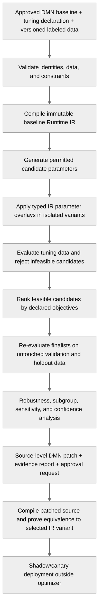

# IDEA-002 — Governed DMN Policy Optimizer

Status: exploring  
Created: 2026-08-02  
Owner: product, decision-policy, risk, and compiler teams  
Related capabilities: compiler facade, Runtime IR, interpreter, compiled-model API, corpus execution, performance validation

## Idea summary

Provide a declarative and governed facility for tuning selected parameters of a DMN decision model
against labeled historical or synthetic cases. The optimizer repeatedly evaluates candidate policy
variants, measures false positives, false negatives, cost, and operational constraints, and produces
an explainable change proposal with reproducible evidence.

The system must not arbitrarily rewrite production logic or silently deploy a statistically fitted
model. A policy owner explicitly declares which values may change, their allowed ranges, required
invariants, objective priorities, validation strategy, and approval policy.

Example intent:

> Find an allowed policy variant whose measured false-positive rate is below 0.001% while observing
> no false negatives in the designated fraud-validation set, then independently validate and submit
> the smallest explainable rule change for approval.

The zero-false-negative condition is evidence about a finite validation set, not a guarantee that no
future fraud will be missed.

## Product hypothesis

If policy owners can declaratively constrain, simulate, compare, and approve changes to selected DMN
rule parameters, then they can improve decision outcomes faster than manual trial and error without
sacrificing DMN explainability, deterministic execution, or change governance.

## Users and value

| User | Need | Value provided |
| --- | --- | --- |
| Fraud or risk policy owner | Reduce customer friction without increasing missed fraud | Constrained optimization expressed in business-policy terms |
| Decision analyst | Explore thresholds and rule variants reproducibly | Scenario generation, metric breakdowns, and candidate comparison |
| Model validator | Detect overfitting, leakage, and subgroup harm | Independent holdout evidence and confidence intervals |
| Approver or auditor | Understand exactly why a rule changed | Source-level patch, rationale, provenance, and replayable evidence |
| Engineer | Evaluate many variants efficiently | Immutable Runtime IR variants, caching, deterministic parallel evaluation |

## Product principles

1. **Declare the search space.** Only explicitly marked parameters may change.
2. **Constraints before optimization.** Safety and policy invariants reject candidates before an
   objective score can make them attractive.
3. **Source is authoritative.** Runtime IR enables fast experiments; an approved result must become
   a deterministic source-level DMN change and compile back to equivalent IR.
4. **Proposals, not autonomous production mutation.** Initial releases stop at an evidence-backed
   change proposal requiring approval.
5. **Separate tuning from proof.** Training/tuning data selects candidates; untouched validation and
   temporal holdout data assess them.
6. **No unverifiable absolutes.** Report observed rates and statistical uncertainty rather than
   claiming that future fraud cannot be missed.
7. **Prefer the smallest sufficient change.** Penalize policy complexity and distance from the
   approved baseline.
8. **Every run is replayable.** Model, data, labels, tuning declaration, seed, engine version, and
   result are content-addressed and retained.

## Terminology and metrics

For a binary fraud decision:

| Actual / decision | Flagged | Not flagged |
| --- | --- | --- |
| Fraud | true positive (TP) | false negative (FN) |
| Legitimate | false positive (FP) | true negative (TN) |

Primary rates:

```text
false-positive rate = FP / (FP + TN)
false-negative rate = FN / (FN + TP)
recall              = TP / (TP + FN)
precision           = TP / (TP + FP)
```

The proposed `0.001%` false-positive limit is a rate of `0.00001`, or at most approximately one
false positive per 100,000 legitimate cases. A credible measurement at that scale requires a large,
representative negative sample and a confidence bound, not merely a point estimate.

Similarly, observing `FN = 0` does not establish a true false-negative rate of zero. As a useful
approximation, with zero observed events the upper 95% rate bound is about `3 / N`, where `N` is the
number of representative fraud cases. Product claims and acceptance gates must state the sample
size and confidence method.

## Declarative tuning contract

A separate tuning document should refer to stable DMN element and parameter identities. It should
not embed opaque compiler slots.

Illustrative syntax, not a committed schema:

```yaml
apiVersion: finmsg.io/dmn-tuning/v1alpha1
kind: DmnPolicyTuning
metadata:
  name: card-fraud-policy
model:
  namespace: https://finmsg.io/dmn/fraud
  name: CardFraudDecision
  baselineDigest: sha256:...
  decision: ReviewTransaction
parameters:
  - id: high_amount_threshold
    target: decisionTable/FraudRules/rule/highAmount/inputEntry/threshold
    type: decimal
    domain: { min: 500, max: 5000, step: 50 }
    baseline: 1500
  - id: velocity_count_threshold
    target: decisionTable/FraudRules/rule/highVelocity/inputEntry/threshold
    type: integer
    domain: { min: 2, max: 20, step: 1 }
    baseline: 6
data:
  tuning: datasets/fraud-tuning-v3.parquet
  validation: datasets/fraud-validation-v3.parquet
  temporalHoldout: datasets/fraud-holdout-2026-q2.parquet
  label: confirmedFraud
  eventTime: transactionTime
constraints:
  - metric: falseNegativeCount
    dataset: validation
    operator: equals
    value: 0
  - metric: falsePositiveRate.upperConfidenceBound
    dataset: validation
    operator: lessThan
    value: 0.00001
  - invariant: mandatorySanctionsBlock
  - invariant: noEvaluationErrors
objectives:
  - minimize: expectedBusinessCost
    weights:
      falsePositive: 1
      falseNegative: 100000
      manualReview: 5
  - minimize: distanceFromBaseline
  - minimize: changedParameterCount
validation:
  split: temporal
  confidenceLevel: 0.95
  seed: 18473
  minimumFraudCases: 10000
  minimumLegitimateCases: 1000000
  subgroupMetrics: [country, channel, customerSegment]

approval:
  mode: proposalOnly
  requiredRoles: [fraud-policy-owner, independent-validator]
```

The final schema should support exact decimals, categorical sets, booleans, monotonic relationships,
conditional parameter dependencies, immutable parameters, and domain-specific invariants.

## Proposed workflow



## Architecture

### 1. Stable tunable-parameter identity

The compiler needs stable identities for eligible literals and unary-test boundaries, independent of
Runtime IR slot allocation. The model author or a companion declaration marks these as tunable.
Unmarked expressions, rule topology, hit policies, functions, imports, and mandatory controls remain
immutable unless a later capability explicitly permits them.

### 2. Typed Runtime IR overlays

The optimizer should not mutate a shared Runtime IR object. It creates immutable variants by applying
validated typed overlays to declared parameter nodes. Structural validation and Runtime IR invariants
run before evaluation. Variants receive deterministic digests for caching and replay.

This offers fast experimentation while retaining one compiled baseline. After selection, the system
must generate a source-level DMN patch, recompile it normally, and verify behavioral equivalence on
the complete evidence corpus.

### 3. Dataset and label boundary

A dataset adapter supplies named DMN inputs, outcome labels, event time, sample weights, and optional
subgroup dimensions. Historical data must be separated into:

- tuning data used by the search algorithm;
- validation data used to accept or reject finalists;
- temporal holdout data representing later, untouched outcomes;
- optional adversarial and synthetic scenario sets for boundary coverage.

Label provenance and maturity matter in fraud: chargeback or investigation labels can arrive late,
be disputed, or encode previous-policy bias. Every run records its label definition and observation
window.

### 4. Scenario and load generation

Synthetic generation serves two different purposes and must not be confused with real-world metric
estimation:

- **Boundary generation:** values immediately below, at, and above tunable thresholds; pairwise
  combinations; nulls; malformed values; and rare rule intersections.
- **Distributional generation:** samples from an explicitly versioned distribution model for load,
  stability, and sensitivity analysis.

Synthetic cases are valuable for finding logic defects and discontinuities. They must not establish
production false-positive or false-negative rates unless their distribution has been independently
validated as representative.

### 5. Search coordinator

Expose one backend-neutral search interface and begin with deterministic strategies:

- exhaustive grid search for small discrete spaces;
- coordinate search for interpretable threshold-by-threshold adjustment;
- seeded random or quasi-random search for a larger initial scan;
- Bayesian or evolutionary optimization only when simpler search is demonstrably inadequate.

The coordinator enforces evaluation budgets, cancellation, deterministic seeds, parallelism limits,
candidate deduplication, checkpointing, and early rejection of violated constraints.

### 6. Metrics and constraint engine

Metrics should include the confusion matrix, rates, confidence intervals, expected business cost,
decision volume, evaluation errors, latency, and subgroup slices. Constraints are hard acceptance
conditions. Objectives rank only candidates that satisfy all hard constraints.

An optional Pareto frontier should expose trade-offs rather than collapsing them prematurely into one
score. This is particularly useful when lowering false positives competes with fraud recall or manual
review capacity.

### 7. Evidence bundle

Each candidate proposal should contain:

- baseline and candidate model digests;
- exact parameter changes and source locations;
- tuning declaration and optimizer configuration;
- dataset and label versions without embedding sensitive records;
- aggregate tuning, validation, holdout, and subgroup metrics;
- confidence intervals and sample sizes;
- sensitivity around each selected parameter;
- failed invariants and rejected alternatives when useful;
- replay command and engine version;
- generated DMN patch and source-to-IR equivalence result;
- approval and deployment status.

## Product shape and module boundaries

Suggested future modules:

```text
dmn-tuning-api
  declarative schema, parameter identity, metrics, result contracts

dmn-tuning-engine
  overlays, coordinator, search strategies, constraint evaluation

dmn-tuning-data
  file/stream dataset SPI, splits, label and subgroup metadata

dmn-tuning-report
  evidence bundles, comparison and visualization inputs

dmn-tuning-cli
  validate, tune, replay, compare, and export-proposal commands
```

These modules should depend on supported compiler/runtime contracts. The compiler and runtime must
not depend on tuning modules.

## Delivery options

| Option | Scope | Benefit | Cost and risk |
| --- | --- | --- | --- |
| A — Threshold laboratory | Tune a few declared numeric thresholds against a static labeled corpus | Fast validation of IR overlays and metrics | Narrow policy shapes and no production workflow |
| B — Governed optimizer MVP | Declarative constraints, deterministic search, holdout validation, evidence bundle, source patch, proposal-only approval | Delivers a credible product capability with controlled risk | Requires stable identities, data discipline, and governance |
| C — Continuously adaptive policy | Monitor outcomes and initiate recurring retuning/deployment workflows | Faster response to drift | High operational, regulatory, feedback-loop, and safety risk |

**Recommendation:** begin with Option A as a technical and statistical spike, then build Option B if
the evidence is promising. Defer Option C until proposal quality, label latency, monitoring, rollback,
and independent validation have been proven over multiple policy cycles.

## Proposed delivery slices

| ID | Slice | Exit evidence |
| --- | --- | --- |
| OPT.1 | Fraud-policy use case and metric contract | Positive class, label maturity, costs, constraints, and target population are unambiguous |
| OPT.2 | Stable tunable parameter identities | Selected DMN literals survive parse, semantics, IR lowering, source patching, and recompilation |
| OPT.3 | Immutable typed IR overlays | Candidate variants are validated, deterministic, isolated, and content-addressed |
| OPT.4 | Dataset, replay, and confusion metrics | A versioned labeled corpus evaluates baseline behavior reproducibly |
| OPT.5 | Deterministic threshold search | Grid and coordinate searches find and rank feasible candidates under a fixed budget |
| OPT.6 | Validation and robustness | Untouched holdout, confidence, sensitivity, and subgroup reports prevent tuning-set acceptance |
| OPT.7 | Source patch and equivalence proof | Selected IR overlay becomes a reviewable DMN diff with matching replay results |
| OPT.8 | Governed proposal workflow | Required roles approve an immutable evidence bundle; no automatic deployment occurs |
| OPT.9 | Shadow evaluation and monitoring contract | Candidate and baseline can be compared on live traffic without affecting decisions |

## MVP boundary

The governed optimizer MVP is complete when:

- one representative fraud DMN model declares a small set of numeric or categorical tunables;
- the search space is bounded and validated before execution;
- baseline and candidates execute against versioned tuning, validation, and temporal holdout data;
- hard constraints are distinct from ranking objectives;
- results include sample sizes, confidence bounds, subgroup breakdowns, and sensitivity analysis;
- a selected candidate produces a minimal source-level DMN patch;
- recompiling the patch proves equivalence with the selected IR variant on all evidence datasets;
- an immutable evidence bundle supports replay and human approval;
- the optimizer has no ability to mutate or deploy the production model automatically.

## Success measures

| Measure | MVP target |
| --- | --- |
| Reproducibility | Same inputs, versions, and seed produce identical candidate ordering and evidence |
| Safety | No candidate bypasses a hard invariant or is ranked after a constraint violation |
| Explainability | Every proposed change maps to a named parameter and source-level DMN difference |
| Validation hygiene | Tuning, validation, and temporal holdout datasets are distinct and provenance-recorded |
| Statistical honesty | Rates include denominators and confidence bounds; zero observed misses is not called zero future risk |
| Minimality | Proposal reports changed-parameter count and distance from baseline |
| Performance | A declared candidate budget completes within an agreed evaluation window |
| Governance | Production deployment is impossible without the configured external approval path |

Business success measures should later include fraud loss, customer friction, manual-review volume,
case-processing cost, policy-change lead time, rollback frequency, and outcome drift. They should be
measured in shadow or controlled rollout before broad production use.

## Major risks and mitigations

| Risk | Mitigation |
| --- | --- |
| Overfitting to historical cases | Untouched temporal holdout, limited search budget, complexity penalty, repeated prospective validation |
| Data leakage | Time-aware splits, feature-availability checks, immutable dataset manifests |
| Biased or delayed fraud labels | Record label source and maturity window; re-evaluate after labels mature |
| Impossible target constraints | Feasibility analysis and Pareto report; never relax hard constraints silently |
| Tiny-rate claims lack statistical power | Minimum sample sizes and confidence-bound constraints |
| Arbitrary IR mutation creates invalid models | Typed overlays over declared identities, invariant checks, immutable variants |
| Optimized IR cannot be audited | Generate source DMN patch and prove recompilation equivalence |
| Feedback loops reinforce previous decisions | Preserve exploration/holdout strategies and audit how labels are acquired |
| Subgroup harm hidden by aggregate results | Required subgroup metrics, minimum subgroup support, policy-owner review |
| Fraud adapts to deployed thresholds | Monitor drift, protect sensitive evidence, rotate validation scenarios, require retuning review |
| Automatic tuning makes unsafe production changes | Proposal-only MVP, separation of duties, shadow evaluation, external deployment controls |

## Decision gates

### Gate 1 — Problem and data fitness

Proceed only when the positive class, target population, label maturity, business costs, minimum
sample sizes, and acceptable uncertainty are agreed by the policy owner and validator.

### Gate 2 — Technical feasibility

Proceed to an MVP only if a bounded threshold laboratory proves stable parameter identities,
immutable IR overlays, deterministic replay, and source-patch equivalence.

### Gate 3 — Candidate validity

Permit an approval proposal only when a candidate satisfies every hard constraint on independent
validation data and passes temporal, sensitivity, invariant, and subgroup checks.

### Gate 4 — Production consideration

Consider deployment only through an external governed release process with shadow evidence,
monitoring thresholds, rollback criteria, ownership, and time-bounded approval. This idea does not
authorize automatic production deployment.

## Open product decisions

| ID | Decision | Needed by |
| --- | --- | --- |
| OPT-D01 | What precisely constitutes fraud, and when is that label mature enough to tune against? | OPT.1 |
| OPT-D02 | Is `0.001%` a point estimate, upper confidence bound, or operational service target? | OPT.1 |
| OPT-D03 | Which zero-miss requirement applies: tuning set, validation set, temporal holdout, or all three? | OPT.1 |
| OPT-D04 | Which DMN elements may be tunable, and how are their stable identities authored? | OPT.2 |
| OPT-D05 | What business costs and priorities rank multiple constraint-satisfying candidates? | OPT.5 |
| OPT-D06 | Which subgroup constraints are mandatory and legally appropriate? | OPT.6 |
| OPT-D07 | What evidence and roles are required to approve a policy proposal? | OPT.8 |
| OPT-D08 | Where does deployment, monitoring, and rollback ownership live outside the optimizer? | OPT.9 |

## Recommended first experiment

Use one small, synthetic but business-shaped fraud decision table with two or three numeric tunables.
Create a seeded dataset containing ordinary cases, threshold-boundary cases, rare fraud patterns, and
an untouched temporal-style holdout. Compare exhaustive grid search with coordinate search.

The experiment should answer:

- Can stable source identities map safely to immutable IR overlays?
- Can the engine evaluate enough candidates and cases within a useful time budget?
- Can infeasible constraints be explained rather than merely returning no result?
- Does the selected candidate survive holdout, sensitivity, and subgroup checks?
- Can it be rendered as a minimal DMN patch and recompiled to equivalent behavior?

Do not use the experiment to claim real fraud performance. Its purpose is to validate the product
contract, optimization loop, evidence model, and architectural boundaries.

## Relationship to the development plan

This idea should remain outside the committed delivery sequence until P2 provides realistic model
corpora and P3 establishes credible runtime semantics. A bounded OPT.1–OPT.3 research spike may run
after stable parameter-addressing requirements are understood, but a product MVP also benefits from
P4's stable name-based compiled-model API and P6's performance-measurement discipline.

If promoted, it should become a distinct product track rather than expanding Runtime IR optimization.
Compiler optimization preserves model semantics; policy optimization intentionally changes business
behavior under declared constraints. Conflating them would obscure ownership, testing, and risk.

