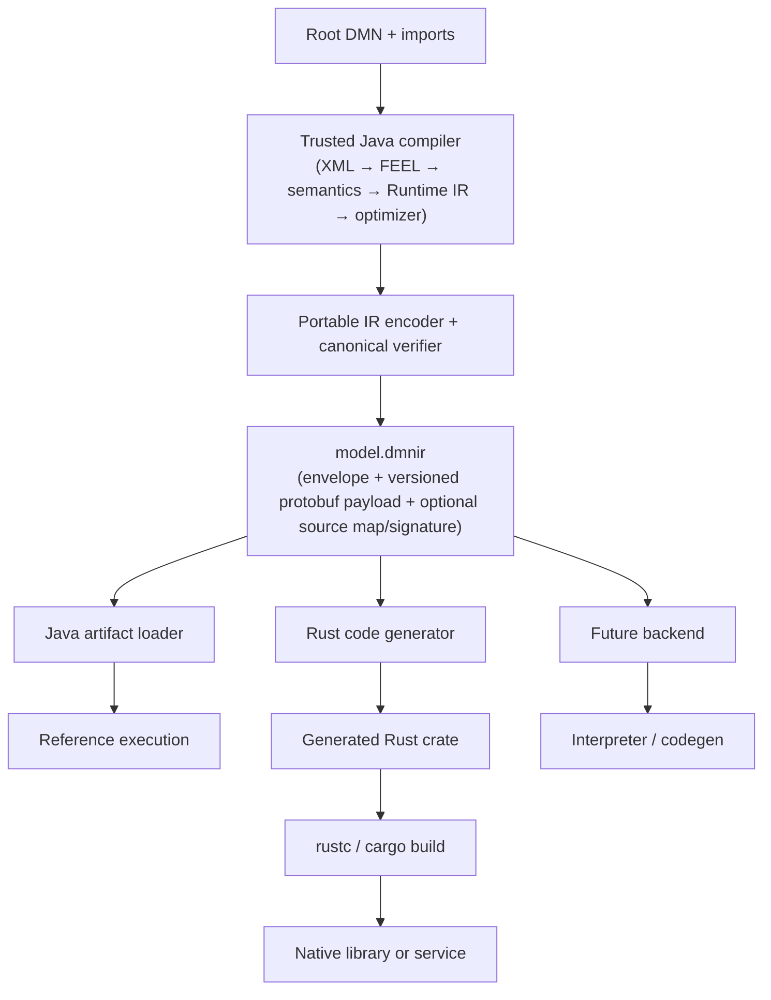
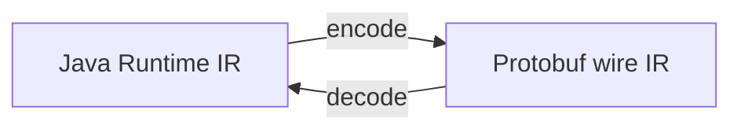
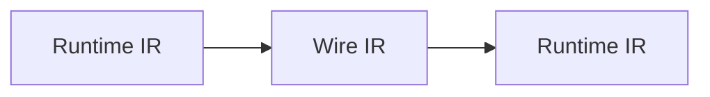
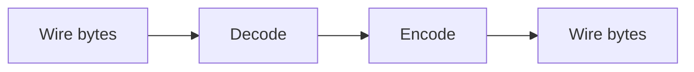

# IDEA-003 — Portable Runtime IR Artifact

Status: exploring  
Created: 2026-08-02  
Owner: compiler, runtime, platform, and language-backend teams  
Related milestones: P3 — Runtime semantic baseline; P4 — Stable compiled-model API; P5 — Java code generation; P6 — Performance validation  
Architecture trigger: [Runtime IR serialization](../architecture/chapters/12-Runtime%20IR.md#915-runtime-ir-serialization)

## Idea summary

Define a versioned Protobuf representation of optimized Runtime IR and package it as a portable,
deterministic artifact. A trusted compiler produces the artifact once from a linked DMN model set.
Other environments can validate and consume it without XML or FEEL parsing, then interpret it or
compile it into native generated code such as Rust.

The intended product capability is:

> Compile DMN once, verify the artifact, and deploy semantically equivalent decisions to multiple
> language runtimes and target platforms.

The Protobuf message is the transport representation, not by itself the complete compatibility
contract. Portable execution also requires explicit schema versions, semantic-runtime versions,
required capabilities, validation limits, stable operation identifiers, canonical values, and
cross-backend conformance evidence.

## Product hypothesis

If a DMN model set can be compiled into a language-neutral, content-addressed Runtime IR artifact,
then teams can separate model compilation from deployment, avoid shipping compiler dependencies to
runtime environments, generate native code in languages such as Rust, and prove backend parity from
one immutable input.

## Users and value

| User | Need | Value provided |
| --- | --- | --- |
| Platform team | Compile centrally and deploy to heterogeneous environments | One signed, versioned artifact independent of DMN parsing |
| Rust/backend developer | Implement code generation without recreating the DMN frontend | Typed executable graph with stable semantics and operations |
| Application developer | Run decisions with a small runtime footprint | No XML, ANTLR, semantic analysis, or Java compiler dependency |
| Release engineer | Reproduce exactly what was deployed | Content digest, compiler provenance, capability manifest, and deterministic bytes |
| Security reviewer | Treat distributed artifacts as untrusted input | Bounded decoding, structural verification, signatures, and explicit policy |
| Model owner | Know all targets execute the same policy | Shared corpus and cross-backend behavioral parity evidence |

## Product principles

1. **Portable semantics, not portable Java objects.** The schema is designed independently of Java
   record layouts and is not generated by reflecting over them.
2. **One authoritative lowering pipeline.** Target backends consume verified Runtime IR; they do not
   reinterpret DMN XML or FEEL source.
3. **Wire compatibility is not semantic compatibility.** An artifact declares both its schema
   version and the semantic contract it requires.
4. **Deterministic artifacts.** Identical compiler inputs, options, and versions produce identical
   canonical bytes and digests.
5. **Reject unsupported behavior early.** A consumer validates required capabilities before
   interpretation or code generation.
6. **Deserialization is hostile-input handling.** Bounds and invariants are checked before expensive
   allocation, compilation, or execution.
7. **Generated backends prove parity.** Rust, Java, and the reference interpreter run the same
   observable-behavior corpus.
8. **Source provenance remains traceable.** Deployment does not require source, but an optional
   source map and model manifest support diagnostics and audit.

## Desired outcomes

- A successful compilation can emit a deterministic `.dmnir` artifact for a complete linked model
  set.
- A consumer can determine compatibility without attempting code generation or execution.
- Java can deserialize the artifact back into validated process-local Runtime IR without semantic
  loss.
- A minimal Rust consumer can validate the artifact and generate executable Rust for a supported
  scalar subset.
- The reference interpreter, direct Java lowering, deserialized Java IR, and generated Rust produce
  equivalent values and errors on the shared supported corpus.
- Runtime environments need neither DMN XML nor the FEEL parser, semantic protobuf model, or semantic
  analyzer.
- Artifacts are content-addressable, attributable to compiler inputs, and optionally signable.

## Non-goals

- Serializing current Java records directly or treating Java enum ordinals as stable IDs.
- Reusing the existing semantic-model protobuf messages as Runtime IR persistence.
- Making the first schema capable of representing every future optimization.
- Requiring every consumer to support every capability.
- Using Protobuf compatibility rules as a substitute for an artifact lifecycle policy.
- Embedding arbitrary native code or executable plugins in the portable artifact.
- Promising that artifacts remain executable forever without migration or recompilation.
- Replacing DMN XML as the editable and interoperable source format.

## Product boundary

The proposal separates three contracts:

```text
DMN source contract
  Human/tool interchange and authoritative editable policy

Portable Runtime IR artifact contract
  Versioned executable meaning distributed between trusted compilation and consumers

Generated target artifact contract
  Rust source/crate, Java source/JAR, native library, WASM module, or service package
```

These contracts have distinct ownership and compatibility lifetimes. A DMN source can be
recompiled into a newer IR schema; an IR artifact can generate different target artifacts; target
binary compatibility is owned by its backend and platform.

## Proposed delivery architecture



## Portable artifact design

### Envelope

The outer envelope should be deliberately small and stable. Illustrative fields:

```proto
message RuntimeIrArtifact {
  ArtifactFormatVersion format_version = 1;
  string semantic_contract = 2;
  string compiler_id = 3;
  string compiler_version = 4;
  bytes source_model_set_digest = 5;
  bytes payload_digest = 6;
  repeated CapabilityRequirement required_capabilities = 7;
  RuntimeModelPayload payload = 8;
  optional SourceMap source_map = 9;
  map<string, string> metadata = 10;
}
```

The committed schema must avoid unconstrained metadata in canonical hashing unless its ordering and
allowed keys are precisely defined. Signature material is preferably a surrounding distribution
manifest or a clearly excluded envelope section, so signing does not create recursive digests.

### Version dimensions

At least four independent dimensions are required:

| Dimension | Meaning | Compatibility action |
| --- | --- | --- |
| Artifact format major/minor | Protobuf structure and encoding contract | Reject unknown major; accept newer minor only under defined rules |
| Semantic contract version | FEEL operations, null/error behavior, decision-table semantics | Consumer must implement the declared version or a proven compatible version |
| Capability set | Optional expressions, built-ins, host bindings, optimizations | Reject missing required capabilities before loading |
| Compiler provenance | Producer implementation and release | Used for audit, reproduction, policy, and defect workarounds—not semantic dispatch |

An artifact being decodable does not mean it is executable. Capability negotiation must complete
before the payload is materialized into a backend-specific graph.

### Schema packages

Use a new schema family owned by Runtime IR, for example:

```text
dmn-runtime-ir-schema/
  src/main/proto/io/finmsg/dmn/runtime/ir/v1/
    artifact.proto
    model.proto
    types.proto
    values.proto
    expressions.proto
    decision_table.proto
    capabilities.proto
    source_map.proto
```

Do not add this schema to the semantic `dmn-protobuf` package merely because both use Protobuf. The
semantic model and executable artifact have different purposes, consumers, and evolution policies.

### Stable representation rules

- Assign every operation, built-in, type, hit policy, and capability an explicit stable numeric ID.
- Reserve removed field numbers and enum values permanently.
- Do not persist Java class names, enum ordinals, object identity, hash-map iteration order, or
  platform paths.
- Canonicalize decimals without precision loss; define negative zero and scale behavior.
- Encode dates, times, date-times, and both duration families explicitly rather than as locale-bound
  strings unless canonical lexical encoding is part of the contract.
- Preserve list order; define whether context field order is semantic or canonical-only.
- Store references by validated dense IDs or indices with declared bounds.
- Separate required semantic nodes from optional debug/source metadata.
- Define deterministic protobuf serialization rules and test actual bytes, not only message equality.

## Runtime IR and wire model relationship

Use explicit bidirectional mapping:



The wire schema should express executable meaning cleanly across languages. It need not reproduce
every internal optimizer cache or Java convenience type. Conversely, a Java Runtime IR feature may
not be distributable until it has a stable wire representation and declared capability.

Round-trip requirements:



must preserve observable behavior and stable identities, while:



must reproduce canonical bytes for accepted canonical artifacts.

## Rust backend

### Recommended first shape

Begin with a Rust command-line compiler rather than embedding a long-running service:

```text
dmnir-rust generate \
  --input model.dmnir \
  --output generated/card-fraud \
  --crate-name card_fraud_decisions
```

Its phases:

1. Decode the Protobuf envelope with strict byte, depth, count, and string limits.
2. Validate format version, payload digest, semantic contract, and required capabilities.
3. Revalidate all graph, slot, type, lexical-frame, decision-table, and constant-pool invariants.
4. Convert to a Rust-native immutable IR owned by the backend.
5. Generate deterministic Rust source and a manifest of required runtime helpers.
6. Format and compile in tests.
7. Execute shared parity vectors and report semantic mismatches.

### Generated code boundary

Generated Rust should use direct native control flow for decisions and specialized tables. A small,
versioned Rust semantic-runtime crate may provide shared behavior for decimals, FEEL null/error
semantics, temporal values, collections, built-ins, and host-value conversion.

Fully standalone generated source sounds attractive but would duplicate complex FEEL semantics into
every artifact. The initial recommendation is a versioned helper crate with explicit semantic
contract compatibility. Revisit standalone generation only when deployment constraints require it.

### Rust numeric and value semantics

Rust primitive types alone are insufficient for full FEEL parity. The backend must define:

- arbitrary or declared-precision decimal behavior;
- null and evaluation-error propagation;
- three-valued boolean logic;
- heterogeneous lists and contexts where required;
- date, time, date-time, and duration operations;
- stable ordering and equality semantics;
- safe recursion, collection, and execution limits.

Backend completion is measured by behavioral parity, not merely successful Rust compilation.

## Artifact validation and security

Distributed IR must be treated as untrusted even if most artifacts are produced internally.

Validation layers:

1. **Transport:** maximum artifact bytes, parse depth, field counts, string sizes, decompression ratio.
2. **Envelope:** versions, capabilities, digest, compiler policy, optional signature and trust chain.
3. **Structure:** unique IDs, valid references, acyclic required graphs, legal evaluation order,
   bounded slots and frames, table dimensions, constant indices.
4. **Semantics:** operation/type compatibility, valid built-in signatures, supported value forms,
   required runtime behavior.
5. **Code generation:** escaped identifiers, bounded generated output, no artifact-controlled file
   traversal, no injected source text, resource budgets.
6. **Execution:** time, memory, recursion, collection, and host-function limits.

Unknown required capabilities fail closed. Invalid artifacts produce structured diagnostics and are
never partially executed.

## Distribution model

The `.dmnir` artifact can initially be one canonical binary Protobuf file. A later bundle may add a
manifest, source map, detached signature, test vectors, and provenance attestation:

```text
card-fraud-1.4.2.dmnbundle
  manifest.json
  model.dmnir
  model.dmnir.sig
  source-map.pb
  parity-vectors.pb
```

If a bundle is introduced, use a specified deterministic archive format and protect extraction from
path traversal and decompression bombs. Do not invent bundling until a real distribution channel
needs more than the single artifact.

Potential channels include Maven artifacts, OCI registries, generic artifact repositories, or a
model registry. Distribution-channel selection is separate from the wire schema.

## Product tools

Suggested commands:

```text
dmn compile --root model.dmn --emit-ir model.dmnir
dmnir inspect model.dmnir
dmnir verify model.dmnir --policy production-policy.yaml
dmnir diff old.dmnir new.dmnir
dmnir migrate --to-format 2 model.dmnir
dmnir-rust generate --input model.dmnir --output generated/model
dmnir parity --artifact model.dmnir --backend rust --vectors corpus/
```

`inspect` should expose metadata, decisions, inputs, types, required capabilities, semantic version,
and fingerprints without dumping sensitive constants by default. `diff` should distinguish metadata,
public contract, graph, constant, operation, and source-map changes.

## Delivery options

| Option | Scope | Benefit | Cost and risk |
| --- | --- | --- | --- |
| A — Persistence spike | Serialize a small scalar Runtime IR subset and round-trip in Java | Validates schema shape and determinism | No true cross-language proof; easy to overfit to Java records |
| B — Portable artifact MVP | Versioned envelope, scalar/list/context IR, strict validator, Java loader, minimal Rust codegen, parity corpus | Proves the product proposition end to end | Requires real compatibility and semantic-runtime decisions |
| C — Multi-language deployment platform | Registry, signing, migrations, Java/Rust/WASM backends, rollout tooling | Strong platform product | Large operational and long-term compatibility commitment |

**Recommendation:** build a short Option A schema spike, but accept its design only through an
Option B vertical slice. Rust consumption is essential evidence that the schema is language-neutral;
a Java-only round trip is insufficient.

## Proposed delivery slices

| ID | Slice | Exit evidence |
| --- | --- | --- |
| PIR.1 | Consumer and compatibility ADR | Rust-generation use case, artifact lifetime, trust boundary, schema policy, and supported semantic baseline are approved |
| PIR.2 | Versioned envelope and scalar schema | Constants, types, inputs, scalar expressions, decisions, dependencies, and capabilities have stable Protobuf representations |
| PIR.3 | Deterministic Java codec | Runtime IR round-trips with canonical bytes, fingerprints, limits, and structured failures |
| PIR.4 | Artifact verifier and inspection CLI | Compatibility and invariants can be checked without executing the model |
| PIR.5 | Minimal Rust reader and native IR | Rust independently decodes, negotiates capabilities, validates, and owns the supported graph |
| PIR.6 | Scalar Rust code generation | Generated Rust compiles and matches the interpreter for scalar expressions and direct dependencies |
| PIR.7 | Structured values and functions | Contexts, lists, frames, functions/BKMs, and host conversion have parity |
| PIR.8 | Decision tables and full supported corpus | Generated Rust specializes decision tables and passes shared conformance cases |
| PIR.9 | Artifact provenance and distribution | Digests, optional signing, publishing, retrieval, and policy verification are reproducible |
| PIR.10 | Evolution and migration harness | Golden artifacts from older versions verify compatibility, rejection, or deterministic migration |

## MVP boundary

The portable artifact MVP is complete when:

- the Runtime IR wire schema is separate from the semantic protobuf schema;
- the envelope declares format, semantic contract, compiler provenance, source digest, payload digest,
  and required capabilities;
- Java encoding is byte-deterministic and bounded Java decoding revalidates all invariants;
- golden artifacts exercise compatible minor evolution and incompatible-major rejection;
- a non-Java Rust consumer independently validates the artifact;
- Rust code generation supports scalar decisions, direct dependencies, inputs by stable name, exact
  decimals, null/error behavior, and deterministic output;
- generated Rust compiles and passes shared interpreter parity cases;
- unsupported capabilities fail before generation with structured diagnostics;
- source DMN can always be associated with the artifact digest and compiler configuration;
- the compatibility and support policy is documented in an ADR.

## Success measures

| Measure | MVP target |
| --- | --- |
| Determinism | Identical inputs and compiler configuration produce identical canonical artifact bytes |
| Losslessness | Java IR encode/decode preserves all supported observable behavior |
| Language neutrality | Rust implements the schema without depending on Java layout knowledge |
| Compatibility clarity | Every artifact is accepted or rejected before generation for an explicit version/capability reason |
| Parity | All declared-supported shared cases return equivalent values and errors in interpreter and generated Rust |
| Safety | Malformed, oversized, cyclic, and reference-invalid artifacts fail within bounded resources |
| Traceability | Artifact digest maps to source-model-set digest, compiler version, options, and evidence corpus |
| Runtime independence | Generated Rust execution requires no DMN XML, FEEL parser, semantic analyzer, or Java runtime |

## Major risks and mitigations

| Risk | Mitigation |
| --- | --- |
| Java implementation details leak into schema | Require Rust implementation review before v1 freeze; use explicit mapping layers |
| Protobuf compatibility masks semantic drift | Separate semantic contract and capability versions; parity golden tests |
| Schema freezes immature Runtime IR | Start experimental `v1alpha`; limit MVP; define migration and expiry policy |
| Different decimal/temporal behavior across languages | Normative value semantics, shared vectors, exact libraries, cross-backend property tests |
| Malicious artifacts exhaust decoder or code generator | Strict pre-allocation bounds, invariant verifier, generation budgets, fuzzing |
| Unknown operations are ignored | Required capabilities and unknown required nodes fail closed |
| Artifacts cannot be debugged | Optional compact source map and stable public names without runtime source dependency |
| Generated code becomes semantically independent | Versioned helper runtime and one shared parity corpus |
| Long-term artifact support becomes costly | Publish support windows; prefer source recompilation; add migrations only for justified lifetimes |
| Signing is confused with correctness | Signature proves provenance only; always perform structural and semantic validation |

## Decision gates

### Gate 1 — Contract readiness

Do not version the schema until P3 defines the supported semantic baseline, stable operation IDs,
null/error behavior, and canonical value rules for the MVP subset.

### Gate 2 — Language neutrality

Do not declare `v1` stable until an independent Rust implementation consumes the schema without
Java-specific workarounds and passes shared parity cases.

### Gate 3 — Compatibility commitment

Do not promise durable artifact compatibility until the product owner approves the supported
lifetime, migration responsibilities, deprecation process, and distribution use cases.

### Gate 4 — Production distribution

Do not accept artifacts in a production generator or runtime until resource limits, invariant
validation, provenance policy, fuzzing, and rollback/recompilation paths are operational.

## Open product and architecture decisions

| ID | Decision | Needed by |
| --- | --- | --- |
| PIR-D01 | What is the first artifact consumer and required deployment lifetime? | PIR.1 |
| PIR-D02 | Which Runtime IR and FEEL capabilities form the MVP semantic contract? | PIR.1 |
| PIR-D03 | Is compatibility guaranteed across patch, minor, or only explicitly listed compiler releases? | PIR.1 |
| PIR-D04 | Which canonical decimal, temporal, null, and error representations are normative? | PIR.2 |
| PIR-D05 | Is source mapping embedded, detached, optional, or prohibited in production artifacts? | PIR.2 |
| PIR-D06 | Does generated Rust depend on a versioned helper crate or emit standalone semantics? | PIR.6 |
| PIR-D07 | Which artifact limits are compile-time policy versus encoded producer hints? | PIR.4 |
| PIR-D08 | Is the first distribution channel filesystem, Maven, OCI, or a model registry? | PIR.9 |
| PIR-D09 | Are signatures required, and which identity/trust system owns them? | PIR.9 |
| PIR-D10 | When is migration preferable to recompilation from authoritative DMN source? | PIR.10 |

## Recommended first experiment

Choose a tiny but complete linked Runtime IR model containing:

- named inputs and decisions;
- exact decimal, string, boolean, and null constants;
- arithmetic, comparison, and three-valued boolean operations;
- direct decision dependencies;
- one structured output;
- one deliberately unsupported capability.

Implement only:

1. an experimental `v1alpha1` Protobuf schema;
2. a Java encoder, bounded decoder, and invariant verifier;
3. canonical byte and golden-file tests;
4. a small Rust decoder and validator;
5. Rust source generation for the supported expressions;
6. shared input/output vectors executed by Java and Rust.

The experiment succeeds when both languages agree on outputs and errors, the unsupported capability
is rejected before generation, and malformed artifacts fail safely. It should reveal schema design
problems before a public compatibility commitment.

## Relationship to the development plan

This idea supplies the concrete distributed-artifact consumer anticipated by the current Runtime IR
architecture. If promoted, PIR.1 must first produce an ADR defining compatibility lifetime and
deployment constraints, as required by the architecture chapter.

P3 should establish the semantic baseline before the portable contract freezes. P4 provides stable
external names and metadata. P5's Java generator and the proposed Rust generator should consume the
same optimized meaning. P6 supplies reproducible performance comparisons but must not replace parity
evidence.

This should become a distinct **portable artifact and cross-language backend track**, not part of
typed Protobuf/gRPC API generation. The two both use Protobuf but serve different contracts:

- portable Runtime IR Protobuf describes executable compiler output for trusted backends;
- typed API Protobuf describes application-facing request and response messages across a service
  boundary.

