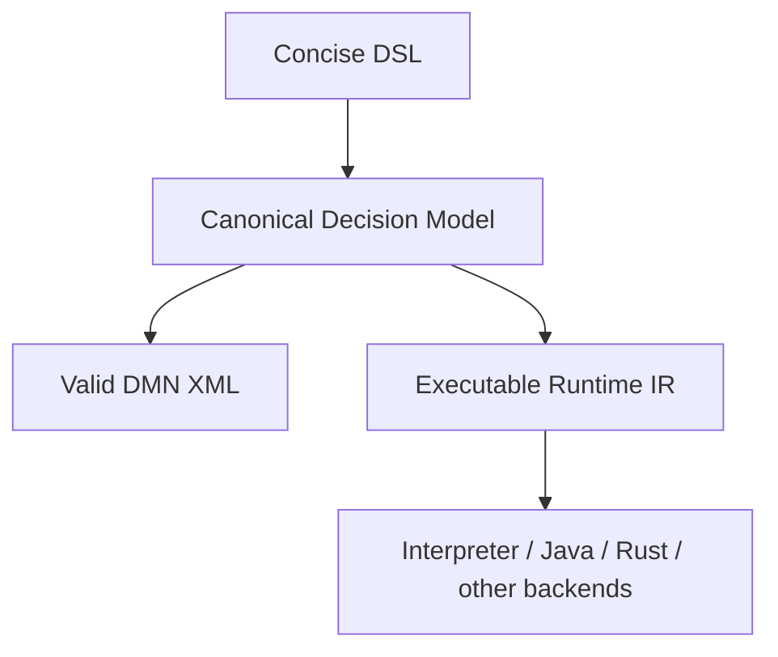
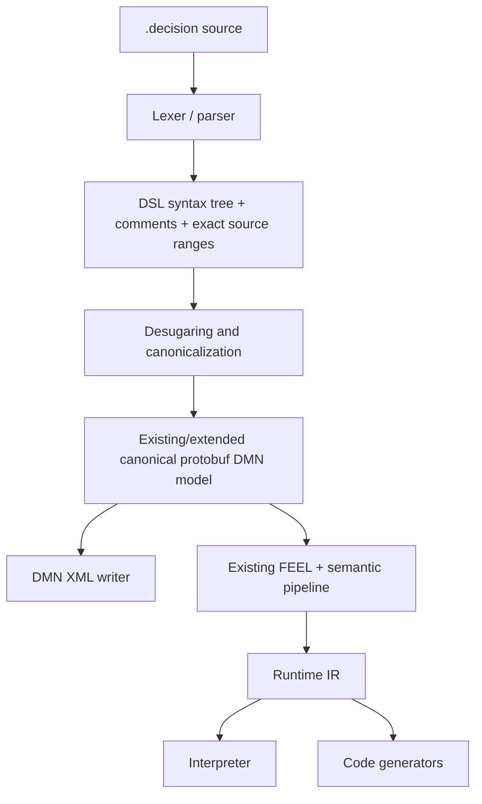
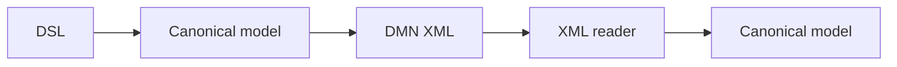

# IDEA-004 — Decision Authoring DSL and Canonical Model

Status: exploring  
Created: 2026-08-02  
Owner: product, language, compiler, and decision-authoring teams  
Related milestones: P1 — Compiler facade; P2 — Real model corpus; P4 — Stable compiled-model API; P5 — Java code generation; IDEA-003 — Portable Runtime IR Artifact

## Idea summary

Create a concise textual DSL for defining decision models without DMN XML boilerplate. The DSL
supports inputs, types, decisions, FEEL expressions, decision tables, reusable functions/BKMs,
imports, tests, and documentation. It compiles through the toolkit into executable Runtime IR and
therefore into interpreters or generated target code.

The same authored model can also be exported as valid standards-compliant DMN XML for interchange
with DMN tools and organizations that do not use the DSL.

The recommended product model is:



The canonical decision model—not optimized Runtime IR—should preserve authoring intent. Runtime IR
is execution-oriented and may discard names, documentation, original expressions, rule identities,
and other information required for faithful DMN generation.

## Product hypothesis

If developers and decision analysts can express standards-aligned decision logic in a compact,
review-friendly language, then they can create, understand, test, and version decisions faster than
working directly with verbose DMN XML while retaining access to the DMN ecosystem and optimized
execution backends.

## Users and value

| User | Need | Value provided |
| --- | --- | --- |
| Application developer | Define business decisions near code without XML ceremony | Concise text, fast validation, generated native code |
| Decision analyst | Read and change rules with clear tables and business names | Reviewable syntax, examples, documentation, DMN export |
| Model owner | Retain vendor-neutral interchange | Deterministic valid DMN XML generated from the canonical model |
| Reviewer | Understand semantic changes in Git | Stable formatting and semantic diffs rather than noisy XML diffs |
| Platform team | Use one decision definition across runtime targets | Shared Runtime IR and backend generation pipeline |
| Tool author | Build editors and automation around a stable language | Grammar, language server, formatter, schema, and compiler APIs |

## Product principles

1. **Concise, not magical.** Remove ceremony while keeping types, dependencies, hit policies, null
   behavior, and external effects explicit.
2. **DMN-aligned semantics.** The DSL offers better syntax, not a second incompatible decision
   language.
3. **Canonical model before Runtime IR.** Preserve authoring constructs before execution lowering.
4. **One semantic pipeline.** DSL and DMN XML converge before FEEL analysis, type checking,
   dependency resolution, and Runtime IR lowering.
5. **Deterministic in both directions.** Formatting, diagnostics, canonical model, DMN XML, and
   Runtime IR are reproducible.
6. **Text is first-class.** Git review, merge behavior, source ranges, comments, and tooling quality
   are product features.
7. **Generated DMN is honest.** Export only constructs with defined DMN mappings; extensions and
   losses are explicit.
8. **Tests live beside policy.** Examples and invariants are easy to author and can be excluded from
   production execution artifacts.

## Source-of-truth recommendation

Support two intentional authoring modes:

| Mode | Authoritative source | Generated artifacts |
| --- | --- | --- |
| DSL-owned model | `.decision` DSL file | DMN XML, Runtime IR, generated code, documentation |
| DMN-owned model | `.dmn` XML file | Canonical model, Runtime IR, generated code |

Do not encourage alternating edits between generated DMN XML and its DSL source. Bidirectional
syntax round-tripping creates conflicting authorities, comment loss, layout churn, and ambiguous
merge behavior.

For a DSL-owned model, generated DMN XML is an interchange artifact and carries generation
provenance. If a user wants to adopt edited DMN XML as the new source, provide an explicit import or
conversion workflow with a reviewed semantic diff.

## Why Runtime IR cannot be the only stored model

Runtime IR is designed for efficient execution. Optimizing it may:

- replace business names with slots and indices;
- fold constants and simplify expressions;
- specialize decision tables;
- erase syntactic choices that have equivalent behavior;
- omit documentation, annotations, diagram layout, extensions, and original source locations;
- combine linked models into one namespace-free execution graph;
- introduce operations that have no direct DMN authoring construct.

Consequently, converting arbitrary optimized Runtime IR back to DMN can at best produce a newly
synthesized, behaviorally related model. It cannot generally reproduce the original authored model.

Recommended layers:

```text
Surface syntax
  DSL text or DMN XML, including source ranges and comments/layout where applicable

Canonical Decision Model
  Lossless DMN-aligned semantics, stable element identities, names, namespaces, documentation,
  types, expressions, tables, imports, and optional diagram/interchange metadata

Semantic result
  Resolved symbols, inferred types, diagnostics, and deterministic dependencies

Runtime IR
  Namespace-free, slot-based executable graph optimized for interpreters and generators
```

The repository's existing protobuf DMN model is the natural starting point for the canonical model.
The spike should determine which stable identities, provenance, authoring metadata, and normalized
constructs must be added rather than inventing a second overlapping semantic tree.

## Illustrative DSL

The syntax below demonstrates product intent only; it is not a committed grammar.

```text
model FraudScreening
  namespace "https://finmsg.io/decisions/fraud"
  version "1.0"

type Transaction = {
  amount: decimal
  country: string
  cardPresent: boolean
  attempts24h: integer
}
input transaction: Transaction
input customerRisk: decimal
decision highVelocity: boolean =
  transaction.attempts24h >= 6

decision riskBand: string table hit first {
  customerRisk, transaction.amount => result
  >= 0.90,      -                  => "critical"
  >= 0.70,      > 1000             => "high"
  -,            > 5000             => "high"
  -,            -                  => "normal"
}

decision action: string table hit first {
  riskBand,  highVelocity, transaction.cardPresent => action
  "critical", -,           -                       => "block"
  "high",     true,        -                       => "review"
  "high",     -,           false                   => "review"
  -,          -,           -                       => "approve"
}

test "critical risk is blocked" {
  given transaction = {
    amount: 250,
    country: "CH",
    cardPresent: true,
    attempts24h: 1
  }
  given customerRisk = 0.96
  expect action = "block"
}
```

Possible reusable logic:

```text
function normalizedRisk(score: decimal, attempts: integer): decimal =
  min([1, score + attempts * 0.01])

decision adjustedRisk = normalizedRisk(customerRisk, transaction.attempts24h)
```

Possible imports:

```text
import CustomerRisk from
  "https://finmsg.io/decisions/customer-risk"
  at "customer-risk.decision"

decision customerRisk = CustomerRisk.riskScore(customer)
```

## Language scope

### MVP constructs

- model name, namespace, version, and documentation;
- primitive and structured types;
- named inputs;
- literal FEEL decisions;
- decision tables with explicit hit policy;
- lists and contexts;
- reusable functions/BKMs;
- local and imported decision dependencies;
- stable element IDs, generated automatically when omitted but materializable by the formatter;
- examples/tests with inputs and expected named outputs;
- comments and source-accurate diagnostics.

### Later constructs

- relations, boxed contexts, iterations, filters, quantified expressions, and every supported DMN
  boxed expression;
- decision services;
- allowed values and richer constraints;
- external Java/PMML functions with explicit host policies;
- diagram layout hints;
- authoring macros that expand into canonical DMN constructs;
- tuning annotations used by IDEA-002;
- module/package dependency management.

### Avoid initially

- arbitrary user-defined syntax extensions;
- implicit I/O, database access, or network calls;
- general-purpose loops or mutable variables;
- whitespace-sensitive semantics;
- macros that cannot be expanded into inspectable canonical constructs;
- embedding target-language Java or Rust source;
- constructs that cannot declare whether DMN export is exact, normalized, extended, or unavailable.

## DMN export fidelity

Each DSL construct must declare one export classification:

| Classification | Meaning |
| --- | --- |
| `exact` | Maps directly to a standard DMN construct without semantic loss |
| `normalized` | Produces valid equivalent DMN but may use different surface structure |
| `extension` | Requires a namespaced DMN extension and is not portable to all tools |
| `not exportable` | Cannot generate valid behaviorally equivalent DMN; compilation fails when DMN output is requested |

The MVP should admit only `exact` and carefully reviewed `normalized` constructs. A command such as
`decision export-dmn` must print or emit a machine-readable fidelity report.

Generated DMN should include:

- deterministic IDs, namespaces, element ordering, and QName prefixes;
- FEEL expressions represented through the supported XML frontend model;
- documentation and declared types;
- imports and references with stable identities;
- optional DMNDI diagram data when a deterministic layout strategy exists;
- provenance identifying the DSL source digest and compiler version.

Valid DMN XML does not necessarily include a beautiful diagram. Diagram interchange and automatic
layout should be a separate product capability from semantic validity.

## Compiler architecture



The DSL frontend should depend on canonical model contracts. Semantic analysis must not depend on
DSL syntax-tree classes. This keeps DMN XML and DSL authoring as equivalent frontends into one
compiler core.

## Recommended tools

### Parser

Use ANTLR, consistent with the existing FEEL parser, for a committed grammar with source ranges and
recoverable diagnostics. Keep FEEL expressions as a defined grammar region rather than parsing them
with fragile string splitting. Reuse the existing FEEL parser after extracting or composing the
expression text when practical.

Before freezing syntax, test a small hand-written parser prototype against representative examples.
Grammar implementation is inexpensive compared with changing an awkward public language later.

### Formatter

Provide one canonical formatter early. Stable formatting is essential for Git review and prevents
style configuration from becoming part of language compatibility.

### Language server

After the grammar and canonical model stabilize, add an LSP server for:

- syntax and semantic diagnostics;
- completion for inputs, decisions, types, fields, and built-ins;
- go-to-definition and find references;
- hover types and documentation;
- decision dependency views;
- formatting and safe rename;
- inline test execution;
- preview of generated DMN and decision tables.

Do not make an IDE extension the first milestone. The CLI, parser, formatter, and diagnostics should
be independently usable and testable.

### CLI

Suggested commands:

```text
decision check fraud.decision
decision format fraud.decision
decision test fraud.decision
decision compile fraud.decision --emit-ir fraud.dmnir
decision export-dmn fraud.decision --output fraud.dmn
decision import-dmn fraud.dmn --output fraud.decision
decision diff --semantic baseline.decision candidate.decision
decision explain fraud.decision --decision action
```

`import-dmn` should be described as deterministic conversion into canonical DSL, not source-preserving
round-trip editing. It may normalize layout, IDs, expression formatting, and constructs.

## Testing strategy

### Golden syntax tests

- parse valid and invalid examples;
- assert exact source ranges and recovery diagnostics;
- format twice and obtain identical bytes;
- parse-format-parse into equivalent canonical models.

### Canonical-model parity

Equivalent DSL and DMN fixtures should produce the same normalized canonical semantics, semantic
diagnostics, dependency order, and Runtime IR behavior.

### DMN export



must preserve all declared exportable semantics. The generated XML should validate against supported
DMN schema/version rules and execute identically through the compiler.

### Runtime parity

DSL and generated DMN must return equivalent values and errors through the interpreter and future
Java/Rust generators on the shared corpus.

### Property and fuzz testing

Generate bounded canonical models or DSL fragments and verify parser termination, formatter
idempotence, export/read equivalence, deterministic diagnostics, and resource limits.

## Product tools and experiences

Potential differentiated capabilities after the MVP:

- semantic Git diffs showing renamed decisions, changed thresholds, added rules, or altered hit
  policies;
- generated Markdown/HTML decision documentation;
- executable examples as policy documentation;
- IDE decision-table projection with text as the underlying source;
- impact analysis for a changed input, type, function, or decision;
- direct annotations for tunable parameters from IDEA-002;
- generation of portable `.dmnir` artifacts from IDEA-003;
- preview of Java/Rust code generation without making generated code authoritative.

## Delivery options

| Option | Scope | Benefit | Cost and risk |
| --- | --- | --- | --- |
| A — Embedded concise frontend | Inputs, types, literal decisions, simple tables, DMN export | Tests the language proposition quickly | Limited usefulness; syntax may be frozen too early |
| B — Authoring DSL MVP | Stable grammar, formatter, tests, imports, core boxed expressions, canonical model, deterministic DMN export, CLI | Credible developer product and DMN interoperability | Requires language-design discipline and canonical identity policy |
| C — Decision development environment | LSP, visual table projection, semantic diff, documentation, package registry, tuning integration | Strong end-to-end product | Significant tooling and compatibility commitment |

**Recommendation:** run Option A as an explicitly experimental syntax laboratory, then promote a
revised grammar into Option B. Do not promise stable source compatibility until real users have
authored and reviewed multiple business-shaped models.

## Proposed delivery slices

| ID | Slice | Exit evidence |
| --- | --- | --- |
| DSL.1 | Language goals and example corpus | Multiple business-shaped examples establish readability, boilerplate reduction, and DMN mapping |
| DSL.2 | Canonical-model and identity decision | ADR defines source authority, stable IDs, provenance, export fidelity, and Runtime IR separation |
| DSL.3 | Experimental parser and diagnostics | Types, inputs, literals, and tables parse with precise multi-error locations |
| DSL.4 | Desugaring into canonical model | DSL and equivalent DMN produce semantically equivalent canonical models |
| DSL.5 | Formatter and source compatibility policy | Formatting is idempotent; experimental/stable language version behavior is documented |
| DSL.6 | Deterministic DMN export | Exported DMN is valid, readable by this and independent tools, and behaviorally equivalent |
| DSL.7 | Inline tests and CLI | Check, format, test, compile, export, and semantic-diff workflows are reproducible |
| DSL.8 | Core authoring coverage | Imports, BKMs/functions, contexts, lists, constraints, and selected boxed expressions support the P2 corpus |
| DSL.9 | Language server | Completion, navigation, hover types, rename, formatting, and test feedback work in a reference editor |
| DSL.10 | Advanced product tools | Documentation, visual projections, tuning annotations, and portable artifact output are validated by demand |

## MVP boundary

The authoring DSL MVP is complete when:

- representative models can define namespaces, types, inputs, literal decisions, decision tables,
  dependencies, imports, reusable functions, documentation, and inline tests concisely;
- the parser produces precise recoverable diagnostics and obeys input limits;
- the formatter is deterministic and idempotent;
- DSL lowering uses the shared canonical DMN model and existing semantic pipeline;
- equivalent DSL and DMN sources produce equivalent Runtime IR behavior;
- every MVP construct is classified `exact` or `normalized` for DMN export;
- generated DMN XML is deterministic, valid for the supported DMN version, readable back into the
  compiler, and behaviorally equivalent;
- Runtime IR and generated code can be emitted without requiring generated DMN as an intermediate;
- inline examples run through named input and decision APIs;
- source-language compatibility and generated-artifact provenance are documented.

## Success measures

| Measure | MVP target |
| --- | --- |
| Boilerplate reduction | Business-shaped examples are materially shorter and clearer than equivalent DMN XML |
| Reviewability | Policy reviewers can identify changed inputs, thresholds, rules, and outputs from a text diff |
| Determinism | Format, canonical model, DMN XML, diagnostics, and Runtime IR are stable for identical inputs |
| DMN interoperability | All MVP fixtures export, read back, and execute equivalently |
| Semantic reuse | DSL introduces no separate FEEL/type/runtime semantic implementation |
| Diagnostic quality | Errors identify the DSL source and tight range with actionable messages |
| Tooling latency | Check, format, and focused tests are fast enough for editor feedback on representative models |
| Source clarity | A documented authority rule prevents accidental dual editing of DSL and generated DMN |

After the MVP, measure model authoring time, review time, defect rate, DMN export adoption, editor
usage, and how often users must escape to constructs the DSL does not yet support.

## Major risks and mitigations

| Risk | Mitigation |
| --- | --- |
| DSL becomes a proprietary alternative to DMN | Keep semantics DMN-aligned, publish deterministic DMN export, classify every mapping |
| Runtime IR loses information needed for export | Store canonical authoring model separately; never promise arbitrary IR-to-source round trips |
| Two editable sources drift | Declare one authority per model; generated outputs carry provenance; explicit adoption workflow |
| Syntax is optimized for toy examples | Build an example corpus with tables, functions, imports, structures, nulls, and diagnostics before stability |
| Hidden defaults change behavior | Require explicit hit policies and document all remaining defaults in the canonical model |
| FEEL embedded syntax creates grammar ambiguity | Define clear lexical boundaries and reuse the FEEL parser with source-offset mapping |
| Generated DMN is valid but unreadable in tools | Test independent readers and add optional deterministic diagram layout separately |
| Stable IDs make text noisy | Generate predictable IDs, hide them when safe, materialize them only when external identity is required |
| Formatter churn harms Git history | One formatter from the experimental phase; version changes deliberately |
| Macros obscure actual policy | Delay macros; require inspectable expansion and semantic-diff tooling |
| Language tooling becomes the main project | Stage CLI/parser first; build LSP only after language and user value stabilize |

## Decision gates

### Gate 1 — Language value

Proceed beyond the syntax laboratory only if representative users find the DSL materially clearer
and faster than DMN XML while still recognizing the resulting policy unambiguously.

### Gate 2 — Canonical architecture

Do not expand the grammar until an ADR defines the canonical model, stable identities, source
authority, provenance, export classifications, and separation from Runtime IR.

### Gate 3 — DMN interoperability

Do not call the DSL DMN-compatible until its supported constructs export to valid DMN, read back,
and pass behavioral parity tests. Validate selected outputs with independent DMN tooling.

### Gate 4 — Stable language

Do not declare syntax `v1` until formatting, diagnostics, source compatibility, deprecation, imports,
and package/version behavior have been exercised on the P2 business corpus.

## Open product and language decisions

| ID | Decision | Needed by |
| --- | --- | --- |
| DSL-D01 | Is the primary user a developer, decision analyst, or deliberately both? | DSL.1 |
| DSL-D02 | Which example domains define minimum readability and coverage? | DSL.1 |
| DSL-D03 | Can the existing protobuf model serve as the canonical authoring model, and what metadata is missing? | DSL.2 |
| DSL-D04 | How are stable element identities represented without burdening normal authors? | DSL.2 |
| DSL-D05 | Which FEEL syntax is embedded unchanged versus given DSL shorthand? | DSL.3 |
| DSL-D06 | Which constructs are exact, normalized, extension-based, or not exportable to DMN? | DSL.2–DSL.6 |
| DSL-D07 | Which DMN version is the initial export target? | DSL.6 |
| DSL-D08 | Does generated DMN need DMNDI diagram layout in the MVP? | DSL.6 |
| DSL-D09 | How are imported DSL and DMN modules located and versioned? | DSL.8 |
| DSL-D10 | What source compatibility is promised before and after language `v1`? | DSL.5 |

## Recommended first experiment

Author the same three models in DSL and DMN:

1. a scalar eligibility decision with structured inputs;
2. a multi-rule decision table with an explicit hit policy and null cases;
3. a linked model using an import and reusable BKM/function.

Implement an experimental parser that emits the existing protobuf DMN model, then use the existing
FEEL, semantic, Runtime IR, optimizer, and interpreter pipeline unchanged. Export the canonical model
with the existing DMN XML writer and read it back.

The experiment should answer:

- Is the DSL substantially easier to author and review?
- Can existing canonical/protobuf model contracts represent the authoring intent?
- Where do source ranges, comments, IDs, documentation, or import metadata need extension?
- Can generated DMN round-trip and execute identically?
- Which shorthand creates ambiguity or hides important DMN semantics?

Do not optimize the first grammar for completeness. Optimize it for learning about authoring,
canonical representation, and honest DMN export.

## Relationship to other ideas and the development plan

- P1 supplies the supported compilation orchestration that a DSL frontend should enter.
- P2 provides realistic models that should eventually be expressible in both DMN and DSL.
- P4 supplies stable named evaluation required by inline tests and developer tooling.
- P5 and future Rust generation consume Runtime IR regardless of whether source was DSL or DMN.
- IDEA-002 can annotate stable canonical parameters as tunable without coupling tuning to DSL syntax.
- IDEA-003 can serialize the resulting Runtime IR for distributed cross-language compilation.

This idea should become a distinct **authoring frontend and tooling track**. It must not be implemented
as Runtime IR persistence. The canonical model preserves policy intent and DMN interchange; Runtime
IR preserves executable meaning for efficient backends.

