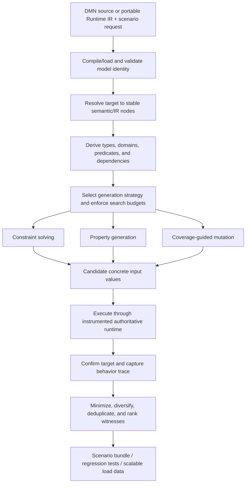

# IDEA-005 — Decision Scenario Synthesizer

Status: exploring  
Created: 2026-08-02  
Owner: product, verification, compiler, and runtime teams  
Related milestones: P2 — Real multi-file DMN corpus; P3 — Runtime semantic baseline; P4 — Stable compiled-model API; P6 — Performance validation  
Related ideas: IDEA-001 — DMN Conformance Accelerator; IDEA-002 — Governed DMN Policy Optimizer; IDEA-003 — Portable Runtime IR Artifact; IDEA-004 — Decision Authoring DSL

## Idea summary

Given a DMN model or validated Runtime IR artifact, generate input data that intentionally provokes
selected behavior. A user declares the behavior they want to reach—such as a decision result, fired
decision-table rule, branch, boundary, error, null path, or dependency combination—and the system
finds one or more concrete input witnesses that cause it.

The witnesses can then be expanded into deterministic datasets for regression, robustness,
distribution, or performance testing.

The intended product capability is:

> Ask for a decision behavior, receive minimal valid inputs that demonstrate it, and replay the
> evidence against any compatible execution backend.

## Product hypothesis

If the toolkit can derive targeted inputs from the same semantic and Runtime IR used for execution,
then policy authors can test hard-to-reach rules, reviewers can obtain evidence for model behavior,
engine developers can increase semantic coverage, and performance teams can create representative
loads without manually constructing every case.

## Users and value

| User | Need | Value provided |
| --- | --- | --- |
| Decision author | Know whether every rule can fire | Concrete witnesses or an explanation of infeasibility |
| Tester | Create regression cases for specific behavior | Replayable named inputs and expected trace/output |
| Reviewer or auditor | Demonstrate why a decision reaches an outcome | Minimal witness plus decision and rule trace |
| Compiler engineer | Exercise rare Runtime IR operations and branches | Coverage-guided and constraint-derived cases |
| Performance engineer | Generate scalable input loads with controlled behavior mix | Dataset expansion with target quotas and deterministic seeds |
| Policy optimizer | Populate boundary and adversarial cases | Targeted scenarios complementing historical data |

## Product principles

1. **Behavior is declared, not inferred from vague prompts.** Targets use stable model, decision,
   rule, operation, and source identities.
2. **Witness generation and load generation are separate.** Finding a satisfying case and producing
   ten million distribution-shaped records require different correctness policies.
3. **Execution confirms every candidate.** Solvers and generators propose inputs; the authoritative
   Runtime IR evaluator verifies the requested behavior.
4. **Valid domains by default.** Generated values respect DMN types, allowed values, ranges, and
   user-declared business constraints unless an invalid-input target explicitly requests otherwise.
5. **Minimal, explainable witnesses first.** Prefer small values and few non-default fields so users
   can understand why behavior was reached.
6. **Infeasibility is a result.** Unsatisfiable targets produce evidence or bounded-search status,
   never a fabricated case.
7. **Deterministic replay.** Model digest, target, constraints, strategy, seed, budgets, and output
   are recorded.
8. **Backend-neutral expectations.** Generated cases can validate the interpreter, Java, Rust, and
   other compatible backends.

## Behavior targets

The product should distinguish public policy targets from internal compiler targets.

### Policy-level targets

- named decision equals, differs from, or falls within a value/range;
- named decision is null or produces a defined evaluation error;
- a specific decision-table rule fires;
- a selected set or sequence of rules fires under a hit policy;
- no rule matches and a default output is selected;
- a BKM/function is invoked with specified argument relationships;
- a decision service produces a requested combination of outputs;
- an imported decision participates in the result;
- a model invariant is satisfied or deliberately violated.

### Structural and boundary targets

- value immediately below, at, and above a comparison threshold;
- each allowed-value member and representative disallowed values;
- null, empty list, singleton list, and bounded larger list;
- first, middle, and last collection elements satisfying a filter;
- overlapping or gapped decision-table rules;
- temporal boundaries such as date cutoffs and duration transitions;
- decimal precision and rounding boundaries.

### Runtime/compiler targets

- a selected Runtime IR node or operation is evaluated;
- both outcomes of a conditional are reached;
- a built-in dispatch ID is exercised;
- selected dependency paths or lexical-frame accesses occur;
- evaluation limits are approached or intentionally exceeded under a safe budget.

Internal targets are useful for engine verification but should not leak unstable Runtime IR slots
into durable user specifications. Stable source identities or capability IDs should address them.

## Declarative scenario request

Illustrative syntax, not a committed schema:

```yaml
apiVersion: finmsg.io/dmn-scenarios/v1alpha1
kind: DecisionScenarioRequest
metadata:
  name: provoke-manual-review
model:
  source: models/card-fraud.dmn
  digest: sha256:...
  namespace: https://finmsg.io/dmn/fraud
targets:
  - id: high-risk-review-rule
    decision: ReviewTransaction
    rule: manual-review-high-risk
    fired: true
  - id: review-output
    decision: Action
    equals: review
inputDomains:
  transaction.amount: { min: 0, max: 100000, scale: 2 }
  transaction.country: { values: [CH, DE, FR, IT] }
  transaction.attempts24h: { min: 0, max: 100 }
  customer.riskScore: { min: 0, max: 1, scale: 4 }

constraints:
  - transaction.amount >= 0
  - transaction.cardPresent implies transaction.channel = "pos"

generation:
  witnesses: 5
  strategy: hybrid
  minimize: [nonDefaultFieldCount, numericMagnitude]
  diversity: [transaction.country, transaction.channel]
  seed: 271828
  timeout: 10s
  maxEvaluations: 100000
output:
  format: jsonl
  includeExpectedResults: true
  includeTrace: true
  includeProvenance: true
```

A boundary request could be concise:

```yaml
targets:
  - around:
      decision: FraudRules
      rule: high-amount
      inputEntry: transaction.amount
    points: [below, exact, above]
```

## Proposed workflow



## Recommended generation strategies

No single algorithm covers full FEEL and DMN behavior. Use a coordinated portfolio behind one
strategy interface.

### 1. Direct boundary synthesis

Extract constants, unary tests, allowed values, and comparison thresholds from the canonical model
or lossless Runtime IR. Generate values below, at, and above each boundary. This is deterministic,
fast, explainable, and should be the first implementation.

Best for:

- decision tables;
- numeric and temporal thresholds;
- allowed values;
- null/empty/non-empty partitions;
- simple conjunctions and disjunctions.

### 2. Constraint solving

Translate a supported, pure subset of FEEL and decision-table predicates into a solver-neutral
constraint model. Use an SMT solver backend for booleans, integers, exact rational/decimal
constraints, strings, enumerations, and selected temporal encodings.

The product contract should not depend directly on one solver. Define an internal constraint IR and
an SPI so a deterministic built-in solver handles simple domains while an optional SMT adapter
handles richer formulas.

Solver results are proposals, not execution truth. Every model is converted back to typed DMN inputs
and confirmed through the runtime.

### 3. Property-based generation

Derive generators from DMN types, allowed values, input-domain declarations, and structural shapes.
Bias generation toward boundaries and under-covered partitions. Shrink successful cases toward
minimal witnesses.

Best for:

- lists and contexts;
- functions and nested structures;
- behavior where precise symbolic translation is unavailable;
- broad robustness exploration.

### 4. Coverage-guided mutation

Instrument Runtime IR evaluation with stable coverage events, then mutate seed inputs to reach new
rules, branches, operations, and errors. This is useful for complex filters, temporal behavior,
built-ins, and expressions difficult to encode symbolically.

Coverage instrumentation must be observational: enabling it cannot change evaluation semantics.

### 5. Concolic execution

Later, combine concrete execution with symbolic path predicates. The runtime executes real values
while collecting supported constraints, then negates selected branch predicates to explore new
paths. Unsupported operations remain concrete and can be mutated.

Concolic execution is powerful but should follow simpler boundary, solver, and coverage approaches.

### 6. Corpus and historical-data mutation

Start from known valid production-shaped or repository-owned cases, redact sensitive fields, and
mutate selected dimensions under declared constraints. This preserves realistic structural
relationships better than independent random generation.

## Model representation responsibilities

### From DMN source

The canonical model supplies:

- stable names and source identities;
- declared types and allowed values;
- readable rule and expression structure;
- documentation and optional generation hints;
- exact source locations for target selection and explanations.

Semantic analysis supplies resolved dependencies, inferred types, symbol bindings, and diagnostics.

### From Runtime IR

Runtime IR supplies:

- an executable graph;
- normalized operations and constants;
- deterministic dependencies and evaluation order;
- efficient repeated execution;
- instrumentation points and backend-neutral behavior confirmation.

Portable IR from IDEA-003 may omit authoring metadata. Scenario generation from IR therefore
requires a public-name/source-map section or accepts only Runtime IR-level target IDs. A stripped
artifact can still generate execution coverage but may produce less understandable explanations.

### Required analysis side tables

Do not insert generator state into immutable production IR. Build separate analysis artifacts:

```text
InputDomainIndex
PredicateConstraintGraph
DecisionRuleCoverageMap
StableTargetIndex
BoundaryCatalog
GenerationCapabilityReport
```

These can be cached by model digest and strategy version.

## Witness versus load generation

### Witness generation

Goal: find a small number of explainable inputs that prove a target is reachable.

Optimization preferences may include:

- fewest non-default fields;
- smallest numeric magnitude;
- shortest strings and lists;
- closeness to a supplied baseline case;
- maximum distance between multiple witnesses;
- avoidance of sensitive or prohibited values.

### Load generation

Goal: expand validated witnesses or domain partitions into large streams with a declared behavior
mix, shape, and arrival pattern.

Illustrative load profile:

```yaml
load:
  records: 10000000
  behaviorMix:
    approve: 0.94
    review: 0.05
    block: 0.01
  throughputPerSecond: 50000
  burst:
    every: 30s
    multiplier: 3
  partitionBy: transaction.country
  output: parquet
```

Each generated record must be executed or derived from a proven partition with a declared
verification sampling policy. If an exact target distribution is requested, the report compares
requested and observed behavior after execution.

Load generation should stream records and avoid retaining complete datasets in memory.

## Behavior tracing

A generation run needs a stable, backend-neutral trace model containing only observable evaluation
events required by the target and explanation:

- decision started/completed;
- dependency evaluated;
- decision-table rule tested/matched/selected;
- conditional branch selected;
- function/BKM invoked;
- built-in operation invoked;
- null or error propagated;
- evaluation limit reached.

Traces should reference stable model/source identities when available. They must be optional and
bounded; full value capture may expose sensitive inputs and significantly affect performance.

## Scenario bundle

Successful generation should produce a replayable bundle or directory:

```text
scenario-high-risk-review/
  request.yaml
  manifest.json
  inputs.jsonl
  expected-results.jsonl
  traces.jsonl
  coverage.json
  generation-report.md
```

The manifest records model digest, compiler/runtime versions, generator version, strategy, solver
identity/version where applicable, seed, budgets, constraints, timestamps, and hashes of outputs.

Possible generated test targets:

- repository-owned JSON/CSV fixtures;
- JUnit parameterized tests;
- TCK-style cases where licensing and format allow;
- IDEA-004 inline DSL tests;
- IDEA-002 adversarial/validation scenario sets;
- IDEA-003 cross-backend parity vectors.

## Feasibility and result statuses

Generation must report more than success/failure:

```text
SATISFIED
PROVEN_UNREACHABLE
NOT_FOUND_WITHIN_BUDGET
UNSUPPORTED_CONSTRAINT
INVALID_TARGET
INVALID_INPUT_DOMAIN
MODEL_COMPILATION_ERROR
EXECUTION_ERROR
```

`PROVEN_UNREACHABLE` is allowed only when a sound supported constraint translation establishes
unsatisfiability. Exhausting random, property-based, or coverage search yields
`NOT_FOUND_WITHIN_BUDGET`, not proof of unreachable behavior.

An unsatisfiable-core explanation should identify contradictory rules or user constraints when the
solver backend supports it.

## Product tools

Suggested commands:

```text
dmn-scenario targets model.dmn
dmn-scenario generate --model model.dmn --request scenario.yaml
dmn-scenario rule --model model.dmn --decision FraudRules --rule high-risk
dmn-scenario boundary --model model.dmn --all
dmn-scenario coverage --model model.dmn --inputs corpus/
dmn-scenario minimize --model model.dmn --input failing.json --preserve target.yaml
dmn-scenario load --model model.dmn --profile load.yaml --output data.parquet
dmn-scenario replay scenario-bundle/
```

An API should expose the same capabilities without requiring CLI parsing. Later, IDE tooling can
offer “generate an example that fires this rule” directly from a decision table or DSL source.

## Proposed module boundaries

```text
dmn-scenario-api
  target declarations, domains, statuses, witness, trace, and report contracts

dmn-scenario-analysis
  target resolution, boundaries, constraint graph, generation capability analysis

dmn-scenario-engine
  strategy coordination, budgets, verification, minimization, diversity, deduplication

dmn-scenario-solver
  solver-neutral constraint IR and optional solver adapters

dmn-scenario-runtime
  bounded observational Runtime IR instrumentation

dmn-scenario-load
  streaming dataset expansion, target mixes, formats, and verification sampling

dmn-scenario-cli
  discovery, generation, replay, coverage, minimization, and load commands
```

The compiler and runtime must not depend on scenario-generation modules. The runtime may expose a
small general instrumentation SPI that the scenario runtime implements.

## Delivery options

| Option | Scope | Benefit | Cost and risk |
| --- | --- | --- | --- |
| A — Decision-table witness generator | Boundaries and direct constraint generation for scalar tables | Fast, explainable value; supports P2 and IDEA-002 | Limited expression and structural coverage |
| B — Hybrid scenario synthesizer MVP | Declarative targets, constraint IR, property generation, runtime confirmation, minimization, trace, bundles | Credible general product with explicit limitations | Requires stable identities, instrumentation, and careful result semantics |
| C — Verification and load platform | Concolic/coverage search, large streaming loads, IDE tooling, cross-backend vectors | Broad differentiation across testing and performance | Significant solver, runtime, data, and tooling investment |

**Recommendation:** start with Option A and design its contracts so Option B can add strategies.
Decision tables provide explicit predicates, rule identities, and boundaries, making them the most
valuable and tractable first target.

## Proposed delivery slices

| ID | Slice | Exit evidence |
| --- | --- | --- |
| SCN.1 | Target and input-domain contract | Named output, rule-fire, no-match, and boundary requests are unambiguous and validated |
| SCN.2 | Stable target and boundary index | Decisions, rules, entries, constants, and source ranges resolve deterministically |
| SCN.3 | Decision-table witness generator | Scalar table rules produce minimal verified inputs or sound infeasibility results |
| SCN.4 | Runtime trace and confirmation | Instrumented evaluation confirms targets without changing observable behavior |
| SCN.5 | Canonical constraint IR and solver SPI | Supported FEEL predicates translate independently of a specific solver implementation |
| SCN.6 | Property generation and shrinking | Typed lists, contexts, nulls, and unsupported symbolic regions can be explored and minimized |
| SCN.7 | Hybrid coordination and coverage | Strategies share budgets, seeds, coverage, deduplication, and deterministic ranking |
| SCN.8 | Scenario bundles and generated tests | Witnesses replay with expected outputs, traces, provenance, and backend-neutral formats |
| SCN.9 | Streaming load generation | Target behavior mixes generate at scale with observed-distribution verification |
| SCN.10 | Concolic and IDE workflows | Complex paths can be explored and users can generate examples from source/editor selections |

## MVP boundary

The hybrid scenario synthesizer MVP is complete when:

- users can select a model, named decision, decision-table rule, output condition, or boundary;
- input domains derive from declared types and can be narrowed by explicit business constraints;
- scalar boolean, exact decimal, string, enumeration, and selected temporal predicates are
  supported;
- a generated candidate is always executed to confirm the requested behavior;
- successful witnesses are minimized, diversified, and deterministic for fixed inputs and seed;
- sound unsatisfiability is distinguished from budget exhaustion and unsupported constraints;
- traces identify selected decisions and rules through stable source identities;
- scenario bundles replay through the interpreter and at least one generated backend;
- resource budgets limit solver time, evaluations, input size, trace size, and generated cases;
- the capability report states which model constructs were solved, generated, treated concretely,
  or unsupported.

## Success measures

| Measure | MVP target |
| --- | --- |
| Target correctness | Every emitted witness is runtime-confirmed to satisfy its declared target |
| Reachability | Every reachable scalar rule in the selected P2 decision-table corpus has a witness |
| Sound status | No bounded-search miss is reported as proven unreachable |
| Minimality | Witnesses contain only required/non-default structure within declared minimization policy |
| Determinism | Fixed model, request, versions, strategy, budget, and seed produce identical ranked witnesses |
| Explainability | Witness report identifies the predicates and trace events responsible for reaching the target |
| Backend reuse | Scenario bundles execute equivalently through interpreter and supported generated backend |
| Safety | Malformed models, hostile domains, solver explosions, and large traces remain bounded |
| Load fidelity | Observed behavior mix is reported against the requested mix with sample counts and tolerance |

## Major risks and mitigations

| Risk | Mitigation |
| --- | --- |
| Full FEEL is not practically solvable | Capability-aware hybrid strategies; runtime confirmation; explicit unsupported status |
| Solver semantics differ from runtime | Exact constraint contract, shared semantic vectors, mandatory concrete confirmation |
| Generated values violate business reality | Required input domains and cross-field constraints; historical corpus mutation |
| Random search miss is called unreachable | Separate proven unsatisfiable from not found within budget |
| Optimization removes useful source identities | Preserve stable source maps and build analysis before destructive optimization where needed |
| Coverage instrumentation changes behavior | Immutable observational SPI and parity tests with tracing on/off |
| Witnesses expose sensitive constants or records | Synthetic defaults, redaction, bounded traces, no raw production values in reports by default |
| Load generator exhausts memory or storage | Streaming formats, quotas, backpressure, cancellation, and preflight estimates |
| Path explosion | Dependency slicing, incremental solving, early constraint pruning, bounded portfolios |
| Users confuse synthetic behavior with production likelihood | Reports distinguish reachability evidence from statistical prevalence |

## Decision gates

### Gate 1 — Target value

Proceed beyond a spike only if policy authors and testers value rule/output witnesses more than
manually maintained cases for representative P2 models.

### Gate 2 — Semantic soundness

Do not claim infeasibility until supported constraint translations are tested against authoritative
runtime semantics, including null and error behavior.

### Gate 3 — Generalization

Add solver and property-based complexity only after direct decision-table boundary generation proves
the target, trace, domain, and replay contracts.

### Gate 4 — Load generation

Do not market generated loads as representative production data without an explicit distribution
model, provenance, validation evidence, and observed-versus-requested report.

## Open product and architecture decisions

| ID | Decision | Needed by |
| --- | --- | --- |
| SCN-D01 | Which first user dominates: policy author, engine tester, auditor, or performance engineer? | SCN.1 |
| SCN-D02 | Which behavior targets and P2 models define the first useful scope? | SCN.1 |
| SCN-D03 | How are stable rule and expression identities represented across DMN, DSL, and Runtime IR? | SCN.2 |
| SCN-D04 | Which input-domain constraints are mandatory before generation? | SCN.1 |
| SCN-D05 | Which FEEL subset has a sound constraint translation? | SCN.5 |
| SCN-D06 | Which solver is optional/default, and what license/distribution constraints apply? | SCN.5 |
| SCN-D07 | What trace events are stable public contracts versus internal diagnostics? | SCN.4 |
| SCN-D08 | Which witness minimization and diversity preferences are defaults? | SCN.3–SCN.7 |
| SCN-D09 | Which scenario bundle format is shared with TCK, DSL tests, tuning, and backend parity? | SCN.8 |
| SCN-D10 | What verification sampling is acceptable for very large generated loads? | SCN.9 |

## Recommended first experiment

Use three small decision tables:

1. a complete non-overlapping table with numeric and categorical inputs;
2. a table with an intentionally unreachable rule caused by contradictory predicates;
3. a table with a gap, overlap, null path, and boundary-sensitive decimal threshold.

Implement direct predicate extraction, boundary catalogs, a small deterministic domain solver, and
runtime confirmation. For every rule, request one minimal witness. Generate below/exact/above cases
for every numeric boundary and report rules as reached, proven unreachable, unsupported, or not found
within budget.

The experiment should answer:

- Are canonical/semantic identities sufficient to select rules and explain witnesses?
- Can decision-table predicates be translated without changing FEEL null/error semantics?
- Are generated witnesses understandable to a policy reviewer?
- Does runtime tracing confirm the selected rule and output reliably?
- Can the same cases run through interpreter and generated Java later?

Do not begin with arbitrary FEEL inversion or large load generation. Establish trustworthy target,
domain, witness, confirmation, and status contracts first.

## Relationship to other ideas and the development plan

- P2 provides understandable models and expected behaviors for the first generation corpus.
- P3 must define authoritative null, error, numeric, temporal, and table semantics used by solvers.
- P4 provides stable named input binding and requested-decision evaluation.
- P6 uses streaming scenario expansion for controlled performance loads.
- IDEA-001 can use generated boundary and coverage cases in addition to external TCK fixtures.
- IDEA-002 uses generated witnesses for policy boundaries, invariants, and adversarial validation, but
  not as a substitute for representative historical outcome data.
- IDEA-003 packages backend-neutral parity vectors beside portable IR artifacts.
- IDEA-004 can expose “generate a case for this rule” from concise DSL source and store selected
  witnesses as inline tests.

If promoted, this should become a distinct **decision verification and scenario-generation track**.
It should not be folded into the Runtime IR optimizer: the optimizer transforms executable models,
whereas this capability searches the model's input space and produces external evidence.

