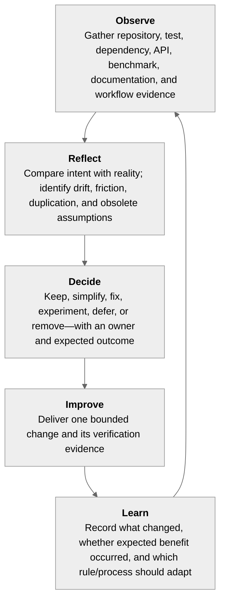
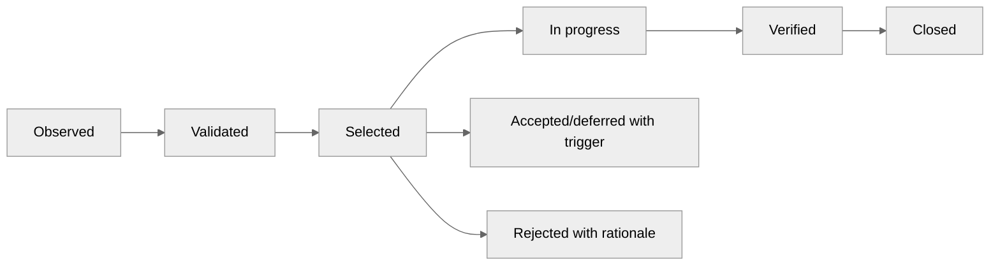
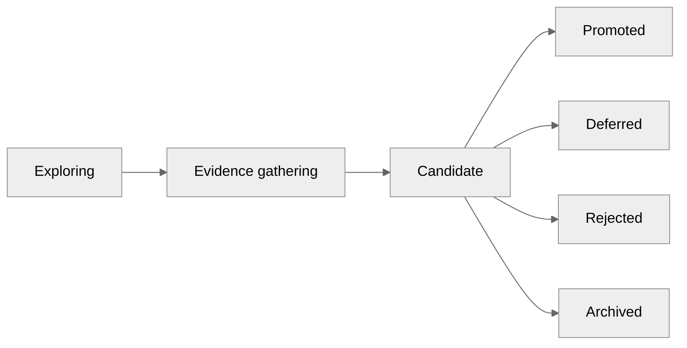

# IDEA-006 — Continuous Architecture Stewardship

Status: exploring  
Created: 2026-08-02  
Owner: product and engineering team  
Scope: repository health, architecture fitness, delivery reflection, simplification, and improvement governance

## Idea summary

Introduce a small set of helpers, automated fitness checks, evidence reports, and recurring review
processes that make continuous improvement part of normal delivery. The system regularly answers:

- What is true about the repository today?
- Where has implementation drifted from plans, documentation, or architectural intent?
- Which complexity no longer earns its cost?
- Which repeated friction should be removed next?
- Which assumptions and ideas have gained or lost supporting evidence?
- Did completed work improve the product outcome or merely add components?

The intended capability is:

> Generate a concise, evidence-backed reflection packet and reliably convert its strongest findings
> into owned simplification or improvement work.

Automation gathers and compares evidence. Humans decide priorities, architectural meaning, and which
changes are worth making.

## Product hypothesis

If repository health, architectural drift, delivery friction, and product evidence are reviewed in a
small repeatable loop, then the toolkit can improve without accumulating unnecessary APIs, modules,
special cases, stale plans, or speculative infrastructure.

## Principles

1. **Evidence over impressions.** Findings link to code, tests, dependency graphs, benchmarks,
   diagnostics, documentation, or repeated workflow observations.
2. **Simplification is a deliverable.** Removing concepts, dependencies, branches, duplication, and
   obsolete documentation counts as product work.
3. **One signal, one owner, one decision.** Avoid reports no one is responsible for interpreting.
4. **Trends over snapshots.** A metric is useful when change over time prompts a decision.
5. **Guardrails over style policing.** Automate architectural invariants and regressions, not personal
   formatting preferences already handled by formatters.
6. **Plans follow reality.** Tests and implementation are authoritative; plans and architecture docs
   are updated when evidence changes.
7. **Small reversible improvements.** Prefer narrow changes with explicit before/after evidence.
8. **No autonomous architectural rewrites.** Tools propose and verify; maintainers approve intent.

## Operating loop



## Proposed helpers and tools

### 1. Repository health command

Add one read-only orchestration command, for example:

```text
./mvnw -Phealth verify
```

or a platform-neutral helper:

```text
tools/repo-health check
tools/repo-health report --output target/repo-health/
```

It should compose existing build tools rather than reimplement them. Outputs:

```text
target/repo-health/
  summary.md
  findings.json
  module-graph.json
  api-surface.json
  test-inventory.json
  documentation-links.json
```

The summary remains short and links to detailed evidence. Every finding has a stable rule ID,
severity, evidence, first-seen revision, owner area, and suppression rationale where applicable.

### 2. Architecture fitness functions

Encode architectural requirements as executable tests:

- module dependency direction and forbidden cycles;
- compiler orchestration dependencies do not leak into lower layers;
- runtime and generated execution do not depend on XML, ANTLR, or semantic-analysis modules;
- semantic protobuf and portable Runtime IR protobuf remain separate contracts;
- public APIs do not expose internal slots or unstable implementation classes;
- deterministic compilation and artifact generation remain reproducible;
- immutable contracts remain immutable;
- no target module silently introduces reflection or dynamic classpath scanning;
- diagnostic and capability identifiers remain stable and unique.

Use focused JUnit architecture tests or a small dependency-graph checker. Adopt a larger architecture
testing library only if it materially reduces maintenance.

### 3. Public API and schema compatibility reports

Track intentional surface growth:

- exported Java packages, public types, methods, and constructors;
- protobuf fields, numbers, enums, reserved ranges, and package changes;
- CLI commands and flags;
- DSL syntax versions when IDEA-004 advances;
- portable artifact capabilities when IDEA-003 advances.

Each pull request that changes a public contract receives a concise compatibility diff and must state
whether the change is experimental, compatible, deprecated, or breaking.

The purpose is not to freeze early APIs. It is to make growth and breakage deliberate.

### 4. Dependency and module pressure map

Generate a module graph and trend:

- incoming and outgoing dependencies;
- dependency cycles;
- compile versus test-only dependencies;
- external library count and version divergence;
- modules with broad fan-in or fan-out;
- modules that contain too little independent responsibility to justify their boundary.

Review hotspots as design questions, not automatic defects. High fan-in may represent a healthy
stable contract; high fan-out may reveal orchestration or misplaced responsibility.

### 5. Complexity and duplication prompts

Use lightweight static signals to nominate code for review:

- repeated semantic switches over the same expression variants;
- duplicate FEEL operation, value conversion, null, numeric, or temporal logic;
- large constructors and records with frequently coupled parameters;
- deeply nested branching;
- repeated test-model builders and fixture construction;
- parallel diagnostic conversion layers;
- compatibility shims with no remaining consumers;
- TODOs without owner, rationale, or decision date.

Never set a universal complexity-number gate. Require review when a trend or repeated hotspot aligns
with actual defects or maintenance friction.

### 6. Semantic coverage matrix

Maintain one generated matrix connecting capabilities to evidence:

| Capability | Parser | Semantics | Runtime IR | Interpreter | Java | Rust | TCK | Docs |
| --- | --- | --- | --- | --- | --- | --- | --- | --- |
| Decimal arithmetic | evidence | evidence | evidence | evidence | — | — | cases | page |
| Three-valued logic | evidence | evidence | evidence | evidence | — | — | cases | page |

Populate it from test metadata or a small reviewed manifest. Avoid deriving “support” from code
presence alone. This matrix becomes the shared status source for planning, IDEA-001 conformance, and
backend parity.

### 7. Test portfolio report

Report test value rather than just test count:

- unit, integration, corpus, conformance, property, fuzz, golden, parity, and benchmark categories;
- capabilities and compiler phases covered;
- quarantined or flaky tests;
- slowest tests and suites;
- fixtures duplicated across modules;
- tests that assert implementation details rather than behavior;
- production defects without regression cases.

Mutation testing can be sampled on stable semantic kernels rather than run across the full reactor.
Fuzzing should target parsers, artifact decoders, model limits, and canonical round trips.

### 8. Determinism and reproducibility checker

Regularly rebuild selected models under perturbed conditions:

- shuffled input/model discovery order;
- clean processes;
- supported JDKs and platforms;
- repeated serialization/code generation;
- different filesystem paths where paths must not affect output.

Compare diagnostics, model ordering, Runtime IR, generated sources, portable artifacts, and reports.
Store small golden fingerprints, not large generated build trees.

### 9. Benchmark and resource budget guardrails

Maintain small, stable micro and scenario benchmarks for critical paths:

- XML/FEEL compilation;
- semantic analysis and Runtime IR lowering;
- interpreter evaluation;
- generated backend execution;
- artifact decoding and validation;
- scenario generation when introduced.

Separate noisy trend reporting from blocking regression gates. Block only statistically meaningful,
repeatable regressions in controlled environments. Also track allocation, artifact size, generated
source size, and worst-case input limits where relevant.

### 10. Documentation freshness checks

Automate structural consistency:

- internal links and referenced files exist;
- milestone statuses use the approved vocabulary;
- `Last reviewed` dates are visible when stale;
- completed plan items link to evidence;
- roadmap and development-plan status contradictions are reported;
- architecture claims identify implementation-aligned versus proposed status;
- generated tables of contents remain current;
- ideation IDs and index entries are unique.

Do not automatically rewrite architectural prose. Produce a finding for human review.

### 11. Decision and assumption register

ADRs record durable architectural decisions. Add a lighter assumption register for claims that need
evidence or expiry:

```text
ASSUMPTION-012
Claim: A shared Rust semantic helper crate is acceptable to target users.
Evidence needed: Two deployment prototypes and user review.
Review by: PIR.6
If false: Evaluate standalone helper generation.
```

Each assumption has an owner, evidence, review trigger, and consequence if false. When resolved, it
becomes an ADR, product decision, rejected direction, or archived learning.

### 12. Improvement proposal template

Keep proposals small:

```text
Problem and evidence
Who experiences it
What can be removed or simplified
Proposed smallest change
Expected observable improvement
Risks and compatibility
Verification
Rollback
Decision date and owner
```

Do not require an RFC for routine refactoring. Use the template when work changes boundaries,
contracts, recurring workflow, or product direction.

### 13. Reflection packet generator

Before a review, generate one compact packet:

```text
What changed since the previous review
Delivery outcomes achieved
Plan versus implementation drift
New/removed public surface
Architecture fitness failures
Top repeated failure categories
Test and benchmark trends
Documentation staleness
Open assumptions reaching their review trigger
Top five simplification candidates
Ideas whose evidence changed
Previously selected improvements and observed results
```

The packet should fit a focused review. Detailed raw reports remain linked rather than embedded.

### 14. Assisted repository reflection

An AI or scripted assistant may periodically inspect repository evidence and propose:

- contradictory documentation;
- repeated patterns suitable for one shared abstraction;
- abstractions with only one consumer that could be removed;
- stale TODOs or compatibility branches;
- missing acceptance evidence;
- unclear names and overly broad module responsibilities;
- tests that demonstrate undocumented behavior;
- likely next decisions based on milestone dependencies.

All proposals must cite concrete files/tests and remain review-only. The assistant should not create
large speculative refactors, update statuses, or remove compatibility behavior autonomously.

## Recurring processes

### Per change

Every material change answers briefly:

- What user or engineering outcome changes?
- Which contract or architectural boundary is affected?
- What evidence proves the change?
- Did it add a concept, and can another concept now be removed?
- Do plan, architecture, capability matrix, or compatibility records need updating?

Automated checks run relevant fitness, API/schema diff, determinism, and focused test suites.

### Weekly or milestone-increment review

Time-box to 30–45 minutes:

1. Review new critical/high findings and repeated failures.
2. Check work in progress against the milestone outcome.
3. Select at most one small simplification or friction-removal task.
4. Assign owner and expected evidence.
5. Close or defer previous findings explicitly.

This is an operational review, not a broad architecture meeting.

### Milestone review

At milestone boundaries:

1. Demonstrate acceptance evidence and user-visible outcome.
2. Compare actual architecture with plan and ADRs.
3. Review public API/schema additions and temporary adapters.
4. Remove obsolete scaffolding, flags, builders, and compatibility code.
5. Consolidate fixtures, values, built-ins, and diagnostics where duplication emerged.
6. Update capability matrix, roadmap, development plan, and implementation-aligned architecture.
7. Record what was learned and re-sequence later work if evidence changed.

### Quarterly or major-direction review

Ask product-level questions:

- Which capabilities are actually used or repeatedly requested?
- Which ideas reinforce one product strategy, and which distract from it?
- Where are we maintaining optionality with no plausible consumer?
- What should be stopped, archived, or explicitly deferred?
- Which quality attributes are improving or degrading?
- What is the smallest coherent product we are trying to make excellent next?

Review IDEA-001 onward as a portfolio rather than assuming every idea should be implemented.

## Simplification process

Create a short-lived simplification register, not an endless debt backlog. Each candidate is one of:

```text
REMOVE       obsolete code, dependency, option, layer, or document
MERGE        duplicate concepts or implementations
INLINE       abstraction whose indirection exceeds its reuse/value
STANDARDIZE  repeated behavior behind one existing semantic contract
RENAME       misleading concept that causes repeated misunderstanding
BOUND        unbounded behavior, input, cache, recursion, or extension point
DOCUMENT     necessary complexity whose rationale is currently invisible
DEFER        valid finding without current priority; include review trigger
```

Prioritize using:

```text
priority = recurrence × user/engineering impact × confidence ÷ change risk
```

This is a discussion aid, not an automated score. Select few items and delete stale candidates that
no longer matter.

## Improvement budget

Reserve capacity through policy rather than a fixed universal percentage:

- every milestone includes a cleanup/learning exit step;
- repeated friction occurring three times requires an explicit keep/fix/defer decision;
- a critical architecture fitness failure blocks expansion of the affected boundary;
- temporary adapters receive an owner and removal trigger when introduced;
- when delivery slows because of one hotspot, the next slice may be simplification rather than more
  feature surface.

The product owner evaluates simplification by lead time, reliability, clarity, and reduced future
cost—not lines of code removed alone.

## Finding lifecycle



A finding contains:

- stable ID and category;
- first and last observed revision;
- concrete evidence;
- affected outcome or quality attribute;
- confidence and likely impact;
- owner area;
- proposed next decision, not necessarily a proposed implementation;
- resolution, verification, and recurrence trigger.

Do not convert every tool warning into a tracked issue. Aggregate mechanically related instances
under one finding and promote only after validation.

## Status and health views

Prefer a small balanced view over one synthetic health score:

| Dimension | Evidence |
| --- | --- |
| Product progress | Milestone outcomes and acceptance evidence |
| Correctness | Corpus, TCK, property, fuzz, and parity results |
| Architecture | Fitness functions, dependency trends, temporary boundaries |
| Compatibility | API/schema/CLI diffs and deprecation state |
| Operability | Build time, flaky tests, reproduction, diagnostics |
| Performance | Controlled benchmarks and resource budgets |
| Maintainability | Repeated hotspots, duplication, concept count, simplification outcomes |
| Knowledge | Documentation freshness, ADRs, assumptions, bus-factor hotspots |

Red/amber/green may summarize each dimension, but the underlying evidence and next decision must be
visible. Avoid combining them into a misleading overall score.

## Suggested initial automation

Start with five high-signal checks using existing Maven/JUnit infrastructure:

1. Module dependency direction and forbidden runtime/compiler dependencies.
2. Development-plan versus roadmap status consistency.
3. Documentation links, ideation IDs, and evidence references.
4. Deterministic compilation of a small model corpus under shuffled discovery order.
5. Generated semantic capability matrix from a reviewed manifest and test evidence.

Add API/schema diffing and benchmark trends after relevant public contracts stabilize. Add complex
static analysis only when repeated repository evidence shows it would drive decisions.

## Delivery slices

| ID | Slice | Exit evidence |
| --- | --- | --- |
| CIS.1 | Baseline reflection packet | Current plans, dependencies, tests, docs, assumptions, and top simplification candidates are summarized |
| CIS.2 | Finding and assumption contracts | Stable lightweight formats, lifecycle, owners, and review triggers are documented |
| CIS.3 | Architecture fitness tests | Critical module boundaries and runtime-independence constraints execute in the reactor |
| CIS.4 | Plan and documentation consistency | Broken links, stale evidence, status conflicts, and duplicate idea IDs are reported |
| CIS.5 | Determinism and capability evidence | Small corpus reproducibility and semantic capability matrix are generated |
| CIS.6 | API/schema compatibility view | Intentional public surface changes produce reviewed diffs |
| CIS.7 | Recurring review cadence | Two review cycles select, implement, and verify bounded improvements |
| CIS.8 | Benchmark and test portfolio trends | Performance, resource, flake, and test-purpose evidence informs milestone decisions |
| CIS.9 | Assisted reflection | Evidence-citing proposals are useful in review without creating autonomous churn |
| CIS.10 | Portfolio review | Ideas, milestones, assumptions, and product direction are re-evaluated together |

## MVP boundary

The stewardship MVP is complete when:

- one command creates a concise reflection packet from repository evidence;
- critical module and runtime-independence constraints run as architecture fitness tests;
- roadmap/development-plan contradictions and broken documentation evidence are detected;
- findings and assumptions have owners, evidence, review triggers, and explicit resolutions;
- a milestone review includes a simplification step;
- two consecutive review cycles each produce one selected improvement and verify its expected result;
- reports remain small enough to review and do not create a growing unowned warning backlog;
- no helper autonomously changes architecture, compatibility promises, plan status, or production code.

## Success measures

| Measure | Desired signal |
| --- | --- |
| Actionability | Most reviewed high-priority findings end in an explicit decision |
| Noise | Repeated ignored findings decrease; suppressions include rationale and review trigger |
| Simplification | Selected changes remove concepts/friction and demonstrate a before/after improvement |
| Drift | Plan, implementation, architecture, and capability status contradictions decline |
| Reliability | Determinism regressions, flaky tests, and repeated defect categories decline |
| Compatibility | Public surface changes are intentional and classified before release |
| Learning | Assumptions are resolved through evidence rather than remaining indefinitely open |
| Delivery | Lead time for representative slices does not worsen as modules and features grow |

Do not use lines of code, test count, warning count, or one composite score as standalone success
measures.

## Major risks and mitigations

| Risk | Mitigation |
| --- | --- |
| Tooling creates noise and no decisions | Begin with five high-signal checks; stable owners; delete low-value rules |
| Metrics are gamed | Use balanced evidence and qualitative review; never optimize one aggregate score |
| Reflection becomes ceremony | Time-box meetings; pre-generate packet; select few actions |
| Simplification is endlessly deferred | Add milestone cleanup exit and repeated-friction decision rule |
| Refactoring becomes speculative | Require concrete evidence, smallest change, verification, and rollback |
| Architecture tests freeze experimentation | Distinguish experimental from stable boundaries; permit explicit time-bounded exceptions |
| AI proposals hallucinate or overreach | Require file/test evidence and human validation; review-only permissions |
| Reports expose sensitive data | Store aggregate metadata and paths; redact runtime inputs and secrets |
| Temporary findings become permanent backlog | Review triggers, expiry, aggregation, and deletion of stale low-value items |

## Decision gates

### Gate 1 — Signal quality

Adopt a check only if a named owner can explain the decision it informs and demonstrate acceptable
false-positive cost on the current repository.

### Gate 2 — Process value

Continue the cadence only if reviews produce completed improvements or explicit product decisions,
not merely more findings and documents.

### Gate 3 — Blocking policy

Make a fitness check blocking only after its contract is stable, deterministic, fast enough, and has
a documented exception process.

### Gate 4 — Tool expansion

Add new analyzers, dashboards, or services only when existing evidence identifies a recurring problem
they are expected to reduce.

## Open decisions

| ID | Decision | Needed by |
| --- | --- | --- |
| CIS-D01 | Which five architectural and documentation signals are most costly when missed? | CIS.1 |
| CIS-D02 | What finding format is sufficiently useful without becoming issue-tracker duplication? | CIS.2 |
| CIS-D03 | Which architecture boundaries are stable enough to enforce now? | CIS.3 |
| CIS-D04 | Who owns capability-matrix truth and evidence review? | CIS.5 |
| CIS-D05 | Which public APIs/schemas are experimental versus compatibility-managed? | CIS.6 |
| CIS-D06 | What review cadence fits actual delivery rhythm? | CIS.7 |
| CIS-D07 | Which benchmark environment can support meaningful regression decisions? | CIS.8 |
| CIS-D08 | Which assistant actions remain read-only and which proposal artifacts may it create? | CIS.9 |
| CIS-D09 | What criteria archive or promote an ideation item? | CIS.10 |

## Recommended first experiment

Run one manual reflection using current repository evidence before building much automation:

1. Compare roadmap, development plan, commits, tests, and architecture claims.
2. Draw the current module dependency graph.
3. Inventory semantic capabilities and their evidence across parser, semantics, IR, and runtime.
4. Identify the five most repeated sources of friction or duplicated logic.
5. List temporary adapters, open assumptions, and speculative extension points.
6. Select one simplification small enough to complete and verify in a normal slice.
7. Record which parts of the packet actually informed the decision.

Only then automate the evidence that proved useful. The experiment succeeds when it yields one
completed improvement with an observable benefit and a smaller repeatable packet for the next cycle.

## Relationship to the development plan and ideation portfolio

This idea is cross-cutting and should not become a large feature milestone. Its fitness checks and
review steps should be introduced incrementally alongside delivery. The development plan remains the
commitment source; this stewardship loop keeps it aligned with evidence.

The ideation portfolio should gain explicit lifecycle states such as:



IDEA-001 through IDEA-005 are not automatically a roadmap. Portfolio review should identify shared
enablers—stable identities, canonical values, Runtime IR semantics, tracing, reproducibility—and
decide whether those foundations justify one or more product tracks.

