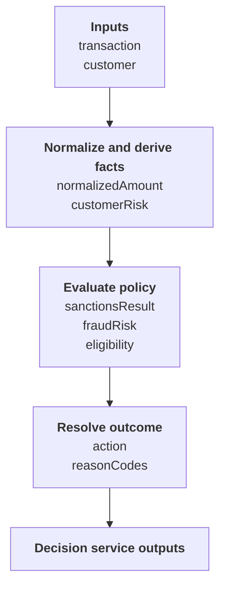
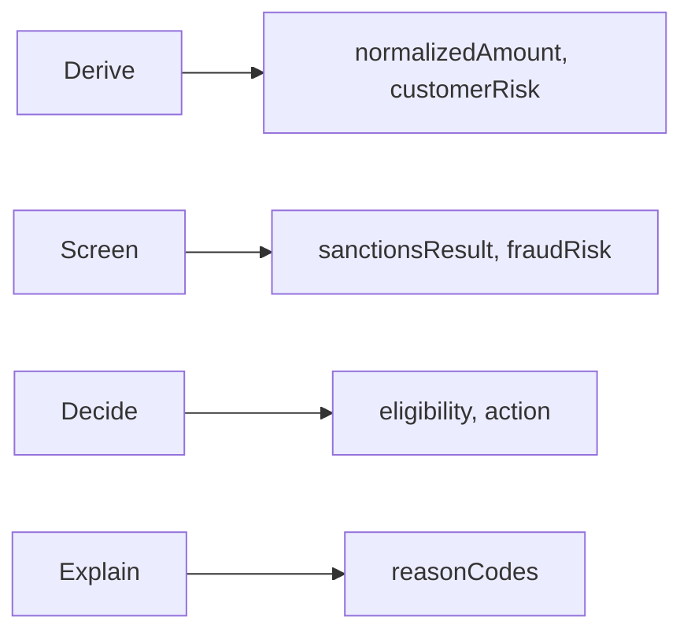

# IDEA-008 — Stateless Decision Flow

Status: exploring  
Created: 2026-08-02  
Owner: product, decision-modeling, compiler, and runtime teams  
Scope: rule orchestration, decision-service composition, flow visualization, and lightweight execution without BPMN  
Standards baseline: [OMG DMN specification](https://www.omg.org/spec/DMN/1.4), [OMG DMN overview](https://www.omg.org/dmn/)

## Idea summary

Support understandable “ruleflows” without requiring BPMN by composing DMN decisions and decision
services into stateless, deterministic decision pipelines.

DMN already provides part of this capability:

- the Decision Requirements Graph expresses information dependencies;
- deterministic dependencies establish what must be evaluated before a requested decision;
- decisions and BKMs express conditional and reusable logic;
- a decision service declares input data/input decisions, encapsulated decisions, and output
  decisions behind a callable boundary.

This is sufficient for a pure acyclic flow where each stage computes values from immutable inputs and
prior results. It is not a process engine. DMN decision services do not provide durable state, events,
timers, retries, human tasks, compensation, message correlation, or general loops.

The recommended product shape has two levels:

```text
Level 1 — DMN Decision Pipeline
  Standard DMN decisions + dependencies + decision services
  No new execution semantics

Level 2 — Lightweight Decision Flow
  Optional minimal orchestration of decision-service calls
  Only when sequencing, guards, or state transitions cannot be represented honestly as one DMN graph
```

Start with Level 1. Introduce Level 2 only after concrete use cases demonstrate that DMN dependency
composition is insufficient.

## Direct answer: can decision services implement ruleflows?

**Yes, for stateless acyclic decision flow; no, for general workflow.**

| Requirement | Decision services/DMN alone? | Representation |
| --- | --- | --- |
| Evaluate rules in dependency order | Yes | Information requirements and requested output decision |
| Group internal decisions behind an API | Yes | Encapsulated and output decisions in a decision service |
| Conditional result selection | Yes | FEEL `if`, decision table, invocation, or context logic |
| Reuse a rule group/function | Yes | BKM/function or imported decision service boundary |
| Produce several related outputs | Yes | Multiple output decisions or structured result context |
| Explain dependencies and intermediate values | Yes | DRG plus optional evaluation trace |
| Force arbitrary procedural rule order unrelated to data | Not naturally | Usually a modeling smell; requires explicit staged data dependency or Level 2 |
| Stop and resume later | No | Durable workflow/state-machine concern |
| Wait for an event or timer | No | External orchestration concern |
| Human approval task | No | External application/workflow concern |
| Retry an external operation | No | External orchestration concern |
| Loop until mutable state changes | No | Process/rule-engine agenda concern; bounded FEEL iteration is different |
| Execute side effects | No by default | Keep decisions pure; effects belong outside the model |

Decision services define an encapsulation and invocation boundary. They do not convert a dependency
graph into procedural workflow semantics.

## Product hypothesis

If policy authors can view, author, execute, and trace DMN dependencies as named decision pipelines,
then many rule-orchestration needs can be met with a small deterministic runtime rather than a BPMN
engine, while retaining standard DMN interchange and generated-code options.

## Users and value

| User | Need | Value provided |
| --- | --- | --- |
| Decision author | Organize many rules into understandable stages | Named pipeline view over standard decisions and services |
| Application developer | Invoke one stable decision boundary | Decision-service API with named inputs and outputs |
| Policy reviewer | Understand which decisions contribute to an outcome | Dependency/stage visualization and bounded trace |
| Platform team | Avoid operating a workflow engine for pure decisions | Stateless interpreter or generated native code |
| Auditor | Replay why a final policy outcome occurred | Model digest, inputs, intermediate decisions, rules, and outputs |
| Architect | Know when DMN is no longer the right abstraction | Explicit boundary between decision flow and stateful workflow |

## Product principles

1. **Data dependencies before procedural order.** A rule runs because its value is required, not
   because it has an arbitrary agenda priority.
2. **Pure and stateless by default.** Evaluation has no hidden mutable session or external side
   effects.
3. **Standard DMN first.** Pipeline modeling should generate and consume ordinary DMN whenever its
   semantics are sufficient.
4. **Decision services are boundaries, not workflow nodes.** They package decisions and define
   callable inputs/outputs.
5. **Requested outputs define the evaluation slice.** Evaluate only dependencies needed for selected
   outputs when P4 dependency pruning is available.
6. **Stages are primarily a view.** A stage label must not silently redefine dependency semantics.
7. **Minimal orchestration, explicit boundary.** Any non-DMN flow semantics live in a separate model,
   IR, module, and compatibility contract.
8. **Effects occur after decisions.** A host application acts on outputs; decision evaluation remains
   replayable and deterministic.

## Level 1 — DMN decision pipeline

### Concept

Treat a decision service as the public pipeline boundary and its internal DRG as the executable flow:



The arrows are information requirements. Topological order is derived from the graph. Parallel
independent decisions may execute concurrently in a future backend, but parallelism cannot change
results.

### Stage metadata

Optional stage metadata can improve readability:



Stage membership should initially be documentation/tooling metadata. Dependencies remain
authoritative. A validator reports:

- dependency edges that contradict declared stage order;
- cycles;
- stage outputs with no consumer or service output;
- hidden cross-stage dependencies;
- decisions unreachable from any service output;
- requested stages that cannot be skipped because a later result depends on them.

### Conditional flow

Conditional behavior should be modeled as decision logic:

```text
decision action =
  if sanctionsResult.blocked then "block"
  else if fraudRisk.level = "high" then "review"
  else eligibility.action
```

This selects a result but does not necessarily imply procedural short-circuiting of separate graph
dependencies. If `action` has declared dependencies on all three decisions, an implementation may
need their values before evaluating `action`. Optimization may prune provably unnecessary branches
only when semantic equivalence is established.

For expensive optional computation, expose separate requested decisions or decision services so the
caller chooses the required evaluation slice explicitly.

### Rule groups

Common “ruleflow group” intentions map as follows:

| Ruleflow intention | DMN representation |
| --- | --- |
| Reusable group of rules | BKM/function or imported decision |
| Stage with one public result | Decision with dependent internal decisions |
| Stage with several outputs | Decision service or structured context decision |
| Ordered transformations | Explicit decisions whose inputs depend on prior outputs |
| First matching rule | Decision table with `FIRST` hit policy where semantically appropriate |
| Collect all matching actions | Decision table with `COLLECT`/rule-order behavior where appropriate |
| Stop after blocking result | Final decision selects block; execution pruning requires explicit supported semantics |
| Rule salience/agenda | No direct pure-DMN equivalent; redesign as explicit dependencies and policies |

## Level 2 — Lightweight decision flow

### When it may be needed

Use a separate lightweight flow only when the business requirement genuinely includes:

- sequential calls to independently deployed decision services;
- passing an immutable context from one service call to the next;
- guards that choose which service is called;
- explicit terminal outcomes;
- bounded fan-out/fan-in between pure decision calls;
- orchestration-level timeouts or failure policies for remote calls.

If the requirement includes durable waiting, human work, long-running state, compensation, event
correlation, or arbitrary loops, this lightweight layer should reject the model and recommend an
external workflow/state-machine technology. “Without BPMN” must not become “reimplement BPMN
poorly.”

### Minimal declarative example

Illustrative syntax only:

```yaml
apiVersion: finmsg.io/decision-flow/v1alpha1
kind: StatelessDecisionFlow
metadata:
  name: transaction-screening
input: TransactionScreeningRequest
steps:
  - id: normalize
    call: NormalizationService
    with:
      transaction: $input.transaction
  - id: sanctions
    call: SanctionsDecisionService
    with:
      customer: $input.customer
      transaction: $normalize.transaction
  - id: fraud
    when: $sanctions.action != "block"
    call: FraudDecisionService
    with:
      customer: $input.customer
      transaction: $normalize.transaction
output:
  action: >-
    if $sanctions.action = "block" then "block"
    else $fraud.action
  reasons: [$sanctions.reasons, $fraud.reasons]
```

Restrictions for the initial model:

- acyclic graph;
- immutable named step results;
- pure local calls first;
- no arbitrary code;
- no mutation or implicit global facts;
- no unbounded loops;
- no durable persistence semantics;
- no side effects;
- explicit missing/error behavior;
- deterministic result for identical model, inputs, and service versions.

### Compilation options

A restricted flow can compile in two ways:

1. **DMN lowering:** when all steps are local, pure, and expressible as decisions/dependencies,
   generate a canonical DMN model with decision services.
2. **Flow IR lowering:** when service-call guards and orchestration errors require separate semantics,
   compile into a small stateless flow IR whose nodes invoke validated compiled decision services.

Every flow should report whether it is `DMN_EXPORTABLE`, `DMN_NORMALIZED`, or
`FLOW_RUNTIME_REQUIRED`.

## Decision service execution contract

The toolkit needs a stable compiled decision-service API:

```text
service identity
model namespace and version
named input data and input decisions
named output decisions and types
encapsulated decision metadata
required capabilities
requested output selection where supported
structured values and errors
evaluation trace policy
```

P4's stable name-based API is therefore a key prerequisite. Public callers must not address Runtime
IR slots or aggregate IDs.

## Evaluation behavior

### Dependency scheduling

For a requested decision-service output:

1. resolve the output by stable service/model/decision identity;
2. compute its transitive decision and BKM dependencies;
3. validate all required inputs;
4. evaluate the deterministic topological slice;
5. return only declared output decisions unless trace/diagnostic policy permits internals.

### Parallel evaluation

Independent nodes may be scheduled concurrently only if:

- decisions and host conversions are pure;
- evaluation errors have deterministic aggregation/order;
- resource limits remain deterministic;
- output and trace ordering is canonical;
- parallel and sequential execution pass the same parity corpus.

Parallelism is an optimization, not a flow semantic.

### Errors

Distinguish:

- invalid model/flow;
- missing or invalid input;
- DMN evaluation error;
- unsupported capability;
- decision-service lookup/version error;
- remote service timeout/unavailability in Level 2;
- flow invariant/resource-limit failure.

Do not turn evaluation errors into alternative branches unless the flow explicitly models and
documents that policy.

## Visualization and explanation

Offer several views over the same model:

```text
Dependency view
  Exact DRG dependencies
Pipeline view
  Decisions grouped into author-declared or inferred stages

Service view
  Public inputs/outputs and encapsulated internals

Evaluation trace
  Nodes/rules actually evaluated for one request
```

The pipeline view must not imply procedural order where only dependency or grouping exists. The UI
should visually distinguish required dependency, optional request boundary, and executed trace.

Useful tools:

```text
dmn flow inspect model.dmn --service TransactionScreening
dmn flow validate model.dmn --pipeline
dmn flow graph model.dmn --format mermaid
dmn flow evaluate model.dmn --service TransactionScreening --input request.json
dmn flow trace model.dmn --service TransactionScreening --input request.json
dmn flow export-dmn flow.yaml --output generated.dmn
```

## Module boundaries

Level 1 should require little new production architecture:

```text
dmn-compiler
  validate and expose decision-service metadata

dmn-runtime-ir
  retain service-to-input/output/encapsulated-decision mappings and stable names

dmn-runtime
  evaluate requested output dependency slices and return service-shaped results

tools/documentation
  pipeline validation, grouping, graph, and trace views
```

Only Level 2 justifies separate modules:

```text
dmn-flow-model
  declarative stateless flow contract and validation

dmn-flow-compiler
  target resolution, DMN-export analysis, DMN or flow-IR lowering

dmn-flow-runtime
  bounded stateless orchestration of compiled decision-service calls

dmn-flow-cli
  validate, inspect, compile, evaluate, trace, and export
```

The DMN compiler/runtime must not depend on Level 2 modules.

## Delivery options

| Option | Scope | Benefit | Cost and risk |
| --- | --- | --- | --- |
| A — Pipeline view over DMN | Service metadata, requested outputs, dependency slicing, stage annotations, visualization, trace | High value with standard DMN and little new semantics | Does not satisfy stateful/procedural expectations |
| B — Stateless flow DSL | Acyclic guarded composition of decision services with DMN export where possible | Covers distributed or explicitly staged decision calls without BPMN | Creates a new contract and error model |
| C — General ruleflow engine | Agendas, mutable facts, loops, timers, persistence, human work | Broad workflow/rule-engine capability | Competes with mature engines and conflicts with pure deterministic architecture |

**Recommendation:** implement Option A after P4. Explore Option B only with two or more concrete
use cases that Option A cannot model clearly. Reject Option C as outside the toolkit's intended
product boundary.

## Proposed delivery slices

| ID | Slice | Exit evidence |
| --- | --- | --- |
| DFL.1 | Ruleflow use-case corpus and boundary | Examples are classified as DMN pipeline, lightweight flow, or external workflow |
| DFL.2 | Stable decision-service metadata | Compiler result exposes typed named inputs, outputs, and encapsulated decisions |
| DFL.3 | Requested service-output evaluation | Runtime executes only the validated transitive dependency slice |
| DFL.4 | Pipeline grouping and validation | Stage metadata cannot contradict dependencies and remains semantically inert |
| DFL.5 | Pipeline visualization and trace | Dependency, pipeline, service, and executed views are clearly distinguished |
| DFL.6 | Decision-service parity corpus | Interpreter and generated Java agree on service inputs, outputs, errors, and traces |
| DFL.7 | Lightweight flow feasibility spike | Two non-DMN examples validate guarded immutable service composition |
| DFL.8 | DMN exportability analysis | Eligible flows generate valid behaviorally equivalent DMN and others explain why not |
| DFL.9 | Optional stateless flow runtime | Bounded acyclic flow IR executes deterministic local service calls |
| DFL.10 | Remote execution policy | Only if demanded: versioning, timeouts, retries, identity, and observability are explicit |

## MVP boundary

The recommended Level 1 MVP is complete when:

- a compiled decision service exposes stable named input and output contracts;
- a caller can request one or more service outputs without internal Runtime IR IDs;
- the runtime evaluates the exact validated transitive dependency slice;
- pipeline stages can group decisions without altering semantics;
- invalid stage order, cycles, missing service inputs, and unreachable outputs have structured
  diagnostics;
- dependency, pipeline, service, and execution-trace views are available;
- actual `.dmn` fixtures cover conditional decisions, BKMs, imports, multiple outputs, and errors;
- interpreter and generated backend parity covers decision-service invocation;
- documentation clearly states that waiting, human tasks, durable state, retries, and side effects
  are outside this capability.

## Success measures

| Measure | Desired evidence |
| --- | --- |
| Modeling fit | Most selected rule-orchestration examples use standard DMN without custom flow semantics |
| Understandability | Reviewers can explain stages, dependencies, service boundary, and outputs correctly |
| Runtime efficiency | Requested-output slicing avoids unrelated decisions without changing results |
| Interoperability | Level 1 models remain valid standard DMN |
| Determinism | Sequential/parallel and interpreter/generated execution return equivalent values/errors |
| Boundary clarity | Stateful workflow requirements are rejected or delegated rather than approximated |
| API quality | Applications invoke services using typed/named contracts, not internal slots |
| Trace usefulness | A trace explains evaluated decisions/rules without implying nonexistent process semantics |

## Major risks and mitigations

| Risk | Mitigation |
| --- | --- |
| Users expect BPMN behavior from “flow” | Call it stateless decision flow; publish capability matrix and rejected examples |
| Stage ordering conflicts with dependencies | Dependencies remain authoritative; validator rejects contradictions |
| Conditional result is mistaken for lazy execution | Document evaluation slicing; expose trace; optimize only with parity proof |
| Decision service metadata is incomplete in Runtime IR | Add explicit stable service mappings during P4, not post-hoc slot inference |
| Lightweight flow grows into workflow engine | Hard product boundary; acyclic/pure restrictions; gate every added semantic |
| Remote calls make results nondeterministic | Keep local first; version endpoints; explicit timeout/failure policy; do not call remote from DMN expressions |
| Side effects enter decision rules | Host acts after evaluation; no effectful built-ins in standard pipeline |
| Multiple overlapping modeling formats confuse users | Standard DMN is default; Level 2 has explicit export classification and separate extension |
| Pipeline visualization misrepresents graph semantics | Show dependency, grouping, and runtime trace with distinct edge/node styles |

## Decision gates

### Gate 1 — Use-case classification

Collect at least ten representative “ruleflow” examples and classify each as pure decision
dependency, decision-service boundary, lightweight stateless orchestration, or genuine workflow.

### Gate 2 — Standard DMN value

Implement Level 1 only if pipeline grouping, requested-output evaluation, and tracing solve a useful
majority of the decision-only examples without new execution semantics.

### Gate 3 — Lightweight flow necessity

Create Level 2 only if at least two important use cases require guarded service sequencing that
cannot be represented clearly and portably as one DMN model/service.

### Gate 4 — Product boundary

Any request for durable waiting, human work, event correlation, compensation, mutable working memory,
or unbounded loops triggers an explicit integrate-with-workflow decision, not automatic feature
expansion.

## Open decisions

| ID | Decision | Needed by |
| --- | --- | --- |
| DFL-D01 | What does “ruleflow” mean for the first target users: grouping, dependency order, conditional execution, or stateful workflow? | DFL.1 |
| DFL-D02 | Are stage annotations stored as DMN extension metadata, companion config, or inferred view? | DFL.4 |
| DFL-D03 | What stable decision-service metadata belongs in compiled model and Runtime IR? | DFL.2 |
| DFL-D04 | Are non-selected dependency branches evaluated, lazily skipped, or exposed as separate requested outputs? | DFL.3 |
| DFL-D05 | Which trace events are stable public behavior versus diagnostic tooling? | DFL.5 |
| DFL-D06 | Can a Level 2 flow call only local compiled services in its first version? | DFL.7 |
| DFL-D07 | Which lightweight-flow constructs must remain DMN-exportable? | DFL.8 |
| DFL-D08 | Which workflow requirements cause a hard rejection and external integration recommendation? | DFL.1 |

## Recommended first experiment

Model three examples:

1. **Pure pipeline:** derive facts, screen policy, decide outcome, produce reasons.
2. **Conditional expensive decision:** sanctions block may make fraud scoring unnecessary.
3. **Stateful case:** wait for manual review, then resume and possibly retry an external check.

Implement the first as one DMN decision service and expose dependency/pipeline/trace views. Test
whether requested outputs solve the second cleanly or whether separate service calls are genuinely
needed. Explicitly reject the third as workflow/case management.

The experiment should answer:

- Does stage visualization make the DRG understandable without changing semantics?
- Can stable decision-service inputs/outputs form the application API?
- How much computation can requested-output dependency slicing avoid safely?
- Which conditional sequencing needs a separate lightweight flow?
- Do users understand the boundary between decision evaluation and workflow?

## Relationship to the development plan and other ideas

- P2 should include a real decision-service fixture with multiple internal and output decisions.
- P3 must define deterministic evaluation, errors, tables, and built-ins before flow tracing becomes
  an oracle.
- P4 is the main prerequisite: it supplies stable named inputs, requested decisions, metadata, and
  structured errors.
- P5 can generate direct code for decision-service dependency slices.
- IDEA-003 may distribute compiled decision services to Java/Rust targets.
- IDEA-004 can offer concise pipeline/stage syntax while exporting standard DMN.
- IDEA-005 can generate witnesses for selected stages, rules, and service outputs.

This idea should initially be a **decision-service API, dependency-slicing, and visualization track**,
not a new orchestration engine. The OMG describes DMN as complementary to BPMN/CMMN for decision
logic; this proposal deliberately uses DMN independently only where the problem is decisioning rather
than long-running process behavior.

