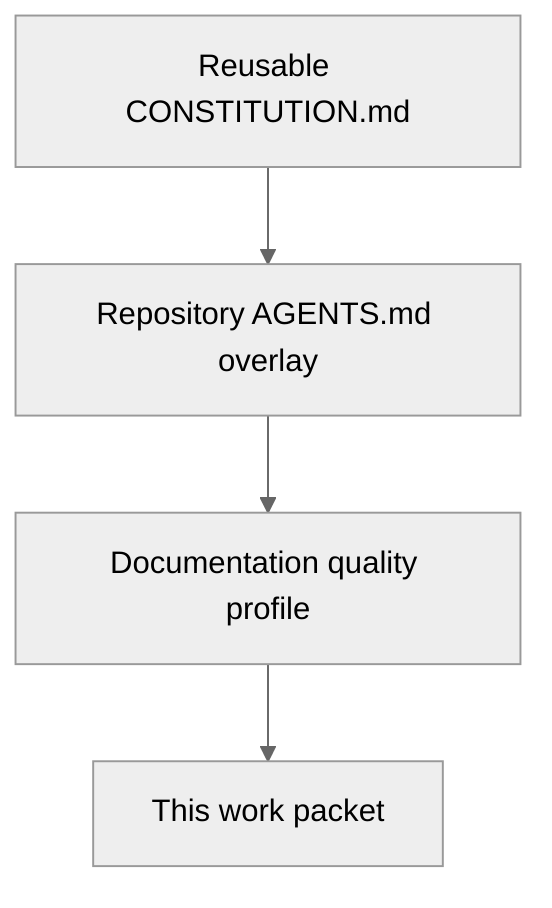
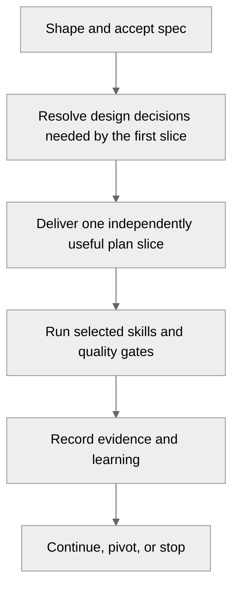

# Worked example: documentation and positioning

This directory demonstrates how the reusable spec-driven delivery system could be applied to the
[documentation and positioning improvement proposal](../../documentation-and-positioning.md).

It is an example work packet, not a second authoritative backlog. The improvement proposal remains
the source of candidate scope until a real work item is accepted.

## Inheritance

The packet assumes these defaults rather than copying them:

The constitution and agent instructions are absent here because they are generic/project-level
artifacts. This implementation provides only the information that differs for this outcome.

Example inherited artifacts are available as
[`CONSTITUTION.example.md`](../CONSTITUTION.example.md) and
[`AGENTS.chatgpt.example.md`](../AGENTS.chatgpt.example.md). Their `.example.md` suffix deliberately
keeps them inactive until reviewed and adopted.

## Files

| File | Why it exists for this work |
| --- | --- |
| [`spec.md`](spec.md) | Required outcome and acceptance contract |
| [`design.md`](design.md) | Needed because canonical ownership, generated content, and navigation boundaries change |
| [`plan.md`](plan.md) | Needed because several independently valuable slices should be delivered sequentially |
| [`skills.md`](skills.md) | Selects reusable skills and records work-specific parameters only |
| [`evidence.md`](evidence.md) | Defines the completion record populated during implementation |

For a local documentation typo, only a short spec and the inherited documentation profile would be
needed. This packet is larger because the proposal is a cross-repository information-architecture
change with automation and migration consequences.

## Intended flow

