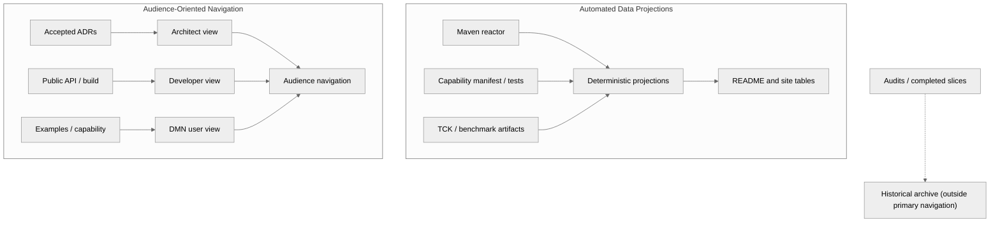

# DOC-001 — Design

Status: example — candidate  
Specification: [`spec.md`](spec.md)

## Design summary

Separate authored source-of-truth content from generated projections and historical evidence.
Audience pages compose links and short explanations around canonical facts; they do not own module,
capability, conformance, or benchmark data.



## Information ownership

| Information | Owner | Projections |
| --- | --- | --- |
| Maven modules and dependency edges | Reactor POMs | Module catalog and diagram |
| Verified capabilities | Capability manifest backed by tests | User matrix, selling points, release notes |
| Conformance | Machine-readable TCK results | Conformance page and badges |
| Performance | Retained benchmark results plus environment metadata | Performance page and qualified claims |
| Architecture decisions | Accepted ADRs | Architect journey |
| Active work | One delivery backlog | Roadmap summary |
| Historical findings | Dated audits | Searchable archive only |

## Proposed content boundaries

- `README.md`: concise promise, verified differentiators, quickest successful path, audience links
- `docs/for-architects.md`: boundaries, quality attributes, deployment matrix, ADR entry points
- `docs/for-developers.md`: build, API, modules, extension points, troubleshooting
- `docs/for-dmn-users.md`: supported scope, examples, diagnostics, deployment options, limitations
- `docs/reference/`: generated capability, module, conformance, and benchmark projections
- `docs/archive/`: historical audits and completed delivery records, excluded from primary navigation

These paths are illustrative and require acceptance before migration.

## Generated-content contract

Generated sections use explicit ownership markers:

```markdown
<!-- generated:module-catalog:start -->
...deterministic content...
<!-- generated:module-catalog:end -->
```

Each generator provides:

- `update` mode that rewrites only its owned regions;
- `check` mode that exits non-zero and reports stale regions;
- deterministic LF output and stable ordering;
- idempotence tests;
- input/output documentation.

CI runs `check`; it does not silently update content.

## TOC decision

Preferred design: remove committed page TOCs and use MkDocs' generated page navigation. This removes
one synchronization problem entirely. If committed TOCs are required for GitHub rendering, use one
repository-owned generator with check mode; never update them manually.

## Failure behavior

- Broken navigation or links fail strict documentation validation.
- Missing evidence downgrades a claim from verified to target; it does not block unrelated docs.
- Missing generator inputs produce an actionable error rather than an empty table.
- Historical pages display snapshot date and non-authoritative status.
- A generated-content diff after verification fails CI.

## Compatibility and migration

- Preserve old URLs with redirects where the hosting solution supports them.
- Migrate primary navigation before moving historical files.
- Transfer active findings before archival.
- Avoid bulk deletion in the first slice.
- Keep each migration slice reviewable and independently valid.

## Decisions required before implementation

1. Accept or reject removal of committed TOCs.
2. Choose the capability-manifest owner and schema.
3. Decide archive paths and URL-compatibility policy.
4. Decide whether audience walkthroughs are manual review evidence or automated navigation tests.

Other presentation details remain reversible implementation choices.
