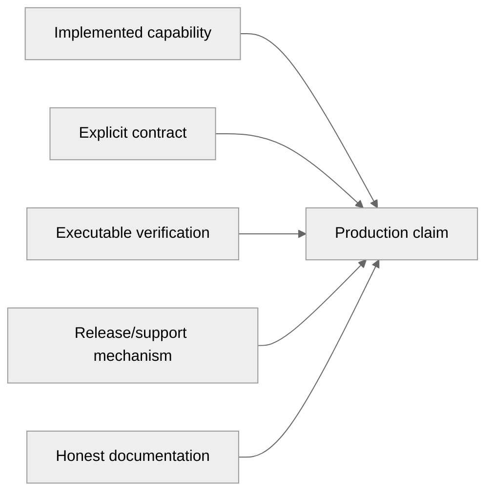

# Production readiness graduation

Status: candidate backlog  
Created: 2026-08-09  
Scope: evidence required to graduate from a strong release candidate to a supportable public 1.0

## Why “graduation”

Production readiness is not a single test result or a subjective percentage. A project graduates
when it can make a defined set of claims and support each claim with repeatable evidence.

The toolkit already has substantial implementation depth: a multi-stage compiler, Runtime IR,
interpreter, Java generation, Spark SQL generation, gRPC adapters, optimizer, TCK execution, and a
large automated reactor. The remaining work is primarily product hardening: compatibility,
security, hostile-input behavior, release safety, consumer validation, operational guarantees, and
defensible documentation.

Current assessment:

- **Controlled internal workloads:** close to production-ready when inputs and deployment are owned
  by the same team.
- **Public 1.0 platform:** release-candidate maturity; compatibility and support promises need
  stronger evidence.
- **Untrusted-input service:** not ready until adversarial/resource-boundary behavior is verified.

## Graduation principle



A capability without a contract cannot be supported predictably. A contract without executable
evidence will drift. Evidence without release and support mechanisms does not produce a dependable
product.

## Graduation levels

### G0 — Development baseline

- Complete reactor builds locally.
- Core unit and integration tests pass.
- Formatting and generated-source ownership are defined.

The repository has passed this level.

### G1 — Controlled production candidate

- The exact deployment path is tested end to end.
- Inputs and supported models are controlled.
- Operational owners understand current limitations.
- Rollback is possible through versioned artifacts.

This is a reasonable near-term status for internal pilots.

### G2 — Public 1.0 production release

- Release, compatibility, security, documentation, packaging, and support gates below pass.
- Published claims link to evidence.
- A new patch release can be produced routinely and safely.

This is the recommended graduation target.

### G3 — Mature platform

- Stable performance/security trends, maintenance branches, versioned documentation, broader
  platform matrices, and operational telemetry are established.

G3 should follow real adoption; it is not required before the first credible 1.0.

## G2 graduation gates

### 1. Release integrity

Required:

- a tag/release build performs clean full verification before Maven deployment;
- version, POMs, changelog, tag, release, and Maven coordinates agree;
- released versions and tags are immutable;
- binary, source, and Javadoc artifacts are published;
- failure/retry and bad-release recovery are documented and demonstrated;
- release notes classify features, fixes, security, deprecations, and breaking changes.

Owner proposal: [Pragmatic automated release train](automated-release-train.md).

### 2. Compatibility contracts

Define and test independently:

- public Java API source/binary compatibility;
- protobuf schema field evolution;
- typed generated protobuf/gRPC compatibility;
- Runtime IR persistence/version compatibility;
- generated Java source/runtime compatibility;
- supported DMN/FEEL versions;
- deprecation and supported-release policy.

D-005, typed Protobuf compatibility, remains open and should graduate to an ADR before a stable
compatibility promise is made. Add automated compatibility analysis after the contract exists; a
tool must enforce policy rather than invent it.

### 3. Semantic and backend evidence

Required:

- interpreter and Java generator pass the pinned TCK/parity suite with no silent missing-fixture
  path;
- test discovery reports expected file and case counts and fails on unexpected reduction;
- Spark SQL and gRPC claims are limited to their verified capability corpus;
- backend capability matrices derive from or link to executable evidence;
- unsupported constructs fail explicitly rather than producing plausible incorrect output.

The current TCK evidence is a major strength, but documentation notes that an XML entry without a
matching DMN file is silently skipped during discovery. Graduation requires an explicit discovery
manifest/count gate.

### 4. Hostile input and resource boundaries

Required for public/untrusted input:

- malformed and fuzzed XML/FEEL handling;
- deep nesting and large expression tests;
- model, decision-table, import-graph, and source-size limits;
- adversarial cycles, Unicode, identifiers, namespaces, and references;
- bounded diagnostics and failure behavior;
- time/memory exhaustion evidence for representative worst cases;
- cancellation/timeout policy where compilation can exceed service budgets.

P14.11 is a genuine graduation gate for deployments that accept untrusted models.

### 5. Concurrency and lifecycle guarantees

Document and verify:

- thread safety of compiler, compiled model, runtime, and generator objects;
- safe concurrent reuse of immutable compiled artifacts;
- cache ownership, bounds, invalidation, and classloader lifecycle;
- deterministic repeated compilation/evaluation;
- resource cleanup and temporary generated-source handling;
- supported maximum model/input sizes or an explicit “not yet bounded” statement.

### 6. Consumer packaging

From a clean external project, verify released artifacts can:

- resolve from the documented package repository;
- compile using only documented dependencies;
- load and evaluate a representative DMN model;
- generate and compile standalone Java;
- exercise advertised gRPC/Spark entry paths where those are release claims.

The test must consume published/repository artifacts, not reactor classes. This catches missing
dependencies, incomplete POM metadata, broken examples, and unpublished supporting artifacts.

### 7. Security and supply chain

Required baseline:

- dependency update automation and pull-request dependency review;
- CodeQL/static analysis on the supported cadence;
- scheduled and release vulnerability scanning;
- reviewed suppressions with vulnerability ID, rationale, owner, and expiry;
- `SECURITY.md` with private reporting instructions and response expectations;
- least-privilege workflows and protected publication environment;
- SBOM and provenance/attestation for released artifacts;
- secret scanning/push protection where repository capabilities permit it.

### 8. Coverage and regression confidence

Required:

- aggregate coverage is visible and reproducible;
- critical semantic, failure, and compatibility paths have explicit tests;
- material unexplained coverage regressions are detected;
- generated code has a documented exclusion/treatment policy.

Do not use an arbitrary global threshold as a substitute for risk-based testing. Coverage supports
the gate; negative, boundary, TCK, parity, and consumer tests provide stronger behavioral evidence.

### 9. Performance evidence

Before performance becomes a prominent production selling point:

- publish raw JMH results and configuration;
- retain OS, CPU, JVM, forks, warmups, and model/input corpus metadata;
- measure compilation, cold start, evaluation latency/throughput, allocation, and artifact size;
- include representative complex and high-cardinality workloads;
- preserve semantic parity for every measured path;
- compare releases on stable enough infrastructure to distinguish regressions from runner noise.

PR benchmark smoke tests may block on correctness. Hard performance thresholds should wait for
several reliable baselines or dedicated runner infrastructure.

### 10. Documentation and claims

Required:

- strict MkDocs/navigation/link validation passes;
- getting-started and API examples compile in CI;
- module, capability, conformance, and version facts have one owner;
- production claims link to evidence or are clearly labeled as targets;
- “self-verified TCK conformance” is distinguished from external certification;
- supported versions, limitations, migration, security, and release procedures are visible;
- documentation is built from the same tag as the released artifacts.

Owner proposal: [Documentation and positioning improvement](documentation-and-positioning.md).

### 11. Support and governance

Required:

- supported-version and bug/security-fix policy;
- issue/bug report templates that request reproduction, version, environment, and model information;
- ownership for critical modules and release approval;
- vulnerability intake and response path;
- deprecation and breaking-change process;
- known-limitations register with explicit owners or triggers.

The first release does not require formal enterprise SLAs, but users must know what is supported and
how failures/security reports will be handled.

## Evidence bundle for every 1.0 release candidate

Retain or link:

- exact source tag/commit and submodule revisions;
- clean full-reactor result and generated-content drift result;
- test/TCK counts, failures, errors, and skips;
- backend parity/capability summary;
- coverage summary;
- benchmark summary or explicit “not measured” statement;
- dependency/security scan results and reviewed suppressions;
- SBOM, checksums, and provenance;
- consumer-project verification;
- strict documentation result;
- known limitations and unresolved compatibility decisions.

The bundle should be machine-generated where possible and summarized for humans in the release.

## Pragmatic implementation order

### P0 — Safe release candidate

- Make release builds verify before publishing.
- Attach sources/Javadocs and validate an external consumer.
- Fix strict documentation/navigation and compile examples.
- Reconcile production claims with current evidence.
- Close or explicitly defer release-blocking compatibility decisions.

### P1 — Untrusted-input and security baseline

- Add fuzz/adversarial/resource-boundary tests.
- Establish `SECURITY.md`, dependency review, CodeQL, scheduled scanning, and suppression governance.
- Generate SBOM/provenance and protect publication permissions.

### P2 — Quantified evidence

- Establish aggregate coverage and regression visibility.
- Publish reproducible release benchmarks.
- Strengthen Spark SQL/gRPC parity corpora and TCK discovery counts.
- Document concurrency, caching, and lifecycle guarantees.

### P3 — Mature operations after adoption

- Maven Central/signing if public adoption benefits from it;
- maintenance release branches;
- versioned documentation;
- broader Windows/Linux/JDK matrices;
- soak/load testing and telemetry integration;
- automated Java/protobuf compatibility tooling.

## What does not block the first 1.0

- native Rust/Go/C++ generators;
- a graphical authoring product;
- enterprise support SLAs;
- every future convenience tool;
- perfect global coverage;
- hard performance thresholds on noisy hosted runners;
- Maven Central, if authenticated GitHub Packages is an accepted initial distribution constraint;
- G3 operational maturity before real users provide feedback.

These may be valuable, but they do not establish the reliability of the currently advertised
compiler and execution targets.

## Graduation decision

Graduation is a short evidence review, not another implementation phase. For every G2 gate, record:

```text
PASS       contract and evidence exist
LIMITED    production claim is explicitly narrower than the missing evidence
BLOCKED    advertised production claim cannot be supported safely
N/A        gate does not apply, with rationale
```

The toolkit may graduate when all advertised production paths are `PASS` or deliberately `LIMITED`,
no path is `BLOCKED`, and limitations are visible to users before adoption.

## Why this is pragmatic

- It protects claims users rely on rather than requiring generic enterprise ceremony.
- It distinguishes controlled internal use from untrusted public service use.
- It prioritizes release safety, compatibility, adversarial behavior, and consumer success.
- It postpones mature-platform work until adoption demonstrates value.
- It accepts explicit limitations instead of pretending every backend has identical maturity.
- It turns “production grade” into a reviewable evidence set rather than a marketing label.

## Worked specification

See the [production graduation `spec.md`](examples/production-readiness-graduation/spec.md) for the
observable acceptance contract for graduating the first public 1.0 release candidate.
