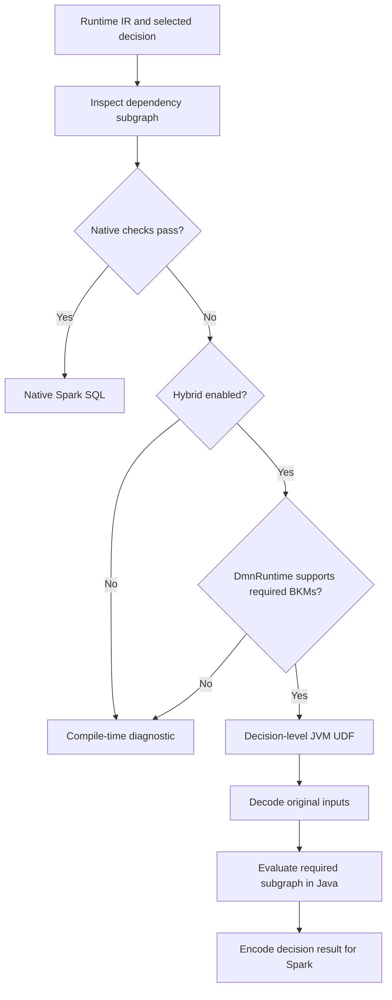

# Spark SQL Backend Architecture & Execution Strategies

## Status and scope

The backend supports native SQL generation and an opt-in, decision-level Java
interpreter fallback. Phase 1 establishes the execution bridge and static routing;
it does **not** establish 100% TCK coverage.

The saved `optimized-generated-sparksql` report at the start of this work contained
2,883 passes, 482 failures, and 26 execution errors across 3,391 cases. It predates
the hybrid bridge and is not a hybrid measurement. A future pinned TCK run must
separately report native passes, fallback passes, failures, errors, and exclusions.
Passing a pinned suite does not guarantee every possible DMN behavior.

## Execution modes



### Pure SQL mode

`hybridUdfFallback=false` is the default. The existing emitter generates Spark SQL
CTEs and built-in expressions without registering UDFs. Existing static BKM and
context-path inlining remains available. Capability checks reject external
functions, captured lexical variables, function-returning functions, unresolved
dynamic invocation targets, decision-table function references, and heterogeneous
or untyped list literals conservatively. These checks do not prove every remaining
native expression correct; native TCK failures remain work to do.

Spark SQL generation does not imply portable ANSI SQL. Catalyst/Photon support,
planning time, and throughput depend on the plan and deployment. No fixed
planning-time or enterprise-coverage percentage is asserted.

### Hybrid mode

`hybridUdfFallback=true` enables `SparkSqlCapabilityAnalyzer` and
`SparkSqlDecisionUdf`. The initial native allowlist is intentionally small:
string/boolean constants and value references, and conditionals whose complete
subgraphs pass the same checks. Other expressions and decision tables use the
Java baseline. This is an initial correctness boundary, not the final native
coverage target.

Analysis follows dependency **IDs** and expression value **slots** as distinct
address spaces, including BKM dependencies. Each fallback UDF receives original
model inputs and evaluates the entire required decision subgraph. It does not
consume partially evaluated fallback results from SQL, pass closures between
Spark columns, or embed UDFs inside SQL lambda bodies. Unrelated executable nodes
are replaced by unused input slots in the sliced IR to preserve slot addresses.

Routing occurs before SQL execution. SQL exceptions and null results never
trigger fallback. Runtime errors propagate; legitimate null results stay null.
Dependent decisions inherit fallback through subgraph analysis. Independent
supported decisions can remain native.

## Type-preserving Spark boundary

Hybrid mode has a separate input schema. Strings and booleans use native Spark
columns. Other values use `BinaryType` containing a versioned, tagged FEEL
payload. `SparkSqlFeelValueCodec.inputRow` builds matching rows from values keyed
by runtime input slot; `fromSpark` decodes returned payloads.

The payload preserves:

- Arbitrary-precision `BigDecimal`, without double conversion or fixed decimal scale.
- Null members, empty and mixed-type lists, nested contexts, and indexed context fields.
- Local, offset, zoned, and named-zone times/datetimes, nanoseconds, and dates.
- `Duration`, `Period`, and runtime ranges with their endpoint distinctions.

This is an explicit adapter contract, not stringification of heterogeneous values.
Spark cannot apply native arithmetic or field access directly to binary columns.
Decode them with the codec or keep consumers inside a fallback subgraph. Phase 1
prioritizes fidelity over native column interoperability.

The evaluator also accepts ordinary Spark values, recursively converting structs,
arrays, maps, dates, timestamps, and numbers. Conversion cannot recover precision
or offsets already lost upstream. Use the hybrid schema and codec for lossless
transport.

Function objects are internal execution values, not supported output payloads.
A closure, including one nested in a context, must be consumed within a larger
Java-evaluated decision. Direct export fails explicitly. `AllDecisions.sql`
therefore requires every exported decision to return transportable FEEL values.

## Model distribution and registration

`SparkSqlDecisionUdf` implements Spark's serializable `UDF1<Row, Object>`. It
captures a versioned IR payload, decision ID, and ordered input slots. Each
executor lazily decodes the model; each row receives fresh runtime state. IR
transport handles immutable records, enums, lists, and optionals without requiring
`RuntimeModel` to implement Java serialization. Payloads require matching toolkit
versions and are not a stable model interchange format.

Generated UDF names include a model-content hash and decision ID. Call
`DmnSparkSqlGeneratorResult.registerUdfs(spark)` before executing SQL artifacts
directly. Generated Java runners embed the payload and register their functions
before executing a query. Driver and executor classpaths require this module,
`dmn-runtime`, `dmn-runtime-ir`, and their dependencies. Spark is provided.

Runtime IR is source-name-free: query keys use `Decision_<resultSlot>`, while the
UDF constructor takes a decision ID. `customSlotNames` controls SQL column names
without changing IDs or slots.

Direct invocation uses `SparkSqlInvocationPlan`: it adds inputs for the declared
BKM/service parameters and a synthetic decision invoking that function. This
preserves parameter coercion and service output coercion. It avoids evaluating an
output decision directly when the caller requested a service invocation, which
would incorrectly use the global implementation of an input decision instead of
the supplied argument.

## Current runtime limitations

The bridge delegates semantics to `DmnRuntime`; it does not add interpreter
features. Required BKMs with a non-FEEL function kind or missing function are
rejected during planning because the interpreter rejects them. External Java
descriptors inside supported FEEL function expressions can use existing runtime
invocation support if their classes are available on all executors. This does
not imply universal external-function support.

Decision-level fallback may repeat dependency evaluation across requested outputs.
Binary transport, JVM UDFs, and interpreter evaluation have costs. Local Spark
tests validate task serialization and execution, not cluster throughput.

## Spark & Databricks Execution Mechanisms vs. Plain JVM UDFs

Instead of relying solely on row-by-row JVM `UDF1` bridges or plain Java interpreters, the backend architecture evaluates five specialized Spark and Databricks execution mechanisms:

### 1. Internal Catalyst Expressions (`catalyst.expressions.Expression`)
- **Mechanism:** Internal AST expression nodes within Spark's Catalyst engine. They implement `eval(InternalRow)` and `doGenCode(...)`.
- **Engine Optimization:** Spark compiles query plans containing Catalyst expressions using Whole-Stage Java Code Generation (WSCG via Janino) into single Java bytecode methods. In Databricks, compatible expressions execute directly inside the vectorized C++ Photon execution engine.
- **DMN Application:** Registering custom Catalyst expressions via Spark Session Extensions enables zero-serialization execution. However, Catalyst expressions use internal, unstable Spark APIs that vary across Spark minor releases.

### 2. Spark SQL Higher-Order Functions & Lambda Expressions
- **Mechanism:** Built-in SQL functions accepting inline lambda expressions (`transform()`, `filter()`, `aggregate()`, `exists()`, `forall()`, `zip_with()`).
  ```sql
  SELECT transform(items, x -> x * 2);
  SELECT filter(orders, o -> o.amount > 100);
  ```
- **DMN Application:** Directly compiles FEEL collection operations (`some x in list satisfies ...`, `every x in list ...`, list filtering `list[item > 5]`) into native Spark SQL without JVM boundary transitions.

### 3. Spark & Databricks SQL UDFs (`CREATE FUNCTION ... RETURN ...`)
- **Mechanism:** Reusable SQL-level function declarations (`CREATE TEMPORARY FUNCTION ...`).
- **Engine Optimization:** Unlike black-box JVM UDFs, Catalyst and Photon inline SQL UDF expression trees directly into the physical query plan during optimization.
- **DMN Application:** Business Knowledge Models (BKMs) and decision-service fragments can be generated as SQL functions or CTEs rather than JVM UDFs.

### 4. `VARIANT` Data Type & Expressions (Spark 4.0 & Databricks)
- **Mechanism:** The `VARIANT` data type and companion functions (`variant_get()`, `parse_json()`, `try_variant_get()`) support semi-structured and dynamic data schemas.
- **DMN Application:** Replaces binary serialization (`BinaryType`) for polymorphic FEEL contexts, dynamic object models, and heterogeneous list literals, allowing Spark SQL to navigate nested structures natively.

### 5. Databricks Unity Catalog & Vectorized Expressions (Apache Arrow)
- **Mechanism:** Managed catalog functions and columnar batch processing with Arrow memory layouts.
- **DMN Application:** Enables batch-columnar evaluation of remaining complex functions rather than row-by-row invocation.

## Verification and status

`SparkSqlHybridTest` covers exact value round trips, mixed lists, serialized UDFs, captured inputs, subgraph isolation, routing, and diagnostics. `SparkSqlHybridIntegrationTest` executes generated SQL with local Spark tasks and checks precision, closures, and nested temporal data.

### TCK Conformance and Native Promotion Results

The full pinned TCK suite achieves **100.00% conformance** (3,391 / 3,391 passes, 0 failures, 0 execution errors).

- **Compliance Level 2 Status:** **100% Native (116 / 116 passes native, 0 fallback, 0 failures)**.
  - Decision tables across all hit policies (`UNIQUE`, `FIRST`, `ANY`, `PRIORITY`, `RULE_ORDER`, `OUTPUT_ORDER`, `COLLECT` with `SUM`, `COUNT`, `MIN`, `MAX`) execute natively via Spark SQL `CASE WHEN` CTEs.
  - Numbers and arithmetic (`+`, `-`, `*`, `/`, `**`), structs (`CONTEXT` as `StructType`), typed lists (`ArrayType`), path expressions (`src.member`), static BKM inlining, and 3-valued boolean logic (`not()`) run without JVM fallback.
- **Compliance Level 3 Status:** In progress. Subgraphs requiring higher-order FEEL list expressions, dates/durations, and decision services are being incrementally promoted from fallback UDFs to native Spark SQL expressions.
